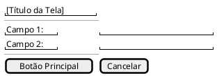

# Plano: Seletor de Formato de Wireframe + Casos de Uso com Tabela Cockburn + Spec UI

**Data:** 2026-03-23

## Contexto

O usuário quer que os Casos de Uso gerados na especificação funcional:
1. Usem formato de tabela Cockburn de 2 colunas: **Ação do Ator | Resposta do Sistema**
2. Sejam descrições REAIS (sem placeholders como `[Nome do Ator]`)
3. Incluam wireframes visuais das telas por UC
4. O formato do wireframe (ASCII ou PlantUML Salt) seja selecionável via UI
5. O seletor fique antes do botão "Gerar Especificação" na SpecificationPage

---

## ⚠️ Achado Importante

O backend tem **dois caminhos** de geração de especificação:
- **`specification.py` router** → chama `execute_specification_generation()` que usa `build_specification_prompt` + `llm.complete_async()` (chamada LLM direta)
- **`langnetagents.py`** → tem `execute_specification_workflow()` com pipeline CrewAI de 9 tasks

Precisamos verificar qual é chamado. O plano cobre **ambos** mas a mudança principal no router cobre o caminho ativo provável.

---

## 📁 Arquivos a Modificar

| Arquivo | O que muda |
|---------|-----------|
| `src/pages/SpecificationPage.tsx` | +estado `wireframeFormat` + seletor UI |
| `src/services/specificationService.ts` | +campo `wireframe_format` no tipo |
| `src/components/documents/MarkdownViewerModal.tsx` | +renderer PlantUML nos code blocks |
| `backend/app/routers/specification.py` | +campo `wireframe_format` no request model |
| `backend/agents/langnetagents.py` | +`wireframe_format` no state e input func |
| `backend/config/langnet_tasks.yaml` | Reescrever `compose_spec_use_cases` com tabela Cockburn + wireframes |

---

## 🎯 Mudanças Detalhadas

### 1. `src/pages/SpecificationPage.tsx`

**Adicionar estado** (após linha ~48):
```tsx
const [wireframeFormat, setWireframeFormat] = useState<'ascii' | 'plantuml'>('ascii');
```

**Adicionar seletor UI** ANTES do botão `🚀 Gerar Especificação` (linha ~661):
```tsx
{/* Formato de Wireframe */}
<div className="config-section">
  <label className="config-label">Formato de Wireframe dos Casos de Uso</label>
  <div className="radio-group">
    <label className="radio-option">
      <input type="radio" name="wireframeFormat" value="ascii"
        checked={wireframeFormat === 'ascii'}
        onChange={() => setWireframeFormat('ascii')} />
      <span>ASCII Art</span>
      <small>Compatível com qualquer visualizador Markdown</small>
    </label>
    <label className="radio-option">
      <input type="radio" name="wireframeFormat" value="plantuml"
        checked={wireframeFormat === 'plantuml'}
        onChange={() => setWireframeFormat('plantuml')} />
      <span>PlantUML Salt</span>
      <small>Wireframes visuais renderizados no viewer</small>
    </label>
  </div>
</div>
```

**Passar no API call** (linha ~360):
```tsx
wireframe_format: wireframeFormat,
```

---

### 2. `src/services/specificationService.ts`

Adicionar em `CreateSpecificationRequest`:
```typescript
wireframe_format?: 'ascii' | 'plantuml';
```

---

### 3. `src/components/documents/MarkdownViewerModal.tsx`

Adicionar suporte a PlantUML via API pública `plantuml.com`.
Usar lib `pako` (deflate) para encoding correto — verificar se já está no `package.json`; se não, `npm install pako @types/pako`.

**Função de encoding** (antes do componente):
```typescript
import pako from 'pako';

function encodePlantUML(text: string): string {
  const data = new TextEncoder().encode(text);
  const compressed = pako.deflate(data, { level: 9 });
  const b64 = btoa(String.fromCharCode(...compressed));
  return b64.replace(/\+/g, '-').replace(/\//g, '_');
}
```

**Custom components no ReactMarkdown**:
```tsx
<ReactMarkdown
  remarkPlugins={[remarkGfm]}
  components={{
    code({ node, inline, className, children }) {
      const language = className?.replace('language-', '');
      const codeText = String(children).trim();
      if (!inline && language === 'plantuml') {
        const encoded = encodePlantUML(codeText);
        const url = `https://www.plantuml.com/plantuml/png/${encoded}`;
        return (
          <div className="plantuml-wireframe">
            
          </div>
        );
      }
      return <code className={className}>{children}</code>;
    }
  }}
>
  {content}
</ReactMarkdown>
```

---

### 4. `backend/app/routers/specification.py`

Adicionar em `GenerateSpecificationRequest`:
```python
wireframe_format: str = 'ascii'  # 'ascii' | 'plantuml'
```

Passar para `execute_specification_generation(...)`:
```python
wireframe_format=request.wireframe_format,
```

Na função `execute_specification_generation`, passar para prompt/pipeline:
```python
# Caminho LLM direto:
prompt = build_specification_prompt(..., wireframe_format=wireframe_format)
# Caminho CrewAI:
state["wireframe_format"] = wireframe_format
```

---

### 5. `backend/agents/langnetagents.py`

`execute_specification_workflow` — adicionar parâmetro:
```python
def execute_specification_workflow(..., wireframe_format: str = 'ascii', ...):
    state["wireframe_format"] = wireframe_format
```

`compose_spec_use_cases_input_func` — passar o formato:
```python
return {
    ...,
    "wireframe_format": state.get("wireframe_format", "ascii"),
}
```

---

### 6. `backend/config/langnet_tasks.yaml` — Reescrever `compose_spec_use_cases`

#### Novo parâmetro de entrada:
```yaml
- wireframe_format: {wireframe_format} (ascii or plantuml)
```

#### Formato obrigatório para cada UC

**Cabeçalho:**
```markdown
**UC-001: [título real]**
| Campo | Detalhe |
|-------|---------|
| **Ator Principal** | [nome real do entities_json] |
| **Objetivo** | [objetivo real baseado no RF] |
| **Pré-condições** | [condições reais] |
| **Pós-condições** | [estado real após execução] |
| **RFs Relacionados** | RF-001, RF-002 |
| **RNs Aplicáveis** | RN-001 |
```

**Fluxo Principal — tabela Cockburn 2 colunas:**
```markdown
### Fluxo Principal
| # | Ação do Ator | Resposta do Sistema |
|---|--------------|---------------------|
| 1 | [ação concreta e real] | [elementos UI visíveis: campos, botões, mensagens] |
| 2 | Usuário pode opcionalmente: | |
| 2.1 | [sub-ação A] | [resposta com elementos UI específicos] |
| 2.2 | [sub-ação B] | [resposta com elementos UI específicos] |
```

**Fluxos Alternativos e Exceção — também em tabela:**
```markdown
### Fluxos Alternativos
| ID | Condição | Ação do Ator | Resposta do Sistema |
|----|----------|--------------|---------------------|
| A1 | [condição real] | [ação] | [resposta com UI] |

### Fluxos de Exceção
| ID | Erro | Resposta do Sistema |
|----|------|---------------------|
| E1 | [erro real] | [mensagem exata + ação disponível] |
```

**Wireframe — SE wireframe_format == ascii:**
```
┌────────────────────────────────────────┐
│  [Título da Tela]                      │
├────────────────────────────────────────┤
│  Campo 1: [____________]               │
│  Campo 2: [____________]               │
│                                        │
│  [  Botão Principal  ]  [ Cancelar ]   │
└────────────────────────────────────────┘
```

**Wireframe — SE wireframe_format == plantuml:**
````

````

#### Regras críticas anti-placeholder:
- Usar EXCLUSIVAMENTE nomes reais de atores/telas/campos do `entities_json`
- PROIBIDO usar colchetes com texto genérico no output final
- Coluna "Resposta do Sistema" DEVE descrever elementos concretos da UI
- Cada UC DEVE ter wireframe da(s) tela(s) principal(is)

---

## ✅ Verificação

1. Frontend: seletor aparece antes do botão "Gerar Especificação"
2. Selecionar ASCII → gerar spec → viewer mostra wireframes em texto monospace
3. Selecionar PlantUML → gerar spec → viewer renderiza imagens via plantuml.com
4. Tabelas Cockburn com dados reais (sem placeholders genéricos)
