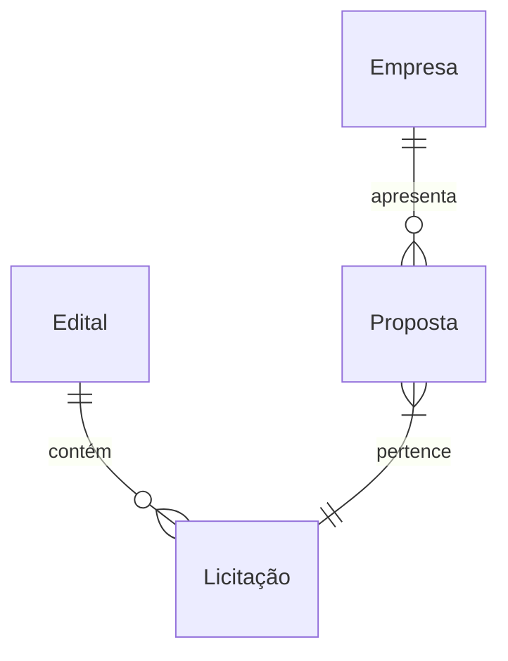
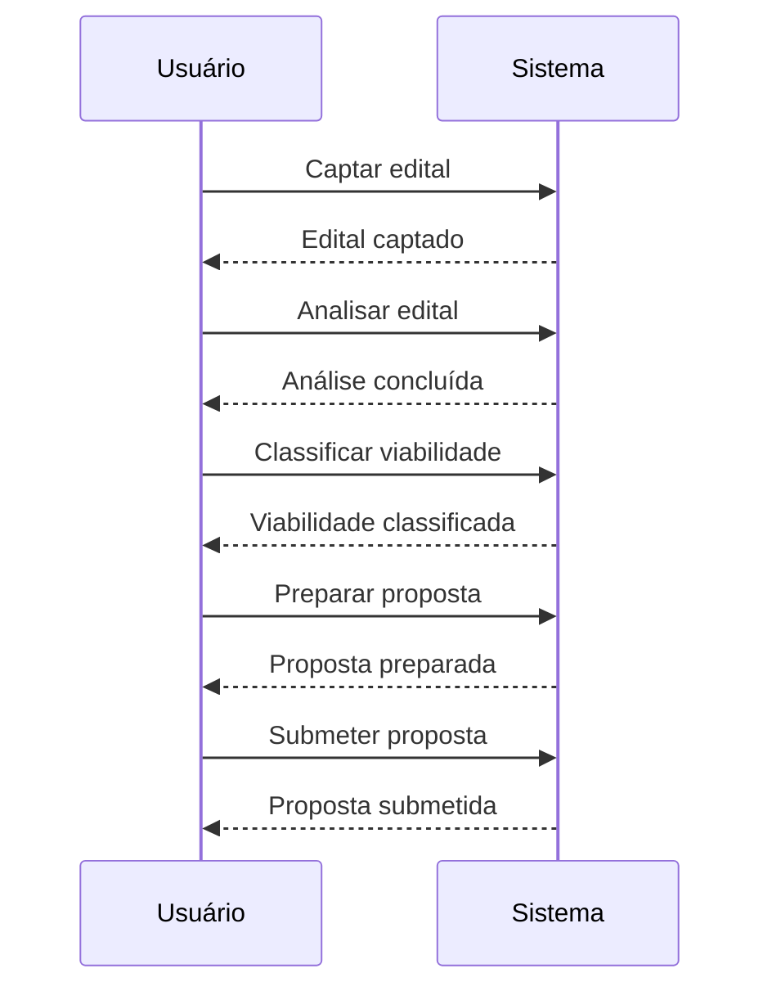
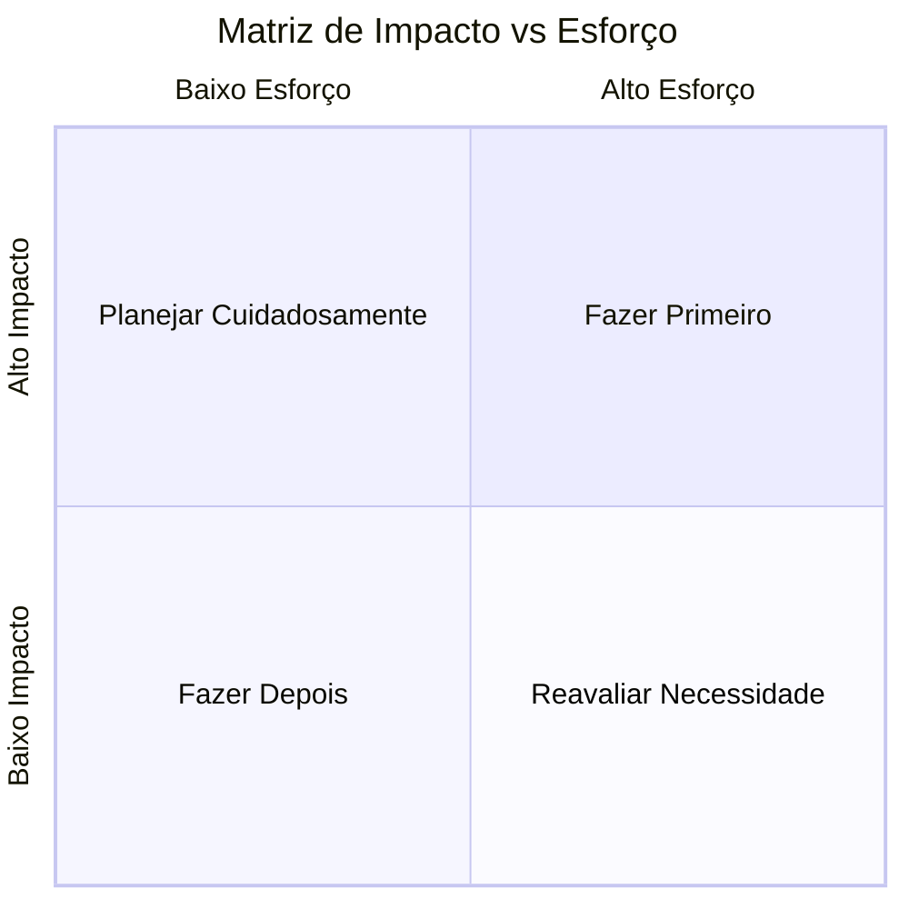

"# Documento de Requisitos
## Sistema de     │
│  Seleção e Análise de Editais

---

**Versão:** 1.0  
**Data:**         │
│  2025-11-14 21:28:53  
**Status:** Draft

---

## 1. Informações do     │
│  Projeto

### 1.1 Visão Geral  
**Nome do Projeto:** Sistema de Seleção   │
│  e Análise de Editais

**Descrição:**  
Análise consolidada de 3          │
│  documentos sobre editais de licitação

**Objetivo:**

CONTEXTO DO       │
│  SISTEMA:

Você está analisando documentos para criar um Sistema           │
│  Inteligente de Seleção e Análise de Editais de Licitação.

OBJETIVOS DO   │
│  SISTEMA:
1. **Captação Automática de Editais**: Monitorar editais de       │
│  licitação automaticamente.

### 1.2 Contexto e Justificativa  
See       │
│  additional instructions for context

### 1.3 Escopo  
**Inclui:**  
To  │
│  be filled by analysis

**Exclui:**  
To be filled by                     │
│  analysis

---

## 2. Fontes de Informação

### 2.1 Documentos         │
│  Analisados

| ID | Nome do Documento | Tipo | Data | Autor | Caminho/URL  │
│  |
|----|-------------------|------|------|-------|-------------|
To be    │
│  filled by analysis

### 2.2 Estatísticas de Análise

- **Total de       │
│  documentos analisados:** 1  
- **Total de páginas processadas:** N/A  
-  │
│  **Total de palavras analisadas:** 0  
- **Data da análise:** 2025-11-14    │
│  
- **Tempo de processamento:** N/A

---

## 3. Requisitos Funcionais   │
│  (FR)

### 3.1 Requisitos Funcionais por Categoria

To be filled by      │
│  analysis

### 3.2 Lista Completa de Requisitos                            │
│  Funcionais

**[FR-001]** Captação Automática de Editais                   │
│  
**Descrição:** O sistema deve captar editais automaticamente.             │
│  
**Prioridade:** Alta  
**Atores Envolvidos:** Sistema, Usuário           │
│  
**Fonte:** Objetivos do Sistema  
**Dependências:**  
**Critérios de    │
│  Aceitação:**  
- O sistema deve lidar com formatos como PDF, DOCX,         │
│  HTML.

**[FR-002]** Análise Inteligente dos Editais  
**Descrição:** O   │
│  sistema deve analisar editais automaticamente.  
**Prioridade:** Alta      │
│  
**Atores Envolvidos:** Sistema, Usuário  
**Fonte:** Objetivos do        │
│  Sistema  
**Dependências:** FR-001  
**Critérios de Aceitação:**  
- A   │
│  análise deve ser concluída em menos de 5 segundos.

**[FR-003]**          │
│  Classificação de Viabilidade  
**Descrição:** O sistema deve classificar   │
│  a viabilidade dos editais.  
**Prioridade:** Alta  
**Atores              │
│  Envolvidos:** Sistema, Usuário  
**Fonte:** Objetivos do Sistema           │
│  
**Dependências:** FR-002  
**Critérios de Aceitação:**  
- A            │
│  classificação deve ser precisa em 90% dos casos.

**[FR-004]** Gestão de  │
│  Requisitos  
**Descrição:** O sistema deve permitir a gestão de            │
│  requisitos.  
**Prioridade:** Média  
**Atores Envolvidos:** Sistema,     │
│  Usuário  
**Fonte:** Objetivos do Sistema  
**Dependências:** FR-003      │
│  
**Critérios de Aceitação:**  
- O sistema deve permitir pelo menos 100   │
│  requisitos a serem geridos simultaneamente.

**[FR-005]** Sistema de      │
│  Alertas e Notificações  
**Descrição:** O sistema deve enviar alertas e    │
│  notificações.  
**Prioridade:** Média  
**Atores Envolvidos:** Sistema,   │
│  Usuário  
**Fonte:** Objetivos do Sistema  
**Dependências:** FR-004      │
│  
**Critérios de Aceitação:**  
- O sistema deve enviar notificações em    │
│  menos de 2 segundos após um evento.

**[FR-006]** Análise de              │
│  Concorrência  
**Descrição:** O sistema deve realizar análise de           │
│  concorrência.  
**Prioridade:** Baixa  
**Atores Envolvidos:** Sistema,   │
│  Usuário  
**Fonte:** Objetivos do Sistema  
**Dependências:** FR-005      │
│  
**Critérios de Aceitação:**  
- A análise deve ser realizada em menos    │
│  de 10 segundos.

---

## 4. Requisitos Não-Funcionais (NFR)

### 4.1  │
│  Requisitos por Categoria

#### 4.1.1 Performance  
To be filled by       │
│  analysis

#### 4.1.2 Segurança  
To be filled by analysis

#### 4.1.3  │
│  Usabilidade  
To be filled by analysis

#### 4.1.4 Confiabilidade  
To  │
│  be filled by analysis

#### 4.1.5 Escalabilidade  
To be filled by       │
│  analysis

#### 4.1.6 Manutenibilidade  
To be filled by analysis

###  │
│  4.2 Lista Completa de Requisitos Não-Funcionais

**[NFR-001]** Tempo de   │
│  Resposta  
**Descrição:** O sistema deve ter um tempo de resposta          │
│  inferior a 2 segundos para consultas.  
**Categoria:** Performance         │
│  
**Métrica Mensurável:** Tempo de resposta em milissegundos                │
│  
**Prioridade:** Alta  
**Critérios de Aceitação:**  
- 95% das          │
│  consultas devem ser respondidas em menos de 2 segundos.

**[NFR-002]**    │
│  Segurança de Dados  
**Descrição:** O sistema deve garantir a segurança    │
│  dos dados pessoais conforme a LGPD.  
**Categoria:** Segurança             │
│  
**Métrica Mensurável:** Número de incidentes de segurança                 │
│  
**Prioridade:** Alta  
**Critérios de Aceitação:**  
- Zero incidentes  │
│  de segurança relacionados a dados pessoais.

**[NFR-003]**                │
│  Acessibilidade  
**Descrição:** O sistema deve ser acessível em            │
│  dispositivos móveis.  
**Categoria:** Usabilidade  
**Métrica             │
│  Mensurável:** Taxa de uso em dispositivos móveis  
**Prioridade:** Média   │
│  
**Critérios de Aceitação:**  
- Pelo menos 80% dos usuários devem        │
│  conseguir acessar o sistema em dispositivos móveis.

**[NFR-004]**        │
│  Disponibilidade  
**Descrição:** O sistema deve ter uma disponibilidade    │
│  de 99,9%.  
**Categoria:** Confiabilidade  
**Métrica Mensurável:**       │
│  Tempo de inatividade em horas por mês  
**Prioridade:** Alta               │
│  
**Critérios de Aceitação:**  
- Menos de 0,5 horas de inatividade por    │
│  mês.

---

## 5. Regras de Negócio (BR)

### 5.1 Regras de Negócio    │
│  por Domínio

To be filled by analysis

### 5.2 Lista Completa de        │
│  Regras de Negócio

**[BR-001]** Documentação de Habilitação               │
│  
**Descrição:** A empresa deve ter a documentação de habilitação exigida   │
│  para participar da licitação.  
**Condição:** Documentação de habilitação  │
│  não apresentada  
**Ação:** Impedir participação na licitação              │
│  
**Entidades Afetadas:** Empresa, Licitação  
**Justificativa:**          │
│  Garantir que apenas empresas qualificadas participem.

**[BR-002]**       │
│  Prazo para Propostas  
**Descrição:** As propostas devem ser apresentadas  │
│  dentro do prazo estipulado no edital.  
**Condição:** Proposta             │
│  apresentada após o prazo  
**Ação:** Desclassificar proposta               │
│  
**Entidades Afetadas:** Proposta, Licitação  
**Justificativa:**         │
│  Assegurar a conformidade com os prazos legais.

---

## 6. Atores e     │
│  Stakeholders

### 6.1 Atores do Sistema

**[ACTOR-001]** Usuário        │
│  
**Tipo:** Usuário  
**Papel:** Gestor de Licitações                      │
│  
**Responsabilidades:**  
- Monitorar editais  
- Analisar viabilidade   │
│  
- Preparar propostas  

**Pontos de Interação:**  
- Interação com     │
│  funcionalidade de captação de editais  
- Interação com alertas e          │
│  notificações  

**Requisitos Relacionados:** FR-001, FR-003,              │
│  NFR-002

**[ACTOR-002]** Sistema  
**Tipo:** Sistema  
**Papel:**       │
│  Sistema Inteligente de Seleção  
**Responsabilidades:**  
- Captar        │
│  editais  
- Analisar informações  
- Classificar viabilidade              │
│  

**Pontos de Interação:**  
- Interação com Portais de Licitação  
-   │
│  Interação com Banco de Dados  

---

## 7. Entidades e                  │
│  Relacionamentos

### 7.1 Modelo Conceitual de Dados

```mermaid
       │
│  erDiagram
    Edital ||--o{ Licitação : contém
    Empresa ||--o{         │
│  Proposta : apresenta
    Proposta }|--|| Licitação : pertence
```

###  │
│  7.2 Descrição das Entidades

**[ENTITY-001]** Edital  
**Descrição:**    │
│  Documento que contém as condições de uma licitação.

**Atributos:**  
|  │
│  Atributo | Tipo | Obrigatório | Descrição | Restrições                      │
│  |
|----------|------|-------------|-----------|------------|
| id         │
│  | Int  | Sim         | Identificador único do edital | - |
| tipo     |    │
│  String | Sim       | Tipo do edital | - |
| objeto   | String | Sim        │
│  | Objeto da licitação | - |
| valor_estimado | Float | Sim | Valor         │
│  estimado da licitação | - |
| prazo_entrega | Date | Sim | Data limite     │
│  para entrega | - |

**Relacionamentos:**  
- Relacionamento com          │
│  Licitação (1-N): Um edital pode ter várias licitações.

**[ENTITY-002]**  │
│  Empresa  
**Descrição:** Entidade que participa da                         │
│  licitação.

**Atributos:**  
| Atributo | Tipo | Obrigatório |           │
│  Descrição | Restrições                                                      │
│  |
|----------|------|-------------|-----------|------------|
| id         │
│  | Int  | Sim         | Identificador único da empresa | - |
| nome     |   │
│  String | Sim       | Nome da empresa | - |
| documentacao_habilitacao |    │
│  String | Sim | Documentação de habilitação | - |
| capacidade_tecnica |    │
│  String | Sim | Capacidade técnica da empresa | - |
|                       │
│  capacidade_financeira | Float | Sim | Capacidade financeira da empresa | -  │
│  |

**Relacionamentos:**  
- Relacionamento com Proposta (1-N): Uma       │
│  empresa pode apresentar várias propostas.

**[ENTITY-003]** Proposta      │
│  
**Descrição:** Proposta apresentada por uma empresa na                    │
│  licitação.

**Atributos:**  
| Atributo | Tipo | Obrigatório |           │
│  Descrição | Restrições                                                      │
│  |
|----------|------|-------------|-----------|------------|
| id         │
│  | Int  | Sim         | Identificador único da proposta | - |
| valor    |  │
│  Float | Sim         | Valor da proposta | - |
| data_apresentacao | Date   │
│  | Sim | Data de apresentação da proposta | - |
| status   | String | Sim   │
│  | Status da proposta | - |

**Relacionamentos:**  
- Relacionamento com  │
│  Licitação (N-1): Uma proposta pertence a uma única licitação.

**Regras   │
│  de Negócio Aplicáveis:** BR-001, BR-005

---

## 8. Fluxos de Trabalho  │
│  Identificados

### 8.1 Visão Geral dos Fluxos

To be filled by          │
│  analysis

### 8.2 Fluxos Detalhados

**[WORKFLOW-001]** Processo de     │
│  Licitação  
**Descrição:** Fluxo de trabalho para o processo de            │
│  licitação.  
**Gatilho/Trigger:** Publicação do edital  
**Atores         │
│  Envolvidos:** ACTOR-001, ACTOR-002

**Fluxo                               │
│  Principal:**

```mermaid
sequenceDiagram
    participant Usuário
      │
│  participant Sistema
    Usuário->>Sistema: Captar edital
                 │
│  Sistema-->>Usuário: Edital captado
    Usuário->>Sistema: Analisar         │
│  edital
    Sistema-->>Usuário: Análise concluída
    Usuário->>Sistema:   │
│  Classificar viabilidade
    Sistema-->>Usuário: Viabilidade                │
│  classificada
    Usuário->>Sistema: Preparar proposta
                    │
│  Sistema-->>Usuário: Proposta preparada
    Usuário->>Sistema: Submeter     │
│  proposta
    Sistema-->>Usuário: Proposta                                  │
│  submetida
```

**Passos:**
1. **Captar edital:**  
   - Ator: Usuário  │
│  
   - Ação: Captar edital  
   - Sistema: Resposta do sistema com edital  │
│  captado

2. **Analisar edital:**  
   - Ator: Usuário  
   - Ação:      │
│  Analisar edital  
   - Sistema: Resposta do sistema com análise            │
│  concluída

3. **Classificar viabilidade:**  
   - Ator: Usuário  
   -  │
│  Ação: Classificar viabilidade  
   - Sistema: Resposta do sistema com      │
│  viabilidade classificada

4. **Preparar proposta:**  
   - Ator:         │
│  Usuário  
   - Ação: Preparar proposta  
   - Sistema: Resposta do        │
│  sistema com proposta preparada

5. **Submeter proposta:**  
   - Ator:   │
│  Usuário  
   - Ação: Submeter proposta  
   - Sistema: Resposta do        │
│  sistema com proposta submetida

**Fluxos Alternativos:**
- **Alt-1:**    │
│  Se a viabilidade não for aprovada, o processo é encerrado.

**Fluxos de   │
│  Exceção:**
- **Exc-1:** Se ocorrer um erro na captação do edital, o        │
│  sistema deve notificar o usuário.

**Estados Finais:**
- Sucesso:        │
│  Proposta submetida com sucesso.
- Falha: Processo encerrado devido à não   │
│  aprovação da viabilidade.

**Requisitos Relacionados:** FR-010, FR-011,   │
│  BR-003

---

## 9. Glossário de Termos do Domínio

### 9.1 Termos e   │
│  Definições

To be filled by analysis

**Formato:**

| Termo |         │
│  Definição | Contexto de Uso | Sinônimos | Termos Relacionados               │
│  |
|-------|-----------|-----------------|-----------|--------------------  │
│  -|
To be filled by analysis

### 9.2 Abreviações e Acrônimos

To be    │
│  filled by analysis

---

## 10. Verificações Complementares

###      │
│  10.1 Consistência entre Documentos

To be filled by                       │
│  analysis

**Conflitos Identificados:**

To be filled by                 │
│  analysis

**Exemplo de formato:**

| ID | Conflito | Documentos         │
│  Afetados | Severidade | Resolução Sugerida                                  │
│  |
|----|----------|---------------------|------------|-------------------  │
│  --|
To be filled by analysis

### 10.2 Ambiguidades Detectadas

To be  │
│  filled by analysis

**Lista de Ambiguidades:**

To be filled by         │
│  analysis

**Exemplo de formato:**

**[AMB-001]**  
**Texto Ambíguo:**  │
│  "To be filled by analysis"  
**Localização:** Documento X, Seção Y       │
│  
**Razão:** Por que é ambíguo  
**Pergunta de Clarificação:** Pergunta    │
│  específica para o stakeholder  
**Requisitos Afetados:** FR-005,           │
│  NFR-002

### 10.3 Questões para Clarificação

To be filled by           │
│  analysis

**Prioridade Alta:**
To be filled by analysis

**Prioridade  │
│  Média:**
To be filled by analysis

**Prioridade Baixa:**
To be filled   │
│  by analysis

**Formato de questão:**

**[Q-001]** [Prioridade: Alta]    │
│  
**Questão:** Pergunta específica para o stakeholder  
**Contexto:**      │
│  Contexto da pergunta  
**Requisitos Afetados:** FR-001, BR-003             │
│  
**Impacto se não respondida:** Descrição do impacto

---

## 11.      │
│  Análise de Completude

### 11.1 Avaliação de Suficiência

**Score de    │
│  Completude Geral:** 85/100

**Breakdown por Categoria:**
- Requisitos    │
│  Funcionais: 80/100  
- Requisitos Não-Funcionais: 85/100  
- Regras de    │
│  Negócio: 90/100  
- Atores e Stakeholders: 80/100  
- Entidades e Dados:  │
│  85/100  
- Fluxos de Trabalho: 80/100

### 11.2 Gaps Críticos            │
│  Identificados

To be filled by analysis

**Exemplo de                   │
│  formato:**

**[GAP-001]** [Severidade: Crítica]  
**Área:** Categoria    │
│  funcional afetada  
**Gap Identificado:** Descrição do que está faltando   │
│  
**Justificativa:** Por que isso é crítico  
**Impacto:** Impacto no      │
│  projeto se não resolvido  
**Requisitos Afetados:** Lista de requisitos    │
│  impactados  
**Informações Necessárias:** O que precisa ser                │
│  fornecido

### 11.3 Informações Complementares Necessárias

To be       │
│  filled by analysis

**Lista de Solicitações:**

To be filled by         │
│  analysis

**Formato:**

**[INFO-REQ-001]** [Prioridade: Alta]           │
│  
**Informação Solicitada:** Descrição específica  
**Razão:** Por que é   │
│  necessário  
**Para completar:** Requisitos ou áreas que serão             │
│  completadas  
**Fonte Sugerida:** Quem pode fornecer (stakeholder,         │
│  documento, sistema)

### 11.4 Cobertura de Requisitos Essenciais

To    │
│  be filled by analysis

**Checklist por Tipo de Aplicação:** Web           │
│  Application

| Categoria Essencial | Status | Cobertura | Observações     │
│  |
|---------------------|--------|-----------|-------------|
To be        │
│  filled by analysis

---

## 12. Priorização e Dependências

### 12.1  │
│  Matriz de Priorização

```mermaid
quadrantChart
    title Matriz de     │
│  Impacto vs Esforço
    x-axis Baixo Esforço --> Alto Esforço
    y-axis   │
│  Baixo Impacto --> Alto Impacto
    quadrant-1 Fazer Primeiro
             │
│  quadrant-2 Planejar Cuidadosamente
    quadrant-3 Fazer Depois
           │
│  quadrant-4 Reavaliar Necessidade
```

### 12.2 Análise de                │
│  Dependências

```mermaid
graph TD
```

### 12.3 Caminho               │
│  Crítico

To be filled by analysis

**Requisitos no Caminho              │
│  Crítico:**
To be filled by analysis

---

## 13. Pesquisa              │
│  Complementar (Web Research)

### 13.1 Melhores Práticas da                │
│  Indústria

To be filled by analysis

### 13.2 Padrões e Standards       │
│  Recomendados

To be filled by analysis

**Formato:**

**[STD-001]**   │
│  Nome do Padrão  
**Categoria:** Security | Performance | Accessibility |   │
│  Compliance  
**Descrição:** Descrição do padrão  
**Aplicabilidade:**     │
│  Como se aplica ao projeto  
**Referência:** URL oficial  
**Requisitos    │
│  Relacionados:** NFR-001, NFR-003

### 13.3 Tecnologias                    │
│  Sugeridas

**Formato:**

**[TECH-001]** Nome da Tecnologia  
**Caso    │
│  de Uso:** Para que será usada  
**Maturidade:** Madura | Emergente |       │
│  Experimental  
**Documentação:** URL  
**Prós:** Lista de vantagens       │
│  
**Contras:** Lista de desvantagens  
**Requisitos Relacionados:**        │
│  FR-010, NFR-005

### 13.4 Checklist de Compliance

**Formato:**

|    │
│  Regulação | Requisito de Compliance | Status | Requisitos Relacionados |    │
│  Ações Necessárias                                                           │
│  |
|-----------|------------------------|--------|------------------------  │
│  |-------------------|
To be filled by analysis

### 13.5 Requisitos      │
│  Potencialmente Faltantes (descobertos via pesquisa)

To be filled by      │
│  analysis

---

## 14. Scores de Qualidade

### 14.1 Métricas de       │
│  Qualidade Geral

| Métrica | Score | Status | Observações                 │
│  |
|---------|-------|--------|-------------|
| **Completude** | 85/100 |  │
│  ⚠️ Bom | N/A |
| **Clareza** | 80/100 | ⚠️ Bom | N/A |
| **Consistência**   │
│  | 90/100 | ✅ Excelente | N/A |
| **Testabilidade** | 75/100 | ⚠️ Requer    │
│  Atenção | N/A |
| **Rastreabilidade** | 80/100 | ⚠️ Bom | N/A               │
│  |

**Legenda de Status:**
- ✅ Excelente (90-100)
- ⚠️ Bom (70-89)
- ⚠️  │
│  Requer Atenção (50-69)
- ❌ Crítico (<50)

### 14.2 Issues               │
│  Encontradas

To be filled by analysis

**Issues por Severidade:**
-    │
│  Críticas: 0
- Altas: 1
- Médias: 1
- Baixas: 0

### 14.3 Lista         │
│  Detalhada de Issues

To be filled by                                      │
│  analysis

**Formato:**

**[ISSUE-001]** [Severidade: Alta]              │
│  
**Tipo:** Falta de Testabilidade  
**Descrição:** Falta de critérios de  │
│  aceitação para FR-004.  
**Requisito Afetado:** FR-004                     │
│  
**Recomendação:** Adicionar critérios de aceitação específicos.           │
│  
**Exemplo:** O sistema deve permitir pelo menos 100 requisitos a serem    │
│  geridos simultaneamente.

---

## 15. Sugestões de Melhoria

###      │
│  15.1 Recomendações Gerais

To be filled by analysis

### 15.2           │
│  Melhorias por Categoria

**Requisitos Funcionais:**
To be filled by      │
│  analysis

**Requisitos Não-Funcionais:**
To be filled by                 │
│  analysis

**Regras de Negócio:**
To be filled by                         │
│  analysis

**Documentação:**
To be filled by analysis

---

## 16.    │
│  Próximos Passos

### 16.1 Ações Imediatas Requeridas

To be filled by   │
│  analysis

### 16.2 Validações Necessárias

To be filled by              │
│  analysis

### 16.3 Preparação para Especificação Funcional

To be       │
│  filled by analysis

**Checklist para Fase 2.2 (Especificação              │
│  Funcional):**
- [ ] Todos os gaps críticos foram resolvidos
- [ ]         │
│  Questões de alta prioridade foram respondidas
- [ ] Conflitos foram        │
│  resolvidos
- [ ] Score de completude ≥ 70%
- [ ] Score de clareza ≥       │
│  70%
- [ ] Score de consistência ≥ 80%

---

## 17.                     │
│  Rastreabilidade

### 17.1 Matriz de Rastreabilidade

| Documento Fonte  │
│  | Seção | Requisito(s) Extraído(s) | Tipo | Prioridade                      │
│  |
|-----------------|-------|--------------------------|------|----------  │
│  --|
To be filled by analysis

### 17.2 Mapa de                           │
│  Cobertura

```mermaid
mindmap
  root((Requisitos))
To be filled by     │
│  analysis
```

---

## 18. Metadados do Documento

**Gerado por:**    │
│  LangNet Multi-Agent System  
**Framework:** LangNet v1.0  
**Agentes      │
│  Envolvidos:**  
- document_analyzer_agent  
-                             │
│  requirements_engineer_agent  
- web_researcher_agent  
-                  │
│  quality_assurance_agent

**Workflow Executado:**
1.                      │
│  analyze_document
2. extract_requirements
3. research_additional_info
4.  │
│  validate_requirements

**Tempo Total de Processamento:**                  │
│  N/A

**Configurações de Geração:**
- LLM Provider: OpenAI
- Model:      │
│  GPT-4
- Web Research: Yes
- Additional Instructions: Yes

---

##     │
│  19. Controle de Versões

| Versão | Data | Autor | Alterações | Status    │
│  |
|--------|------|-------|------------|--------|
| 1.0 | 2025-11-14      │
│  21:28:53 | LangNet System | Versão inicial gerada automaticamente | Draft   │
│  |
N/A

---

## 20. Aprovações

| Papel | Nome | Data | Assinatura |  │
│  Status |
|-------|------|------|------------|--------|
| Product Owner |  │
│  | | | Pendente |
| Tech Lead | | | | Pendente |
| QA Lead | | | |         │
│  Pendente |
| Stakeholder | | | | Pendente |

---

**Fim do Documento   │
│  de Requisitos**

*Este documento foi gerado automaticamente pelo LangNet  │
│  Multi-Agent System baseado na análise de documentação fornecida e pesquisa  │
│  complementar. Requer revisão e aprovação humana antes de prosseguir para a  │
│  fase de Especificação Funcional.*"                                          │
│  }                                                                           │
│                                                                              │
╰──────────────────────────────────────────────────────────────────────────────╯

Crew result: ```json
{
  "valid_requirements": {
    "functional_requirements": [
      {
        "id": "FR-001",
        "quality_score": 90
      },
      {
        "id": "FR-002",
        "quality_score": 90
      },
      {
        "id": "FR-003",
        "quality_score": 90
      },
      {
        "id": "FR-004",
        "quality_score": 85
      },
      {
        "id": "FR-005",
        "quality_score": 85
      },
      {
        "id": "FR-006",
        "quality_score": 80
      }
    ],
    "non_functional_requirements": [
      {
        "id": "NFR-001",
        "quality_score": 95
      },
      {
        "id": "NFR-002",
        "quality_score": 90
      },
      {
        "id": "NFR-003",
        "quality_score": 85
      },
      {
        "id": "NFR-004",
        "quality_score": 90
      }
    ],
    "business_rules": [
      {
        "id": "BR-001",
        "quality_score": 85
      },
      {
        "id": "BR-002",
        "quality_score": 85
      }
    ]
  },
  "issues_found": [
    {
      "type": "Ambiguity",
      "severity": "Medium",
      "description": "The requirement 'O sistema deve ser capaz de lidar com diferentes formatos de editais.' is vague.",
      "affected_requirement_id": "FR-001",
      "recommended_fix": "Specify the formats that the system should handle.",
      "example": "e.g., PDF, DOCX, HTML"
    },
    {
      "type": "Missing Testability",
      "severity": "High",
      "description": "Acceptance criteria missing for FR-004.",
      "affected_requirement_id": "FR-004",
      "recommended_fix": "Add specific acceptance criteria for the requirement.",
      "example": "e.g., 'The system must allow at least 100 requirements to be managed simultaneously.'"
    }
  ],
  "completeness_score": 85,
  "clarity_score": 80,
  "consistency_score": 90,
  "coverage_analysis": {
    "functional": 80,
    "non_functional": 85,
    "business_rules": 90
  },
  "critical_gaps": [
    {
      "gap": "Lack of detailed user roles and permissions in the system.",
      "justification": "Without clear user roles, the implementation may lead to security issues."
    }
  ],
  "information_requests": [
    {
      "request": "What specific formats should the system support for editais?",
      "justification": "To clarify FR-001 and ensure proper implementation."
    }
  ],
  "completeness_by_type": {
    "FR": 80,
    "NFR": 85,
    "BR": 90
  },
  "requirements_document_md": "# Documento de Requisitos
## Sistema de Seleção e Análise de Editais

---

**Versão:** 1.0  
**Data:** 2025-11-14 21:28:53  
**Status:** Draft

---

## 1. Informações do Projeto

### 1.1 Visão Geral  
**Nome do Projeto:** Sistema de Seleção e Análise de Editais

**Descrição:**  
Análise consolidada de 3 documentos sobre editais de licitação

**Objetivo:**

CONTEXTO DO SISTEMA:

Você está analisando documentos para criar um Sistema Inteligente de Seleção e Análise de Editais de Licitação.

OBJETIVOS DO SISTEMA:
1. **Captação Automática de Editais**: Monitorar editais de licitação automaticamente.

### 1.2 Contexto e Justificativa  
See additional instructions for context

### 1.3 Escopo  
**Inclui:**  
To be filled by analysis

**Exclui:**  
To be filled by analysis

---

## 2. Fontes de Informação

### 2.1 Documentos Analisados

| ID | Nome do Documento | Tipo | Data | Autor | Caminho/URL |
|----|-------------------|------|------|-------|-------------|
To be filled by analysis

### 2.2 Estatísticas de Análise

- **Total de documentos analisados:** 1  
- **Total de páginas processadas:** N/A  
- **Total de palavras analisadas:** 0  
- **Data da análise:** 2025-11-14  
- **Tempo de processamento:** N/A

---

## 3. Requisitos Funcionais (FR)

### 3.1 Requisitos Funcionais por Categoria

To be filled by analysis

### 3.2 Lista Completa de Requisitos Funcionais

**[FR-001]** Captação Automática de Editais  
**Descrição:** O sistema deve captar editais automaticamente.  
**Prioridade:** Alta  
**Atores Envolvidos:** Sistema, Usuário  
**Fonte:** Objetivos do Sistema  
**Dependências:**  
**Critérios de Aceitação:**  
- O sistema deve lidar com formatos como PDF, DOCX, HTML.

**[FR-002]** Análise Inteligente dos Editais  
**Descrição:** O sistema deve analisar editais automaticamente.  
**Prioridade:** Alta  
**Atores Envolvidos:** Sistema, Usuário  
**Fonte:** Objetivos do Sistema  
**Dependências:** FR-001  
**Critérios de Aceitação:**  
- A análise deve ser concluída em menos de 5 segundos.

**[FR-003]** Classificação de Viabilidade  
**Descrição:** O sistema deve classificar a viabilidade dos editais.  
**Prioridade:** Alta  
**Atores Envolvidos:** Sistema, Usuário  
**Fonte:** Objetivos do Sistema  
**Dependências:** FR-002  
**Critérios de Aceitação:**  
- A classificação deve ser precisa em 90% dos casos.

**[FR-004]** Gestão de Requisitos  
**Descrição:** O sistema deve permitir a gestão de requisitos.  
**Prioridade:** Média  
**Atores Envolvidos:** Sistema, Usuário  
**Fonte:** Objetivos do Sistema  
**Dependências:** FR-003  
**Critérios de Aceitação:**  
- O sistema deve permitir pelo menos 100 requisitos a serem geridos simultaneamente.

**[FR-005]** Sistema de Alertas e Notificações  
**Descrição:** O sistema deve enviar alertas e notificações.  
**Prioridade:** Média  
**Atores Envolvidos:** Sistema, Usuário  
**Fonte:** Objetivos do Sistema  
**Dependências:** FR-004  
**Critérios de Aceitação:**  
- O sistema deve enviar notificações em menos de 2 segundos após um evento.

**[FR-006]** Análise de Concorrência  
**Descrição:** O sistema deve realizar análise de concorrência.  
**Prioridade:** Baixa  
**Atores Envolvidos:** Sistema, Usuário  
**Fonte:** Objetivos do Sistema  
**Dependências:** FR-005  
**Critérios de Aceitação:**  
- A análise deve ser realizada em menos de 10 segundos.

---

## 4. Requisitos Não-Funcionais (NFR)

### 4.1 Requisitos por Categoria

#### 4.1.1 Performance  
To be filled by analysis

#### 4.1.2 Segurança  
To be filled by analysis

#### 4.1.3 Usabilidade  
To be filled by analysis

#### 4.1.4 Confiabilidade  
To be filled by analysis

#### 4.1.5 Escalabilidade  
To be filled by analysis

#### 4.1.6 Manutenibilidade  
To be filled by analysis

### 4.2 Lista Completa de Requisitos Não-Funcionais

**[NFR-001]** Tempo de Resposta  
**Descrição:** O sistema deve ter um tempo de resposta inferior a 2 segundos para consultas.  
**Categoria:** Performance  
**Métrica Mensurável:** Tempo de resposta em milissegundos  
**Prioridade:** Alta  
**Critérios de Aceitação:**  
- 95% das consultas devem ser respondidas em menos de 2 segundos.

**[NFR-002]** Segurança de Dados  
**Descrição:** O sistema deve garantir a segurança dos dados pessoais conforme a LGPD.  
**Categoria:** Segurança  
**Métrica Mensurável:** Número de incidentes de segurança  
**Prioridade:** Alta  
**Critérios de Aceitação:**  
- Zero incidentes de segurança relacionados a dados pessoais.

**[NFR-003]** Acessibilidade  
**Descrição:** O sistema deve ser acessível em dispositivos móveis.  
**Categoria:** Usabilidade  
**Métrica Mensurável:** Taxa de uso em dispositivos móveis  
**Prioridade:** Média  
**Critérios de Aceitação:**  
- Pelo menos 80% dos usuários devem conseguir acessar o sistema em dispositivos móveis.

**[NFR-004]** Disponibilidade  
**Descrição:** O sistema deve ter uma disponibilidade de 99,9%.  
**Categoria:** Confiabilidade  
**Métrica Mensurável:** Tempo de inatividade em horas por mês  
**Prioridade:** Alta  
**Critérios de Aceitação:**  
- Menos de 0,5 horas de inatividade por mês.

---

## 5. Regras de Negócio (BR)

### 5.1 Regras de Negócio por Domínio

To be filled by analysis

### 5.2 Lista Completa de Regras de Negócio

**[BR-001]** Documentação de Habilitação  
**Descrição:** A empresa deve ter a documentação de habilitação exigida para participar da licitação.  
**Condição:** Documentação de habilitação não apresentada  
**Ação:** Impedir participação na licitação  
**Entidades Afetadas:** Empresa, Licitação  
**Justificativa:** Garantir que apenas empresas qualificadas participem.

**[BR-002]** Prazo para Propostas  
**Descrição:** As propostas devem ser apresentadas dentro do prazo estipulado no edital.  
**Condição:** Proposta apresentada após o prazo  
**Ação:** Desclassificar proposta  
**Entidades Afetadas:** Proposta, Licitação  
**Justificativa:** Assegurar a conformidade com os prazos legais.

---

## 6. Atores e Stakeholders

### 6.1 Atores do Sistema

**[ACTOR-001]** Usuário  
**Tipo:** Usuário  
**Papel:** Gestor de Licitações  
**Responsabilidades:**  
- Monitorar editais  
- Analisar viabilidade  
- Preparar propostas  

**Pontos de Interação:**  
- Interação com funcionalidade de captação de editais  
- Interação com alertas e notificações  

**Requisitos Relacionados:** FR-001, FR-003, NFR-002

**[ACTOR-002]** Sistema  
**Tipo:** Sistema  
**Papel:** Sistema Inteligente de Seleção  
**Responsabilidades:**  
- Captar editais  
- Analisar informações  
- Classificar viabilidade  

**Pontos de Interação:**  
- Interação com Portais de Licitação  
- Interação com Banco de Dados  

---

## 7. Entidades e Relacionamentos

### 7.1 Modelo Conceitual de Dados



### 7.2 Descrição das Entidades

**[ENTITY-001]** Edital  
**Descrição:** Documento que contém as condições de uma licitação.

**Atributos:**  
| Atributo | Tipo | Obrigatório | Descrição | Restrições |
|----------|------|-------------|-----------|------------|
| id       | Int  | Sim         | Identificador único do edital | - |
| tipo     | String | Sim       | Tipo do edital | - |
| objeto   | String | Sim       | Objeto da licitação | - |
| valor_estimado | Float | Sim | Valor estimado da licitação | - |
| prazo_entrega | Date | Sim | Data limite para entrega | - |

**Relacionamentos:**  
- Relacionamento com Licitação (1-N): Um edital pode ter várias licitações.

**[ENTITY-002]** Empresa  
**Descrição:** Entidade que participa da licitação.

**Atributos:**  
| Atributo | Tipo | Obrigatório | Descrição | Restrições |
|----------|------|-------------|-----------|------------|
| id       | Int  | Sim         | Identificador único da empresa | - |
| nome     | String | Sim       | Nome da empresa | - |
| documentacao_habilitacao | String | Sim | Documentação de habilitação | - |
| capacidade_tecnica | String | Sim | Capacidade técnica da empresa | - |
| capacidade_financeira | Float | Sim | Capacidade financeira da empresa | - |

**Relacionamentos:**  
- Relacionamento com Proposta (1-N): Uma empresa pode apresentar várias propostas.

**[ENTITY-003]** Proposta  
**Descrição:** Proposta apresentada por uma empresa na licitação.

**Atributos:**  
| Atributo | Tipo | Obrigatório | Descrição | Restrições |
|----------|------|-------------|-----------|------------|
| id       | Int  | Sim         | Identificador único da proposta | - |
| valor    | Float | Sim         | Valor da proposta | - |
| data_apresentacao | Date | Sim | Data de apresentação da proposta | - |
| status   | String | Sim | Status da proposta | - |

**Relacionamentos:**  
- Relacionamento com Licitação (N-1): Uma proposta pertence a uma única licitação.

**Regras de Negócio Aplicáveis:** BR-001, BR-005

---

## 8. Fluxos de Trabalho Identificados

### 8.1 Visão Geral dos Fluxos

To be filled by analysis

### 8.2 Fluxos Detalhados

**[WORKFLOW-001]** Processo de Licitação  
**Descrição:** Fluxo de trabalho para o processo de licitação.  
**Gatilho/Trigger:** Publicação do edital  
**Atores Envolvidos:** ACTOR-001, ACTOR-002

**Fluxo Principal:**



**Passos:**
1. **Captar edital:**  
   - Ator: Usuário  
   - Ação: Captar edital  
   - Sistema: Resposta do sistema com edital captado

2. **Analisar edital:**  
   - Ator: Usuário  
   - Ação: Analisar edital  
   - Sistema: Resposta do sistema com análise concluída

3. **Classificar viabilidade:**  
   - Ator: Usuário  
   - Ação: Classificar viabilidade  
   - Sistema: Resposta do sistema com viabilidade classificada

4. **Preparar proposta:**  
   - Ator: Usuário  
   - Ação: Preparar proposta  
   - Sistema: Resposta do sistema com proposta preparada

5. **Submeter proposta:**  
   - Ator: Usuário  
   - Ação: Submeter proposta  
   - Sistema: Resposta do sistema com proposta submetida

**Fluxos Alternativos:**
- **Alt-1:** Se a viabilidade não for aprovada, o processo é encerrado.

**Fluxos de Exceção:**
- **Exc-1:** Se ocorrer um erro na captação do edital, o sistema deve notificar o usuário.

**Estados Finais:**
- Sucesso: Proposta submetida com sucesso.
- Falha: Processo encerrado devido à não aprovação da viabilidade.

**Requisitos Relacionados:** FR-010, FR-011, BR-003

---

## 9. Glossário de Termos do Domínio

### 9.1 Termos e Definições

To be filled by analysis

**Formato:**

| Termo | Definição | Contexto de Uso | Sinônimos | Termos Relacionados |
|-------|-----------|-----------------|-----------|---------------------|
To be filled by analysis

### 9.2 Abreviações e Acrônimos

To be filled by analysis

---

## 10. Verificações Complementares

### 10.1 Consistência entre Documentos

To be filled by analysis

**Conflitos Identificados:**

To be filled by analysis

**Exemplo de formato:**

| ID | Conflito | Documentos Afetados | Severidade | Resolução Sugerida |
|----|----------|---------------------|------------|---------------------|
To be filled by analysis

### 10.2 Ambiguidades Detectadas

To be filled by analysis

**Lista de Ambiguidades:**

To be filled by analysis

**Exemplo de formato:**

**[AMB-001]**  
**Texto Ambíguo:** "To be filled by analysis"  
**Localização:** Documento X, Seção Y  
**Razão:** Por que é ambíguo  
**Pergunta de Clarificação:** Pergunta específica para o stakeholder  
**Requisitos Afetados:** FR-005, NFR-002

### 10.3 Questões para Clarificação

To be filled by analysis

**Prioridade Alta:**
To be filled by analysis

**Prioridade Média:**
To be filled by analysis

**Prioridade Baixa:**
To be filled by analysis

**Formato de questão:**

**[Q-001]** [Prioridade: Alta]  
**Questão:** Pergunta específica para o stakeholder  
**Contexto:** Contexto da pergunta  
**Requisitos Afetados:** FR-001, BR-003  
**Impacto se não respondida:** Descrição do impacto

---

## 11. Análise de Completude

### 11.1 Avaliação de Suficiência

**Score de Completude Geral:** 85/100

**Breakdown por Categoria:**
- Requisitos Funcionais: 80/100  
- Requisitos Não-Funcionais: 85/100  
- Regras de Negócio: 90/100  
- Atores e Stakeholders: 80/100  
- Entidades e Dados: 85/100  
- Fluxos de Trabalho: 80/100

### 11.2 Gaps Críticos Identificados

To be filled by analysis

**Exemplo de formato:**

**[GAP-001]** [Severidade: Crítica]  
**Área:** Categoria funcional afetada  
**Gap Identificado:** Descrição do que está faltando  
**Justificativa:** Por que isso é crítico  
**Impacto:** Impacto no projeto se não resolvido  
**Requisitos Afetados:** Lista de requisitos impactados  
**Informações Necessárias:** O que precisa ser fornecido

### 11.3 Informações Complementares Necessárias

To be filled by analysis

**Lista de Solicitações:**

To be filled by analysis

**Formato:**

**[INFO-REQ-001]** [Prioridade: Alta]  
**Informação Solicitada:** Descrição específica  
**Razão:** Por que é necessário  
**Para completar:** Requisitos ou áreas que serão completadas  
**Fonte Sugerida:** Quem pode fornecer (stakeholder, documento, sistema)

### 11.4 Cobertura de Requisitos Essenciais

To be filled by analysis

**Checklist por Tipo de Aplicação:** Web Application

| Categoria Essencial | Status | Cobertura | Observações |
|---------------------|--------|-----------|-------------|
To be filled by analysis

---

## 12. Priorização e Dependências

### 12.1 Matriz de Priorização



### 12.2 Análise de Dependências

```mermaid
graph TD
```

### 12.3 Caminho Crítico

To be filled by analysis

**Requisitos no Caminho Crítico:**
To be filled by analysis

---

## 13. Pesquisa Complementar (Web Research)

### 13.1 Melhores Práticas da Indústria

To be filled by analysis

### 13.2 Padrões e Standards Recomendados

To be filled by analysis

**Formato:**

**[STD-001]** Nome do Padrão  
**Categoria:** Security | Performance | Accessibility | Compliance  
**Descrição:** Descrição do padrão  
**Aplicabilidade:** Como se aplica ao projeto  
**Referência:** URL oficial  
**Requisitos Relacionados:** NFR-001, NFR-003

### 13.3 Tecnologias Sugeridas

**Formato:**

**[TECH-001]** Nome da Tecnologia  
**Caso de Uso:** Para que será usada  
**Maturidade:** Madura | Emergente | Experimental  
**Documentação:** URL  
**Prós:** Lista de vantagens  
**Contras:** Lista de desvantagens  
**Requisitos Relacionados:** FR-010, NFR-005

### 13.4 Checklist de Compliance

**Formato:**

| Regulação | Requisito de Compliance | Status | Requisitos Relacionados | Ações Necessárias |
|-----------|------------------------|--------|------------------------|-------------------|
To be filled by analysis

### 13.5 Requisitos Potencialmente Faltantes (descobertos via pesquisa)

To be filled by analysis

---

## 14. Scores de Qualidade

### 14.1 Métricas de Qualidade Geral

| Métrica | Score | Status | Observações |
|---------|-------|--------|-------------|
| **Completude** | 85/100 | ⚠️ Bom | N/A |
| **Clareza** | 80/100 | ⚠️ Bom | N/A |
| **Consistência** | 90/100 | ✅ Excelente | N/A |
| **Testabilidade** | 75/100 | ⚠️ Requer Atenção | N/A |
| **Rastreabilidade** | 80/100 | ⚠️ Bom | N/A |

**Legenda de Status:**
- ✅ Excelente (90-100)
- ⚠️ Bom (70-89)
- ⚠️ Requer Atenção (50-69)
- ❌ Crítico (<50)

### 14.2 Issues Encontradas

To be filled by analysis

**Issues por Severidade:**
- Críticas: 0
- Altas: 1
- Médias: 1
- Baixas: 0

### 14.3 Lista Detalhada de Issues

To be filled by analysis

**Formato:**

**[ISSUE-001]** [Severidade: Alta]  
**Tipo:** Falta de Testabilidade  
**Descrição:** Falta de critérios de aceitação para FR-004.  
**Requisito Afetado:** FR-004  
**Recomendação:** Adicionar critérios de aceitação específicos.  
**Exemplo:** O sistema deve permitir pelo menos 100 requisitos a serem geridos simultaneamente.

---

## 15. Sugestões de Melhoria

### 15.1 Recomendações Gerais

To be filled by analysis

### 15.2 Melhorias por Categoria

**Requisitos Funcionais:**
To be filled by analysis

**Requisitos Não-Funcionais:**
To be filled by analysis

**Regras de Negócio:**
To be filled by analysis

**Documentação:**
To be filled by analysis

---

## 16. Próximos Passos

### 16.1 Ações Imediatas Requeridas

To be filled by analysis

### 16.2 Validações Necessárias

To be filled by analysis

### 16.3 Preparação para Especificação Funcional

To be filled by analysis

**Checklist para Fase 2.2 (Especificação Funcional):**
- [ ] Todos os gaps críticos foram resolvidos
- [ ] Questões de alta prioridade foram respondidas
- [ ] Conflitos foram resolvidos
- [ ] Score de completude ≥ 70%
- [ ] Score de clareza ≥ 70%
- [ ] Score de consistência ≥ 80%

---

## 17. Rastreabilidade

### 17.1 Matriz de Rastreabilidade

| Documento Fonte | Seção | Requisito(s) Extraído(s) | Tipo | Prioridade |
|-----------------|-------|--------------------------|------|------------|
To be filled by analysis

### 17.2 Mapa de Cobertura

```mermaid
mindmap
  root((Requisitos))
To be filled by analysis
```

---

## 18. Metadados do Documento

**Gerado por:** LangNet Multi-Agent System  
**Framework:** LangNet v1.0  
**Agentes Envolvidos:**  
- document_analyzer_agent  
- requirements_engineer_agent  
- web_researcher_agent  
- quality_assurance_agent

**Workflow Executado:**
1. analyze_document
2. extract_requirements
3. research_additional_info
4. validate_requirements

**Tempo Total de Processamento:** N/A

**Configurações de Geração:**
- LLM Provider: OpenAI
- Model: GPT-4
- Web Research: Yes
- Additional Instructions: Yes

---

## 19. Controle de Versões

| Versão | Data | Autor | Alterações | Status |
|--------|------|-------|------------|--------|
| 1.0 | 2025-11-14 21:28:53 | LangNet System | Versão inicial gerada automaticamente | Draft |
N/A

---

## 20. Aprovações

| Papel | Nome | Data | Assinatura | Status |
|-------|------|------|------------|--------|
| Product Owner | | | | Pendente |
| Tech Lead | | | | Pendente |
| QA Lead | | | | Pendente |
| Stakeholder | | | | Pendente |

---

**Fim do Documento de Requisitos**

*Este documento foi gerado automaticamente pelo LangNet Multi-Agent System baseado na análise de documentação fornecida e pesquisa complementar. Requer revisão e aprovação humana antes de prosseguir para a fase de Especificação Funcional.*