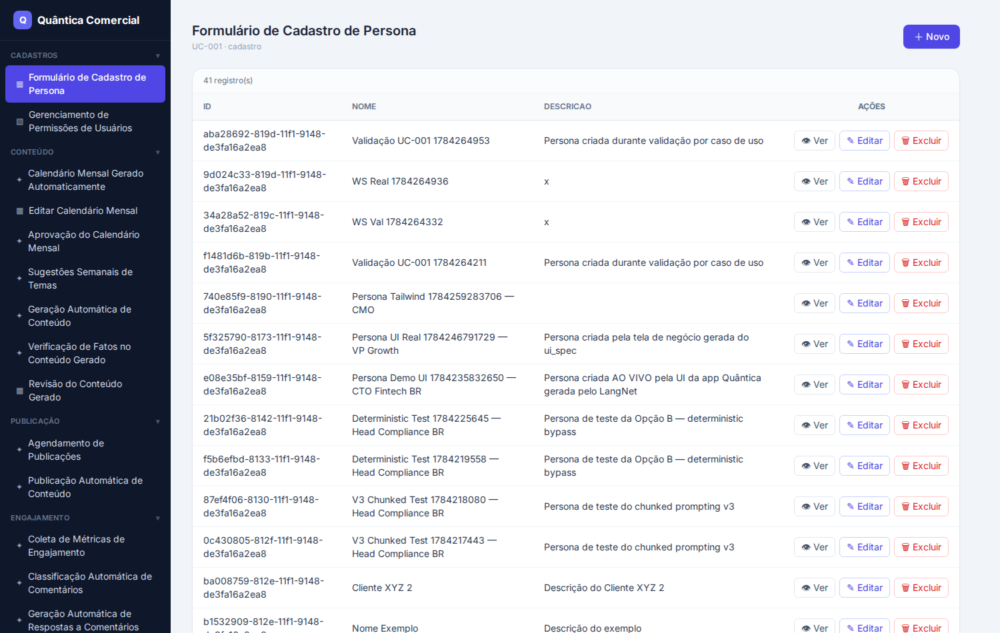
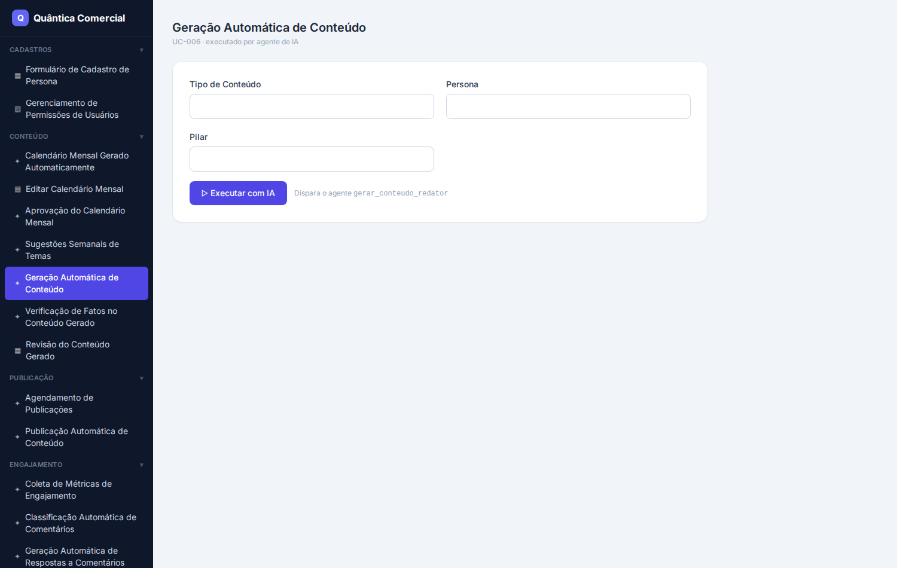
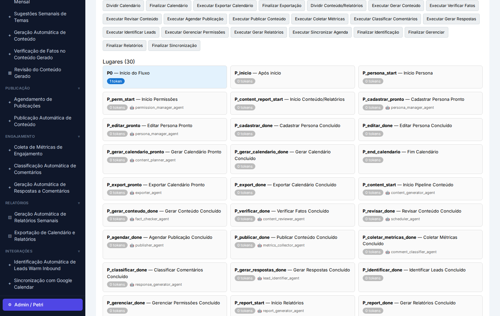
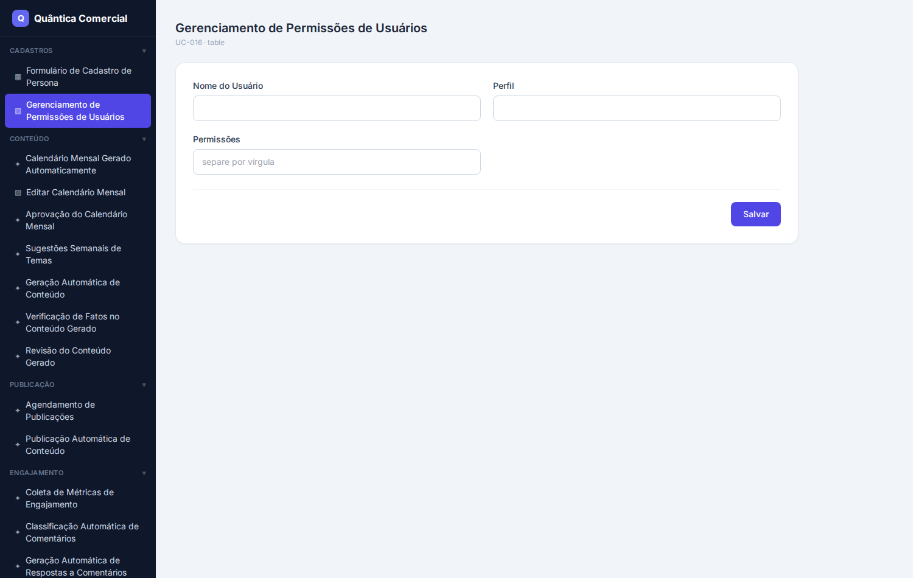

# F0 — Relatório Completo: Validação de Execução do App Gerado + Correções

**Data:** 23/07/2026 · **Projeto-teste:** Quântica Comercial
**Sessão de código validada:** `6b2ec6ad` (55 arquivos) · **LLM:** qwen2.5-coder-32b (LM Studio local)
**Banco do app:** `quantica_ops` (separado do `langnet`)

---

## 1. Objetivo do F0

Provar que o aplicativo **gerado pelo pipeline do LangNet realmente roda** — não só produz arquivos
plausíveis. E, a partir do que a execução revelasse, **corrigir no gerador** os problemas encontrados.

**Veredito:** ✅ **O app gerado roda de ponta a ponta** — telas React reais, persistência SQL real e
agentes CrewAI reais no LLM local. Todos os problemas encontrados eram de **polimento do gerador** e
foram corrigidos e retestados.

---

## 2. Ambiente montado

| Item | Ação |
|------|------|
| Extração | 55 arquivos gravados em `~/quantica-app-gerada/` (e versões v2/v3/final por retest) |
| Banco do app | `quantica_ops` (banco **separado** — sem risco ao `langnet`); ~20 tabelas |
| `.env` do ws-server | `LLM_PROVIDER=lmstudio`, modelo `qwen2.5-coder-32b-instruct`, `DB_NAME=quantica_ops` |
| Dependências | crewai, websockets, mysql-connector, litellm — presentes |

---

## 3. Testes de execução (validação inicial)

| # | Teste | Resultado | Evidência |
|---|-------|-----------|-----------|
| T-F0.1 | Subir `ws-server` (:5002) | ✅ | handshake `connected` lista as tasks |
| T-F0.2 | Task **determinística** (`cadastrar_persona_alvo`) → INSERT real | ✅ | `{status:sucesso, persona_id}`; persona + canais + problemas gravados no banco |
| T-F0.3 | Task **CrewAI** (`verificar_fatos_revisor`) → `crew.kickoff()` no LLM local | ✅ | ~30s; retornou `{"status":"falha"}` (julgou "300% em 2 dias" como não-comprovável) |
| T-F0.4 | `npm install` + `npm run build` do frontend | ✅ | "build folder is ready"; bundle 228 KB |

A cadeia **tela → `runTask` → WebSocket :5002 → ws-server → (SQL determinístico OU CrewAI+LLM)** funciona.

---

## 4. O app gerado rodando (capturas ao vivo)

O frontend gerado foi subido (`npm start`, porta 3001) contra o `ws-server` e o banco `quantica_ops`.
As telas abaixo são **do aplicativo gerado pelo LangNet em execução real**.

### 4.1 Tela de negócio com dados reais (CRUD por entidade)
"Formulário de Cadastro de Persona" — uma **tabela CRUD** listando **41 registros reais** do banco
(via `runTask("listar_personas")` → ws-server → SQL). Ações Ver/Editar/Excluir + "＋ Novo". Esta é a
**Cara A** (UI de negócio) gerada a partir do `ui_spec` + Modelo de Dados.

### 4.2 Formulário de cadastro (＋ Novo)
O formulário de criação de persona, com os campos do Modelo de Dados.

### 4.3 Tela executada por agente de IA
"Geração Automática de Conteúdo" (UC-006) — botão **"▷ Executar com IA"** que **dispara o agente
`gerar_conteudo_redator`** (task CrewAI) via WebSocket.

### 4.4 Executor da Rede de Petri (Cara B) — aba Admin
A aba **Admin / Petri** traz o executor formal da rede: **30 lugares** vinculados aos agentes
(`P_cadastrar` → `persona_manager_agent`, `P_verificar` → `fact_checker_agent`…) e botões de disparo
por tarefa. Cara A (negócio) e Cara B (orquestração) convivem no **mesmo app gerado**.

---

## 5. Problemas encontrados e correções (todas no GERADOR, retestadas)

Cada correção foi validada **regenerando o código** e, quando aplicável, **rodando o app**.

### 5.1 [Segurança] `.env.example` vazava segredos reais — `3e918ed`
O template embutia `DB_PASSWORD=112358123` (senha de produção), usuário/host reais, modelo LM Studio
errado e default `LLM_PROVIDER=deepseek` (nuvem).
**Correção:** placeholders vazios para todos os segredos, default `lmstudio`, modelo/endpoint refletindo
o ambiente (não-segredos). **Retest:** scan dos 55 arquivos regenerados → **nenhum segredo real**.

### 5.2 [Robustez] Adapter determinístico iterava string caractere-a-caractere — `e2033c6`
Se um campo de lista chegasse como string `"a, b"`, o INSERT criava uma linha por **caractere**.
**Correção:** helper `_as_list` normaliza string→lista nos dois geradores de loop.
**Retest ao vivo:** `cadastrar_persona_alvo` com `canais="LinkedIn, Instagram, Blog"` criou **3 canais
corretos**, não 20 caracteres.

### 5.3 [Funcional] Telas sem ação (form morto) — `e2033c6`
Algumas telas (ex.: "Gerenciamento de Permissões") vinham com `onPrimary` vazio e **sem botão**.
**Correção:** fallback resolve a task pelo **nome/entidade** da tela quando o `ui_spec` não a amarra;
sem task, vira **botão desabilitado** (não form morto).
**Retest ao vivo:** a tela de permissões agora tem o botão **"Salvar"** vinculado a
`gerenciar_permissoes_usuario` (ver abaixo).

### 5.4 [Blocker] Tool sem `args_schema` derrubava o ws-server — `8a6cdd9`
O LLM às vezes emite tools `BaseTool` com `args_schema = None`, que **quebra o CrewAI no import** e
derruba o servidor inteiro no startup (`AttributeError: 'NoneType' ... model_fields`).
**Correção:** `_ensure_tools_have_args_schema` injeta um schema default permissivo e substitui todo
`args_schema=None`. **Retest:** o `tools.py` que quebrava passou a importar (TOOL_REGISTRY com 7 tools)
e o ws-server sobe.

### 5.5 [Robustez] `schema_sql` stub mutilava o CRUD por entidade — `8a6cdd9`
A sessão de Modelo de Dados corrente tinha `schema_sql="teste"` (stub) apesar do `entities_json` cheio.
**Correção:** o code gen valida o schema (exige `CREATE TABLE` + tamanho) e cai para a sessão com schema
real. **Retest:** o fallback disparou (`schema real mais recente — 24045 chars`) e gerou **5 funções de
CRUD por entidade** — é o que faz a tela CRUD da seção 4.1 listar dados reais.

### 5.6 [Qualidade — documentado] Saída de task cognitiva enxuta
`verificar_fatos_revisor` retornou só `{"status":"falha"}`. Investigado: o `output_func` **já preserva
o raw**; a terseness é do **LLM**. Não é bug de código — registrado como limitação de qualidade do modelo
(melhorável via `expected_output` mais rico na geração das tasks).

---

## 6. Validação final (tudo junto)

Regeneração final (sessão `6b2ec6ad`, 55 arquivos) com **os 5 fixes** confirmados no código gerado, e o
**app final rodando**:
- ws-server sobe (16 tasks disponíveis);
- task determinística com input **string** → cria os canais corretos (não caracteres);
- telas de negócio renderizam dados reais do banco (seção 4);
- aba Admin/Petri renderiza os 30 lugares vinculados a agentes.

| Fix | Commit | Retest |
|-----|--------|--------|
| `.env.example` sem segredos | `3e918ed` | scan de 55 arquivos limpo |
| `_as_list` (adapter string) | `e2033c6` | runtime: 3 canais de string |
| binding tela→task | `e2033c6` | runtime: botão "Salvar" vinculado |
| tool sem args_schema | `8a6cdd9` | ws-server sobe (tools.py que quebrava) |
| schema_sql stub | `8a6cdd9` | fallback 24045 chars + 5 CRUD funcs |

---

## 7. Conclusão e itens em aberto

**F0 comprova:** o LangNet gera um app **executável e coerente** (Cara A + Cara B), e o gerador ficou
mais robusto e seguro. Todos os achados foram corrigidos no gerador e retestados.

**Itens menores em aberto (menor prioridade):**
- Casamento tela→task por similaridade ainda pode errar em casos ambíguos.
- `task_name` vazio nos lugares da Petri (vínculo vai na `logica` WS).
- Saída de tasks cognitivas às vezes enxuta (qualidade do LLM).

**Como reproduzir:** `cd ~/quantica-app-final/ws-server && python3 main.py` (:5002) +
`cd ~/quantica-app-final/frontend && npm start` (:3001).

**Próxima frente combinada:** F1 — Configurações reais (banco de dados + provedor LLM pela UI).
