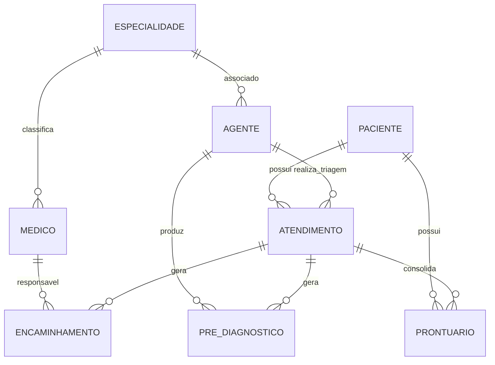
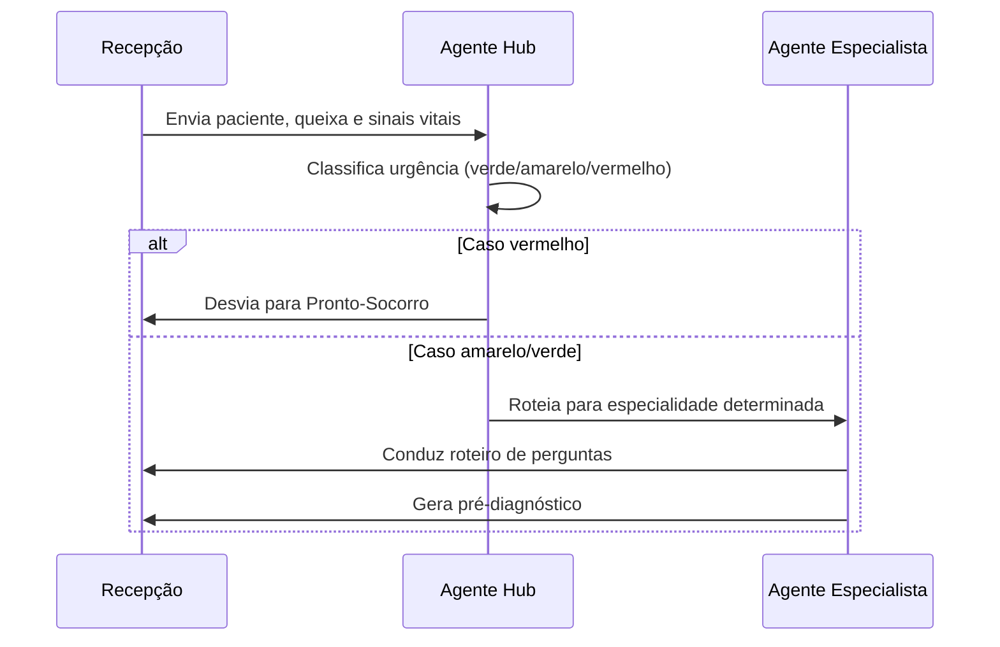
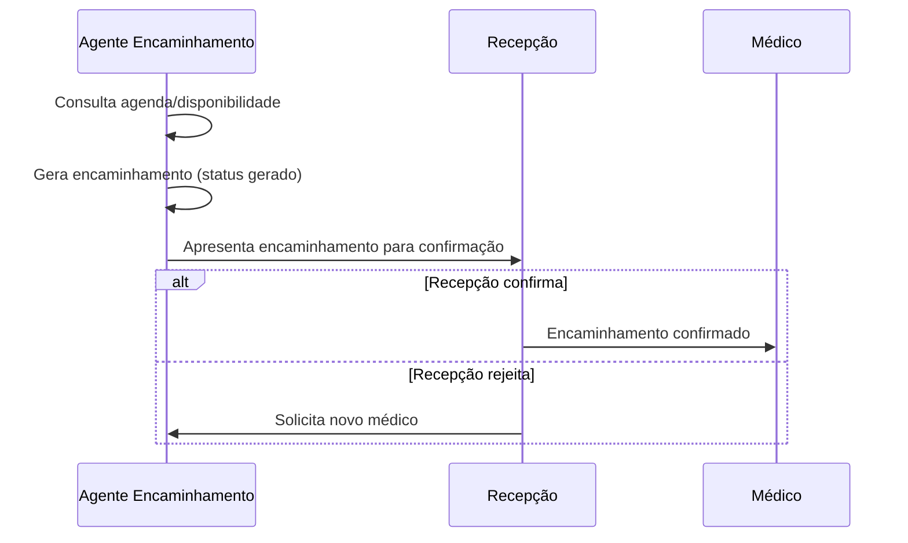
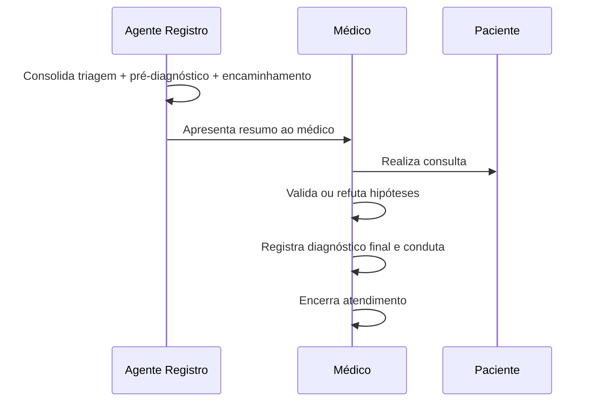
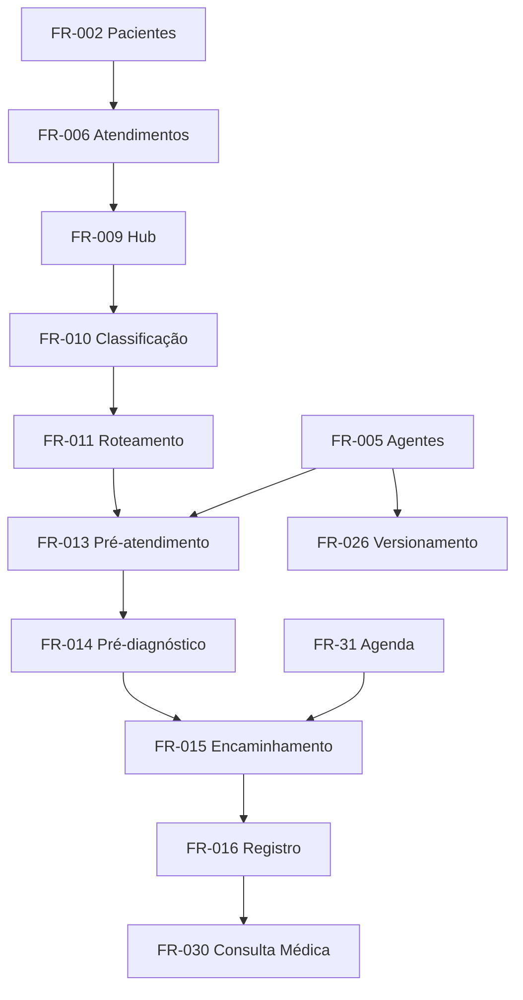
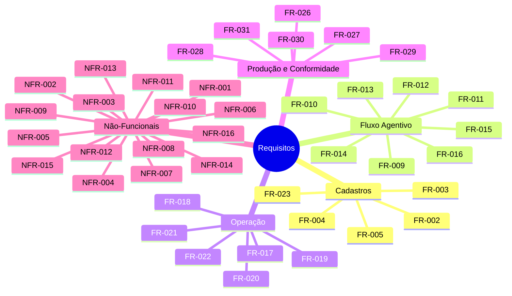

# Documento de Requisitos
## Análise de Requisitos - Projeto a3ae2f89-a7e1-44b2-9ea4-6b8394843c7a

---

**Versão:** 1.0
**Data:** 2026-08-03 15:00:52
**Status:** Draft

---

## 1. Informações do Projeto

### 1.1 Visão Geral
**Nome do Projeto:** Análise de Requisitos - Projeto a3ae2f89-a7e1-44b2-9ea4-6b8394843c7a

**Descrição:**
Sistema de clínica médica com triagem por agentes de IA: agente hub de triagem classifica urgência e roteia para agentes especialistas por área médica; agentes especialistas produzem pré-diagnóstico e encaminham ao médico. O sistema inclui cadastros de pacientes, médicos, especialidades, agentes, atendimentos, pré-diagnósticos e encaminhamentos, além de requisitos funcionais e não-funcionais.

**Objetivo:**
Entregar uma análise de requisitos completa, rastreável e validada, cobrindo o fluxo agentivo de triagem, pré-diagnóstico, encaminhamento, registro em prontuário, consulta médica e módulos administrativos/operacionais da clínica.

### 1.2 Contexto e Justificativa
O contexto estruturado de negócio não foi fornecido de forma detalhada nos documentos de entrada; recomenda-se validação complementar com stakeholders. Pelo escopo identificado, o projeto atende uma clínica médica com fluxo de recepção, triagem por IA, atendimento especializado, encaminhamento e prontuário eletrônico.

O domínio envolve dados sensíveis de saúde (queixas, sinais vitais, hipóteses diagnósticas, prontuários), portanto exige conformidade com a LGPD, sigilo médico e auditoria. O sistema depende criticamente de agentes de IA para classificação de urgência, roteamento, pré-diagnóstico, encaminhamento e registro; a decisão final permanece sempre com o médico humano.

Principais motivadores do projeto:
- Reduzir o tempo de triagem e melhorar a experiência do paciente;
- Padronizar a classificação de urgência com base em protocolo tipo Manchester;
- Usar IA para apoiar, e não substituir, a decisão médica;
- Garantir rastreabilidade de cada etapa produzida por cada agente;
- Atender requisitos legais e normativos de proteção de dados e prontuário.

### 1.3 Escopo
**Inclui:**
- Fluxo agentivo completo: hub de triagem, agentes especialistas, agente de encaminhamento e agente de registro/prontuário;
- CRUD de pacientes, médicos, especialidades e agentes de IA;
- Registro de atendimentos/triagens, pré-diagnósticos, encaminhamentos e prontuário;
- Módulos de recepção, triagem, pré-atendimento, encaminhamentos, prontuário, dashboard e cadastros;
- Fluxo de consulta médica com validação/refutação do pré-diagnóstico e registro de diagnóstico final;
- Gestão de agenda/disponibilidade médica, consentimento LGPD, fallback manual e auditoria.

**Exclui:**
- Integração com sistemas externos de faturamento, TISS, farmácia, laboratório e telemedicina;
- Internação hospitalar e gestão de leitos;
- Prescrição eletrônica integrada a serviços externos (a prescrição é registrada no fluxo médico, sem integração externa);
- Agendamento online para o paciente;
- Aplicativos mobile nativos (o escopo é interface web responsiva).

---

## 2. Fontes de Informação

### 2.1 Documentos Analisados

| ID | Nome do Documento | Tipo | Data | Autor | Caminho/URL |
|----|-------------------|------|------|-------|-------------|
| DOC-001 | Descrição do sistema e documento complementar de cadastros e fluxos | Documento de requisitos | 2026-08-03 | Não informado | Não informado |

### 2.2 Estatísticas de Análise

- **Total de documentos analisados:** 1
- **Total de páginas processadas:** Não informado
- **Total de palavras analisadas:** 784
- **Data da análise:** 2026-08-03
- **Tempo de processamento:** Não informado

---

## 3. Requisitos Funcionais (FR)

### Legenda de Indicadores de Origem

| Indicador | Significado | Descrição |
|-----------|-------------|-----------|
| 🔴 RED | Requisito Extraído do Documento | Identificado diretamente nos documentos fornecidos |
| 📘 REI | Requisito Extraído das Instruções | Especificado nas instruções do usuário |
| 🔧 RI | Requisito Inferido | Deduzido pelo LLM com base no contexto técnico |
| 🌐 RW | Requisito da Web Research | Identificado através de pesquisa complementar |
| 🤖 RIA | Requisito Sugerido pela IA | Adicionado pela IA para sistema production-ready |

### 3.1 Requisitos Extraídos dos Documentos (🔴 RED)

| ID | Origem | Nome | Descrição | Prioridade | Atores | Dependências | Critérios de Aceitação |
|----|--------|------|-----------|------------|--------|--------------|------------------------|
| FR-009 | 🔴 RED | Agente de Triagem (Hub) | Receber paciente e queixa inicial em texto livre, com sinais vitais opcionais, classificar urgência e determinar especialidade de destino. | Alta | Paciente, Recepcionista, Agente Hub | FR-002, FR-006 | Dado paciente e queixa, o hub retorna classificação e especialidade; sinais vitais opcionais não bloqueiam a triagem; falhas acionam FR-027. |
| FR-010 | 🔴 RED | Classificação de Urgência Manchester | Classificar urgência usando protocolo tipo Manchester, com níveis verde, amarelo e vermelho. | Alta | Agente Hub | FR-009 | Toda triagem tem classificação válida em {verde, amarelo, vermelho}; critérios objetivos ainda pendentes - ver GAP-001. |
| FR-011 | 🔴 RED | Roteamento para Agente Especialista | Encaminhar o paciente ao agente especialista da área médica determinada. | Alta | Agente Hub, Agente Especialista | FR-009, FR-010 | Para cada especialidade determinada, o roteamento aciona o agente ativo associado; se ausente, registra erro e aciona fallback. |
| FR-012 | 🔴 RED | Desvio de Casos Vermelhos | Casos classificados como vermelhos devem ser desviados diretamente para Pronto-Socorro/Emergência, sem fluxo regular de especialista. | Alta | Agente Hub, Recepcionista | FR-010 | Caso vermelho gera encaminhamento para PS com prioridade máxima; não aciona especialista regular; notifica recepção. |
| FR-013 | 🔴 RED | Pré-atendimento por Especialista | Agente especialista conduz pré-atendimento dirigido à especialidade, com roteiro de perguntas específico. | Alta | Agente Especialista, Paciente | FR-011, FR-005 | O especialista apresenta o roteiro e coleta respostas; a conclusão gera o pré-diagnóstico. |
| FR-014 | 🔴 RED | Geração de Pré-diagnóstico | Agente especialista produz pré-diagnóstico com hipóteses, nível de confiança e recomendação de exames. | Alta | Agente Especialista | FR-013 | Pré-diagnóstico possui hipóteses, confiança e exames; registrado com autor/agente, data/hora e versão do prompt. |
| FR-015 | 🔴 RED | Agente de Encaminhamento | Selecionar médico disponível da especialidade determinada, com base em agenda/disponibilidade, e criar encaminhamento. | Alta | Agente de Encaminhamento, Médico | FR-014, FR-003, FR-031 | Agente seleciona médico ativo e disponível; gera encaminhamento com status 'gerado'; evita conflito de agenda. |
| FR-016 | 🔴 RED | Agente de Registro/Prontuário | Consolidar triagem, pré-diagnóstico e encaminhamento no prontuário do paciente e gerar resumo para o médico. | Alta | Agente de Registro, Médico | FR-009, FR-014, FR-015 | Prontuário consolidado com todas as etapas; resumo gerado e acessível ao médico. |
| FR-017 | 🔴 RED | Módulo Recepção | Permitir cadastro/edição de pacientes, abertura de atendimento e acompanhamento da fila de triagem. | Alta | Recepcionista | FR-002 | Recepção cadastra/edita paciente, abre atendimento e visualiza fila ordenada por urgência e data/hora. |
| FR-018 | 🔴 RED | Tela de Triagem Agentiva | Exibir recebimento da queixa pelo agente-hub, classificação de urgência e área de destino, com resultado do roteamento. | Alta | Recepcionista, Médico | FR-009, FR-011 | Tela mostra queixa original, classificação, área de destino e resultado do roteamento. |
| FR-019 | 🔴 RED | Tela de Pré-atendimento | Permitir que o agente especialista conduza o roteiro de perguntas e exiba o pré-diagnóstico gerado. | Alta | Recepcionista, Médico, Paciente | FR-013, FR-014 | Tela exibe roteiro, respostas e pré-diagnóstico. |
| FR-020 | 🔴 RED | Tela de Encaminhamentos | Listar encaminhamentos gerados, com o médico selecionado. | Média | Recepcionista, Médico | FR-015 | Lista encaminhamentos com médico, especialidade, prioridade e status; permite confirmação conforme BR-009. |
| FR-021 | 🔴 RED | Tela de Prontuário | Exibir o histórico consolidado de atendimentos do paciente. | Alta | Médico, Recepcionista, Paciente | FR-016 | Prontuário exibe histórico consolidado com triagens, pré-diagnósticos, encaminhamentos e consultas. |
| FR-022 | 🔴 RED | Painel/Dashboard KPIs | Exibir KPIs operacionais: atendimentos do dia, distribuição por especialidade, urgências e tempo médio de triagem. | Média | Administrador, Médico, Recepcionista | FR-006, NFR-009 | KPIs calculados com dados reais; tempo médio de triagem usa timestamps de abertura e classificação. |
| FR-023 | 🔴 RED | Cadastros Administrativos | Gerenciar médicos, especialidades e agentes. | Média | Administrador | FR-003, FR-004, FR-005 | Admin gerencia médicos, especialidades e agentes com validação das regras de negócio. |

**Total: 15 requisitos extraídos dos documentos**

---

### 3.2 Requisitos das Instruções do Usuário (📘 REI)

| ID | Origem | Nome | Descrição | Prioridade | Atores | Dependências | Critérios de Aceitação |
|----|--------|------|-----------|------------|--------|--------------|------------------------|
| FR-001 | 📘 REI | Fluxo de Triagem por Agentes de IA | Sistema de clínica médica com triagem por agentes de IA: hub classifica urgência, roteia para especialistas, que produzem pré-diagnóstico e encaminham ao médico. | Alta | Todos | FR-009, FR-010, FR-013, FR-015, FR-016 | Fluxo ponta-a-ponta orquestrado, rastreável e com decisão final médica. Épico operacionalizado pelos FR-009 a FR-016. |
| FR-002 | 📘 REI | CRUD de Pacientes | Cadastrar, editar, consultar e excluir pacientes com nome, CPF, data de nascimento, contato, convênio e histórico. | Alta | Recepcionista, Administrador | Nenhuma | CRUD completo; exclusão lógica para preservar prontuário e auditoria (ver ISSUE-002). |
| FR-003 | 📘 REI | CRUD de Médicos | Cadastrar, editar, consultar e excluir médicos com nome, CRM, especialidade, disponibilidade/agenda e contato. | Alta | Administrador | FR-004, FR-031 | CRUD completo; CRM é único; especialidade obrigatória; exclusão lógica se houver atendimentos. |
| FR-004 | 📘 REI | CRUD de Especialidades | Cadastrar, editar, consultar e excluir especialidades com nome, descrição e agente especialista associado. | Alta | Administrador | FR-005 | CRUD completo; agente especialista obrigatório (BR-005); campo validado na criação. |
| FR-005 | 📘 REI | CRUD de Agentes de IA | Cadastrar, editar, consultar e excluir agentes com nome, tipo, especialidade associada, prompt/roteiro e status ativo. | Alta | Administrador | FR-004 | CRUD completo; tipos: triagem, especialista, encaminhamento, registro; somente ativos participam do fluxo. |
| FR-006 | 📘 REI | CRUD de Atendimentos/Triagens | Registrar paciente, queixa, sinais vitais, classificação de urgência, área de destino, data/hora e status. | Alta | Recepcionista | FR-002 | Registro completo; status com domínio definido, ex.: {aberto, em_triagem, aguardando_especialista, encaminhado, concluído, cancelado}. |
| FR-007 | 📘 REI | CRUD de Pré-diagnósticos | Registrar atendimento, agente responsável, hipóteses, confiança, exames sugeridos e texto. | Alta | Agente Especialista, Médico | FR-006, FR-005 | Estrutura de hipóteses definida, ex.: [{cid, descricao, justificativa}]; confiança com escala definida; exclusão lógica. |
| FR-008 | 📘 REI | CRUD de Encaminhamentos | Registrar atendimento, especialidade, médico, prioridade e status. | Alta | Recepcionista, Agente de Encaminhamento | FR-006, FR-003, FR-004 | Domínio de status e prioridade definido; confirmação manual pela recepção; exclusão lógica. |

**Total: 8 requisitos das instruções**

---

### 3.3 Requisitos Inferidos pelo LLM (🔧 RI)

| ID | Origem | Nome | Descrição | Prioridade | Atores | Dependências | Critérios de Aceitação |
|----|--------|------|-----------|------------|--------|--------------|------------------------|
| FR-024 | 🔧 RI | Modelo de Dados Relacional | Implementar modelo de dados relacional completo com Paciente, Médico, Especialidade, Agente, Atendimento/Triagem, Pré-diagnóstico, Encaminhamento e Prontuário, com relacionamentos e rastreabilidade. | Alta | Sistema | FR-002 a FR-008 | Banco possui todas as entidades, FK, índices e histórico de rastreabilidade. |
| FR-025 | 🔧 RI | Orquestração de Agentes | Criar camada de orquestração de agentes via serviços/API, permitindo execução sequencial do fluxo e registro de cada etapa produzida por agente. | Alta | Sistema, Agentes de IA | FR-009 a FR-016 | Orquestrador coordena hub, especialistas, encaminhamento e registro; falhas são registradas e tratadas. |

**Total: 2 requisitos inferidos**

---

### 3.4 Requisitos da Pesquisa Web (🌐 RW)

⚠️ **A pesquisa web foi realizada, mas não identificou requisitos funcionais adicionais relevantes para este domínio específico. A análise web focou em melhores práticas e padrões (ver Seção 13).**

**Total: 0 requisitos da web**

---

### 3.5 Requisitos Sugeridos pela IA (🤖 RIA)

| ID | Origem | Nome | Descrição | Prioridade | Atores | Dependências | Critérios de Aceitação |
|----|--------|------|-----------|------------|--------|--------------|------------------------|
| FR-026 | 🤖 RIA | Versionamento de Prompts/Roteiros | Manter histórico de versões dos prompts/roteiros dos agentes e associar a versão utilizada a cada triagem e pré-diagnóstico. | Média | Administrador, Sistema | FR-005 | Cada triagem/pré-diagnóstico registra a versão do prompt; histórico permite reconstituir decisões passadas. |
| FR-027 | 🤖 RIA | Fallback Manual | Implementar mecanismo de fallback para triagem e encaminhamento manual quando um agente de IA estiver indisponível ou retornar erro. | Alta | Recepcionista, Administrador | FR-009 a FR-016 | Procedimento operacional definido; a ação manual é registrada com justificativa. |
| FR-028 | 🤖 RIA | Justificativa da Classificação | Registrar justificativa e principais fatores/sinais que levaram à classificação de urgência em cada triagem. | Alta | Agente Hub | FR-009, FR-010 | Toda classificação possui justificativa textual e fatores de decisão armazenados. |
| FR-029 | 🤖 RIA | Gestão de Consentimento LGPD | Registrar consentimento do paciente para coleta, uso e compartilhamento de dados de saúde pelos agentes de IA, com data/hora, finalidade e versão do termo; permitir revogação e bloquear novos processamentos quando revogado. | Alta | Paciente, Recepcionista | FR-002, FR-006 | Fluxo de captura e revogação implementado; sem consentimento vigente não há novo processamento, exceto emergência comprovada (BR-011). |
| FR-030 | 🤖 RIA | Fluxo de Consulta Médica | Disponibilizar fluxo no qual o médico visualiza o resumo do Agente de Registro e o pré-diagnóstico, valida ou refuta hipóteses, registra diagnóstico final, conduta/prescrição e encerra o atendimento, com CRM do médico responsável. | Alta | Médico | FR-016, FR-021 | Médico consegue concluir atendimento; registro final é auditável e associado ao CRM. |
| FR-031 | 🤖 RIA | Agenda e Disponibilidade Médica | Gerenciar agenda e disponibilidade dos médicos: horários, bloqueios, ausências, capacidade; consultar disponibilidade em tempo real para o Agente de Encaminhamento. | Alta | Médico, Administrador | FR-003, FR-015 | Agenda com horários e bloqueios; consulta de disponibilidade em tempo real usada no encaminhamento. |

**Total: 6 requisitos sugeridos pela IA**

---

### 3.6 CONSOLIDADO - Todos os Requisitos Funcionais

| ID | Origem | Nome | Prioridade |
|----|--------|------|------------|
| FR-001 | 📘 REI | Fluxo de Triagem por Agentes de IA | Alta |
| FR-002 | 📘 REI | CRUD de Pacientes | Alta |
| FR-003 | 📘 REI | CRUD de Médicos | Alta |
| FR-004 | 📘 REI | CRUD de Especialidades | Alta |
| FR-005 | 📘 REI | CRUD de Agentes de IA | Alta |
| FR-006 | 📘 REI | CRUD de Atendimentos/Triagens | Alta |
| FR-007 | 📘 REI | CRUD de Pré-diagnósticos | Alta |
| FR-008 | 📘 REI | CRUD de Encaminhamentos | Alta |
| FR-009 | 🔴 RED | Agente de Triagem (Hub) | Alta |
| FR-010 | 🔴 RED | Classificação de Urgência Manchester | Alta |
| FR-011 | 🔴 RED | Roteamento para Agente Especialista | Alta |
| FR-012 | 🔴 RED | Desvio de Casos Vermelhos | Alta |
| FR-013 | 🔴 RED | Pré-atendimento por Especialista | Alta |
| FR-014 | 🔴 RED | Geração de Pré-diagnóstico | Alta |
| FR-015 | 🔴 RED | Agente de Encaminhamento | Alta |
| FR-016 | 🔴 RED | Agente de Registro/Prontuário | Alta |
| FR-017 | 🔴 RED | Módulo Recepção | Alta |
| FR-018 | 🔴 RED | Tela de Triagem Agentiva | Alta |
| FR-019 | 🔴 RED | Tela de Pré-atendimento | Alta |
| FR-020 | 🔴 RED | Tela de Encaminhamentos | Média |
| FR-021 | 🔴 RED | Tela de Prontuário | Alta |
| FR-022 | 🔴 RED | Painel/Dashboard KPIs | Média |
| FR-023 | 🔴 RED | Cadastros Administrativos | Média |
| FR-024 | 🔧 RI | Modelo de Dados Relacional | Alta |
| FR-025 | 🔧 RI | Orquestração de Agentes | Alta |
| FR-026 | 🤖 RIA | Versionamento de Prompts/Roteiros | Média |
| FR-027 | 🤖 RIA | Fallback Manual | Alta |
| FR-028 | 🤖 RIA | Justificativa da Classificação | Alta |
| FR-029 | 🤖 RIA | Gestão de Consentimento LGPD | Alta |
| FR-030 | 🤖 RIA | Fluxo de Consulta Médica | Alta |
| FR-031 | 🤖 RIA | Agenda e Disponibilidade Médica | Alta |

**Total Geral: 31 requisitos funcionais**

---

## 4. Requisitos Não-Funcionais (NFR)

### 4.1 Requisitos Extraídos dos Documentos (🔴 RED)

| ID | Origem | Nome | Descrição | Categoria | Métrica Mensurável | Prioridade | Critérios de Aceitação |
|----|--------|------|-----------|-----------|--------------------|------------|------------------------|
| NFR-001 | 🔴 RED | Rastreabilidade do Fluxo | Registrar em banco triagem, pré-diagnóstico, encaminhamento e prontuário, com rastreabilidade de qual agente produziu o quê e quando. | Confiabilidade | 100% das etapas persistidas com agente, data/hora e identificador | Alta | Toda etapa possui agente autor, timestamp e referência ao atendimento. |
| NFR-002 | 🔴 RED | Auditabilidade da Triagem | Triagem auditável: guardar queixa original, classificação e justificativa. | Segurança | Registro imutável e recuperável para cada triagem | Alta | Queixa original, classificação e justificativa armazenadas sem possibilidade de alteração. |
| NFR-003 | 🔴 RED | Aviso de Pré-diagnóstico | Exibir aviso claro de que pré-diagnósticos são apoio à decisão; a decisão final é sempre do médico humano. | Usabilidade | Aviso visível e não dispensável nas telas de pré-diagnóstico | Alta | Texto padrão exibido no topo: 'Pré-diagnóstico automatizado de apoio à decisão. A decisão final é exclusiva do médico.' |
| NFR-004 | 🔴 RED | Interface Responsiva | Interface responsiva e organizada por módulos. | Usabilidade | Layout funcional em resoluções 320/768/1280 px | Média | Suportar breakpoints; navegadores alvo devem ser definidos (Q-008). |

**Total: 4 requisitos extraídos dos documentos**

---

### 4.2 Requisitos das Instruções do Usuário (📘 REI)

Nenhum requisito não-funcional foi extraído diretamente das instruções; os requisitos NFR-001 a NFR-004 vieram do documento complementar e os demais foram inferidos ou sugeridos pela IA.

**Total: 0 requisitos das instruções**

---

### 4.3 Requisitos Inferidos pelo LLM (🔧 RI)

| ID | Origem | Nome | Descrição | Categoria | Métrica Mensurável | Prioridade | Critérios de Aceitação |
|----|--------|------|-----------|-----------|--------------------|------------|------------------------|
| NFR-005 | 🔧 RI | Segurança e Privacidade LGPD | Garantir segurança e privacidade de dados de saúde, com conformidade à LGPD: consentimento, minimização, proteção em repouso e em trânsito. | Segurança | Política de privacidade e controles implementados | Alta | Dados sensíveis classificados, minimizados e protegidos; DPIA recomendado. |
| NFR-006 | 🔧 RI | Autenticação e Autorização por Papel | Implementar autenticação e autorização por papel: Recepcionista, Médico, Administrador e, quando aplicável, Paciente. | Segurança | Matriz de permissões RBAC por papel/módulo | Alta | Usuário só acessa ações permitidas; matriz detalhada pendente (Q-006). |
| NFR-007 | 🔧 RI | Logs de Auditoria | Manter logs de auditoria imutáveis e completos para ações de usuários e de agentes de IA. | Segurança | 100% das ações sensíveis registradas | Alta | Logs com autor, data/hora, ação, entidade e valores relevantes; imutabilidade garantida. |
| NFR-008 | 🔧 RI | Disponibilidade e Tratamento de Falhas | Garantir disponibilidade e tratamento de falhas no fluxo de triagem, sem perda de dados e com recuperação segura. | Confiabilidade | Disponibilidade mensal ≥ 99,9% | Alta | Falhas de agente acionam fallback sem perda das etapas já persistidas. |
| NFR-009 | 🔧 RI | Monitoramento do KPI de Triagem | Monitorar desempenho do fluxo de triagem, incluindo o KPI de tempo médio de triagem, e garantir resposta adequada ao uso na recepção. | Performance | KPI disponível no dashboard | Média | Tempo médio calculado por m+odia(date_fim_classificacao - date_abertura_atendimento). |

**Total: 5 requisitos inferidos**

---

### 4.4 Requisitos da Pesquisa Web (🌐 RW)

⚠️ **A pesquisa web foi realizada, mas não identificou requisitos não-funcionais adicionais relevantes para este domínio específico. Os padrões e boas práticas recomendados estão descritos na Seção 13.**

**Total: 0 requisitos da web**

---

### 4.5 Requisitos Sugeridos pela IA (🤖 RIA)

| ID | Origem | Nome | Descrição | Categoria | Métrica Mensurável | Prioridade | Critérios de Aceitação |
|----|--------|------|-----------|-----------|--------------------|------------|------------------------|
| NFR-010 | 🤖 RIA | Criptografia de Dados | Criptografar dados sensíveis em repouso e em trânsito, incluindo prontuários, queixas e pré-diagnósticos. | Segurança | AES-256 em repouso; TLS 1.2+ em trânsito | Alta | Dados sensíveis criptografados em banco e nas comunicações. |
| NFR-011 | 🤖 RIA | Backup e Recuperação de Desastres | Implementar backup automatizado e recuperação de desastres com RPO ≤ 15 min e RTO ≤ 4 h, backups criptografados e testes de restauração periódicos. | Confiabilidade | RPO ≤ 15 min; RTO ≤ 4 h | Alta | Backups automáticos criptografados; restauração testada periodicamente. |
| NFR-012 | 🤖 RIA | Observabilidade | Implementar monitoramento contínuo, health checks e alertas automatizados para agentes de IA, orquestrador, APIs e banco de dados, com métricas de latência, taxa de erro e filas. | Manutenibilidade | Alertas configurados para latência, erro e indisponibilidade | Alta | Health checks nos componentes; alertas acionados em degradação. |
| NFR-013 | 🤖 RIA | Rate Limiting e Proteção | Aplicar rate limiting, proteção contra força bruta e mitigação de DDoS nos endpoints públicos, com limites por IP e usuário autenticado, além de bloqueio temporário após tentativas inválidas. | Segurança | Limites configurados por IP e usuário | Alta | Endpoints públicos protegidos; bloqueio temporário após tentativas inválidas. |
| NFR-014 | 🤖 RIA | Desempenho | Definir e monitorar benchmarks de desempenho: 95% das chamadas de triagem do hub em até 10 segundos e 95% dos pré-diagnósticos em até 60 segundos, com escalabilidade horizontal do orquestrador. | Performance | 95% das triagens ≤ 10s; 95% pré-diagnósticos ≤ 60s; janela mensal | Alta | Métricas coletadas por janela mensal, sem considerar retries (Q-009). |
| NFR-015 | 🤖 RIA | Retenção e Descarte de Dados | Definir e aplicar política de retenção e descarte: prontuários e registros de atendimento retidos por no mínimo 20 anos, dados não clínicos conforme finalidade, com descarte seguro. | Segurança | Política documentada e implementada | Alta | Prazo de retenção validado com jurídico; descarte seguro após prazo. |
| NFR-016 | 🤖 RIA | Acessibilidade WCAG | Garantir acessibilidade das interfaces web conforme WCAG 2.1 nível AA, incluindo navegação por teclado, contraste, legendas e compatibilidade com leitores de tela. | Usabilidade | Auditoria WCAG 2.1 AA | Média | Interface navegável por teclado; compatível com leitores de tela; contraste adequado. |

**Total: 7 requisitos sugeridos pela IA**

---

### 4.6 CONSOLIDADO - Todos os Requisitos Não-Funcionais

| ID | Origem | Nome | Categoria | Prioridade |
|----|--------|------|-----------|------------|
| NFR-001 | 🔴 RED | Rastreabilidade do Fluxo | Confiabilidade | Alta |
| NFR-002 | 🔴 RED | Auditabilidade da Triagem | Segurança | Alta |
| NFR-003 | 🔴 RED | Aviso de Pré-diagnóstico | Usabilidade | Alta |
| NFR-004 | 🔴 RED | Interface Responsiva | Usabilidade | Média |
| NFR-005 | 🔧 RI | Segurança e Privacidade LGPD | Segurança | Alta |
| NFR-006 | 🔧 RI | Autenticação e Autorização por Papel | Segurança | Alta |
| NFR-007 | 🔧 RI | Logs de Auditoria | Segurança | Alta |
| NFR-008 | 🔧 RI | Disponibilidade e Tratamento de Falhas | Confiabilidade | Alta |
| NFR-009 | 🔧 RI | Monitoramento do KPI de Triagem | Performance | Média |
| NFR-010 | 🤖 RIA | Criptografia de Dados | Segurança | Alta |
| NFR-011 | 🤖 RIA | Backup e Recuperação de Desastres | Confiabilidade | Alta |
| NFR-012 | 🤖 RIA | Observabilidade | Manutenibilidade | Alta |
| NFR-013 | 🤖 RIA | Rate Limiting e Proteção | Segurança | Alta |
| NFR-014 | 🤖 RIA | Desempenho | Performance | Alta |
| NFR-015 | 🤖 RIA | Retenção e Descarte de Dados | Segurança | Alta |
| NFR-016 | 🤖 RIA | Acessibilidade WCAG | Usabilidade | Média |

**Total Geral: 16 requisitos não-funcionais**

---

## 5. Regras de Negócio (BR)

### 5.1 Regras Extraídas dos Documentos (🔴 RED)

| ID | Origem | Nome | Descrição/Condição/Ação | Prioridade | Entidades Afetadas |
|----|--------|------|------------------------|------------|--------------------|
| BR-001 | 🔴 RED | Protocolo Manchester | A classificação de urgência deve seguir protocolo tipo Manchester, com níveis verde, amarelo e vermelho. | Alta | Atendimento/Triagem |
| BR-002 | 🔴 RED | Desvio de Urgência Vermelha | Todo paciente classificado como vermelho deve ser desviado diretamente para Pronto-Socorro/Emergência. | Alta | Atendimento, Encaminhamento |
| BR-003 | 🔴 RED | Pré-diagnóstico como Apoio | Pré-diagnósticos são apenas apoio à decisão; a decisão final é sempre do médico humano. | Alta | Pré-diagnóstico, Prontuário |
| BR-004 | 🔴 RED | Seleção de Médico Disponível | O Agente de Encaminhamento deve selecionar somente médicos disponíveis da especialidade determinada pelo pré-diagnóstico. | Alta | Agenda, Encaminhamento, Médico |
| BR-005 | 🔴 RED | Agente Especialista por Especialidade | Cada especialidade médica deve ter um agente especialista associado. | Alta | Especialidade, Agente |
| BR-006 | 🔴 RED | Somente Agentes Ativos | Somente agentes com status ativo devem ser considerados no roteamento e na execução do fluxo. | Alta | Agente, Fluxo de triagem |
| BR-007 | 🔴 RED | Estrutura do Pré-diagnóstico | O pré-diagnóstico deve conter hipóteses, nível de confiança e recomendação de exames. | Alta | Pré-diagnóstico |
| BR-008 | 🔴 RED | Registro de Justificativa | A triagem deve registrar a queixa original, a classificação e a justificativa para fins de auditoria. | Alta | Atendimento/Triagem |
| BR-009 | 🔴 RED | Confirmação de Encaminhamento | O recepcionista/atendente deve confirmar os encaminhamentos gerados. | Média | Encaminhamento |
| BR-010 | 🔴 RED | Campos do Encaminhamento | O encaminhamento deve conter atendimento, especialidade, médico, prioridade e status. | Alta | Encaminhamento |

**Total: 10 regras extraídas dos documentos**

---

### 5.2 Regras das Instruções do Usuário (📘 REI)

Nenhuma regra de negócio adicional foi especificada diretamente nas instruções; as regras extraídas vieram do documento complementar ou foram sugeridas pela IA.

**Total: 0 regras das instruções**

---

### 5.3 Regras Inferidas pelo LLM (🔧 RI)

Nenhuma regra de negócio foi inferida pelo LLM nesta iteração.

**Total: 0 regras inferidas**

---

### 5.4 Regras da Pesquisa Web (🌐 RW)

⚠️ **A pesquisa web não retornou regras de negócio adicionais no momento da geração.**

**Total: 0 regras da web**

---

### 5.5 Regras Sugeridas pela IA (🤖 RIA)

| ID | Origem | Nome | Descrição/Condição/Ação | Prioridade | Entidades Afetadas |
|----|--------|------|------------------------|------------|--------------------|
| BR-011 | 🤖 RIA | Consentimento em Emergência | O processamento de dados de saúde pelos agentes exige consentimento prévio do paciente; em emergência/risco de vida comprovada, o atendimento pode iniciar antes do consentimento, com registro de justificativa no prontuário e solicitação de consentimento assim que possível. | Alta | Consentimento, Atendimento, Prontuário |

**Total: 1 regra sugerida pela IA**

---

### 5.6 CONSOLIDADO - Todas as Regras de Negócio

| ID | Origem | Nome | Prioridade |
|----|--------|------|------------|
| BR-001 | 🔴 RED | Protocolo Manchester | Alta |
| BR-002 | 🔴 RED | Desvio de Urgência Vermelha | Alta |
| BR-003 | 🔴 RED | Pré-diagnóstico como Apoio | Alta |
| BR-004 | 🔴 RED | Seleção de Médico Disponível | Alta |
| BR-005 | 🔴 RED | Agente Especialista por Especialidade | Alta |
| BR-006 | 🔴 RED | Somente Agentes Ativos | Alta |
| BR-007 | 🔴 RED | Estrutura do Pré-diagnóstico | Alta |
| BR-008 | 🔴 RED | Registro de Justificativa | Alta |
| BR-009 | 🔴 RED | Confirmação de Encaminhamento | Média |
| BR-010 | 🔴 RED | Campos do Encaminhamento | Alta |
| BR-011 | 🤖 RIA | Consentimento em Emergência | Alta |

**Total Geral: 11 regras de negócio**

---

## 6. Atores e Stakeholders

### 6.1 Atores do Sistema

| ID | Nome | Tipo | Papel | Responsabilidades | Pontos de Interação | Requisitos Relacionados |
|----|------|------|-------|-------------------|---------------------|------------------------|
| ACTOR-001 | Recepcionista/Atendente | Usuário | Responsável pelo cadastro de pacientes, abertura de atendimentos, acompanhamento da fila de triagem e confirmação de encaminhamentos. | Cadastrar pacientes; abrir atendimentos; acompanhar fila; confirmar/rejeitar encaminhamentos. | Recepção, Triagem, Encaminhamentos | FR-002, FR-006, FR-017, FR-020, BR-009 |
| ACTOR-002 | Médico | Usuário | Responsável pela decisão clínica final. | Visualizar resumo do Agente de Registro; validar ou refutar hipóteses; registrar diagnóstico final, conduta e prescrição; encerrar atendimento. | Consulta médica, Prontuário | FR-030, FR-021, NFR-003, BR-003 |
| ACTOR-003 | Administrador | Usuário | Responsável pela gestão de cadastros e configuração dos agentes. | Gerenciar médicos, especialidades, agentes, agendas e usuários; auditar o sistema. | Cadastros administrativos, Dashboard | FR-003, FR-004, FR-005, FR-023, FR-031, NFR-006 |
| ACTOR-004 | Paciente | Usuário | Titular dos dados de saúde. | Fornecer queixa, sinais vitais e consentimento; receber atendimento e acessar seus próprios dados quando aplicável. | Recepção, Triagem, Pré-atendimento, Prontuário | FR-002, FR-006, FR-013, FR-029, BR-011 |
| ACTOR-005 | Agente Hub de Triagem | Sistema/IA | Classifica urgência e roteia o paciente. | Receber queixa; classificar; determinar especialidade; desviar vermelhos para PS. | Triagem agentiva | FR-009, FR-010, FR-011, FR-012, FR-028 |
| ACTOR-006 | Agente Especialista | Sistema/IA | Conduz pré-atendimento dirigido à especialidade. | Aplicar roteiro de perguntas; gerar pré-diagnóstico. | Pré-atendimento por especialidade | FR-013, FR-014 |
| ACTOR-007 | Agente de Encaminhamento | Sistema/IA | Seleciona médico disponível e cria encaminhamento. | Consultar agenda; selecionar médico; gerar encaminhamento. | Encaminhamentos | FR-015, FR-031, BR-004 |
| ACTOR-008 | Agente de Registro/Prontuário | Sistema/IA | Consolida etapas no prontuário e gera resumo. | Consolidar triagem, pré-diagnóstico e encaminhamento; gerar resumo. | Prontuário | FR-016 |

---

## 7. Entidades e Relacionamentos

### 7.1 Modelo Conceitual de Dados

### 7.2 Descrição das Entidades

**[ENTITY-001] Paciente**
**Descrição:** Pessoa atendida pela clínica.
**Atributos:** id, nome, CPF, data_nascimento, contato, convenio, historico, status, consentimento.
**Relacionamentos:** possui ATENDIMENTO (1-N); possui PRONTUARIO (1-N).
**Regras de Negócio Aplicáveis:** BR-011.

**[ENTITY-002] Médico**
**Descrição:** Profissional de saúde responsável pelo atendimento final.
**Atributos:** id, nome, CRM, especialidade_id, contato, disponibilidade/agenda, status.
**Relacionamentos:** responsavel por ENCAMINHAMENTO (1-N); pertence a ESPECIALIDADE (N-1).
**Regras de Negócio Aplicáveis:** BR-003, BR-004.

**[ENTITY-003] Especialidade**
**Descrição:** Área médica de atendimento.
**Atributos:** id, nome, descricao, agente_especialista_id.
**Relacionamentos:** classifica MÉDICO (1-N); associada a AGENTE (1-1).
**Regras de Negócio Aplicáveis:** BR-005.

**[ENTITY-004] Agente**
**Descrição:** Agente de IA configurável para triagem, especialidade, encaminhamento ou registro.
**Atributos:** id, nome, tipo, especialidade_id, prompt/roteiro, versao_prompt, status_ativo.
**Relacionamentos:** realiza ATENDIMENTO (1-N); produz PRE_DIAGNOSTICO (1-N); associado a ESPECIALIDADE (N-1).
**Regras de Negócio Aplicáveis:** BR-005, BR-006.

**[ENTITY-005] Atendimento/Triagem**
**Descrição:** Registro de um atendimento do paciente com triagem.
**Atributos:** id, paciente_id, queixa, sinais_vitais, classificacao_urgencia, justificativa, area_destino, data_hora, status.
**Relacionamentos:** possui PACIENTE (N-1); gera PRE_DIAGNOSTICO (1-N); gera ENCAMINHAMENTO (1-N); consolidado em PRONTUARIO (N-1).
**Regras de Negócio Aplicáveis:** BR-001, BR-002, BR-007, BR-008.

**[ENTITY-006] Pré-diagnóstico**
**Descrição:** Resultado do agente especialista.
**Atributos:** id, atendimento_id, agente_id, hipoteses, nivel_confianca, exames_sugeridos, texto, versao_prompt.
**Relacionamentos:** pertence a ATENDIMENTO (N-1); produzido por AGENTE (N-1).
**Regras de Negócio Aplicáveis:** BR-003, BR-007.

**[ENTITY-007] Encaminhamento**
**Descrição:** Registro de encaminhamento para médico/especialidade.
**Atributos:** id, atendimento_id, especialidade_id, medico_id, prioridade, status, data_hora.
**Relacionamentos:** pertence a ATENDIMENTO (N-1); responsavel MÉDICO (N-1).
**Regras de Negócio Aplicáveis:** BR-002, BR-004, BR-009, BR-010.

**[ENTITY-008] Prontuário**
**Descrição:** Histórico consolidado do paciente.
**Atributos:** id, paciente_id, atendimento_id, dados_consolidados, resumo_medico, data_atualizacao.
**Relacionamentos:** pertence a PACIENTE (N-1); consolidado de ATENDIMENTO (N-1).
**Regras de Negócio Aplicáveis:** BR-003, BR-011, NFR-001, NFR-002.

**[ENTITY-009] Agenda/Disponibilidade**
**Descrição:** Disponibilidade e horários do médico.
**Atributos:** id, medico_id, data, horario_inicio, horario_fim, bloqueios, status.
**Relacionamentos:** pertence a MÉDICO (N-1).
**Regras de Negócio Aplicáveis:** BR-004.

**[ENTITY-010] Consentimento**
**Descrição:** Registro de consentimento do paciente para tratamento de dados de saúde.
**Atributos:** id, paciente_id, versao_termo, data_hora, finalidade, status, revogacao_data.
**Relacionamentos:** pertence a PACIENTE (N-1).
**Regras de Negócio Aplicáveis:** BR-011.

---

## 8. Fluxos de Trabalho Identificados

### 8.1 Visão Geral dos Fluxos

| ID | Nome | Descrição | Requisitos Relacionados |
|----|------|-----------|------------------------|
| WORKFLOW-001 | Triagem Agentiva | Recepção abre atendimento; hub classifica e roteia; especialista conduz pré-atendimento e gera pré-diagnóstico. | FR-006, FR-009, FR-010, FR-011, FR-013, FR-014 |
| WORKFLOW-002 | Encaminhamento e Confirmação | Agente de encaminhamento seleciona médico disponível; recepção confirma ou rejeita. | FR-015, FR-020, BR-009 |
| WORKFLOW-003 | Registro e Consulta Médica | Agente de registro consolida prontuário; médico valida/refuta hipóteses, registra diagnóstico final e encerra. | FR-016, FR-021, FR-030, BR-003 |

### 8.2 Fluxos Detalhados

**[WORKFLOW-001] Triagem Agentiva**
**Gatilho:** Recepção abre atendimento para paciente já cadastrado.
**Atores Envolvidos:** Recepcionista, Paciente, Agente Hub, Agente Especialista.

**Passos:**
1. Recepção abre atendimento com queixa e sinais vitais.
2. Hub classifica urgência e registra justificativa.
3. Se vermelho → desvio para PS (BR-002).
4. Se amarelo/verde → roteia para especialista ativo.
5. Especialista conduz roteiro e gera pré-diagnóstico.

**Fluxos Alternativos:**
- **Alt-1:** Sinais vitais ausentes; triagem continua com queixa em texto livre.
- **Alt-2:** Especialidade não identificada; fluxo de fallback manual.

**Fluxos de Exceção:**
- **Exc-1:** Hub indisponível → fallback manual (FR-027).
- **Exc-2:** Agente especialista sem resposta → nova tentativa e fallback.

**[WORKFLOW-002] Encaminhamento e Confirmação**
**Gatilho:** Pré-diagnóstico gerado com especialidade definida.
**Atores Envolvidos:** Agente de Encaminhamento, Recepcionista, Médico.

**Fluxos de Exceção:**
- **Exc-1:** Nenhum médico disponível → encaminhamento pendente e fila de espera.
- **Exc-2:** Agenda alterada após seleção → validação em tempo real.

**[WORKFLOW-003] Registro e Consulta Médica**
**Gatilho:** Encaminhamento confirmado e paciente em consulta.
**Atores Envolvidos:** Agente de Registro, Médico, Paciente.

---

## 9. Glossário de Termos do Domínio

### 9.1 Termos e Definições

| Termo | Definição | Contexto de Uso | Sinônimos | Termos Relacionados |
|-------|-----------|-----------------|-----------|---------------------|
| Triagem | Processo de classificação de urgência e direcionamento do paciente. | Fluxo inicial do atendimento | Classificação de risco | Atendimento, Urgência |
| Protocolo Manchester | Protocolo de classificação de risco com níveis de urgência. | Classificação verde/amarelo/vermelho | Sistema Manchester | BR-001 |
| Pré-diagnóstico | Hipóteses diagnósticas geradas por IA como apoio à decisão. | Resultado do agente especialista | Hipóteses diagnósticas | Diagnóstico final |
| Agente de IA | Componente de software baseado em IA configurável para tarefas específicas. | Hub, especialista, encaminhamento, registro | Assistente de IA | Orquestração |
| Prontuário | Registro consolidado e histórico dos atendimentos do paciente. | Consulta médica e auditoria | Prontuário eletrônico | Paciente |
| Encaminhamento | Registro de direcionamento do paciente a um médico/especialidade. | Fluxo pós pré-diagnóstico | Referência | Médico, Especialidade |
| Orquestração | Coordenação da execução sequencial de agentes e persistência de cada etapa. | Camada de serviços/API | Pipeline | Agente de IA |
| Roteamento | Ação de direcionar o paciente ao agente especialista da área correta. | Fluxo do hub | Direcionamento | Agente Hub |
| Fallback | Procedimento alternativo quando um agente falha ou está indisponível. | Continuidade do atendimento | Plano B | Resiliência |
| Consentimento | Autorização do titular para tratamento de dados pessoais sensíveis. | Captura/revogação LGPD | Autorização | LGPD |
| Sinais vitais | Medidas fisiológicas como pressão, frequência cardíaca, saturação e temperatura. | Triagem | Parâmetros vitais | Atendimento |
| CRM | Registro do médico no Conselho Regional de Medicina. | Identificação do médico | Número CRM | Médico |
| CID-10 | Classificação Internacional de Doenças. | Estrutura de hipóteses diagnósticas | Código CID | Pré-diagnóstico |
| RPO | Recovery Point Objective - perda máxima de dados aceitável. | Backup/DR | Objetivo de ponto de recuperação | NFR-011 |
| RTO | Recovery Time Objective - tempo máximo para recuperação. | Backup/DR | Objetivo de tempo de recuperação | NFR-011 |
| WCAG | Diretrizes de acessibilidade para conteúdo web. | Acessibilidade | W3C WCAG | NFR-016 |
| RBAC | Controle de acesso baseado em papéis. | Autorização | Role-Based Access Control | NFR-006 |

### 9.2 Abreviações e Acrônimos

| Abreviação | Significado |
|------------|-------------|
| IA | Inteligência Artificial |
| LGPD | Lei Geral de Proteção de Dados Pessoais |
| CFM | Conselho Federal de Medicina |
| CRM | Conselho Regional de Medicina |
| CPF | Cadastro de Pessoas Físicas |
| KPI | Key Performance Indicator |
| RPO | Recovery Point Objective |
| RTO | Recovery Time Objective |
| WCAG | Web Content Accessibility Guidelines |
| RBAC | Role-Based Access Control |
| API | Application Programming Interface |
| DDoS | Distributed Denial of Service |
| XSS | Cross-Site Scripting |
| CSRF | Cross-Site Request Forgery |
| TLS | Transport Layer Security |
| AES | Advanced Encryption Standard |

---

## 10. Verificações Complementares

### 10.1 Consistência entre Documentos

| ID | Conflito | Documentos Afetados | Severidade | Resolução Sugerida |
|----|----------|---------------------|------------|---------------------|
| CONFLICT-001 | FR-015 gera encaminhamento automaticamente; BR-009 exige confirmação do recepcionista. | Documento complementar | Alta | Definiir status intermediário 'gerado' e fluxo de confirmação/rejeição. |
| CONFLICT-002 | FR-002/FR-007/FR-008 preveem exclusão; NFR-015 exige retenção mínima de prontuário. | Instruções vs documento complementar | Alta | Substituir exclusão física por inativação lógica. |
| CONFLICT-003 | FR-004 permite cadastrar especialidade; BR-005 exige agente especialista associado. | Instruções vs documento complementar | Média | Tornar o campo agente especialista obrigatório ou criar estado pendente. |
| CONFLICT-004 | FR-010 e BR-001 citam Manchester sem critérios objetivos. | Documento complementar | Alta | Definir matriz de decisão clínica. |
| CONFLICT-005 | FR-029 exige consentimento; BR-011 permite emergência sem consentimento. | Sugerido pela IA | Média | Documentar regra de exceção e justificativa no prontuário. |

### 10.2 Ambiguidades Detectadas

**[AMB-001]**
**Texto Ambíguo:** 'protocolo tipo Manchester'
**Localização:** FR-010, BR-001
**Razão:** Não define sinais, sintomas nem thresholds para cada nível.
**Pergunta de Clarificação:** Quais critérios clínicos objetivos definem verde/amarelo/vermelho?
**Requisitos Afetados:** FR-010, BR-001

**[AMB-002]**
**Texto Ambíguo:** 'excluir pacientes/pré-diagnósticos/encaminhamentos'
**Localização:** FR-002, FR-007, FR-008
**Razão:** Conflita com retenção legal e auditoria.
**Pergunta de Clarificação:** A exclusão deve ser lógica ou física?
**Requisitos Afetados:** FR-002, FR-007, FR-008, NFR-015

**[AMB-003]**
**Texto Ambíguo:** 'médico disponível'
**Localização:** FR-015
**Razão:** Não há requisito formal de agenda consultável até FR-031.
**Pergunta de Clarificação:** Qual é a fonte de verdade da disponibilidade?
**Requisitos Afetados:** FR-015, FR-031

**[AMB-004]**
**Texto Ambíguo:** 'aviso claro'
**Localização:** NFR-003
**Razão:** Não especifica conteúdo, posição ou possibilidade de dispensar.
**Pergunta de Clarificação:** Qual o texto padrão e onde deve aparecer?
**Requisitos Afetados:** NFR-003

**[AMB-005]**
**Texto Ambíguo:** 'interface responsiva'
**Localização:** NFR-004
**Razão:** Não define breakpoints, navegadores ou resoluções.
**Pergunta de Clarificação:** Quais navegadores e resoluções devem ser suportados?
**Requisitos Afetados:** NFR-004

### 10.3 Questões para Clarificação

**[Q-001] [Prioridade: Alta]**
**Questão:** Quais critérios clínicos objetivos definem verde/amarelo/vermelho no protocolo tipo Manchester?
**Contexto:** FR-010 e BR-001 são centrais ao fluxo e não possuem matriz de decisão.
**Requisitos Afetados:** FR-010, BR-001
**Impacto se não respondida:** Impossibilidade de implementar e testar a triagem com segurança.

**[Q-002] [Prioridade: Alta]**
**Questão:** Quais são os valores permitidos e a máquina de estados para status de Atendimento/Triagem, Encaminhamento e Prontuário?
**Contexto:** FR-006 e FR-008 citam status sem enumeração.
**Requisitos Afetados:** FR-006, FR-008, FR-030
**Impacto se não respondida:** Inconsistência de validação e testes.

**[Q-003] [Prioridade: Alta]**
**Questão:** A exclusão nos CRUDs deve ser lógica ou física? Como tratar registros clínicos?
**Contexto:** Conflito entre CRUD e retenção de prontuário.
**Requisitos Afetados:** FR-002, FR-007, FR-008, NFR-015
**Impacto se não respondida:** Risco legal e de auditoria.

**[Q-004] [Prioridade: Alta]**
**Questão:** Qual o fluxo de confirmação/rejeição de encaminhamento pelo recepcionista?
**Contexto:** Conflito entre FR-015 e BR-009.
**Requisitos Afetados:** FR-015, FR-020, BR-009
**Impacto se não respondida:** Fluxo ponta-a-ponta incompleto.

**[Q-005] [Prioridade: Alta]**
**Questão:** Quais são os passos operacionais do fallback manual quando um agente falha?
**Contexto:** FR-027 promete fallback sem detalhar.
**Requisitos Afetados:** FR-027, NFR-008
**Impacto se não respondida:** Atendimento pode parar em caso de falha.

**[Q-006] [Prioridade: Alta]**
**Questão:** Qual é a matriz de permissões de cada papel para cada módulo/ação?
**Contexto:** NFR-006 lista papéis sem detalhar permissões.
**Requisitos Afetados:** NFR-006
**Impacto se não respondida:** Risco de acesso indevido a dados de saúde.

**[Q-007] [Prioridade: Alta]**
**Questão:** Como o consentimento é capturado e revogado na interface? Qual o comportamento em emergência sem consentimento?
**Contexto:** FR-029 e BR-011 precisam de fluxo operacional.
**Requisitos Afetados:** FR-029, BR-011
**Impacto se não respondida:** Risco legal no processamento de dados sensíveis.

**[Q-008] [Prioridade: Média]**
**Questão:** Quais navegadores, versões e resoluções devem ser suportados?
**Contexto:** NFR-004 é genérico.
**Requisitos Afetados:** NFR-004
**Impacto se não respondida:** Problemas de layout e usabilidade.

**[Q-009] [Prioridade: Média]**
**Questão:** Qual a janela de medição e o escopo dos benchmarks de desempenho? Inclui retries?
**Contexto:** NFR-014 define 95% sem detalhar janela.
**Requisitos Afetados:** NFR-014
**Impacto se não respondida:** Requisito de desempenho não verificável.

**[Q-010] [Prioridade: Alta]**
**Questão:** Quais campos compõem o prontuário eletrônico, o diagnóstico final e a prescrição no fluxo médico?
**Contexto:** Necessários para modelar entidade de prontuário e telas.
**Requisitos Afetados:** FR-016, FR-021, FR-030
**Impacto se não respondida:** Modelo de dados e auditoria clínica incompletos.

---

## 11. Análise de Completude

### 11.1 Avaliação de Suficiência

**Score de Completude Geral:** 74/100

**Breakdown por Categoria:**
- Requisitos Funcionais: 80/100
- Requisitos Não-Funcionais: 70/100
- Regras de Negócio: 75/100
- Atores e Stakeholders: 60/100
- Entidades e Dados: 65/100
- Fluxos de Trabalho: 60/100

### 11.2 Gaps Críticos Identificados

**[GAP-001] [Severidade: Crítica]**
**Área:** Critérios clínicos do protocolo Manchester
**Gap:** Não há critérios formais para classificar verde/amarelo/vermelho.
**Justificativa:** FR-010 e BR-001 são centrais ao fluxo; sem regras de decisão não há base segura para os agentes de IA.
**Impacto:** Risco clínico e impossibilidade de testes de aceitação.
**Requisitos Afetados:** FR-010, BR-001
**Informações Necessárias:** Matriz de decisão clínica com sinais e sintomas.

**[GAP-002] [Severidade: Alta]**
**Área:** Confirmação de encaminhamentos
**Gap:** Fluxo de confirmação/rejeição pela recepção não está detalhado.
**Justificativa:** BR-009 exige confirmação humana; FR-015 gera automaticamente.
**Impacto:** Fluxo ponta-a-ponta incompleto.
**Requisitos Afetados:** FR-015, FR-020, BR-009
**Informações Necessárias:** Estados e ações de confirmação/rejeição.

**[GAP-003] [Severidade: Alta]**
**Área:** Permissões por papel
**Gap:** Matriz de permissões e gerenciamento de sessão não definidos.
**Justificativa:** NFR-006 exige autorização sem detalhamento.
**Impacto:** Risco de acesso indevido e não conformidade LGPD.
**Requisitos Afetados:** NFR-006
**Informações Necessárias:** Matriz RBAC por módulo/ação.

**[GAP-004] [Severidade: Alta]**
**Área:** Consentimento
**Gap:** Processo de captura, revogação e exceção de emergência não detalhado.
**Justificativa:** FR-029 e BR-011 exigem consentimento.
**Impacto:** Risco legal no processamento de dados sensíveis.
**Requisitos Afetados:** FR-029, BR-011
**Informações Necessárias:** Fluxo de UI/UX e regras de emergência.

**[GAP-005] [Severidade: Alta]**
**Área:** Fallback manual
**Gap:** Fallback não especifica gatilhos, passos, responsáveis e registro.
**Justificativa:** Sem procedimento operacional, a indisponibilidade pode parar o atendimento.
**Impacto:** Violação da continuidade exigida por NFR-008.
**Requisitos Afetados:** FR-027, NFR-008
**Informações Necessárias:** Procedimento operacional de fallback.

**[GAP-006] [Severidade: Alta]**
**Área:** Responsabilidades dos atores
**Gap:** Matriz de responsabilidades implícita, sem definição formal de permissões.
**Justificativa:** Dificulta implementação de NFR-006 e testes de autorização.
**Impacto:** Acessos indevidos e falhas de auditoria.
**Requisitos Afetados:** NFR-006
**Informações Necessárias:** Permissões por papel e sessão.

### 11.3 Informações Complementares Necessárias

**[INFO-REQ-001] [Prioridade: Alta]**
**Informação:** Matriz de decisão do protocolo Manchester.
**Razão:** Necessária para codificar e testar a triagem.
**Para completar:** FR-010, BR-001.
**Fonte Sugerida:** Equipe clínica / protocolo oficial.

**[INFO-REQ-002] [Prioridade: Alta]**
**Informação:** Enumerações e máquina de estados dos registros.
**Razão:** Necessária para modelagem e validação.
**Para completar:** FR-006, FR-008, FR-030.
**Fonte Sugerida:** Product Owner / área técnica.

**[INFO-REQ-003] [Prioridade: Alta]**
**Informação:** Fluxo de confirmação/rejeição de encaminhamento.
**Razão:** Resolver conflito FR-015 vs BR-009.
**Para completar:** FR-015, FR-020, BR-009.
**Fonte Sugerida:** Recepção / Product Owner.

**[INFO-REQ-004] [Prioridade: Alta]**
**Informação:** Procedimento operacional de fallback manual.
**Razão:** Garantir continuidade do atendimento.
**Para completar:** FR-027, NFR-008.
**Fonte Sugerida:** Equipe de operações / recepção.

**[INFO-REQ-005] [Prioridade: Alta]**
**Informação:** Matriz de permissões RBAC.
**Razão:** Implementar autorização por papel.
**Para completar:** NFR-006.
**Fonte Sugerida:** Segurança da informação / Product Owner.

**[INFO-REQ-006] [Prioridade: Alta]**
**Informação:** Fluxo de consentimento na interface.
**Razão:** Conformidade LGPD e segurança jurídica.
**Para completar:** FR-029, BR-011.
**Fonte Sugerida:** Jurídico / Product Owner.

### 11.4 Cobertura de Requisitos Essenciais

**Checklist por Tipo de Aplicação:** Web Application

| Categoria Essencial | Status | Cobertura | Observações |
|---------------------|--------|-----------|-------------|
| Autenticação de usuários | ✅ | NFR-006 | Implementar com sessão e timeout |
| Gestão de sessão e timeout | ❌ | Faltante | Necessário adicionar requisito |
| Autorização por papel/permissões | ⚠️ | NFR-006 | Matriz detalhada pendente (Q-006) |
| Layout responsivo | ⚠️ | NFR-004 | Falta matriz de navegadores (Q-008) |
| Matriz de navegadores suportados | ❌ | Faltante | Necessário definir |
| Validação de formulários e mensagens de erro | ❌ | Faltante | Necessário adicionar |
| Proteção contra CSRF/XSS e headers de segurança | ❌ | Faltante | Necessário adicionar |
| Acessibilidade WCAG | ✅ | NFR-016 | WCAG 2.1 AA |
| Auditoria de ações | ✅ | NFR-007 | Incluir ações de agentes e usuários |
| Criptografia em repouso e em trânsito | ✅ | NFR-010 | AES-256 e TLS 1.2+ |
| Tratamento de indisponibilidade de backend/IA | ✅ | NFR-008, FR-027 | Fallback manual |
| Paginação/busca em listas CRUD | ❌ | Faltante | Necessário adicionar |
| Documentação e versionamento de APIs | ❌ | Faltante | Necessário adicionar |

---

## 12. Priorização e Dependências

### 12.1 Matriz de Priorização

A maioria dos requisitos é de prioridade alta (40 de 58). Os requisitos de prioridade média incluem telas de listagem, dashboard, cadastros administrativos, versionamento de prompts e acessibilidade. Nenhum requisito foi classificado como baixa prioridade nesta iteração.

### 12.2 Análise de Dependências

### 12.3 Caminho Crítico

**Requisitos no Caminho Crítico:**
FR-002 → FR-006 → FR-009 → FR-010 → FR-011 → FR-013 → FR-014 → FR-015 → FR-016 → FR-030

---

## 13. Pesquisa Complementar (Web Research)

### 13.1 Melhores Práticas da Indústria

A pesquisa web não retornou dados estruturados no momento da geração. Com base nos requisitos e nas normas aplicáveis, recomenda-se:
- Aplicar princípios de segurança por padrão e privacidade por design (LGPD);
- Manter trilha de auditoria imutável para dados de saúde;
- Usar protocolos clínicos validados e revisados por corpo clínico;
- Garantir que decisões de IA sejam explicáveis e auditáveis;
- Prever degradação controlada e fallback manual em sistemas de saúde.

### 13.2 Padrões e Standards Recomendados

| ID | Nome do Padrão | Categoria | Descrição | Aplicabilidade | Referência | Requisitos Relacionados |
|----|----------------|-----------|-----------|----------------|------------|------------------------|
| STD-001 | LGPD | Compliance | Lei Geral de Proteção de Dados Pessoais | Base legal para dados sensíveis de saúde | https://www.gov.br/anpd | NFR-005, FR-029, BR-011 |
| STD-002 | Protocolo Manchester | Saúde | Protocolo de classificação de risco | Aplicar critérios objetivos na triagem | A validar com equipe clínica | FR-010, BR-001 |
| STD-003 | WCAG 2.1 | Acessibilidade | Diretrizes de acessibilidade web | Nível AA para interfaces públicas | https://www.w3.org/WAI | NFR-016 |
| STD-004 | OWASP ASVS | Segurança | Padrão de verificação de segurança de aplicações | Endpoints, autenticação, sessão e APIs | https://owasp.org | NFR-006, NFR-013 |
| STD-005 | CFM - Prontuário | Compliance | Guarda de prontuários e documentação médica | Prazo mínimo de retenção de prontuário | Resolução CFM a validar | NFR-015 |

### 13.3 Tecnologias Sugeridas

| ID | Tecnologia | Caso de Uso | Maturidade | Documentação | Prós | Contras | Requisitos Relacionados |
|----|-----------|-------------|------------|--------------|------|---------|------------------------|
| TECH-001 | Frontend Web Responsivo | Interface web por módulos | Madura | A validar com Tech Lead | Acesso via navegador; flexibilidade | Necessita definição de navegadores | NFR-004, NFR-016 |
| TECH-002 | Backend com API REST | Orquestração e serviços | Madura | A validar | Padrão de integração; escalável | Requer versionamento | FR-025, NFR-014 |
| TECH-003 | Banco Relacional | Persistência e integridade | Madura | A validar | ACID; relacionamentos | Escala vertical limitada | FR-024, NFR-001 |
| TECH-004 | Fila/Mensageria | Assincronia e resiliência | Madura | A validar | Desacoplamento; fila de triagem | Complexidade operacional | FR-025, NFR-008 |
| TECH-005 | Observabilidade | Métricas, logs e alertas | Madura | A validar | Diagnóstico rápido | Custo adicional | NFR-012 |

### 13.4 Checklist de Compliance

| Regulação | Requisito de Compliance | Status | Requisitos Relacionados | Ações Necessárias |
|-----------|------------------------|--------|------------------------|-------------------|
| LGPD | Consentimento para dados sensíveis | Em definição | FR-029, BR-011 | Implementar fluxo de consentimento e revogação |
| LGPD | Minimização e finalidade | Em definição | NFR-005 | Revisar bases legais com jurídico |
| LGPD | Segurança e proteção | Em definição | NFR-005, NFR-010 | Criptografia e controle de acesso |
| CFM | Guarda de prontuário | Em definição | NFR-015 | Confirmar prazo de retenção |
| WCAG 2.1 | Acessibilidade AA | Em definição | NFR-016 | Auditoria e correção de interfaces |
| OWASP | Segurança de aplicação | Em definição | NFR-013 | Rate limiting, CSRF, XSS, sessão |

### 13.5 Requisitos Potencialmente Faltantes (descobertos via pesquisa)

A pesquisa web não retornou resultados adicionais nesta iteração. Entretanto, pela checklist de aplicação web, recomenda-se adicionar requisitos para:
- Gestão de sessão e timeout;
- Validação de formulários e mensagens de erro;
- Proteção CSRF/XSS e headers de segurança;
- Paginação e busca em listas CRUD;
- Versionamento e documentação de APIs.

---

## 14. Scores de Qualidade

### 14.1 Métricas de Qualidade Geral

| Métrica | Score | Status | Observações |
|---------|-------|--------|-------------|
| **Completude** | 74/100 | ⚠️ Requer Atenção | Gaps em critérios clínicos, permissões e consentimento |
| **Clareza** | 68/100 | ⚠️ Requer Atenção | Ambiguidades em Manchester, exclusão e responsividade |
| **Consistência** | 78/100 | ⚠️ Bom | Conflitos entre automação e confirmação humana |
| **Testabilidade** | 70/100 | ⚠️ Requer Atenção | Critérios de aceite precisam de definições formais |
| **Rastreabilidade** | 88/100 | ⚠️ Bom | Requisitos associados a fontes e evidências |

**Legenda de Status:**
- ✅ Excelente (90-100)
- ⚠️ Bom (70-89)
- ⚠️ Requer Atenção (50-69)
- ❌ Crítico (<50)

### 14.2 Issues Encontradas

**Issues por Severidade:**
- Críticas: 1
- Altas: 10
- Médias: 8
- Baixas: 0

### 14.3 Lista Detalhada de Issues

| ID | Severidade | Tipo | Descrição | Requisito Afetado | Recomendação |
|----|------------|------|-----------|-------------------|--------------|
| ISSUE-001 | Alta | Testabilidade | FR-001 é visão geral sem entradas/saídas; 'encaminham ao médico' conflita com FR-015. | FR-001 | Tratar como épico e harmonizar nomenclatura |
| ISSUE-002 | Alta | Conflito | 'Excluir pacientes' conflita com retenção de prontuário e auditoria. | FR-002 | Usar inativação lógica (soft delete) |
| ISSUE-003 | Média | Completude | Status de Atendimento/Triagem sem enumeração. | FR-006 | Definir máquina de estados |
| ISSUE-004 | Alta | Completude | Confiança do pré-diagnóstico sem escala; hipóteses sem estrutura. | FR-007 | Definir escala 0-100/baixa/média/alta e estrutura CID |
| ISSUE-005 | Alta | Completude | Prioridade e status de encaminhamento sem enumeração. | FR-008 | Definir domínios e ciclo de vida |
| ISSUE-006 | Crítica | Testabilidade | Protocolo Manchester sem critérios objetivos. | FR-010 | Incluir matriz de decisão clínica |
| ISSUE-007 | Alta | Completude | Desvio de vermelhos sem fluxo de registro e notificação ao PS. | FR-012 | Modelar fluxo de emergência |
| ISSUE-008 | Alta | Conflito | FR-015 cria encaminhamento automaticamente; BR-009 exige confirmação. | FR-015 | Encaminhamento em dois estágios: gerado → confirmado |
| ISSUE-009 | Alta | Completude | Fallback manual sem gatilhos, passos ou responsáveis. | FR-027 | Descrever procedimento operacional |
| ISSUE-010 | Alta | Completude | Consentimento sem fluxo de captura, revogação e emergência. | FR-029 | Adicionar jornada de consentimento e exceção |
| ISSUE-011 | Média | Ambiguidade | 'Interface responsiva' sem metas de resolução/navegadores. | NFR-004 | Definir breakpoints e navegadores |
| ISSUE-012 | Alta | Completude | Papéis sem matriz de permissões. | NFR-006 | Criar matriz RBAC |
| ISSUE-013 | Alta | Ambiguidade | Disponibilidade sem percentual; 'sem perda de dados' não mensurável. | NFR-008 | Definir SLA ≥99,9% e modos degradados |
| ISSUE-014 | Média | Testabilidade | NFR-014 sem janela de medição e escopo de retries. | NFR-014 | Definir janela mensal e escopo |
| ISSUE-015 | Média | Ambiguidade | 'Aviso claro' subjetivo. | NFR-003 | Definir texto e posição padronizados |
| ISSUE-016 | Média | Completude | KPI tempo médio de triagem sem marcos de início/fim. | FR-022 | Definir timestamps do cálculo |
| ISSUE-017 | Média | Conflito | Especialidade sem validação de agente obrigatório. | FR-004 | Tornar agente especialista obrigatório |
| ISSUE-018 | Média | Completude | Fila de triagem sem critério de ordenação. | FR-017 | Ordenar por urgência e data/hora |
| ISSUE-019 | Média | Rastreabilidade | Requisitos inferidos/sugeridos sem validação com stakeholders. | FR-024 | Realizar validação com domínio, jurídico e infraestrutura |

---

## 15. Sugestões de Melhoria

### 15.1 Recomendações Gerais

- Priorizar a definição da matriz clínica do protocolo Manchester antes da implementação dos agentes de IA.
- Substituir exclusão física por inativação lógica em todos os registros clínicos.
- Modelar encaminhamento com status intermediário 'gerado' e fluxo de confirmação pela recepção.
- Detalhar o procedimento de fallback manual com responsáveis e registros obrigatórios.
- Realizar workshop com stakeholders para validar requisitos inferidos e sugeridos.
- Complementar a checklist de aplicação web com gestão de sessão, CSRF/XSS, paginação e versionamento de API.

### 15.2 Melhorias por Categoria

**Requisitos Funcionais:**
- Definir enumerações e máquinas de estado de atendimento, encaminhamento e prontuário.
- Detalhar fluxo de emergência para casos vermelhos.
- Estabelecer jornada de consentimento com captura, revogação e exceção.
- Especificar estrutura do pré-diagnóstico com CID-10, confiança e justificativa.

**Requisitos Não-Funcionais:**
- Definir matriz de navegadores e breakpoints.
- Criar matriz RBAC detalhada.
- Adicionar requisito de gestão de sessão e timeout.
- Adicionar requisito de proteção CSRF/XSS e headers de segurança.
- Estabelecer política de versionamento de APIs.

**Regras de Negócio:**
- Formalizar o fluxo de confirmação/rejeição de encaminhamento.
- Formalizar a exceção de emergência para consentimento.
- Estabelecer validação obrigatória entre especialidade e agente especialista.

**Documentação:**
- Incluir diagramas de estados para atendimento, pré-diagnóstico, encaminhamento e prontuário.
- Documentar decisões de arquitetura e integrações.

---

## 16. Próximos Passos

### 16.1 Ações Imediatas Requeridas

1. Obter resposta às questões Q-001 a Q-010.
2. Validar requisitos inferidos e sugeridos com stakeholders.
3. Resolver conflitos FR-015 vs BR-009 e CRUD vs retenção.
4. Definir matriz de permissões RBAC.
5. Detalhar procedimento de fallback manual.
6. Definir matriz de decisão do protocolo Manchester com equipe clínica.

### 16.2 Validações Necessárias

- Validação clínica da matriz de classificação de urgência.
- Validação jurídica dos prazos de retenção e consentimento LGPD.
- Validação de infraestrutura para RPO/RTO, observabilidade e segurança.
- Validação de UX para recepção, consulta médica e consentimento.

### 16.3 Preparação para Especificação Funcional

**Checklist para Fase 2.2 (Especificação Funcional):**
- [ ] Todos os gaps críticos foram resolvidos
- [ ] Questões de alta prioridade foram respondidas
- [ ] Conflitos foram resolvidos
- [ ] Score de completude ≥ 70%
- [ ] Score de clareza ≥ 70%
- [ ] Score de consistência ≥ 80%

---

## 17. Rastreabilidade

### 17.1 Matriz de Rastreabilidade

| Documento Fonte | Seção | Requisito(s) Extraído(s) | Tipo | Prioridade |
|-----------------|-------|--------------------------|------|------------|
| Instruções do usuário | Descrição geral | FR-001 a FR-008 | Funcional | Alta |
| Documento complementar | Cadastros e fluxos | FR-009 a FR-023 | Funcional | Alta/Média |
| Documento complementar | Rastreabilidade e auditoria | NFR-001 a NFR-004 | Não-funcional | Alta/Média |
| Documento complementar | Regras de negócio | BR-001 a BR-010 | Regra de negócio | Alta/Média |
| Inferência do LLM | Modelo e orquestração | FR-024, FR-025, NFR-005 a NFR-009 | Funcional/Não-funcional | Alta/Média |
| Sugestão da IA | Produção e conformidade | FR-026 a FR-031, NFR-010 a NFR-016, BR-011 | Funcional/Não-funcional/Regra | Alta/Média |

### 17.2 Mapa de Cobertura

---

## 18. Metadados do Documento

**Gerado por:** LangNet Multi-Agent System
**Framework:** LangNet v1.0
**Agentes Envolvidos:**
- document_analyzer_agent
- requirements_engineer_agent
- web_researcher_agent
- quality_assurance_agent

**Workflow Executado:**
1. analyze_document
2. extract_requirements
3. research_additional_info
4. validate_requirements

**Tempo Total de Processamento:** Não informado

**Configurações de Geração:**
- LLM Provider: DeepSeek
- Model: DeepSeek Reasoner
- Web Research: Sim
- Additional Instructions: Sim

---

## 19. Controle de Versões

| Versão | Data | Autor | Alterações | Status |
|--------|------|-------|------------|--------|
| 1.0 | 2026-08-03 15:00:52 | LangNet System | Versão inicial gerada automaticamente | Draft |

---

## 20. Aprovações

| Papel | Nome | Data | Assinatura | Status |
|-------|------|------|------------|--------|
| Product Owner | | | | Pendente |
| Tech Lead | | | | Pendente |
| QA Lead | | | | Pendente |
| Stakeholder | | | | Pendente |

---

**Fim do Documento de Requisitos**

*Este documento foi gerado automaticamente pelo LangNet Multi-Agent System baseado na análise de documentação fornecida e pesquisa complementar. Requer revisão e aprovação humana antes de prosseguir para a fase de Especificação Funcional.*

---

## 📚 Referências

### 16.1 Documentos Analisados

| # | Documento |
|---|-----------|
| 1 | 20260803_145130_00-DESCRICAO-SISTEMA.md |

*Analisados em: 03/08/2026 15:04*