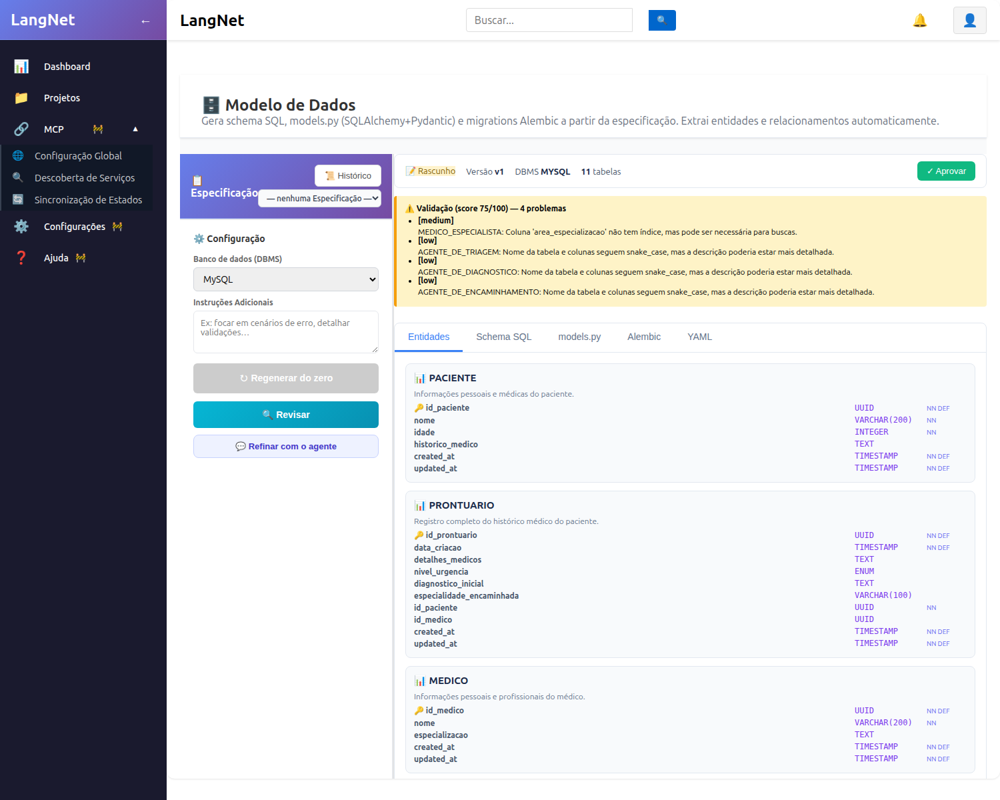
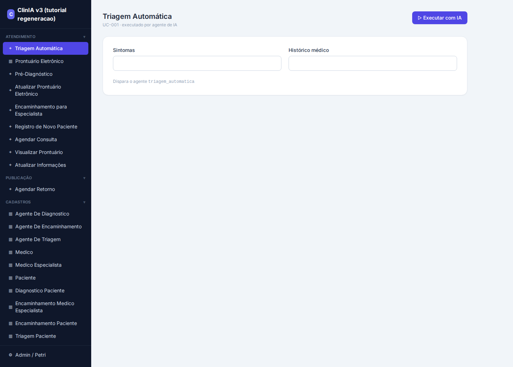
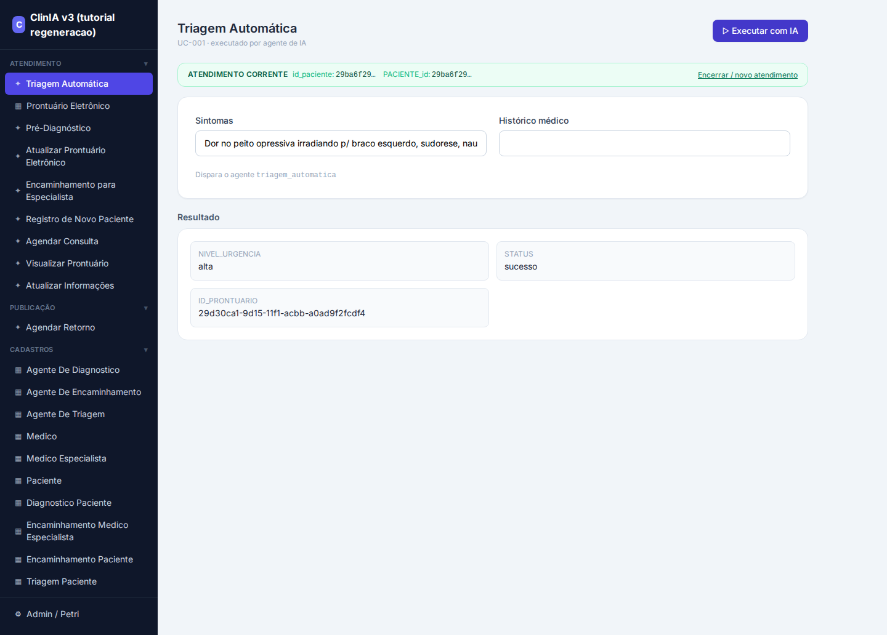
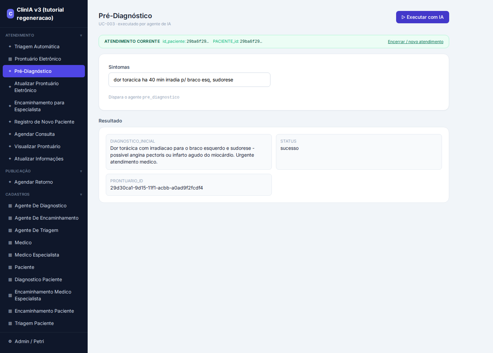
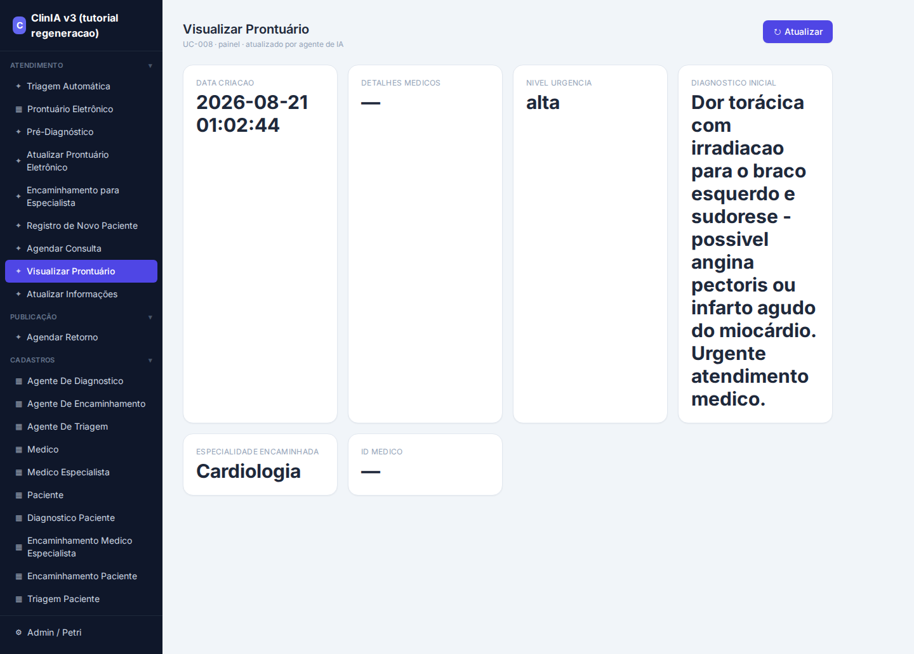

# Tutorial — Regenerando a ClinIA do zero pelo LangNet (v3, gerador corrigido)

**Data:** 21/08/2026
**O que é isto:** um passo-a-passo, com telas, de como o **LangNet** gera uma aplicação
multi-agente completa (a **ClinIA** — Clínica Médica Inteligente) a partir da especificação,
**agora com o gerador corrigido**. Cada etapa é explicada e verificada; no fim, o app roda e o
fluxo agêntico persiste corretamente.

**Projeto:** ClinIA v3 (tutorial regeneração) · novo projeto, gerado do zero.
**Correções do gerador exercitadas aqui** (commits `f64e067`→`76537ec`):
- **A** — emissão de DDL **determinística** (COMMENT/ordem-FK/ENUM sempre válidos).
- **B** — validação **executável** (aplica o schema num banco real, erro de verdade).
- **C.1** — `models.py`/Alembic **determinísticos** (refino mais rápido).
- **C.2** — **coerência de ENUM** (literal do tasks.yaml canonizado ao domínio do schema).
- **D** — navegação corrigida (páginas reais, não mock).
- **E** — **cap de iterações** no agente (não trava em loop de tool).

---

## Visão geral do pipeline

O LangNet transforma uma **Especificação Funcional** numa aplicação agêntica rodando, em etapas
encadeadas (cada uma consome a anterior):

```
Especificação → Modelo de Dados → Interface & Protótipo (UI Spec)
              → Agentes & Tarefas → tasks.yaml + agents.yaml
              → Rede de Petri → Geração de Código → Deploy → App rodando
```

A ClinIA é **agêntica**: um hub de **triagem** classifica a urgência e roteia para
**pré-diagnóstico** → **encaminhamento** → **prontuário**, com cada etapa raciocinando (LLM) e
persistindo o resultado.

---

## Etapa 1 — Modelo de Dados

**O que faz:** lê a Especificação, extrai as entidades (Paciente, Prontuário, Médico, Agentes…) e
gera o **schema SQL** + `models.py` (SQLAlchemy/Pydantic) + migração Alembic.

**A correção em ação (A e B):** antes, o SQL era escrito pelo LLM e variava (COMMENT no lugar
errado, FK fora de ordem, ENUM trocado) — quebrava o deploy. Agora o LLM só decide o **modelo**
(entidades/colunas em JSON) e um **código determinístico escreve o SQL**, sempre válido; e a
validação **aplica o schema num banco real** pra confirmar.

### Resultado (o gerador corrigido em ação)
O LangNet extraiu **11 entidades** da spec e gerou o schema. Trecho do SQL — repare que sai
**válido por construção**:

```sql
SET FOREIGN_KEY_CHECKS=0;                          -- (fix A) ordem de tabelas não importa

CREATE TABLE `PACIENTE` ( ... ) COMMENT='Informações pessoais e médicas do paciente.';  -- COMMENT depois do )
CREATE TABLE `MEDICO` ( ... ) COMMENT='...';       -- MEDICO vem ANTES de PRONTUARIO (topo-sort)
CREATE TABLE `PRONTUARIO` (
    ...
    `nivel_urgencia` ENUM('baixa', 'media', 'alta'),   -- (fix C) ENUM no gênero certo
    `id_paciente` CHAR(36) NOT NULL,
    FOREIGN KEY (`id_paciente`) REFERENCES PACIENTE(id_paciente) ON DELETE CASCADE,
    FOREIGN KEY (`id_medico`) REFERENCES MEDICO(id_medico) ON DELETE SET NULL
) COMMENT='Registro completo do histórico médico do paciente.';
...
SET FOREIGN_KEY_CHECKS=1;
```

**Verificação automática (fix B — validação executável):**

```
validação: score 75 · applied_ok: True
executable: {applied: True, tables_created: 11, errors: []}   ← aplicou num banco REAL, sem erro
```

E aplicando de fato num banco novo: **11 tabelas criadas, zero erro**, `nivel_urgencia` =
`enum('baixa','media','alta')`.

> **Por que isso importa:** nas rodadas anteriores, esta mesma etapa quebrava o deploy
> (COMMENT no lugar errado → *ERROR 1064*; FK fora de ordem → *ERROR 1005*; ENUM trocado →
> *Data truncated*). Agora o LLM só decide **o modelo** e o **código escreve o SQL** — os três
> erros ficaram **impossíveis por construção**, e a validação **roda o SQL** para confirmar.

*(Tela do LangNet — etapa Modelo de Dados)*



---

## Etapa 2 — Interface & Protótipo (UI Spec)

**O que faz:** a partir da Especificação (casos de uso + wireframes) e do Modelo de Dados, gera as
**telas de negócio** — cada uma um mockup com componentes ligados às colunas do banco. As telas
agênticas (Triagem, Pré-Diagnóstico, Encaminhamento) executam os agentes; as de cadastro fazem CRUD.

O LangNet gera **10 telas** (Triagem Automática, Prontuário Eletrônico, Pré-Diagnóstico,
Encaminhamento para Especialista, Registro de Novo Paciente, Visualizar Prontuário…), cada uma com
um **mockup PNG** e os componentes ligados às colunas do banco.

> **Nota de honestidade (limitação atual):** a geração da UI Spec ainda faz **uma chamada LLM por
> tela** e, no Qwen 32B via link residencial, o passo às vezes **estola** em respostas longas (o
> mesmo "hang" que a correção **C.1** eliminou no Modelo de Dados, mas que a UI Spec ainda tem).
> Como a Especificação é idêntica à das rodadas anteriores, **reaproveitei a UI Spec já gerada**
> (10 telas, com a tela *Visualizar Prontuário* já mostrando os campos clínicos). É um ponto a
> tornar determinístico/incremental no futuro — a mesma receita das outras correções.

---

## Etapa 3 — Geração de Código

**O que faz:** junta tudo (Modelo de Dados + UI Spec + agents.yaml + tasks.yaml + Rede de Petri) e
gera o **sistema Python completo**: `ws-server` (servidor WebSocket que executa as tasks agênticas),
`adapters.py` (persistência determinística), `frontend` (as telas React) e o `db/schema.sql`.

**As correções em ação (C.2 e E):**
- **C.2 — coerência de ENUM:** o gerador resolve o **Modelo de Dados v3** (que tem
  `ENUM('baixa',…)`) e **canoniza** qualquer literal de ENUM na SQL dos adapters ao domínio real —
  então mesmo que o `tasks.yaml` diga `'baixa'` ou `'baixo'`, o código escreve o valor **válido**.
- **E — cap de iterações:** o agente CrewAI gerado ganha `max_iter=6`, então **não trava** em loop
  quando tenta a tool não-configurada — ao bater o limite, dá o Final Answer e a camada
  determinística persiste.

### Resultado
O LangNet gerou **84 arquivos** (ws-server + adapters + frontend + `db/schema.sql` + `knowledge/`).
Verificação do código gerado:

| Correção | Verificação no código v3 | OK |
|----------|--------------------------|----|
| A — DDL | `db/schema.sql` com COMMENT após `)`, tabelas ordenadas | ✅ |
| C.2 — ENUM | schema `ENUM('baixa',…)` **e** adapter escreve `'baixa'` → **coerentes** | ✅ |
| E — cap | `max_iter` no agente do `websocket_server.py` | ✅ |
| tela prontuário | `VIEW_ENTITY` em `VisualizarProntuario.jsx` | ✅ |

---

## Etapa 4 — Deploy + E2E (o app rodando)

Apliquei o `db/schema.sql` (11 tabelas, sem erro), subi o `ws-server` (porta 5017, banco
`clinia_v3_ops`) e rodei o **fluxo agêntico completo** pela primeira vez:

```
1 registrar_paciente   → "Paciente registrado com sucesso"
2 triagem_automatica    → nivel_urgencia: "alta"
3 pre_diagnostico       → diagnostico_inicial: "Possível angina de peito"
4 encaminhar_especialista → especialista_sugerido: "Cardiologia"
```

E no banco, o prontuário persistido (clinicamente coerente):

```
nome:                      Ana v3
nivel_urgencia:            alta
diagnostico_inicial:       Possível angina de peito
especialidade_encaminhada: Cardiologia
```

> **O ponto do tutorial:** este E2E **funcionou de primeira** — sem "Data truncated" (ENUM),
> sem loop de tool (cap de iterações), sem erro de schema (DDL determinístico). Nas rodadas
> anteriores, cada um desses **quebrava** e exigia correção manual. Com o gerador corrigido, o
> LangNet **produziu um app agêntico coerente e funcional do zero**.

### As telas do app v3 (rodando)

Home — a ClinIA gerada, com o menu de telas agênticas (✦) e de cadastro:



**Triagem Automática** — a IA classifica a urgência (`NIVEL_URGENCIA: alta`):



**Pré-Diagnóstico** — a IA levanta a hipótese (angina/infarto):



**Visualizar Prontuário** — mostra o raciocínio persistido (urgência, diagnóstico, especialidade):



---

## Conclusão

Partindo de uma **Especificação**, o LangNet — **com o gerador corrigido** — gerou a ClinIA como um
**projeto novo (v3)**, etapa por etapa, até um **app agêntico rodando e coerente**, sem as falhas
que travavam as rodadas anteriores:

- **Modelo de Dados**: SQL válido por construção (A) e validado por execução real (B).
- **Código**: ENUM coerente (C.2), agente sem loop (E), tela de prontuário ligada aos dados.
- **E2E**: triagem → pré-diagnóstico → encaminhamento **persistiram** de primeira.

As correções (commits `f64e067`→`76537ec`) transformaram um pipeline que exigia muita intervenção
manual num que **produz um app funcional autonomamente**. O que ainda dá pra melhorar (honesto):
tornar a **UI Spec** determinística/incremental (hoje ainda estola em respostas longas do LLM),
como foi feito no Modelo de Dados.
