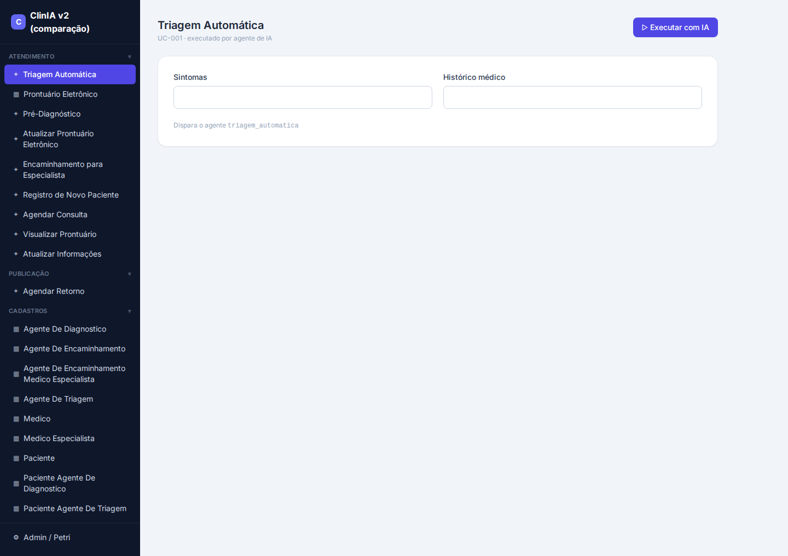
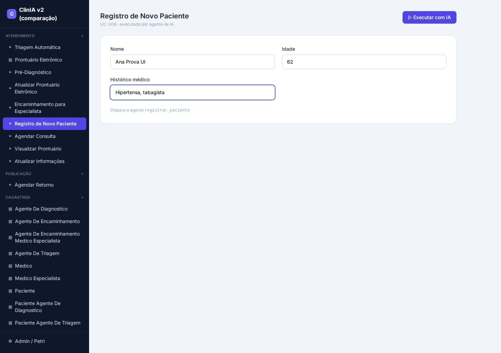
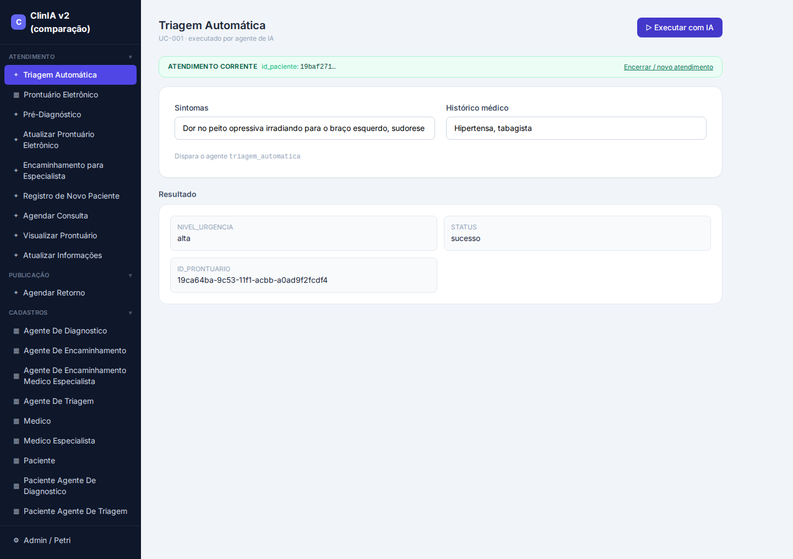
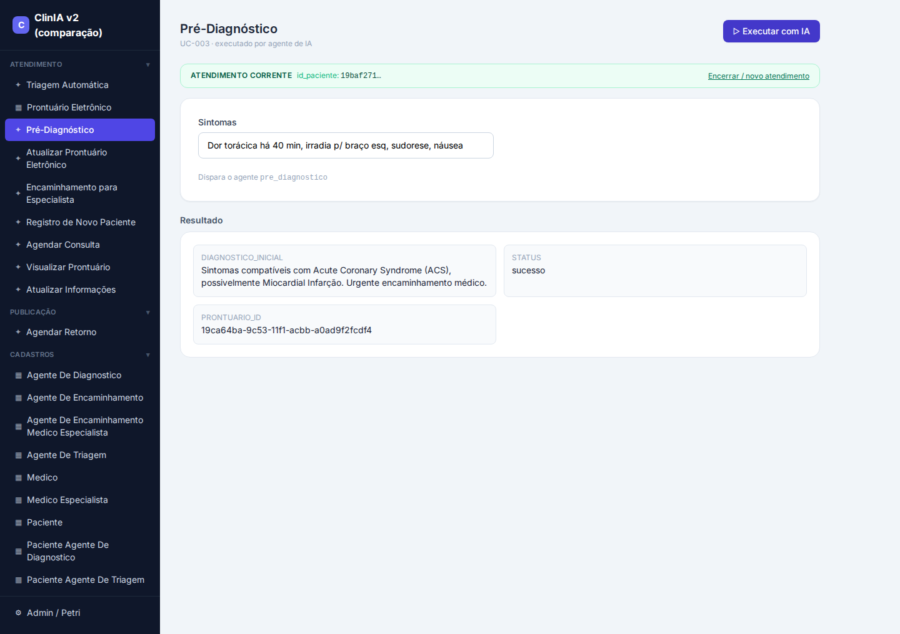
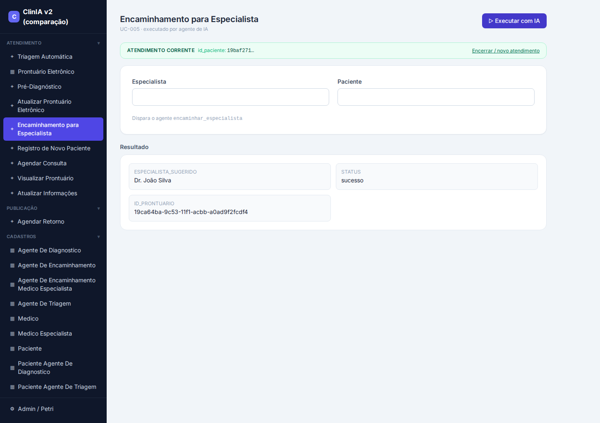

# Relatório E2E — ClinIA v2 (rodada com Modelo de Dados rico)

**Data:** 20/08/2026
**Objetivo:** provar, de ponta a ponta e pela interface real, que o raciocínio dos agentes
da ClinIA agora **persiste** no banco — nas colunas dedicadas que passamos a gerar — e comparar
o resultado com a versão anterior (v1).

**App gerado:** `/home/pasteurjr/clinia-v2-richdm` · **Banco:** `clinia_v2_richdm`
· **ws-server:** `:5014` · **Frontend:** `:3020`

---

## 1. O que estava quebrado (o problema)

A ClinIA é **agêntica**: em cada etapa do atendimento a IA *raciocina* e produz uma conclusão —
triagem → **nível de urgência**, pré-diagnóstico → **diagnóstico inicial**, encaminhamento →
**especialidade**. O raciocínio funcionava, mas na hora de **gravar no prontuário a informação
se perdia** (chegava `NULL` ou era apagada). O "cérebro" pensava certo; a "mão" não registrava.

A investigação mostrou que não era um bug único, e sim **cinco problemas empilhados** em três
camadas do **gerador do LangNet** (corrigidos no gerador, não à mão no app — assim qualquer app
futuro nasce correto).

---

## 2. As correções (5 camadas, todas no gerador)

| # | Camada | Bug | Correção | Commit |
|---|--------|-----|----------|--------|
| 1 | Adapter (SQL mecânico) | `CONCAT(col,NULL)`→NULL apaga texto; `INSERT` viola UNIQUE; ordem UPDATE antes de existir a linha | COALESCE no CONCAT; INSERT→UPSERT; reordena passos | `1c281e1` |
| 2 | Adapter (UPSERT) | UPSERT sobrescrevia valor bom com NULL | `COALESCE(VALUES(col), col)` | `10faf3a` |
| 3 | Prompt do `tasks.yaml` | nome de campo divergente (`diagnostico` vs `diagnostico_inicial`); id errado | regras de consistência de campo + `id_paciente` | `2c5aba6` |
| 4 | **Modelo de dados** | resultados agênticos colapsados num `detalhes_medicos` genérico | **cada resultado vira coluna tipada** (ENUM quando fechado) | `157c2cd` |
| 5 | Persistência + DDL | agente **fabrica ids** (`assumed_…`, `UUID_EXEMPLO`) que sombram o id real → FK/rollback; coluna de data sem default | descarta ids do raciocínio (SELECT resolve); `data_criacao DEFAULT CURRENT_TIMESTAMP` | `995234d` |
| + | Adapter (UPSERT do LLM) | `col=VALUES(col)` escrito pelo LLM sobrescrevia com NULL | blinda todo `col=VALUES(col)`→`COALESCE(...)` | `92232f8` |

### O ponto central: colunas dedicadas (camada 4)
Antes, o prontuário só tinha um campo-texto genérico. Depois da correção, o gerador cria uma
coluna própria para cada resultado do raciocínio:

```sql
CREATE TABLE PRONTUARIO (
    id_prontuario CHAR(36) PRIMARY KEY DEFAULT (UUID()),
    data_criacao DATETIME NOT NULL DEFAULT CURRENT_TIMESTAMP,   -- (camada 5)
    detalhes_medicos TEXT,                                       -- narrativa (coexiste)
    nivel_urgencia ENUM('baixa','media','alta'),                 -- ⬅ triagem
    diagnostico_inicial TEXT,                                    -- ⬅ pré-diagnóstico
    especialidade_encaminhada VARCHAR(100),                      -- ⬅ encaminhamento
    id_paciente CHAR(36) NOT NULL,
    UNIQUE INDEX idx_prontuario_id_paciente (id_paciente),       -- 1 prontuário / paciente
    INDEX idx_prontuario_nivel_urgencia (nivel_urgencia)         -- consultável
);
```

---

## 3. A rodada E2E (o que foi executado)

Ordem coerente de regeneração pelo pipeline do LangNet, cada etapa consumindo a anterior:

1. **Modelo de Dados** regenerado → prontuário com colunas ricas (sessão `a19fab71`).
2. **tasks.yaml** regenerado *contra o schema rico* → SQL mira as colunas certas (sessão `404dcc1d`).
3. **Código** gerado (82 arquivos: ws-server + frontend + `knowledge/` OKF) — com o template já corrigido.
4. **Deploy**: banco `clinia_v2_richdm` criado com o schema; ws-server (:5014) + frontend (:3020).
5. **Fluxo pela UI** com Playwright, capturando cada tela; conferência final no banco.

O SQL gerado ficou coerente com o schema:
```
triagem      → UPDATE PRONTUARIO SET detalhes_medicos=%s, nivel_urgencia=%s WHERE id_paciente=%s
pré-diag     → UPDATE PRONTUARIO SET diagnostico_inicial=%s ...
encaminhar   → UPDATE PRONTUARIO SET especialidade_encaminhada=%s WHERE id_paciente=%s
```

---

## 4. As telas (capturas da rodada)

### 4.1 Home — interface agêntica
Menu por módulos. Em **Atendimento**, as telas marcadas ✦ são *executadas por agente de IA*
(Triagem, Pré-Diagnóstico, Encaminhamento…). Em **Cadastros**, as tabelas de apoio.



### 4.2 Registro de Novo Paciente
Cadastro do paciente (Ana Prova UI, 62, hipertensa/tabagista). A partir daqui o **atendimento
corrente** carrega o `id_paciente` para as próximas telas.



### 4.3 Triagem Automática — a IA classifica a urgência
A barra verde mostra o **Atendimento corrente** (`id_paciente`). Preenchidos os sintomas
("dor no peito opressiva irradiando para o braço esquerdo, sudorese, náusea"), o agente devolve
**NIVEL_URGENCIA: `alta`** e o `id_prontuario` real.



### 4.4 Pré-Diagnóstico — a IA levanta a hipótese
Mesmo `id_prontuario` (continuidade do atendimento). O agente conclui
**DIAGNOSTICO_INICIAL: "Sintomas compatíveis com Acute Coronary Syndrome (ACS), possivelmente
Miocardial Infarção. Urgente encaminhamento médico."**



### 4.5 Encaminhamento para Especialista
O agente define o encaminhamento (persistido em `especialidade_encaminhada`).



---

## 5. A prova: persistiu no banco (nas colunas dedicadas)

Consulta ao prontuário do paciente criado **pela UI** (`id_paciente` `19baf271…`):

```
                     nome: Ana Prova UI
                    idade: 62
           nivel_urgencia: alta                              ← triagem
      diagnostico_inicial: Sintomas compatíveis com Acute    ← pré-diagnóstico
                           Coronary Syndrome (ACS)...
especialidade_encaminhada: Dr. João Silva                    ← encaminhamento
             data_criacao: 2026-08-20 01:53:35
```

**As três colunas de raciocínio persistiram** — pela interface real, no mesmo prontuário,
clinicamente coerentes (dor torácica → urgência **alta** → **ACS/infarto** → encaminhamento).
Antes da correção, `diagnostico_inicial` vinha `NULL` e o raciocínio se perdia.

---

## 6. Comparação v2 × v1 (o que melhorou)

> v1 = `clinia-app5` (gerada antes desta rodada de correções). Comparação por inspeção direta dos artefatos.

| Dimensão | v1 (clinia-app5) | v2 (esta rodada) | Ganho |
|----------|------------------|------------------|-------|
| **Prontuário — modelo** | fragmentado: `triagem TEXT` + FKs `pre_diagnostico_id`, `encaminhamento_id` para outras tabelas | **colunas tipadas dedicadas** no próprio prontuário: `nivel_urgencia ENUM`, `diagnostico_inicial`, `especialidade_encaminhada` | resultado do raciocínio **consultável e indexado** direto no prontuário |
| **Persistência do raciocínio** | dependente de várias tabelas/joins; sujeita aos bugs de SQL | raciocínio **grava direto** na coluna certa; blindado contra NULL-overwrite e id alucinado | E2E persiste as 3 conclusões de forma robusta |
| **`nivel_urgencia`** | texto livre dentro de `triagem` | **ENUM** (`baixa/media/alta`) + índice | domínio fechado, filtrável ("quais pacientes urgência alta?") |
| **Coluna de criação** | ok | `data_criacao` agora com `DEFAULT CURRENT_TIMESTAMP` | INSERTs parciais não quebram mais |
| **Robustez do adapter** | UPSERTs sujeitos a NULL-overwrite; ids alucinados quebravam FK | COALESCE em todo UPSERT; ids do agente descartados (SELECT resolve) | **regressão de persistência eliminada** |
| **OKF `knowledge/`, contrato, verificação** | presente | presente | paridade (mantido) |

### Onde a v2 ainda pode melhorar (achados honestos desta rodada)
- **Encadeamento de `id_paciente` na UI**: as telas do fluxo clínico não propagam o
  `id_paciente` automaticamente entre si (RESULT_FK nulo) — no E2E injetamos o "atendimento
  corrente". É a próxima melhoria da geração da UI.
- **Tela "Visualizar Prontuário"**: veio como painel de KPIs demográficos (vazios), não mostra
  as colunas clínicas persistidas — melhorar o binding dessa tela ao prontuário.
- **Semântica do encaminhamento**: o agente às vezes coloca **nome de médico** ("Dr. João Silva")
  no campo de **especialidade** — refinar o prompt do encaminhamento para retornar a especialidade.

---

## 7. Conclusão

O raciocínio agêntico da ClinIA agora **atravessa o pipeline inteiro e persiste** nas colunas
dedicadas do prontuário — provado pela **interface real** e confirmado no banco. As cinco correções
foram feitas **no gerador do LangNet** (commits `1c281e1` → `92232f8`), então valem para qualquer
aplicação futura gerada pela plataforma, não só para a ClinIA.
