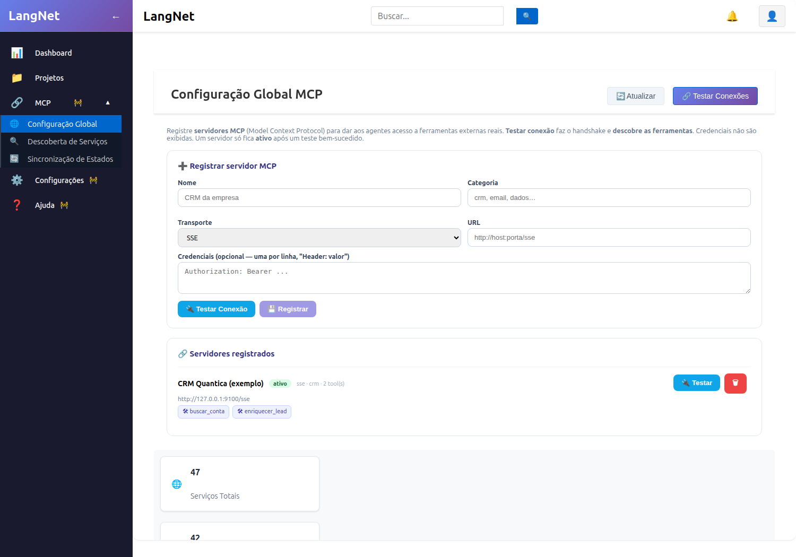

# F2 (Integração MCP) — Relatório da Fase 1

**Configuração Global + Testar Conexão + Descoberta de Ferramentas**
**Data:** 24/07/2026 · **Commits:** `3eeb5e5` (backend) · `76e06f2` (frontend)

---

## 1. Objetivo
Registrar **servidores MCP** (Model Context Protocol) de forma global no LangNet e, via um
**handshake real**, descobrir as ferramentas que cada servidor expõe. É a base para dar aos
agentes gerados acesso a ferramentas externas (CRM, e-mail, ERP do cliente).

## 2. O que foi implementado

### Backend
- **Tabela `mcp_servers`** (migration 031): id, name, transport (sse/http/stdio), url, command,
  category, `credentials_json` (segredo), status (registrado/ativo/erro), `capabilities_json`
  (tools descobertas), last_error.
- **Cliente MCP** no backend (SDK `mcp`) — conecta e lista as ferramentas (SSE/HTTP).
- **Router `/api/mcp`**:
  - `POST /test` — testa uma config ad-hoc (antes de salvar).
  - `POST /servers` — registrar.
  - `GET /servers` — listar (**segredos mascarados**).
  - `GET /servers/{id}` — detalhe + tools.
  - `POST /servers/{id}/test` — handshake real → descobre e salva as tools, marca **ativo**.
  - `DELETE /servers/{id}`.
- **Regras:** segredo nunca retorna em claro; servidor só fica **ativo após teste OK** (mesmo
  padrão da F1 de banco/LLM).

### Frontend
- Componente `McpServersManager` + `mcpService` consumindo a API, integrado na tela
  **MCP → Configuração Global**: registrar, **Testar Conexão** (mostra as tools descobertas como
  chips), listar com status, remover.

## 3. Testes de validação (todos executados)

### T1 — SDKs MCP disponíveis
```
mcp: OK · mcp.client.sse (SSE/HTTP): OK · crewai_tools.MCPServerAdapter: OK
```
**Gotcha resolvido:** `pip install mcp` subia o **starlette para 1.x** e quebrava o FastAPI 0.115
(`Router.__init__() got an unexpected keyword argument 'on_startup'`). Fix: **pinado
`starlette==0.41.3`** (funciona para FastAPI + cliente MCP). ✅

### T2 — Servidor MCP de exemplo (para testar de verdade)
Criado um servidor MCP (CRM fake, transporte SSE, porta 9100) com 2 ferramentas:
`buscar_conta`, `enriquecer_lead`. ✅

### T3 — Descoberta direta (cliente MCP → list_tools)
```
TOOLS DESCOBERTAS: 2
  - buscar_conta → Busca uma conta de cliente pelo nome e retorna um resumo.
  - enriquecer_lead → Enriquece um lead a partir do e-mail (empresa, cargo, porte).
```
✅ O cliente conecta via SSE e descobre as ferramentas.

### T4 — Regressão (não quebrou o resto)
```
GET /api/settings -> HTTP 200
```
✅ Endpoints existentes seguem funcionando com o starlette pinado.

### T5 — Teste ad-hoc via API (`POST /api/mcp/test`)
```
ok: True | tools: 2 | ['buscar_conta', 'enriquecer_lead']
```
✅

### T6 — Fluxo completo: registrar → ativar → listar
```
registrar   -> id=548f717f-...
testar/ativar -> status: ativo | tools: 2
listar      -> CRM Quantica (exemplo) | status: ativo | tools: 2
              has_credentials: True | credencial em claro na resposta? False
              tools: ['buscar_conta', 'enriquecer_lead']
```
✅ Servidor fica **ativo**, as 2 tools são descobertas e salvas, e a **credencial não vaza**
na resposta (mascarada).

### T7 — Validação visual (UI real)
A tela "Configuração Global MCP" mostra o form de registro + Testar Conexão, e o servidor de
exemplo **ativo** com as 2 ferramentas descobertas como chips.



## 4. Conclusão
Fase 1 **completa e validada ponta a ponta**: registro global de servidores MCP, teste de conexão
com **handshake real**, descoberta de ferramentas, segredos mascarados — na API e na UI.
Próximo: **Fase 2** (vínculo por projeto + atribuição das tools aos agentes).
