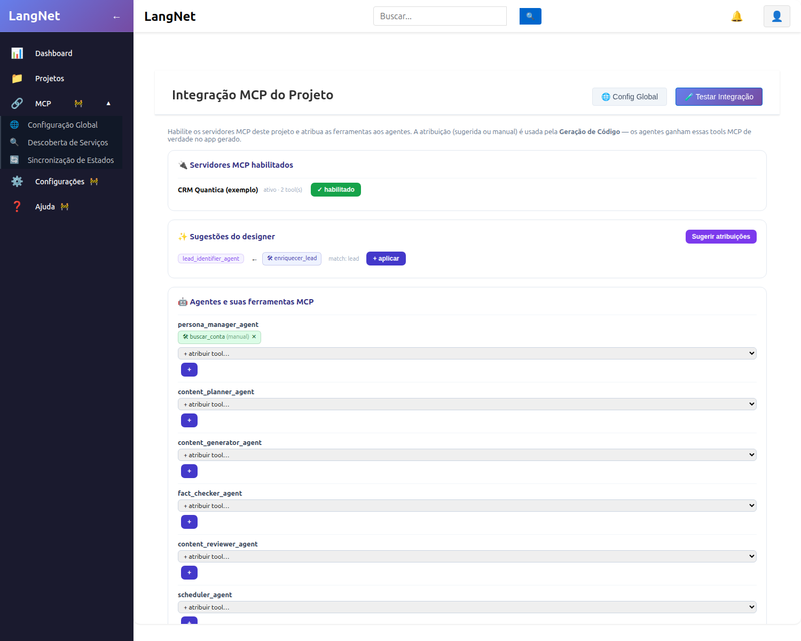

# F2 (Integração MCP) — Relatório da Fase 2

**Vínculo por Projeto + Atribuição de Ferramentas aos Agentes (sugerida + manual)**
**Data:** 24/07/2026 · **Commit:** `193d01d`

---

## 1. Objetivo
Cada projeto escolhe **quais servidores MCP** pode usar, e as ferramentas descobertas são
**atribuídas aos agentes** — de duas formas (decisão do usuário): **sugerida** pelo designer
(heurística) **e** **manual** pela UI. O resultado é consumido pela Geração de Código (Fase 3).

## 2. O que foi implementado

### Backend (migration 032: `mcp_project_servers`, `mcp_agent_tools`)
- `GET /project/{id}/servers` — todos os servidores + flag `enabled` para o projeto.
- `POST` / `DELETE /project/{id}/servers/{sid}` — habilitar/desabilitar servidor no projeto.
- `GET /project/{id}/tools` — catálogo de tools MCP disponíveis (dos servidores ativos habilitados).
- `GET /project/{id}/agents` — agentes do projeto (lidos do `agents.yaml`, removendo cercas markdown).
- `GET/POST/DELETE /project/{id}/agent-tools` — listar/atribuir/remover tool ↔ agente.
- `POST /project/{id}/suggest` — **sugestão heurística**: casa `role+goal` do agente com `nome+descrição`
  da tool por sobreposição de tokens (com stopwords PT para reduzir ruído).

### Frontend
- Componente `McpProjectManager` na tela **MCP do Projeto**: habilitar servidores, botão
  **Sugerir atribuições** (aplica com um clique), e por agente um seletor **manual** de tools + remover.

## 3. Testes de validação (todos executados)

### T1 — Habilitar servidor no projeto
```
POST /project/{pid}/servers/{sid} -> {'status': 'habilitado'}
```
✅

### T2 — Catálogo de tools do projeto
```
GET /project/{pid}/tools ->
  [('buscar_conta','CRM Quantica (exemplo)'), ('enriquecer_lead','CRM Quantica (exemplo)')]
```
✅ As tools do servidor habilitado aparecem no catálogo.

### T3 — Agentes do projeto (parse do agents.yaml)
```
15 agentes: persona_manager_agent, content_planner_agent, content_generator_agent,
fact_checker_agent, content_reviewer_agent, scheduler_agent, publisher_agent,
metrics_collector_agent, comment_classifier_agent, response_generator_agent,
lead_identifier_agent, report_generator_agent, permission_manager_agent, exporter_agent,
calendar_syncer_agent
```
**Bug encontrado e corrigido:** o `agents.yaml` vinha com cercas markdown (` ```yaml `) que
quebravam o parse (0 agentes). Corrigido removendo as cercas antes do `yaml.safe_load`. ✅

### T4 — Sugestão heurística (designer)
Antes das stopwords havia ruído (match "pelo"). Após filtrar stopwords PT:
```
POST /project/{pid}/suggest ->
  lead_identifier_agent ← enriquecer_lead (match ['lead'])
```
✅ Sugestão **precisa e relevante** (o agente identificador de leads recebe a tool de enriquecer leads).

### T5 — Atribuição manual + listagem
```
atribuir enriquecer_lead -> lead_identifier_agent  -> {'status': 'atribuido'}
atribuir buscar_conta     -> persona_manager_agent -> ok
listar agent-tools ->
  lead_identifier_agent → enriquecer_lead (manual)
  persona_manager_agent → buscar_conta   (manual)
```
✅ Persistência correta.

### T6 — Validação visual (UI real)
A tela "Integração MCP do Projeto" mostra: servidor **habilitado** (verde), **Sugestões do designer**
(`lead_identifier_agent ← enriquecer_lead`, match: lead, com "+ aplicar"), e a lista dos 15 agentes,
com `persona_manager_agent` já exibindo `🛠 buscar_conta (manual)` e o seletor de atribuição.



## 4. Conclusão
Fase 2 **completa e validada ponta a ponta**: vínculo de servidores por projeto, catálogo de tools,
sugestão do designer **e** atribuição manual — na API e na UI. As atribuições ficam prontas para a
**Fase 3** (Geração de Código).
