# BioByte Sentinela v5 — relatório de funcionamento do sistema gerado

**Data do teste:** 03/10/2026 · **Aplicação:** a implantação vigente do BioByte Sentinela v5 (interface :3002, API :8035, servidor de agentes :5037, banco `biobyte_v5_app`), gerada pelo LangNet em 29/09/2026 a partir da Especificação v2 · **Modelo dos agentes:** DeepSeek (deepseek-flash) · **Custo do teste:** cerca de US$ 0,01 (saldo de US$ 1,61 para US$ 1,60).

## 1. Resumo

Todas as 30 telas de negócio (31 casos de uso: as UC-018 e UC-022 dividem a mesma tela) e as 28 telas de cadastro foram abertas e capturadas. Em cada uma, a ação principal foi executada, e o resultado foi comparado com o que o caso de uso da Especificação v2 pede.

**O que funciona.** As tarefas de agente respondem, e respondem bem. Na consulta em cadeia, o agente traduziu o antibiograma do caso, contou 4 classes resistentes e decidiu "multirresistente", aplicando exatamente a regra das três classes (BR-009). Depois redigiu um alerta claro para a equipe da UTI. Cada decisão ficou gravada no banco: a tabela de decisões passou de 11 para 23 linhas durante o teste. Quando falta dado, o agente recusa e explica por quê, em vez de inventar. Os cadastros de banco funcionam: listam o que está no banco e, onde os campos são simples, criam, editam e excluem, conferido linha a linha.

**O que não funciona.** Em 20 das 31 telas de negócio, a ação principal responde "Ação não vinculada a uma tarefa do sistema": falta o executor do lado convencional. Em 3 telas o único botão fica sempre desabilitado. Não há login: o aplicativo abre direto. Há falhas que passam caladas: o cadastro recusado pelo banco volta à lista sem nenhuma mensagem. E o resumo da senha dos usuários chega ao navegador.

**A cadeia clínica para na classificação:** a tarefa de classificação não recebe os critérios NHSN nem a data de início do caso, então responde "pendente", e a recomendação de bundle e o registro da escolha médica, que exigem caso confirmado, recusam por consequência.

| Veredito | Casos de uso |
|---|---|
| AÇÃO SEM EXECUTOR | 20 |
| BOTÃO DESABILITADO | 3 |
| RECUSA CORRETA POR FALTA DE DADO | 3 |
| FUNCIONA, COM RESSALVA | 2 |
| FUNCIONA | 2 |
| NÃO EXECUTADO (AÇÃO SENSÍVEL) | 1 |

## 2. Como o teste foi feito

1. **O que se esperava.** Da Especificação v2 foram lidos os 31 casos de uso: natureza (convencional ou agêntica), objetivo, requisitos relacionados, fluxo principal e fluxos de exceção. Da etapa de Interface veio a tela de cada caso de uso, com os campos e botões declarados. Juntos, dão a lista do que cada tela deve mostrar.
2. **Cada tela de negócio**, pelo navegador, como o operador: abrir, capturar, conferir os elementos esperados e executar a ação principal. As telas de agente receberam só a escolha do caso; as convencionais, o formulário preenchido. Ações que mexem em dado sensível (rotação de credenciais, descarte, backup) não foram executadas.
3. **A consulta aos agentes em cadeia**, como o operador faria: tradução → classificação → multirresistência → recomendação → alerta, com o mesmo caso clínico (Staphylococcus aureus, hemocultura HC-2026-1187) passando de uma tela à outra.
4. **As 28 telas de cadastro:** a listagem comparada com o banco e, em cinco cadastros, o ciclo criar → editar → excluir, conferido no banco a cada passo. Os registros de teste foram removidos ao final.
5. **Os vereditos** foram dados um a um, lendo a resposta de cada ação, e não por contagem automática.

**Leitura dos vereditos.** *Funciona*: faz o que o caso de uso pede. *Funciona, com ressalva*: faz, com um defeito que não impede o uso. *Recusa correta por falta de dado*: o sistema se negou a decidir pela razão certa, e a falta é de dado que não chega à tela. *Ação sem executor*: a tela existe, mas a ação não chega ao servidor. *Botão desabilitado*: a tela não tem como ser usada.

## 3. Caso de uso a caso de uso

### UC-001 — Autenticar Usuário com E-mail e Senha

| | |
|---|---|
| **Natureza** | convencional |
| **Requisitos** | FR-001, FR-004, FR-064, FR-065, FR-066, FR-096 |
| **Tela** | Login |
| **Veredito** | **AÇÃO SEM EXECUTOR** |

**O que a especificação pede.** Permitir que o usuário entre no sistema informando e-mail e senha, sem segundo fator, mantendo a identidade durante todo o uso e protegendo o acesso por token.

**Elementos da tela.** 4 de 22 elementos previstos (na especificação e na etapa de Interface) aparecem na tela. Ausentes: Acesso sem segundo fator, conforme decisão da CCIH; Falar com o administrador para solicitar acesso; Limpar; Sua sessão expirou. Entre novamente.; Usuário desativado. Procure o administrador do sistema.; Tentar novamente; Erro de credenciais (E1); Campos vazios (E2); Limite de tentativas excedido (E3); Servidor indisponível (E4); Sessão expirada (A3); Usuário desativado (A4); Autocadastro bloqueado (A1); Rodapé — decisão da CCIH….

**O que se observou.** Ao clicar em "Entrar", a tela respondeu "Ação não vinculada a uma tarefa do sistema." Nada foi gravado nem consultado. Além disso, o aplicativo abre direto nas telas, sem pedir login: qualquer pessoa na rede acessa tudo.

**Comparação com o caso de uso.** O caso de uso pede autenticação por e-mail e senha, token em toda chamada e limite de tentativas. Nada disso está ativo: não há autenticação.

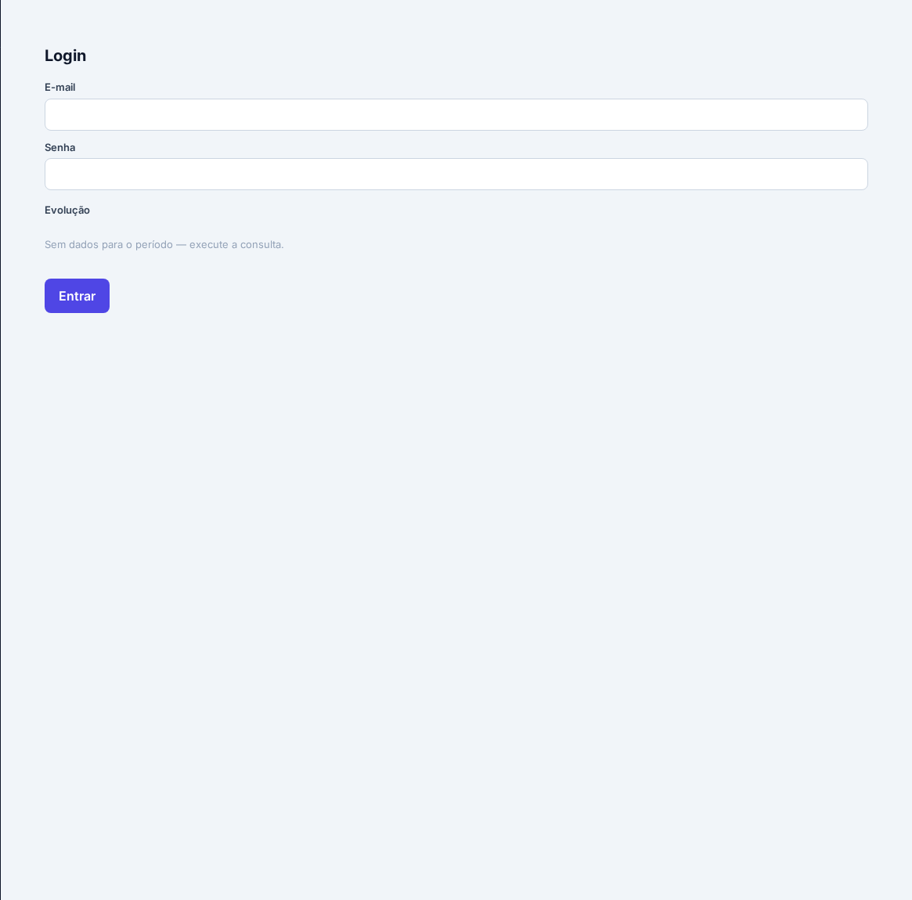
*UC-001 — a tela ao abrir*

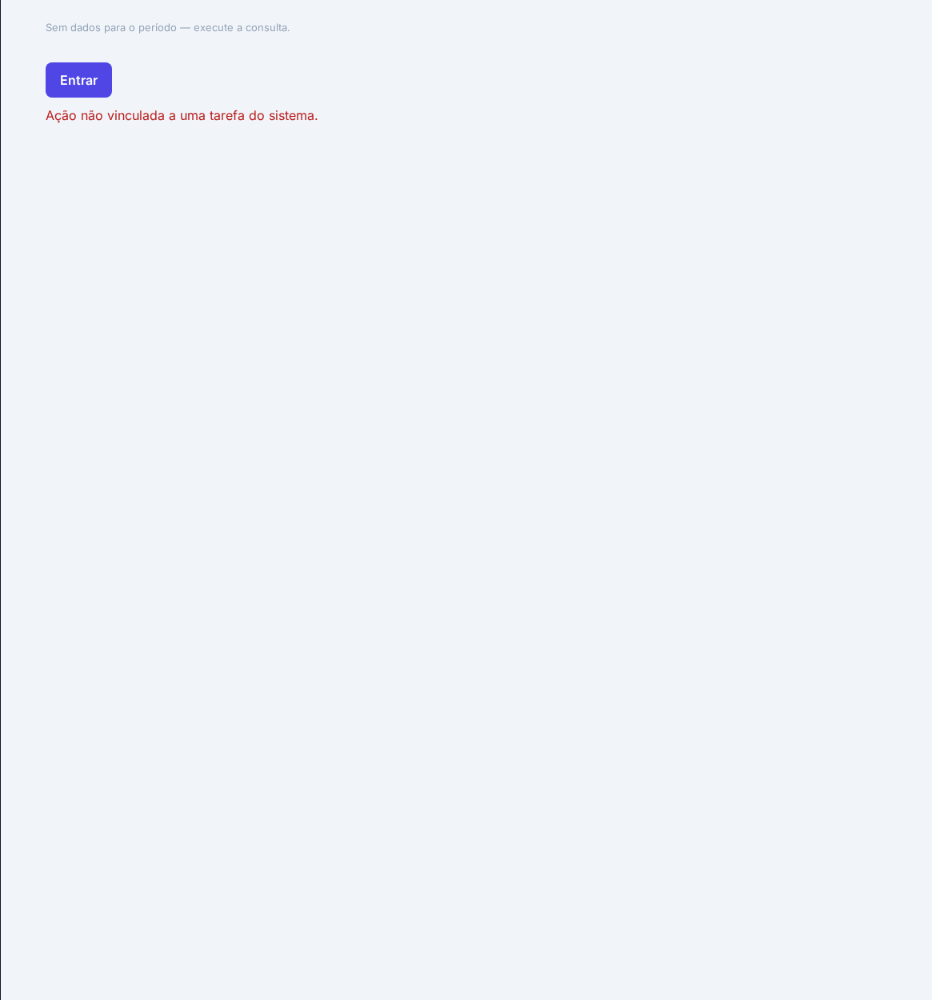
*UC-001 — o resultado da ação "Entrar"*

### UC-002 — Gerenciar Cadastro e Desativação de Usuários

| | |
|---|---|
| **Natureza** | convencional |
| **Requisitos** | FR-002, FR-003, FR-067 |
| **Tela** | Usuários |
| **Veredito** | **AÇÃO SEM EXECUTOR** |

**O que a especificação pede.** Permitir que o administrador cadastre usuários com nome, e-mail, senha, papel e situação ativa, e desative usuários desligados do hospital sem apagá-los, preservando o nome nos registros antigos.

**Elementos da tela.** 24 de 33 elementos previstos (na especificação e na etapa de Interface) aparecem na tela. Ausentes: Novo usuário; Cadastro de usuário; Confirmar desativação; Cancelar; Editar; Reativar; Tentar novamente; Ir para o Login; Exportar.

**O que se observou.** Ao clicar em "Salvar", a tela respondeu "Ação não vinculada a uma tarefa do sistema." Nada foi gravado nem consultado. A tela "Usuários" mostra as mensagens de exceção do caso de uso ("Este e-mail já está cadastrado.", "Desativar este usuário?") como linhas de dados com "—". No cadastro "Usuarios", a listagem que vem do servidor traz o resumo da senha (senha_hash) de cada usuário.

**Comparação com o caso de uso.** O caso de uso proíbe a senha em qualquer tela ou mensagem (FR-066); o resumo da senha chega ao navegador. Cadastrar e desativar pela tela de negócio não funcionam.

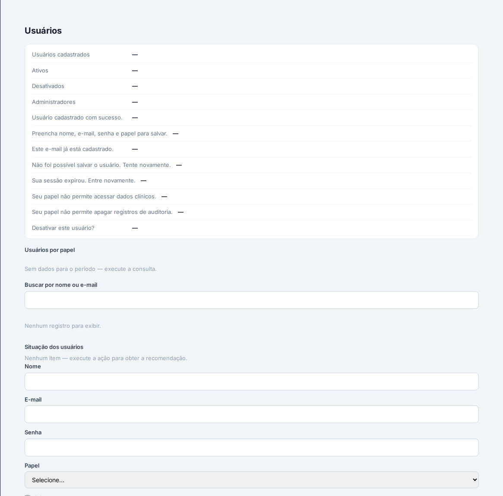
*UC-002 — a tela ao abrir*

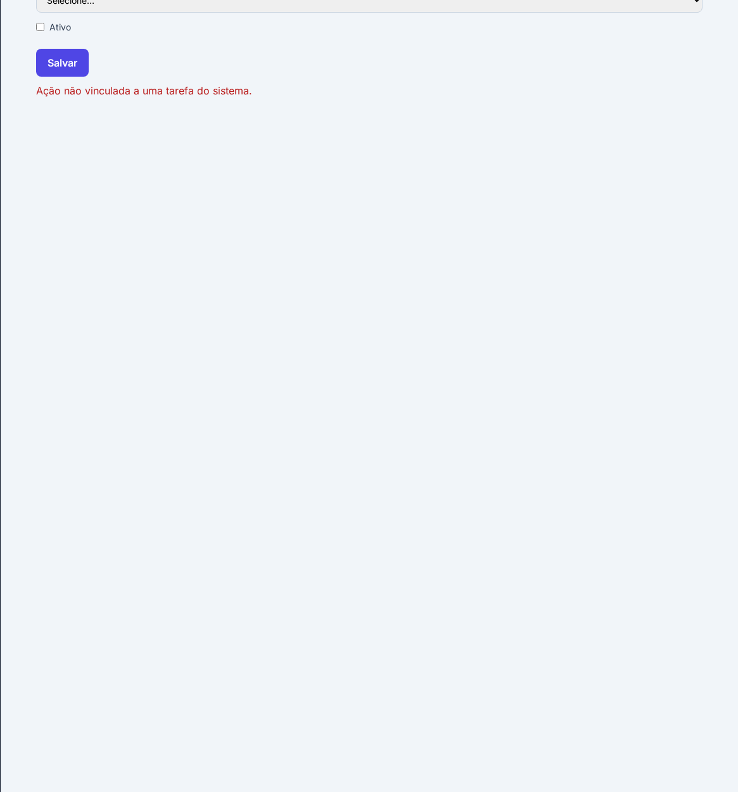
*UC-002 — o resultado da ação "Salvar"*

### UC-003 — Registrar Ações Relevantes em Trilha de Auditoria

| | |
|---|---|
| **Natureza** | convencional |
| **Requisitos** | FR-005, FR-056, FR-057, FR-058, FR-070, FR-098 |
| **Tela** | Log de auditoria |
| **Veredito** | **AÇÃO SEM EXECUTOR** |

**O que a especificação pede.** Registrar automaticamente toda ação relevante com quem fez, o que fez, sobre qual registro e quando, de forma encadeada, e permitir que o administrador consulte o log filtrando por período, usuário ou tipo de ação.

**Elementos da tela.** 17 de 27 elementos previstos (na especificação e na etapa de Interface) aparecem na tela. Ausentes: Verificar integridade; Data/hora; Registro afetado; Marca da entrada anterior; Encadeamento íntegro; Nenhum filtro aplicado — exibindo as entradas mais recentes.; Limpar filtros; Seu papel não permite apagar registros de auditoria.; Voltar ao Dashboard; Entradas de auditoria.

**O que se observou.** Ao clicar em "Consultar", a tela respondeu "Ação não vinculada a uma tarefa do sistema." Nada foi gravado nem consultado.

**Comparação com o caso de uso.** A tela existe e tem os campos e botões do caso de uso, mas a ação não chega ao servidor: falta o executor do lado convencional (o gerador só liga ações a tarefas de agente).

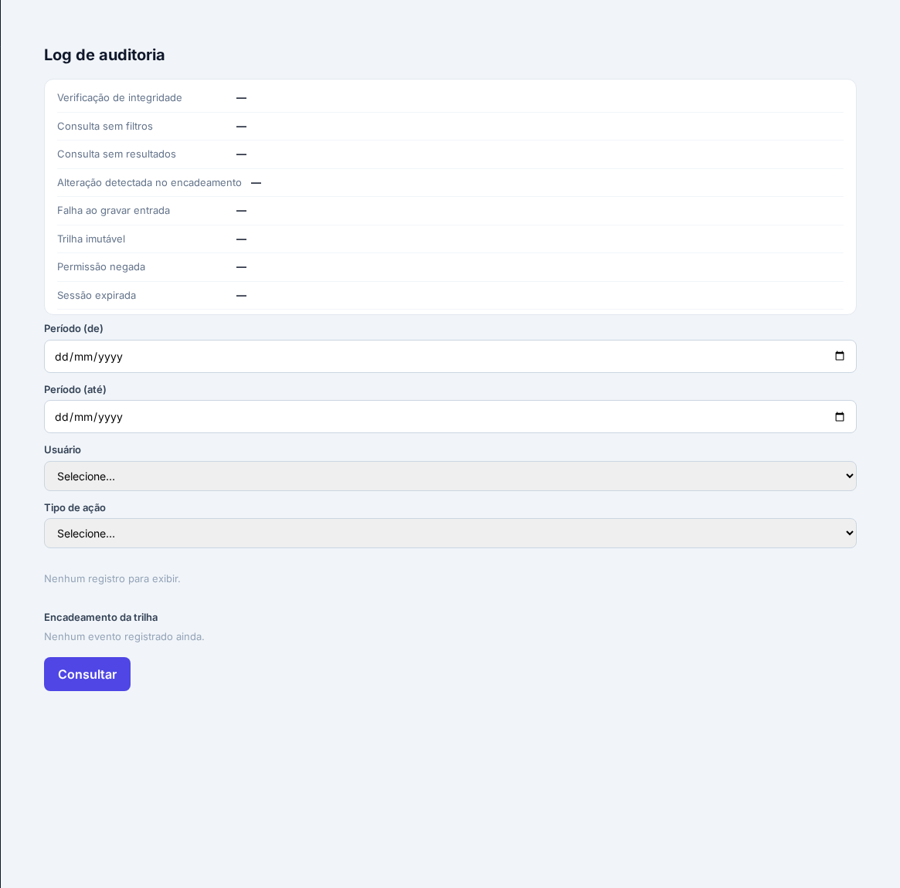
*UC-003 — a tela ao abrir*

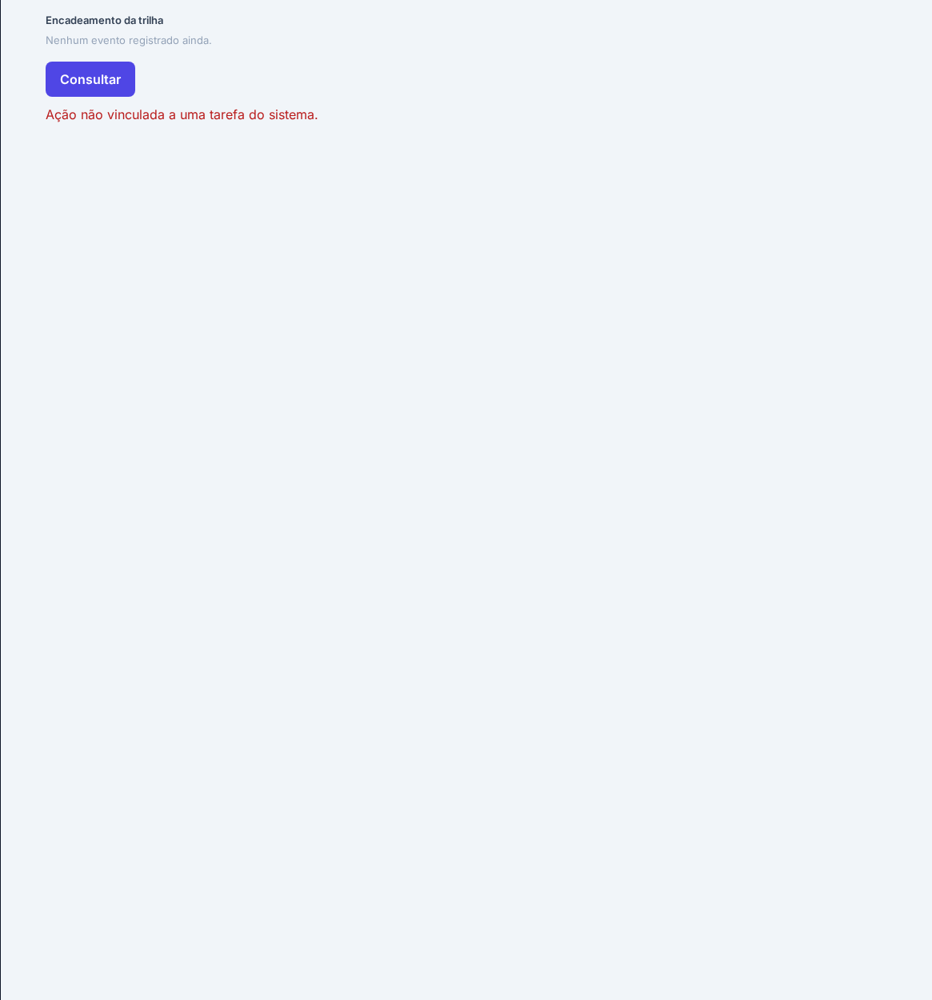
*UC-003 — o resultado da ação "Consultar"*

### UC-004 — Cadastrar Paciente com Cateter Venoso Central

| | |
|---|---|
| **Natureza** | convencional |
| **Requisitos** | FR-006, FR-086, FR-087, FR-088, FR-005, FR-063 |
| **Tela** | Cadastro de Paciente com Cateter Venoso Central |
| **Veredito** | **BOTÃO DESABILITADO** |

**O que a especificação pede.** Cadastrar o paciente com cateter venoso central, registrando nome, data de nascimento, sexo, número do prontuário e o médico responsável, para que o acompanhamento diário de UTI e a priorização de atenção possam ser feitos a partir desse cadastro.

**Elementos da tela.** 6 de 16 elementos previstos (na especificação e na etapa de Interface) aparecem na tela. Ausentes: Salvar; Cancelar; Novo Paciente; Tentar novamente; Ir para o Login; Paciente cadastrado com sucesso.; Preencha o campo [nome do campo faltante].; Data de nascimento inválida. Informe no formato dia/mês/ano.; Sessão expirada. Entre novamente.; Não foi possível salvar o paciente. Tente novamente..

**O que se observou.** O único botão da tela é "Executar com IA", e ele está sempre desabilitado: a tela foi gerada como tela de agente, mas nenhuma tarefa está ligada a ela.

**Comparação com o caso de uso.** O caso de uso é convencional (cadastrar paciente com cateter). O cadastro de pacientes funciona pela tela de cadastro "Pacientes", não por esta.

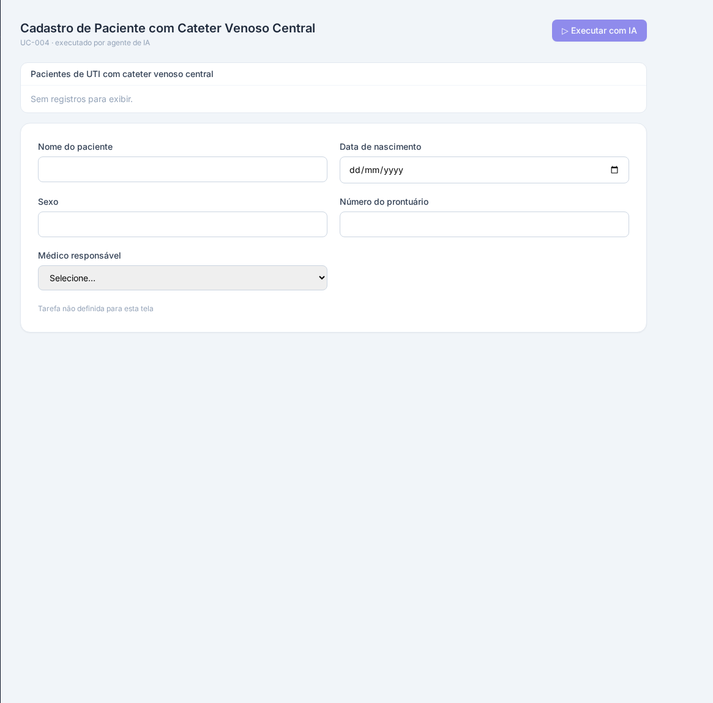
*UC-004 — a tela ao abrir*

### UC-005 — Registrar Episódio e Dados de Risco do Caso Clínico

| | |
|---|---|
| **Natureza** | convencional |
| **Requisitos** | FR-007, FR-008, FR-009, FR-061, FR-005, FR-063 |
| **Tela** | Episódio e Dados de Risco do Caso Clínico |
| **Veredito** | **BOTÃO DESABILITADO** |

**O que a especificação pede.** Registrar, para o episódio do caso clínico, a idade do paciente na data, há quantos dias o cateter está instalado, a pontuação APACHE II, o sítio de inserção do cateter e as comorbidades relevantes, além da data de início, da data de encerramento opcional e do estado do caso, exigindo os cinco dados de risco antes de permitir qualquer conta de risco.

**Elementos da tela.** 8 de 19 elementos previstos (na especificação e na etapa de Interface) aparecem na tela. Ausentes: Salvar Episódio; Tentar novamente; Cancelar; Paciente do caso; Alerta de dado de risco faltante; Alerta de data de início inválida; Alerta de encerramento sem data; Alerta de sessão expirada; Alerta de falha ao salvar; Confirmação de episódio registrado; Nota sobre o estado do caso.

**O que se observou.** Mesmo caso da UC-004: "Executar com IA" sempre desabilitado, sem tarefa ligada.

**Comparação com o caso de uso.** Caso de uso convencional gerado como tela de agente.

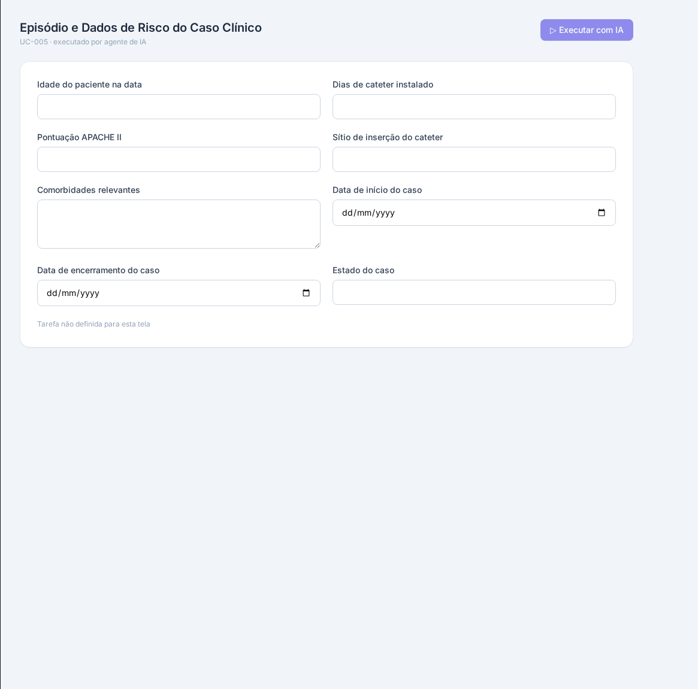
*UC-005 — a tela ao abrir*

### UC-006 — Consultar Escore de Risco de Cox no Serviço Externo

| | |
|---|---|
| **Natureza** | convencional |
| **Requisitos** | FR-010, FR-011, FR-012, FR-013, FR-014, FR-015, FR-060, FR-072, FR-084, FR-008, FR-070 |
| **Tela** | Escore de Risco de Cox |
| **Veredito** | **AÇÃO SEM EXECUTOR** |

**O que a especificação pede.** Consultar o escore de risco de ICSAC já calculado no servidor de estatística do hospital, enviando idade, pontuação APACHE II e tipo de cateter, e armazenar o escore, a faixa de risco, o preditor linear, os fatores que pesaram, o nome da versão do modelo e a data do cálculo, associados ao caso, sem recalcular nada e sem exigir intervalo de confiança.

**Elementos da tela.** 22 de 26 elementos previstos (na especificação e na etapa de Interface) aparecem na tela. Ausentes: Tentar novamente; Ver histórico de escores; Fechar; Ir para o Login.

**O que se observou.** Ao clicar em "Consultar Escore", a tela respondeu "Ação não vinculada a uma tarefa do sistema." Nada foi gravado nem consultado.

**Comparação com o caso de uso.** A tela existe e tem os campos e botões do caso de uso, mas a ação não chega ao servidor: falta o executor do lado convencional (o gerador só liga ações a tarefas de agente). O serviço externo de escore de Cox está no ar (servidor MCP), mas a tela não o aciona.

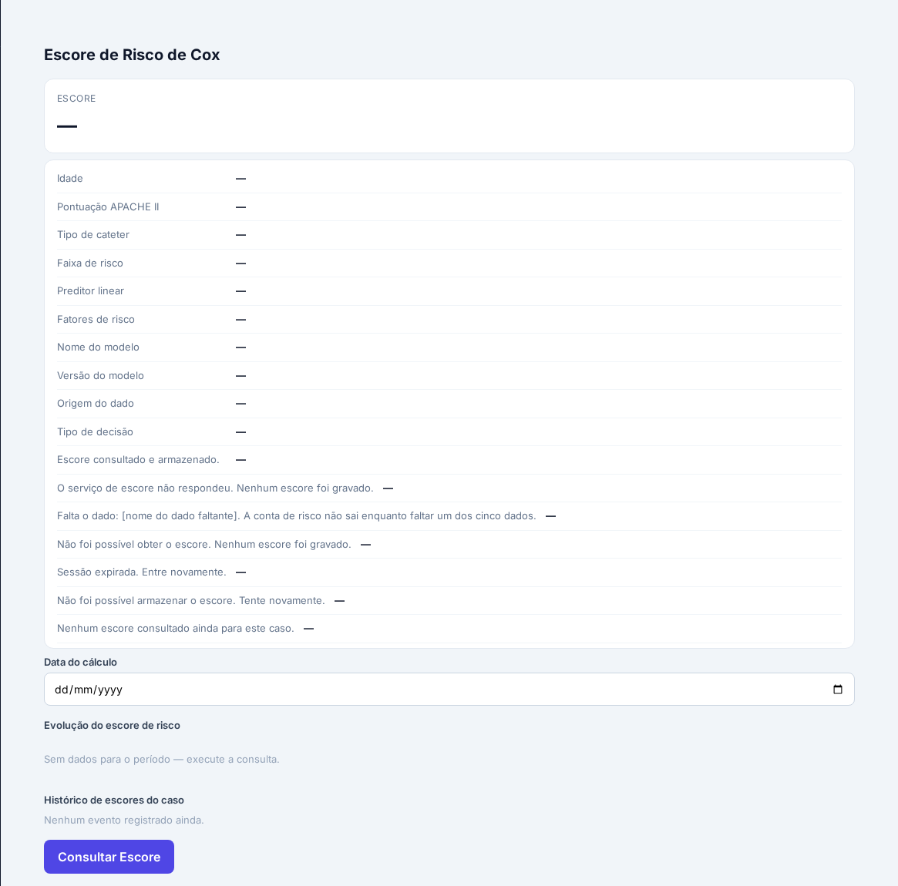
*UC-006 — a tela ao abrir*

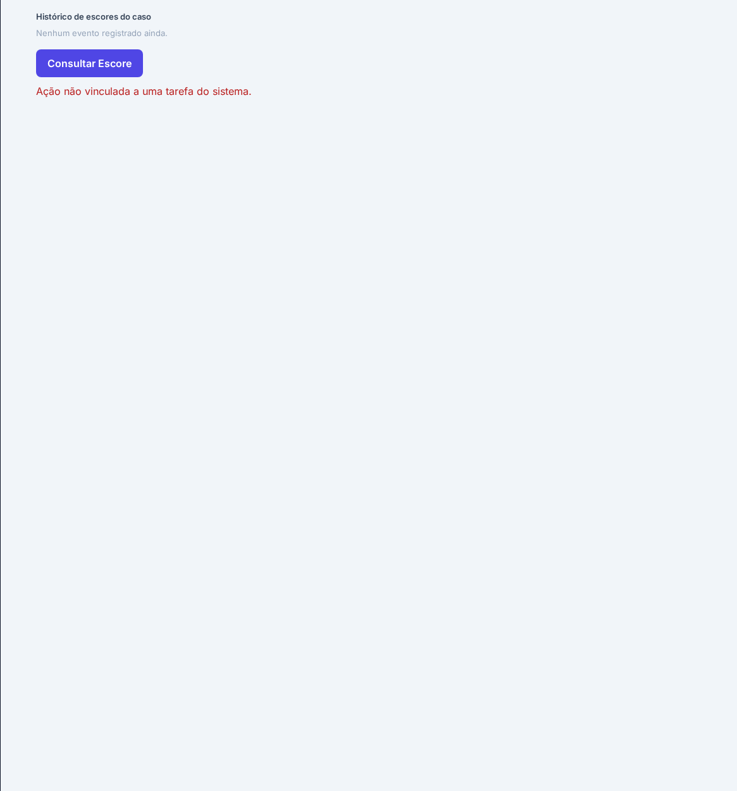
*UC-006 — o resultado da ação "Consultar Escore"*

### UC-007 — Importar Resultado de Hemocultura do Laboratório

| | |
|---|---|
| **Natureza** | convencional |
| **Requisitos** | FR-016, FR-017, FR-018, FR-019, FR-020, FR-021, FR-022, FR-059, FR-069, FR-071 |
| **Tela** | Importação de Hemocultura |
| **Veredito** | **AÇÃO SEM EXECUTOR** |

**O que a especificação pede.** Consultar o sistema do laboratório pelo número do paciente e importar os resultados de hemocultura (identificador da amostra, origem, microrganismo e antibiograma), tratando corretamente retornos pendentes, mensagens de erro e evitando duplicação de registros.

**Elementos da tela.** 28 de 34 elementos previstos (na especificação e na etapa de Interface) aparecem na tela. Ausentes: Confirmar importação; Registrar ocorrência; Buscar novamente; Tentar novamente; Cancelar; Resultados importados deste caso.

**O que se observou.** Ao clicar em "Buscar no laboratório", a tela respondeu "Ação não vinculada a uma tarefa do sistema." Nada foi gravado nem consultado.

**Comparação com o caso de uso.** A tela existe e tem os campos e botões do caso de uso, mas a ação não chega ao servidor: falta o executor do lado convencional (o gerador só liga ações a tarefas de agente).

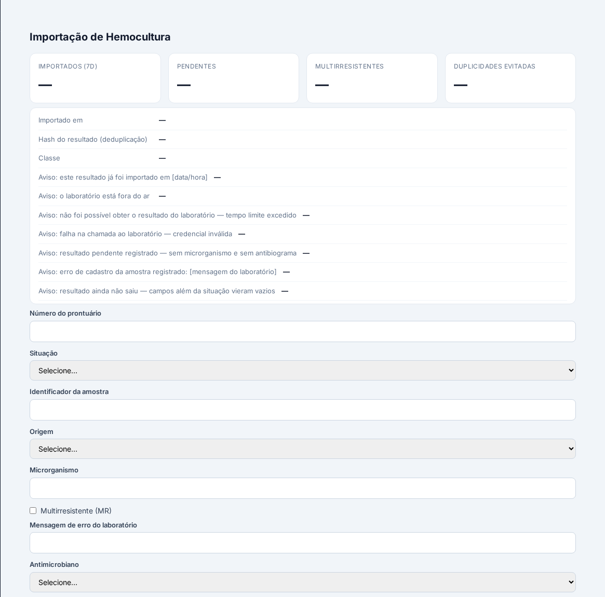
*UC-007 — a tela ao abrir*

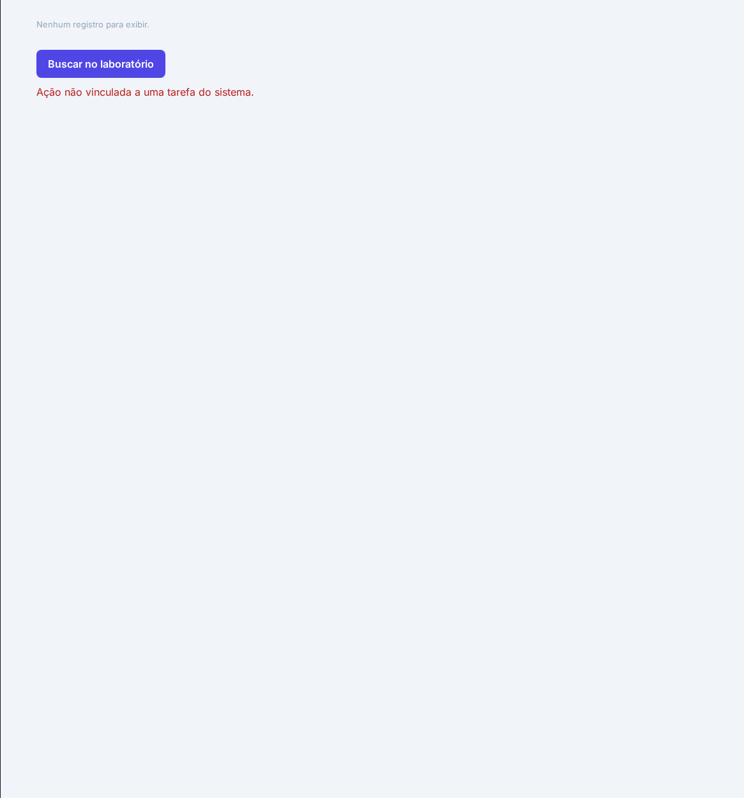
*UC-007 — o resultado da ação "Buscar no laboratório"*

### UC-008 — Traduzir Resultado do Laboratório para Nomenclatura do Hospital

| | |
|---|---|
| **Natureza** | agêntica |
| **Decisão do agente** | O agente lê o resultado bruto vindo do laboratório, interpreta o que é, traduz a nomenclatura própria do laboratório para o vocabulário adotado pelo hospital e decide se o resultado é aproveitável, sem inventar nada quando não for. |
| **Requisitos** | FR-023, FR-076, FR-077 |
| **Tela** | Tradução do Resultado do Laboratório |
| **Veredito** | **FUNCIONA, COM RESSALVA** |

**O que a especificação pede.** Converter o resultado laboratorial em nomenclatura do hospital e marcar se é aproveitável, reconhecendo resultado "pendente" ou com erro sem gerar valor clínico inventado.

**Elementos da tela.** 24 de 29 elementos previstos (na especificação e na etapa de Interface) aparecem na tela. Ausentes: Encaminhar para classificação; Ver justificativa; Tentar novamente; Voltar; Resultado traduzido — nomenclatura do hospital.

**O que se observou.** Na cadeia, o agente leu o antibiograma do caso no banco e devolveu Staphylococcus aureus com 6 antimicrobianos e as classes (aproveitável: sim). Numa execução isolada, com o mesmo caso, recusou: disse que a busca vetorial do vocabulário do hospital não está configurada.

**Comparação com o caso de uso.** Faz o que o caso de uso pede quando recebe o caso, mas o resultado não é estável entre execuções, e o vocabulário do hospital, que a tradução deveria consultar, não existe (busca vetorial sem tabela configurada).

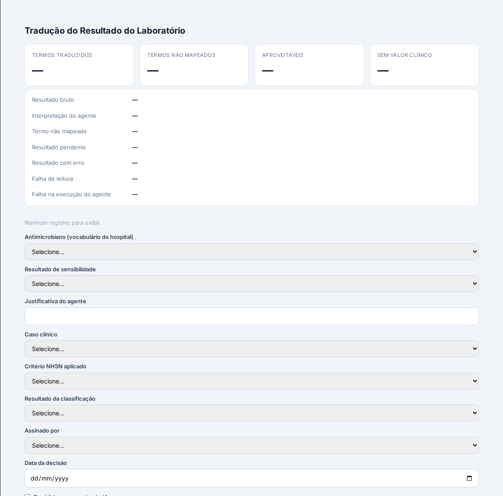
*UC-008 — a tela ao abrir*

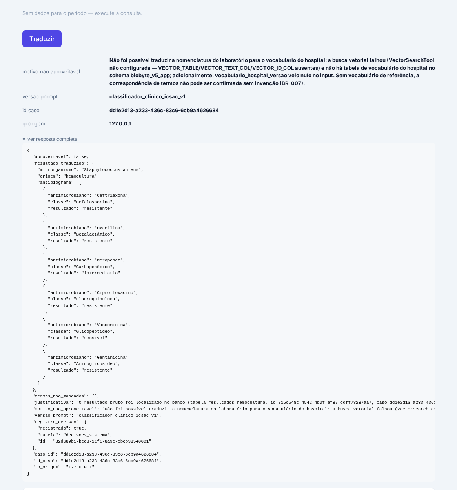
*UC-008 — o resultado da ação "Traduzir"*

### UC-009 — Classificar Caso pelo Critério NHSN

| | |
|---|---|
| **Natureza** | agêntica |
| **Decisão do agente** | O agente decide se o caso é infecção de corrente sanguínea ou não, aplicando a norma vigente, e informa em cima de qual critério tomou a decisão. |
| **Requisitos** | FR-024, FR-025, FR-026, FR-027, FR-028, FR-078, FR-079, FR-091 |
| **Tela** | Classificação do Caso pelo Critério NHSN |
| **Veredito** | **RECUSA CORRETA POR FALTA DE DADO** |

**O que a especificação pede.** Aplicar o critério NHSN vigente ao caso com base na microbiologia, atribuir a classificação confirmada, descartada ou pendente, registrar o critério e a versão aplicados e permitir auditoria da classificação.

**Elementos da tela.** 24 de 30 elementos previstos (na especificação e na etapa de Interface) aparecem na tela. Ausentes: Assinar classificação; Salvar sobrescrita; Tentar novamente; Ver rastreabilidade; Voltar; Antibiograma.

**O que se observou.** O agente respondeu "pendente" e explicou: a data de início do caso e os critérios candidatos não chegaram na entrada, e sem eles não há como escolher o critério NHSN vigente.

**Comparação com o caso de uso.** A recusa segue a regra BR-010 e não inventa critério — comportamento correto. A falta é do gerador: a tarefa não recebe criterios_candidatos nem data_inicio_caso (lacuna já conhecida).

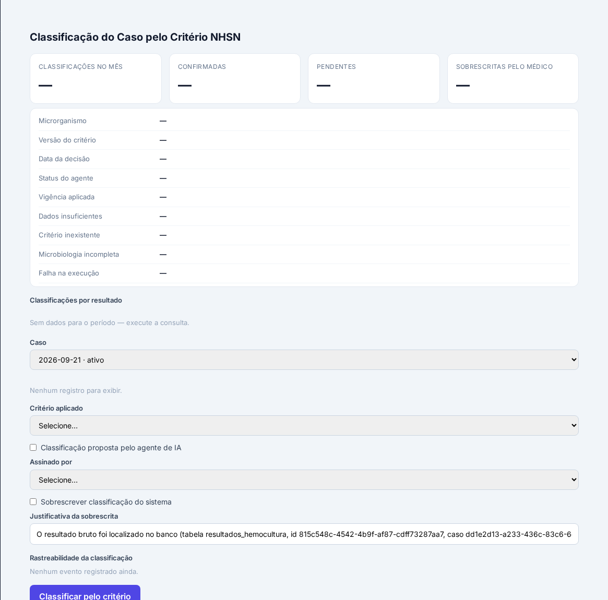
*UC-009 — a tela ao abrir*

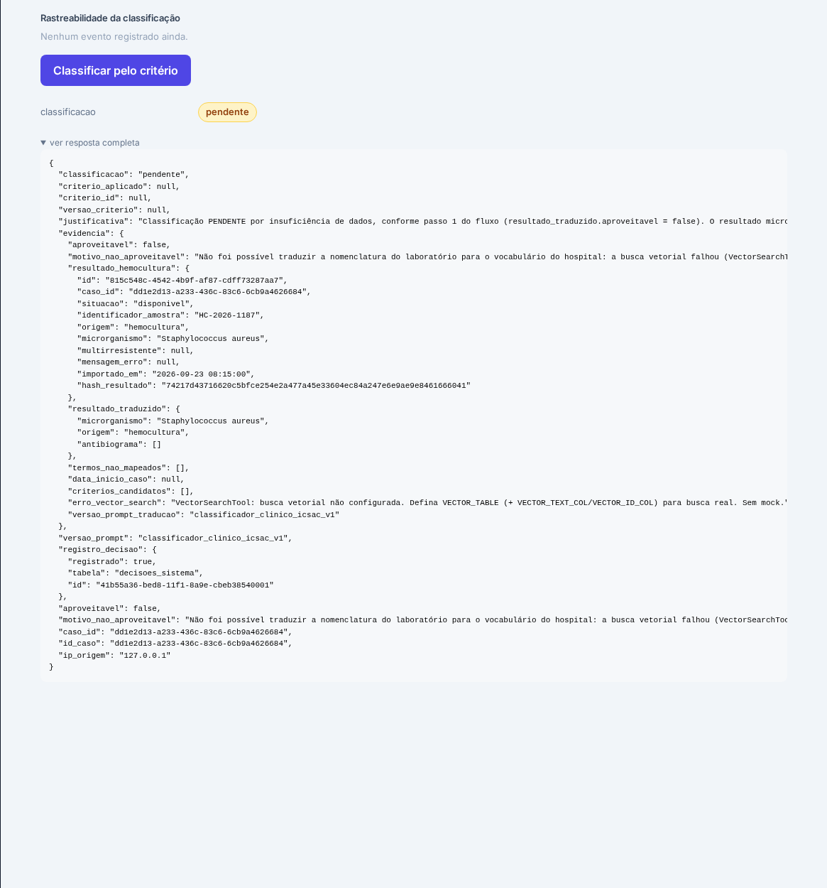
*UC-009 — o resultado da ação "Classificar pelo critério"*

### UC-010 — Sobrescrever Classificação Automática com Justificativa

| | |
|---|---|
| **Natureza** | convencional |
| **Requisitos** | FR-029, FR-030 |
| **Tela** | Detalhe do Caso Clínico — Sobrescrever Classificação Automática |
| **Veredito** | **AÇÃO SEM EXECUTOR** |

**O que a especificação pede.** Permitir que o médico altere a classificação automática do caso (confirmada, descartada ou pendente), exigindo justificativa por escrito, e mantendo o registro original para auditoria.

**Elementos da tela.** 25 de 35 elementos previstos (na especificação e na etapa de Interface) aparecem na tela. Ausentes: Classificação NHSN; Critério aplicado; Nova classificação; Ver classificação original do sistema; Classificação original do sistema; Cancelar; Tentar novamente; Executar classificação do caso; Fazer login novamente; Parecer do agente sobre o bundle recomendado.

**O que se observou.** Ao clicar em "Confirmar sobrescrita", a tela respondeu "Ação não vinculada a uma tarefa do sistema." Nada foi gravado nem consultado.

**Comparação com o caso de uso.** A tela existe e tem os campos e botões do caso de uso, mas a ação não chega ao servidor: falta o executor do lado convencional (o gerador só liga ações a tarefas de agente).

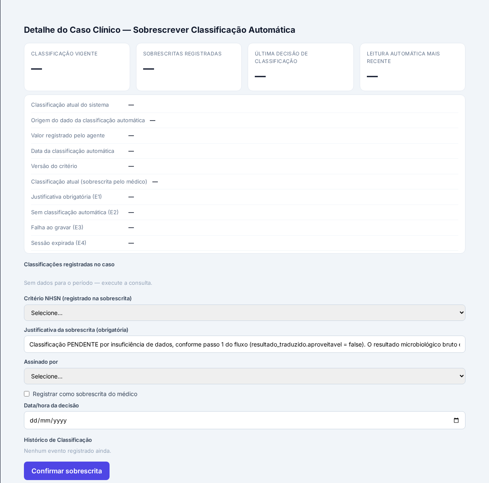
*UC-010 — a tela ao abrir*

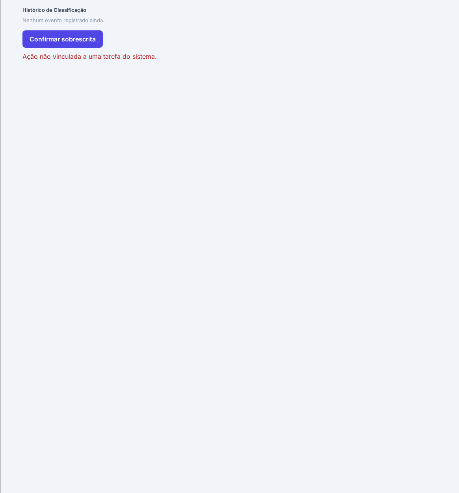
*UC-010 — o resultado da ação "Confirmar sobrescrita"*

### UC-011 — Identificar Multirresistência no Antibiograma

| | |
|---|---|
| **Natureza** | agêntica |
| **Decisão do agente** | Examinar a lista de antimicrobianos do antibiograma e julgar se o microrganismo isolado é multirresistente, aplicando a regra de resistência a três ou mais classes. |
| **Requisitos** | FR-031, FR-032, FR-080 |
| **Tela** | Detalhe do Caso Clínico — Multirresistência |
| **Veredito** | **FUNCIONA** |

**O que a especificação pede.** Ler o antibiograma recebido do laboratório, interpretar cada antimicrobiano com sua classe e resultado, e decidir se o microrganismo é multirresistente, deixando o resultado disponível para o médico e para os fluxos de alerta e recomendação.

**Elementos da tela.** 18 de 34 elementos previstos (na especificação e na etapa de Interface) aparecem na tela. Ausentes: Ver antibiograma completo; Antibiograma Completo; Avaliar multirresistência; Reavaliar multirresistência; Tentar novamente; Voltar ao caso; Arquivo do laboratório; Prévia do resultado importado; Limiar da regra (BR-009); Intermediários (não contados); Distribuição dos resultados do antibiograma; Classe ausente (E1); Falha do agente (E2); Resultado pendente (E3)….

**O que se observou.** Na cadeia, o agente contou 4 classes resistentes (cefalosporina, betalactâmico, fluoroquinolona, aminoglicosídeo), deixou o carbapenêmico de fora por ser intermediário e decidiu multirresistente = sim, com a justificativa e a decisão gravada. Aberta sozinha, a tela não tem seletor de caso: o agente recebeu o caso vazio e recusou corretamente, listando os dois casos do banco sem escolher um.

**Comparação com o caso de uso.** A regra de três ou mais classes (BR-009) foi aplicada exatamente. Ressalva: a tela depende do atendimento corrente vindo das telas anteriores, e o botão se chama "Identificar multirresistência" na tela e "Avaliar multirresistência" na especificação.

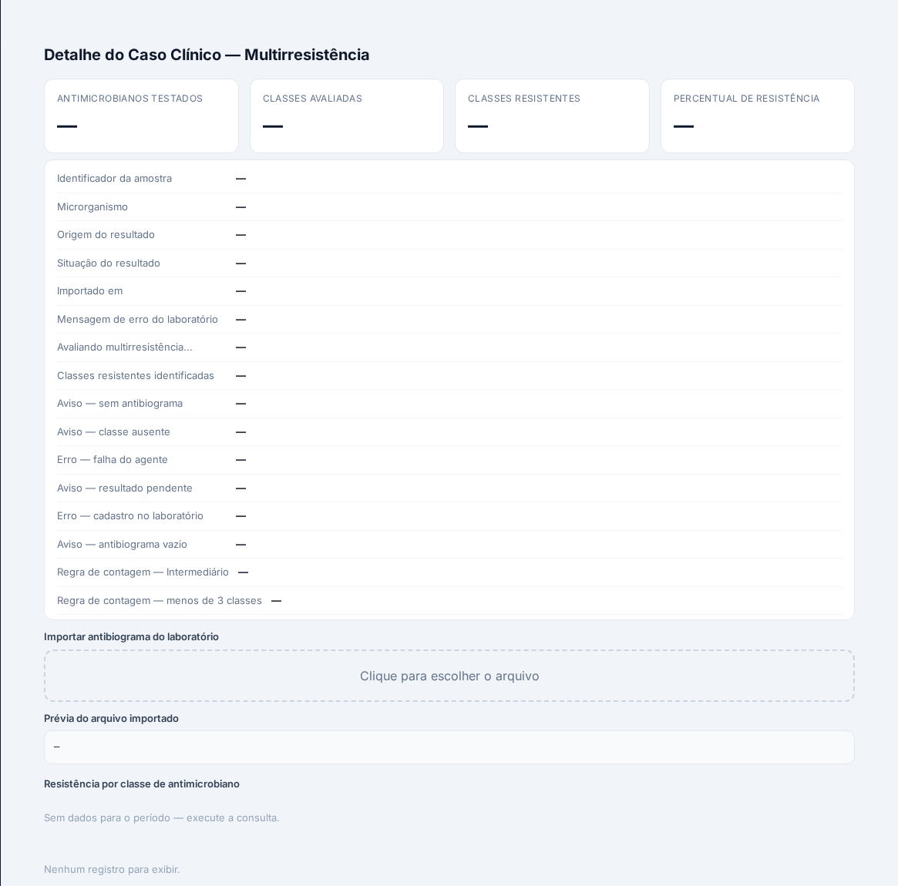
*UC-011 — a tela ao abrir*

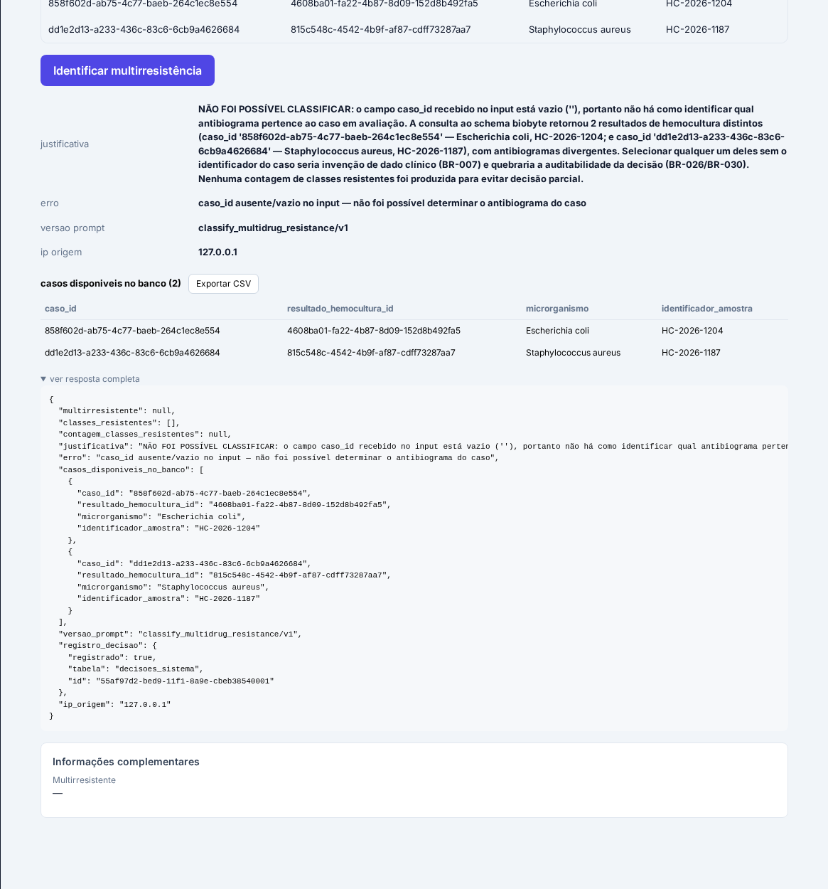
*UC-011 — o resultado da ação "Identificar multirresistência"*

### UC-012 — Abrir e Gerenciar Alerta de Multirresistência

| | |
|---|---|
| **Natureza** | convencional |
| **Requisitos** | FR-033, FR-034 |
| **Tela** | Alertas de Multirresistência |
| **Veredito** | **AÇÃO SEM EXECUTOR** |

**O que a especificação pede.** Abrir um alerta quando o sistema detectar multirresistência, com tipo, gravidade e situação, e permitir que a coordenadora da CCIH e o enfermeiro acompanhem a mudança de situação entre aberto, reconhecido e encerrado.

**Elementos da tela.** 24 de 32 elementos previstos (na especificação e na etapa de Interface) aparecem na tela. Ausentes: Detalhe do Alerta; Encerrar alerta; Reabrir alerta; Já existe alerta aberto para este caso.; Tentar novamente; Ir para Login; Voltar para a lista de alertas; Lista de alertas.

**O que se observou.** Ao clicar em "Reconhecer alerta", a tela respondeu "Ação não vinculada a uma tarefa do sistema." Nada foi gravado nem consultado.

**Comparação com o caso de uso.** A tela existe e tem os campos e botões do caso de uso, mas a ação não chega ao servidor: falta o executor do lado convencional (o gerador só liga ações a tarefas de agente).

*UC-012 — a tela ao abrir*

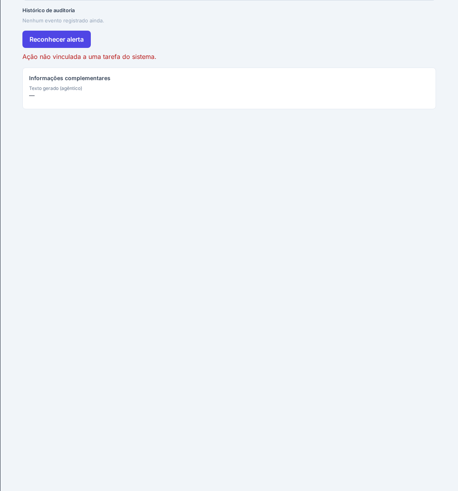
*UC-012 — o resultado da ação "Reconhecer alerta"*

### UC-013 — Redigir Texto do Alerta para a Equipe

| | |
|---|---|
| **Natureza** | agêntica |
| **Decisão do agente** | Redigir, em linguagem clara e legível pela equipe assistencial, o texto do alerta explicando o que houve (microrganismo multirresistente identificado no antibiograma) e por que aquilo importa para o paciente com cateter. |
| **Requisitos** | FR-035, FR-083 |
| **Tela** | Alerta de Multirresistência |
| **Veredito** | **FUNCIONA** |

**O que a especificação pede.** Produzir o texto do alerta de multirresistência que o enfermeiro lerá na rotina da UTI, informando o que houve e por que importa, a partir do alerta já aberto pelo sistema.

**Elementos da tela.** 18 de 24 elementos previstos (na especificação e na etapa de Interface) aparecem na tela. Ausentes: Tentar novamente; Reconhecer Alerta; Encerrar Alerta; Notificar Equipe; Voltar; Antibiograma estruturado.

**O que se observou.** O agente redigiu o alerta para a equipe da UTI: o microrganismo, a hemocultura, as classes resistentes, por que importa para um paciente com cateter e as medidas de precaução, em linguagem clara.

**Comparação com o caso de uso.** Atende ao caso de uso (texto do alerta com o germe, as classes e a conduta).

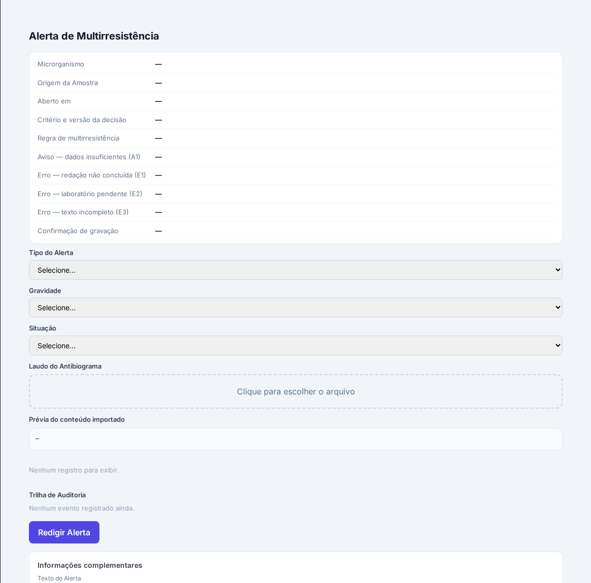
*UC-013 — a tela ao abrir*

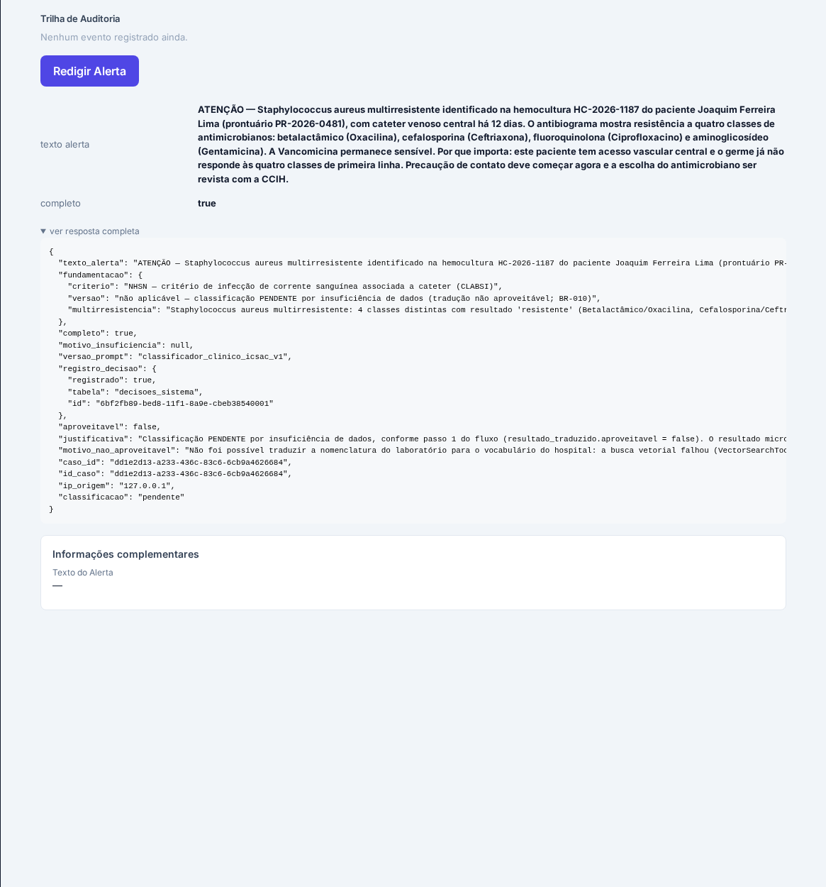
*UC-013 — o resultado da ação "Redigir Alerta"*

### UC-014 — Notificar Coordenadora e Enfermeiro por E-mail

| | |
|---|---|
| **Natureza** | convencional |
| **Requisitos** | FR-036, FR-037, FR-038, FR-062, FR-073 |
| **Tela** | Alerta de Multirresistência — Notificar Equipe |
| **Veredito** | **BOTÃO DESABILITADO** |

**O que a especificação pede.** Notificar por e-mail a coordenadora da CCIH e o enfermeiro responsável quando houver alerta de multirresistência, registrando destinatário, canal e tempo decorrido, e reportando falha de envio sem simular sucesso.

**Elementos da tela.** 8 de 16 elementos previstos (na especificação e na etapa de Interface) aparecem na tela. Ausentes: Enviar Notificação; Tentar novamente; Cancelar; Entrar novamente; Confirmação de envio; E-mail não configurado; Destinatário inválido; Sessão expirada.

**O que se observou.** "Executar com IA" sempre desabilitado: a notificação por e-mail não está ligada a nenhuma tarefa.

**Comparação com o caso de uso.** O caso de uso pede o envio do alerta por e-mail à coordenadora e ao enfermeiro; o servidor MCP de e-mail existe, mas a tela não o aciona.

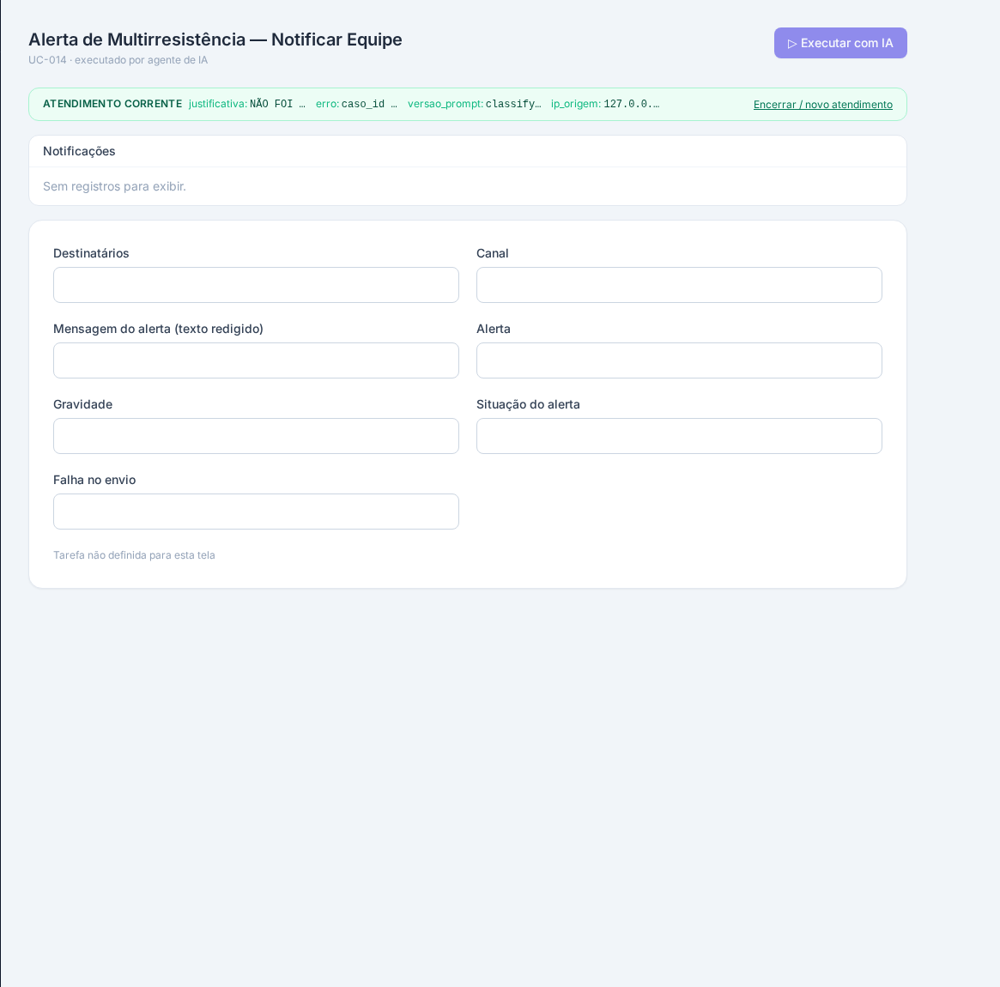
*UC-014 — a tela ao abrir*

### UC-015 — Recomendar Bundle ao Caso Confirmado

| | |
|---|---|
| **Natureza** | agêntica |
| **Decisão do agente** | Recomendar o pacote de medidas (bundle) aplicável ao caso confirmado, considerando o resultado do NHSN e a presença de multirresistência, e explicar por que o recomenda — ou declarar que os dados não sustentam recomendação. |
| **Requisitos** | FR-039, FR-041, FR-043, FR-044, FR-045, FR-081, FR-082 |
| **Tela** | Recomendação de Tratamento |
| **Veredito** | **RECUSA CORRETA POR FALTA DE DADO** |

**O que a especificação pede.** Recomendar o bundle ao caso confirmado, com justificativa textual que cita o resultado do NHSN e a situação de multirresistência, sem recomendar bundle de germe multirresistente para caso sem multirresistência registrada, e declarar insuficiência quando os dados não sustentarem.

**Elementos da tela.** 7 de 28 elementos previstos (na especificação e na etapa de Interface) aparecem na tela. Ausentes: Recomendar Bundle; Aceitar Recomendação; Escolher Outro Bundle; Ver Justificativa; Tentar novamente; Cancelar; Entrar novamente; Resultado NHSN; Multirresistência; Intervalo de Confiança; Compatibilidade com multirresistência registrada; Recomendação gerada em; Estado da análise; Dados insuficientes….

**O que se observou.** O agente reconheceu o germe multirresistente e o bundle compatível, mas respondeu "insuficiente": "Recomendação disponível apenas para caso confirmado", porque a classificação ficou pendente.

**Comparação com o caso de uso.** Correto pela regra do caso de uso; a cadeia para porque a UC-009 não recebe os dados para confirmar o caso.

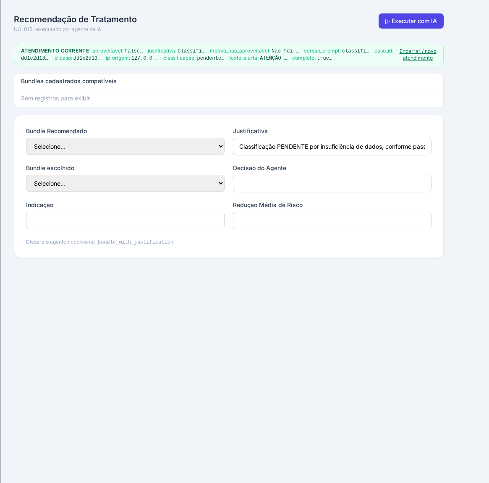
*UC-015 — a tela ao abrir*

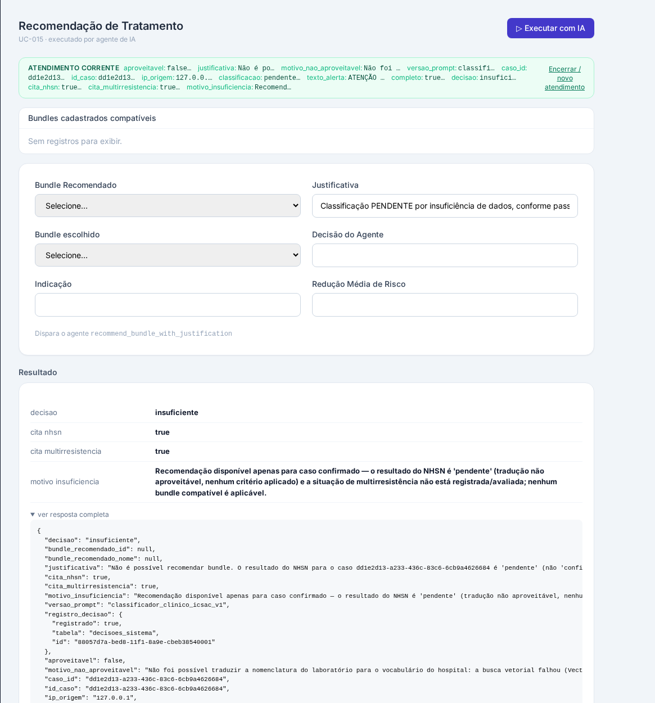
*UC-015 — o resultado da ação "▷ Executar com IA"*

### UC-016 — Cadastrar Bundles com Dados de Risco

| | |
|---|---|
| **Natureza** | convencional |
| **Requisitos** | FR-040 |
| **Tela** | Cadastro de Bundle |
| **Veredito** | **FUNCIONA, COM RESSALVA** |

**O que a especificação pede.** Permitir que o administrador ou a coordenadora da CCIH cadastrem um novo bundle de medidas no sistema, informando seu nome, a indicação clínica, a redução média de risco esperada e o intervalo de confiança dessa redução, para que o sistema possa usá-lo nas recomendações de tratamento.

**Elementos da tela.** 6 de 14 elementos previstos (na especificação e na etapa de Interface) aparecem na tela. Ausentes: Salvar; Cancelar; Tentar novamente; Confirmação de cadastro; Nome já existente (A1); Campo obrigatório não preenchido (A2); Valor não numérico (E2); Falha de comunicação com o banco (E1).

**O que se observou.** O cadastro de bundle foi feito pelo botão "Executar com IA" e gravou o bundle no banco (o registro de teste foi apagado depois).

**Comparação com o caso de uso.** Grava o que o caso de uso pede, mas um cadastro convencional está sendo executado por agente de IA, o que custa chamada de modelo para uma operação de banco.

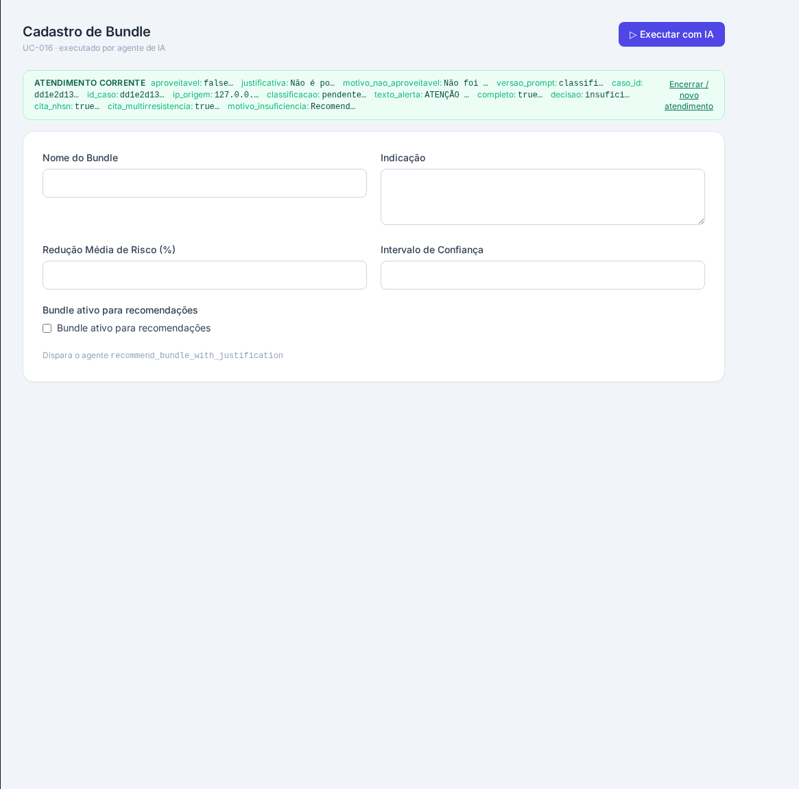
*UC-016 — a tela ao abrir*

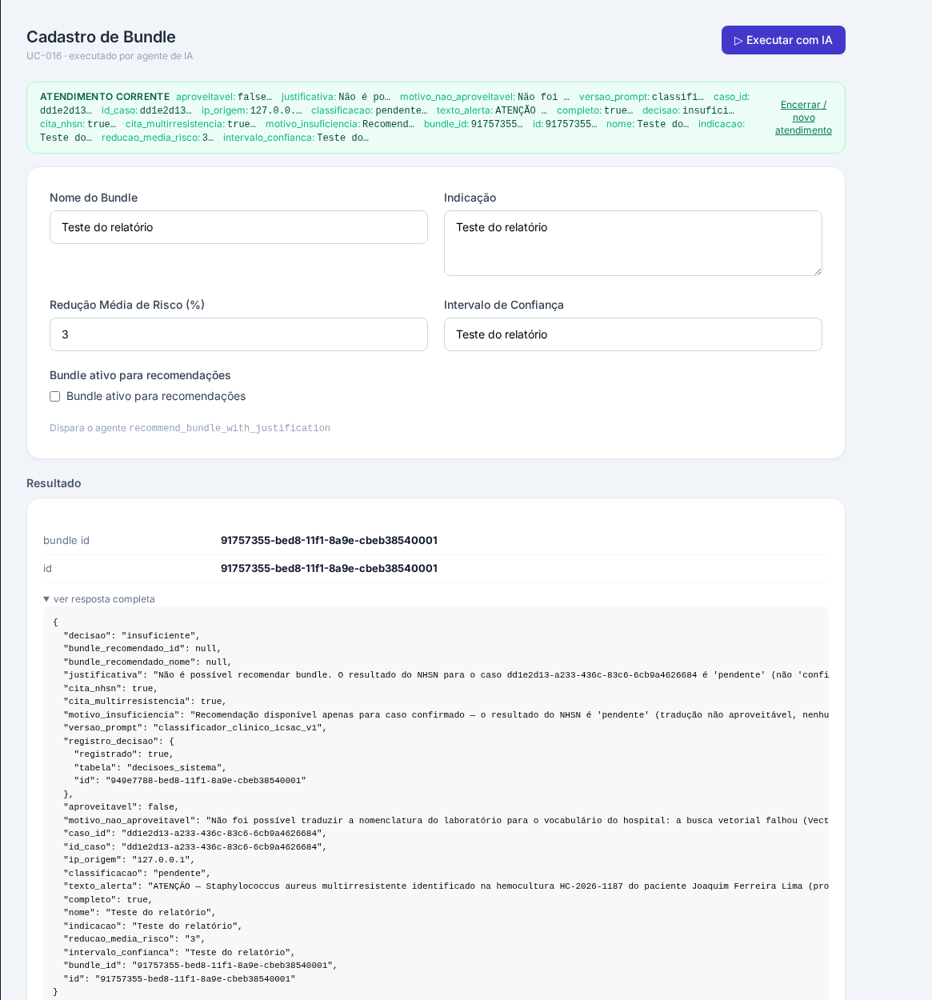
*UC-016 — o resultado da ação "▷ Executar com IA"*

### UC-017 — Registrar Escolha Médica de Outro Bundle

| | |
|---|---|
| **Natureza** | convencional |
| **Requisitos** | FR-042 |
| **Tela** | Detalhes do Caso — Registrar Escolha Médica de Outro Bundle |
| **Veredito** | **RECUSA CORRETA POR FALTA DE DADO** |

**O que a especificação pede.** Permitir que o médico, após receber uma recomendação de bundle do sistema, escolha um bundle diferente para o tratamento do caso, garantindo que a recomendação original do sistema permaneça registrada para fins de auditoria.

**Elementos da tela.** 14 de 21 elementos previstos (na especificação e na etapa de Interface) aparecem na tela. Ausentes: Recomendação de Tratamento; Selecionar Bundle Alternativo; Escolher Outro Bundle; Tentar novamente; Cancelar; Atualizar página; Bundles alternativos disponíveis (modal).

**O que se observou.** Ao confirmar a escolha de outro bundle, o sistema respondeu que não é possível recomendar para o caso, porque a classificação está pendente.

**Comparação com o caso de uso.** Correto: a própria especificação exige, como pré-condição, um caso classificado como confirmado com recomendação gerada. A cadeia para na UC-009.

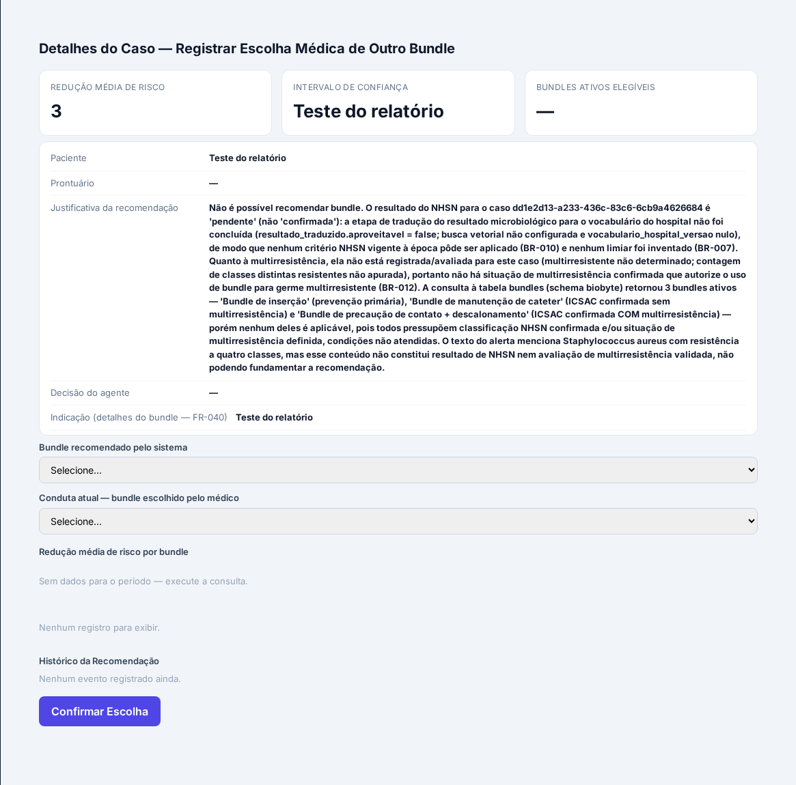
*UC-017 — a tela ao abrir*

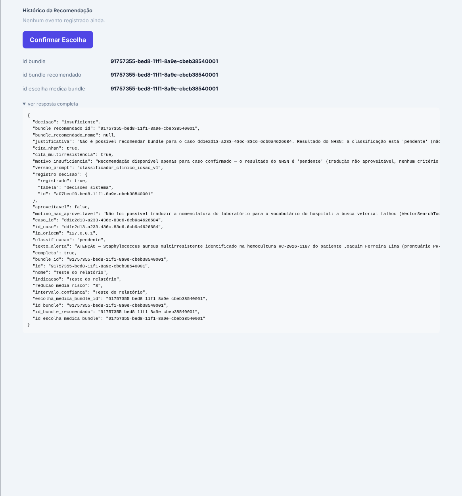
*UC-017 — o resultado da ação "Confirmar Escolha"*

### UC-018 — Estimar Redução de Risco do Tratamento Escolhido

| | |
|---|---|
| **Natureza** | convencional |
| **Requisitos** | FR-046, FR-047, FR-048 |
| **Tela** | Detalhes do Caso — Estimativa de Redução de Risco |
| **Veredito** | **AÇÃO SEM EXECUTOR** |

**O que a especificação pede.** Calcular e apresentar a estimativa de redução de risco para um paciente, com base no tratamento já escolhido, usando os dados clínicos do caso e um horizonte de tempo selecionado (30, 90 ou 180 dias).

**Elementos da tela.** 56 de 59 elementos previstos (na especificação e na etapa de Interface) aparecem na tela. Ausentes: Tentar novamente; Voltar; Antibiograma (amostra 2026-000118).

**O que se observou.** Ao clicar em "Calcular Estimativa", a tela respondeu "Ação não vinculada a uma tarefa do sistema." Nada foi gravado nem consultado.

**Comparação com o caso de uso.** A tela existe e tem os campos e botões do caso de uso, mas a ação não chega ao servidor: falta o executor do lado convencional (o gerador só liga ações a tarefas de agente).

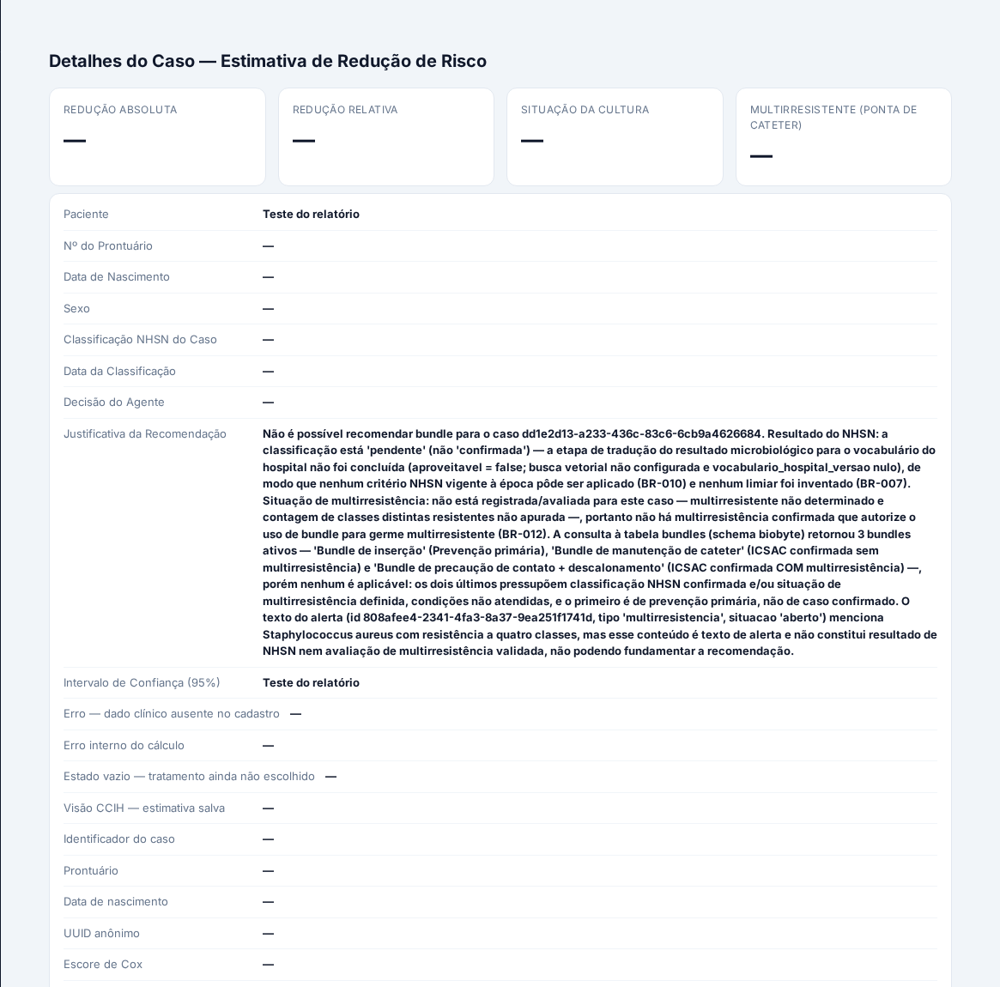
*UC-018 — a tela ao abrir*

*UC-018 — o resultado da ação "Calcular Estimativa"*

### UC-019 — Executar Ciclo Integrado de um Caso

| | |
|---|---|
| **Natureza** | convencional |
| **Requisitos** | FR-049, FR-050, FR-085 |
| **Tela** | Ciclo Integrado do Caso |
| **Veredito** | **AÇÃO SEM EXECUTOR** |

**O que a especificação pede.** Executar, para um caso, a sequência inteira do ciclo — buscar microbiologia, classificar, detectar multirresistência, calcular escore, recomendar e estimar — por meio de um comando único, devolvendo quais etapas concluíram e qual foi o resultado de cada uma.

**Elementos da tela.** 18 de 22 elementos previstos (na especificação e na etapa de Interface) aparecem na tela. Ausentes: Tentar novamente; Cancelar; Ver Detalhe do Caso; Antibiograma importado (Etapa 1).

**O que se observou.** Ao clicar em "Executar Ciclo", a tela respondeu "Ação não vinculada a uma tarefa do sistema." Nada foi gravado nem consultado.

**Comparação com o caso de uso.** A tela existe e tem os campos e botões do caso de uso, mas a ação não chega ao servidor: falta o executor do lado convencional (o gerador só liga ações a tarefas de agente).

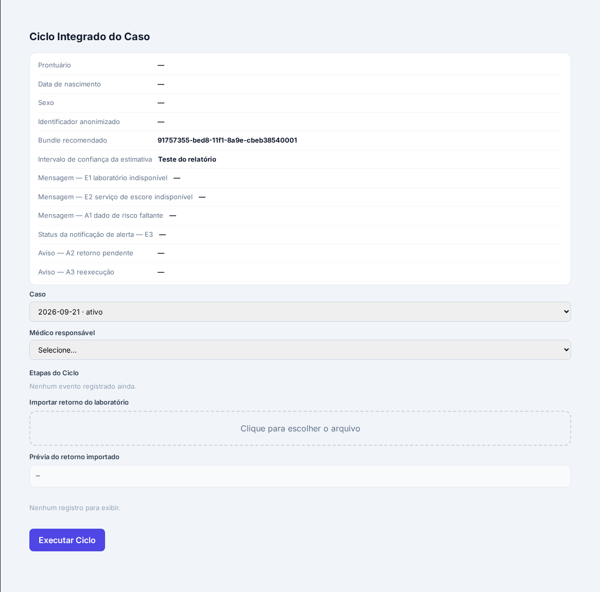
*UC-019 — a tela ao abrir*

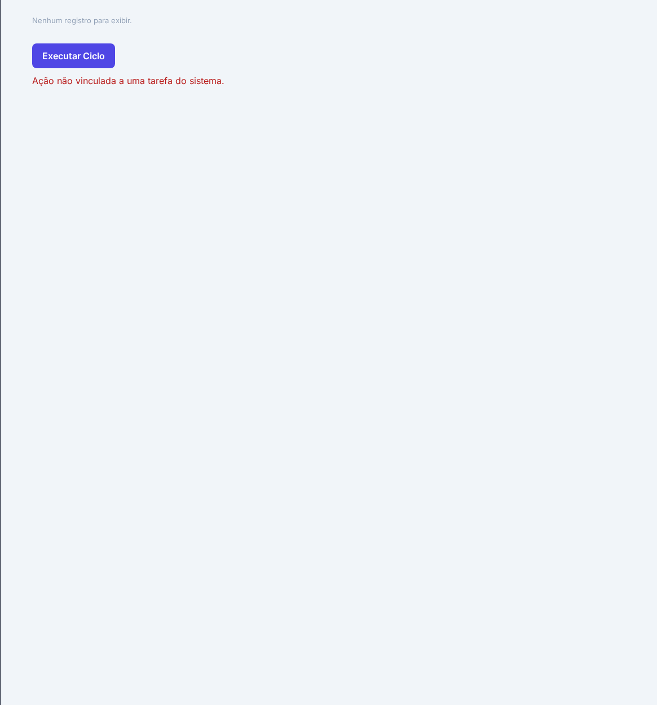
*UC-019 — o resultado da ação "Executar Ciclo"*

### UC-020 — Consultar Painel de Vigilância por Período

| | |
|---|---|
| **Natureza** | convencional |
| **Requisitos** | FR-051, FR-052 |
| **Tela** | Painel de Vigilância |
| **Veredito** | **AÇÃO SEM EXECUTOR** |

**O que a especificação pede.** Exibir a situação do serviço por período selecionável entre 7, 30, 90 ou 365 dias, apresentando os seis indicadores de vigilância.

**Elementos da tela.** 12 de 15 elementos previstos (na especificação e na etapa de Interface) aparecem na tela. Ausentes: Tentar novamente; Ir para o Login; Voltar ao Dashboard.

**O que se observou.** Ao clicar em "Atualizar", a tela respondeu "Ação não vinculada a uma tarefa do sistema." Nada foi gravado nem consultado.

**Comparação com o caso de uso.** A tela existe e tem os campos e botões do caso de uso, mas a ação não chega ao servidor: falta o executor do lado convencional (o gerador só liga ações a tarefas de agente).

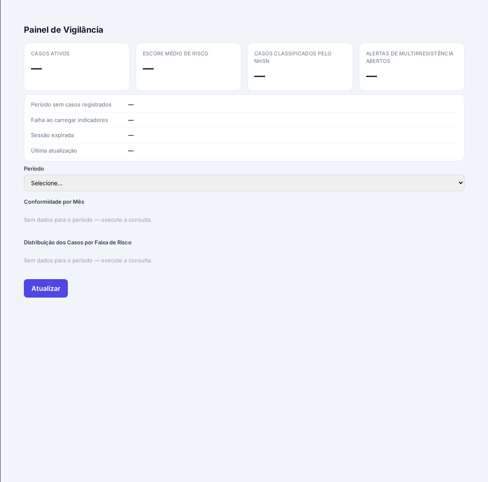
*UC-020 — a tela ao abrir*

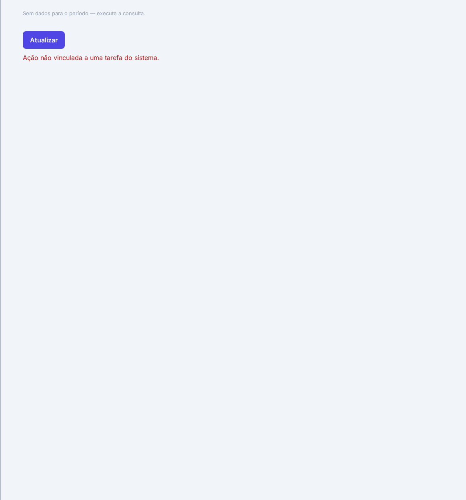
*UC-020 — o resultado da ação "Atualizar"*

### UC-021 — Exportar Relatório de Vigilância em PDF ou CSV

| | |
|---|---|
| **Natureza** | convencional |
| **Requisitos** | FR-053, FR-054, FR-055 |
| **Tela** | Exportar Relatório de Vigilância |
| **Veredito** | **AÇÃO SEM EXECUTOR** |

**O que a especificação pede.** Exportar o relatório de vigilância em PDF ou CSV, por período, podendo filtrar por paciente, contendo casos, escores, classificações e alertas, informando quantos registros foram exportados e disponibilizando o arquivo gerado.

**Elementos da tela.** 18 de 21 elementos previstos (na especificação e na etapa de Interface) aparecem na tela. Ausentes: Baixar Arquivo; Tentar novamente; Cancelar.

**O que se observou.** Ao clicar em "Gerar Relatório", a tela respondeu "Ação não vinculada a uma tarefa do sistema." Nada foi gravado nem consultado.

**Comparação com o caso de uso.** A tela existe e tem os campos e botões do caso de uso, mas a ação não chega ao servidor: falta o executor do lado convencional (o gerador só liga ações a tarefas de agente).

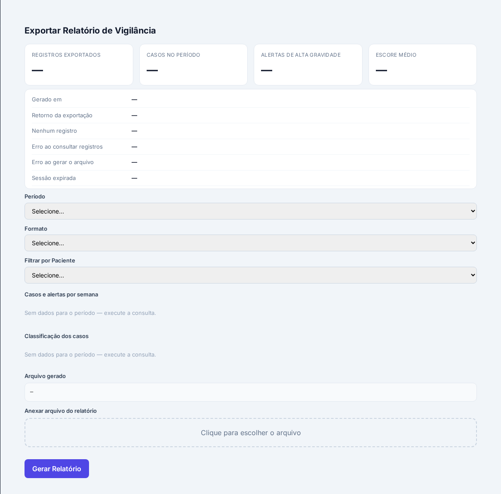
*UC-021 — a tela ao abrir*

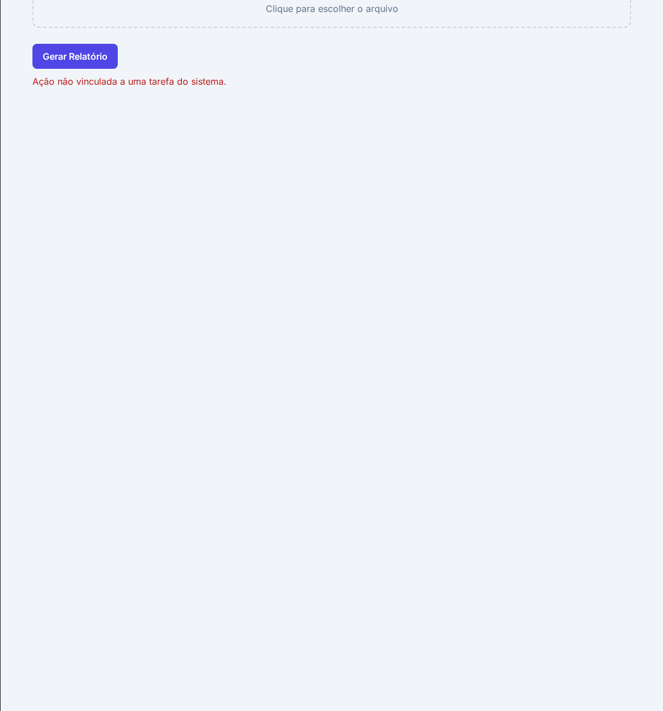
*UC-021 — o resultado da ação "Gerar Relatório"*

### UC-022 — Sinalizar Falhas e Dados Faltantes ao Usuário

| | |
|---|---|
| **Natureza** | convencional |
| **Requisitos** | FR-063, FR-075, FR-059, FR-060, FR-061, FR-062 |
| **Tela** | Detalhes do Caso — Estimativa de Redução de Risco |
| **Veredito** | **AÇÃO SEM EXECUTOR** |

**O que a especificação pede.** Garantir que nenhuma tela do sistema apresente valor de exemplo, texto de preenchimento ou número inventado, e que toda falha de obtenção de resultado seja reportada explicitamente como "não consegui", em vez de exibir um número que não possa ser defendido em auditoria.

**Elementos da tela.** 54 de 57 elementos previstos (na especificação e na etapa de Interface) aparecem na tela. Ausentes: Tentar novamente; Voltar; Antibiograma (amostra 2026-000118).

**O que se observou.** Ao clicar em "Calcular Estimativa", a tela respondeu "Ação não vinculada a uma tarefa do sistema." Nada foi gravado nem consultado.

**Comparação com o caso de uso.** A tela existe e tem os campos e botões do caso de uso, mas a ação não chega ao servidor: falta o executor do lado convencional (o gerador só liga ações a tarefas de agente).

*UC-022 — a tela ao abrir*

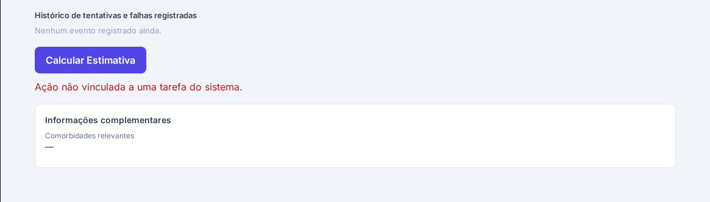
*UC-022 — o resultado da ação "Calcular Estimativa"*

### UC-023 — Proteger Credenciais e Chamadas Externas do Sistema

| | |
|---|---|
| **Natureza** | convencional |
| **Requisitos** | FR-068, FR-069, FR-064, FR-065, FR-066, FR-067, FR-070 |
| **Tela** | Configuração de Serviços Externos |
| **Veredito** | **AÇÃO SEM EXECUTOR** |

**O que a especificação pede.** Garantir que as credenciais dos serviços externos (laboratório, motor de risco de Cox, serviço de e-mail) residam exclusivamente em configuração do servidor, nunca dentro do código nem na tela, e que toda chamada externa leve dados de paciente anonimizados.

**Elementos da tela.** 14 de 16 elementos previstos (na especificação e na etapa de Interface) aparecem na tela. Ausentes: Tentar novamente; Voltar ao Dashboard.

**O que se observou.** Ao clicar em "Testar todas as conexões", a tela respondeu "Ação não vinculada a uma tarefa do sistema." Nada foi gravado nem consultado.

**Comparação com o caso de uso.** A tela existe e tem os campos e botões do caso de uso, mas a ação não chega ao servidor: falta o executor do lado convencional (o gerador só liga ações a tarefas de agente).

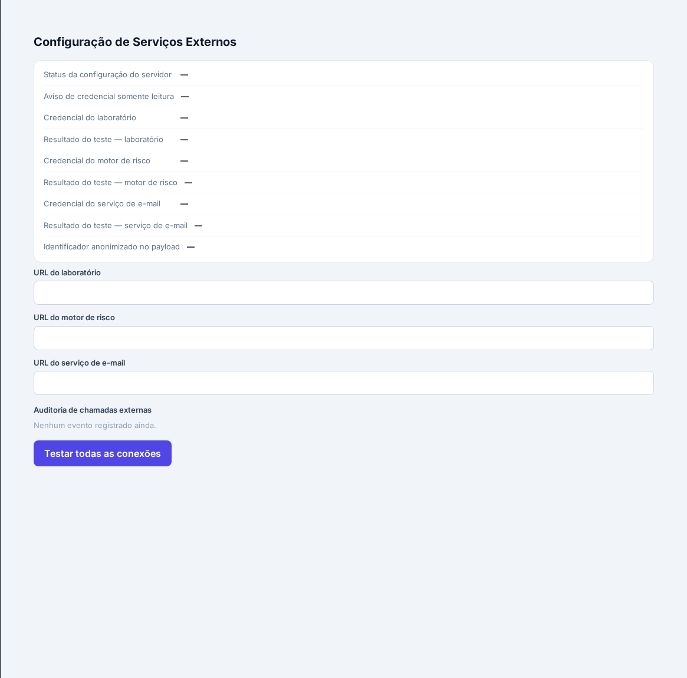
*UC-023 — a tela ao abrir*

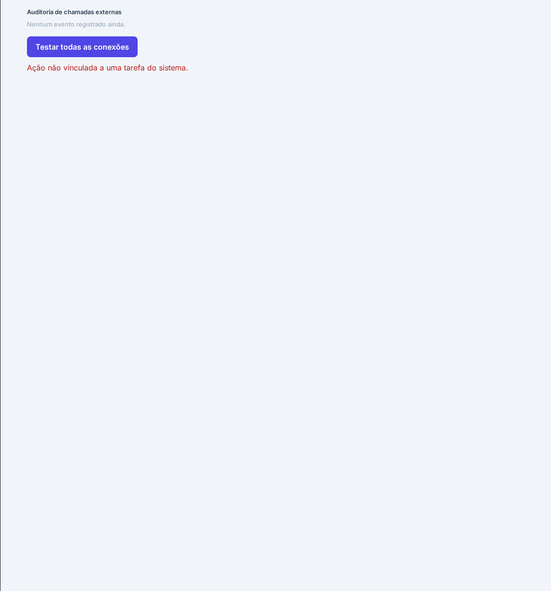
*UC-023 — o resultado da ação "Testar todas as conexões"*

### UC-024 — Padronizar Nomes de Dados entre Telas e Banco

| | |
|---|---|
| **Natureza** | convencional |
| **Requisitos** | FR-074, FR-070, FR-056 |
| **Tela** | Dicionário de Dados |
| **Veredito** | **AÇÃO SEM EXECUTOR** |

**O que a especificação pede.** Garantir que o sistema use nomes consistentes para os mesmos dados em todas as telas e no banco, de modo que o identificador do caso tenha o mesmo nome em qualquer ponto.

**Elementos da tela.** 28 de 36 elementos previstos (na especificação e na etapa de Interface) aparecem na tela. Ausentes: Adicionar dado ao dicionário; Revalidar dicionário; Exportar dicionário; Ver no banco; Remover do dicionário; Tentar novamente; Cancelar; Voltar ao Dashboard.

**O que se observou.** Ao clicar em "Corrigir nomenclatura", a tela respondeu "Ação não vinculada a uma tarefa do sistema." Nada foi gravado nem consultado.

**Comparação com o caso de uso.** A tela existe e tem os campos e botões do caso de uso, mas a ação não chega ao servidor: falta o executor do lado convencional (o gerador só liga ações a tarefas de agente).

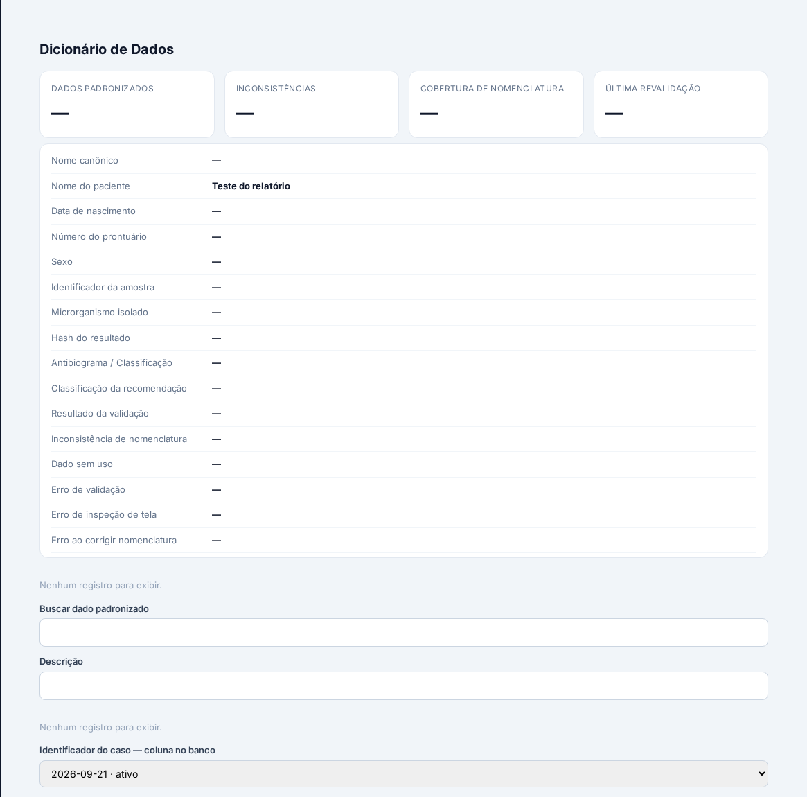
*UC-024 — a tela ao abrir*

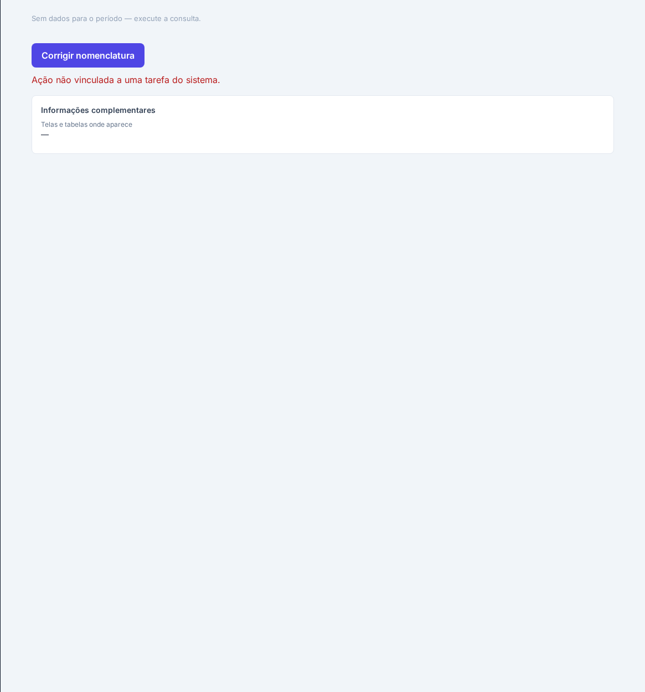
*UC-024 — o resultado da ação "Corrigir nomenclatura"*

### UC-025 — Sinalizar Hemocultura Pronta e Suspeita de ICSAC

| | |
|---|---|
| **Natureza** | agêntica |
| **Decisão do agente** | Julgar, a partir do resultado bruto da hemocultura traduzido e do antibiograma, se o caso configura uma suspeita de infecção de corrente sanguínea associada a cateter (ICSAC) que merece sinalização imediata, e se o germe multirresistente exige destaque de urgência. |
| **Requisitos** | FR-089, FR-090, FR-076, FR-077, FR-078, FR-079, FR-080, FR-086, FR-087, FR-088, FR-016, FR-017, FR-018, FR-019, FR-020, FR-021, FR-022, FR-024, FR-025, FR-026, FR-070, FR-075 |
| **Tela** | Acompanhamento Diário de Pacientes de UTI com Cateter |
| **Veredito** | **AÇÃO SEM EXECUTOR** |

**O que a especificação pede.** Reduzir o tempo entre a hemocultura ficar pronta no laboratório e a percepção de que o paciente tem uma infecção de corrente sanguínea, sinalizando o caso na tela de acompanhamento diário e destacando-o como prioritário quando o germe for multirresistente.

**Elementos da tela.** 19 de 25 elementos previstos (na especificação e na etapa de Interface) aparecem na tela. Ausentes: Consultar novamente; Ver antibiograma traduzido; Aplicar filtros; Atualizar; Lista de acompanhamento diário; Antibiograma traduzido.

**O que se observou.** Ao clicar em "Registrar ciência da sinalização", a tela respondeu "Ação não vinculada a uma tarefa do sistema." Nada foi gravado nem consultado.

**Comparação com o caso de uso.** A tela existe e tem os campos e botões do caso de uso, mas a ação não chega ao servidor: falta o executor do lado convencional (o gerador só liga ações a tarefas de agente). Este caso de uso é agêntico (sinalizar hemocultura pronta e suspeita de ICSAC), mas a tela não tem tarefa de agente ligada.

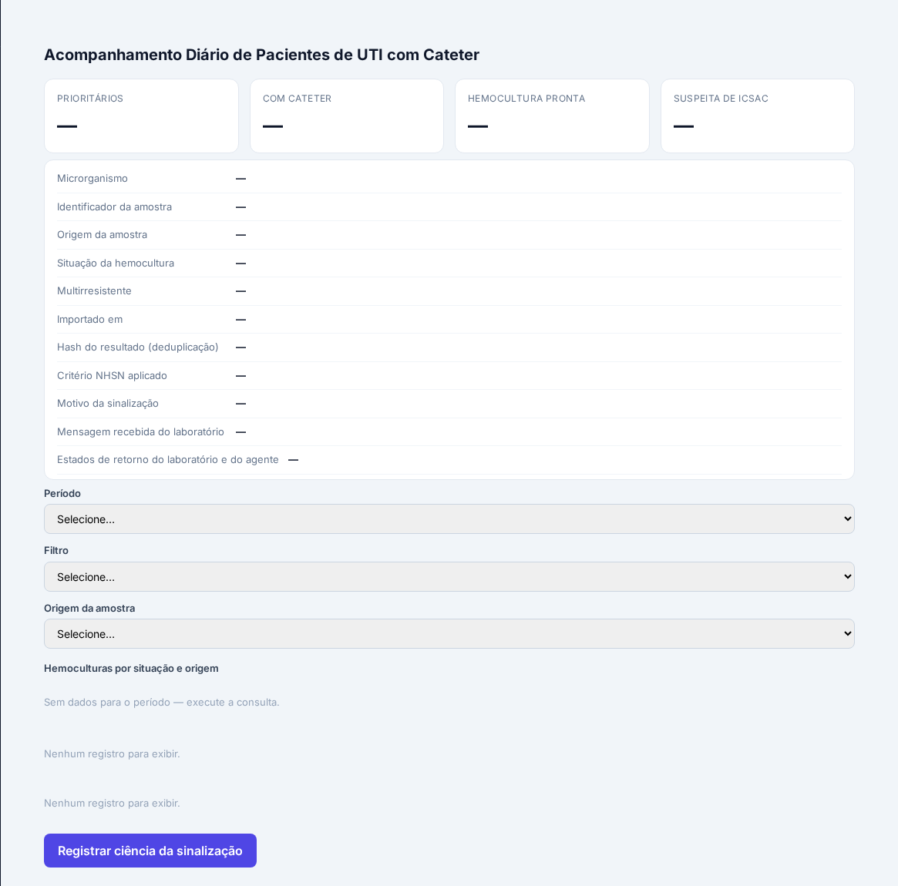
*UC-025 — a tela ao abrir*

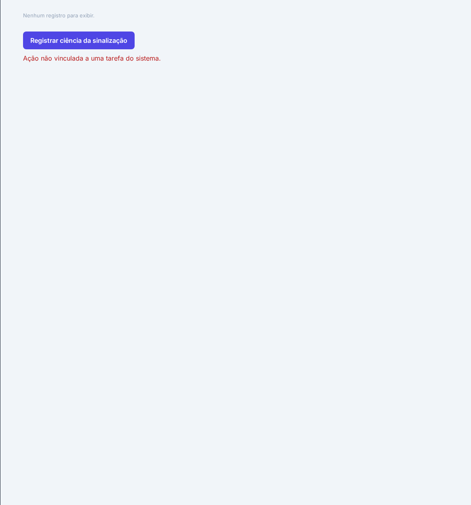
*UC-025 — o resultado da ação "Registrar ciência da sinalização"*

### UC-026 — Executar Backup Automatizado com RTO e RPO

| | |
|---|---|
| **Natureza** | convencional |
| **Requisitos** | FR-092, FR-056, FR-057, FR-070, FR-098 |
| **Tela** | Backup Automatizado |
| **Veredito** | **AÇÃO SEM EXECUTOR** |

**O que a especificação pede.** Realizar backup automatizado dos dados clínicos e de auditoria, com objetivos de tempo de recuperação (RTO) e ponto de recuperação (RPO) definidos e testados periodicamente, garantindo que a perda de dados não inviabilize a defesa de classificações nem a continuidade da vigilância da CCIH.

**Elementos da tela.** 22 de 26 elementos previstos (na especificação e na etapa de Interface) aparecem na tela. Ausentes: Executar backup agora; Testar restauração; Registrar teste; Cancelar.

**O que se observou.** Ao clicar em "Salvar configuração", a tela respondeu "Ação não vinculada a uma tarefa do sistema." Nada foi gravado nem consultado.

**Comparação com o caso de uso.** A tela existe e tem os campos e botões do caso de uso, mas a ação não chega ao servidor: falta o executor do lado convencional (o gerador só liga ações a tarefas de agente).

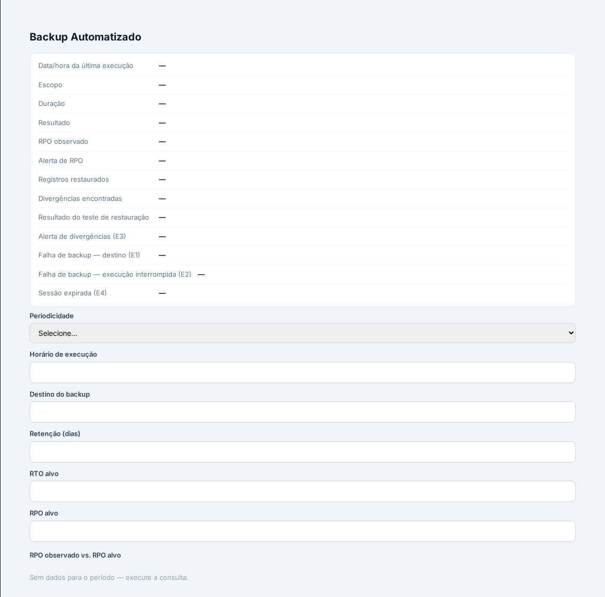
*UC-026 — a tela ao abrir*

*UC-026 — o resultado da ação "Salvar configuração"*

### UC-027 — Monitorar Disponibilidade dos Serviços Externos

| | |
|---|---|
| **Natureza** | convencional |
| **Requisitos** | FR-093, FR-059, FR-060, FR-062, FR-085, FR-094, FR-056, FR-070 |
| **Tela** | Monitoramento dos Serviços Externos |
| **Veredito** | **AÇÃO SEM EXECUTOR** |

**O que a especificação pede.** Monitorar continuamente a disponibilidade dos serviços externos (laboratório, motor de risco de Cox e serviço de e-mail) e expor health checks internos, alertando a TI quando um serviço ficar indisponível, para que falhas silenciosas não comprometam a classificação e a notificação de alertas de multirresistência.

**Elementos da tela.** 19 de 23 elementos previstos (na especificação e na etapa de Interface) aparecem na tela. Ausentes: Salvar configuração; Enviar alerta de teste; Aplicar; Cancelar.

**O que se observou.** Ao clicar em "Verificar agora", a tela respondeu "Ação não vinculada a uma tarefa do sistema." Nada foi gravado nem consultado.

**Comparação com o caso de uso.** A tela existe e tem os campos e botões do caso de uso, mas a ação não chega ao servidor: falta o executor do lado convencional (o gerador só liga ações a tarefas de agente).

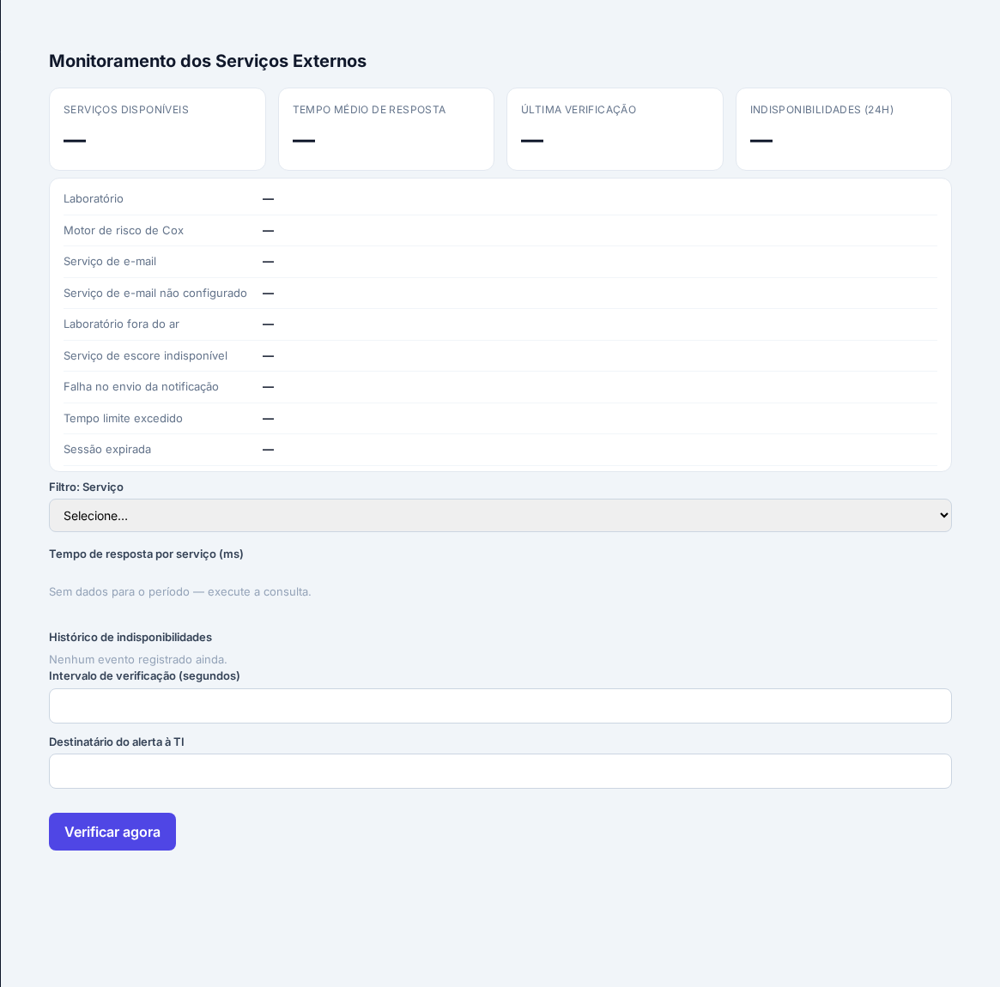
*UC-027 — a tela ao abrir*

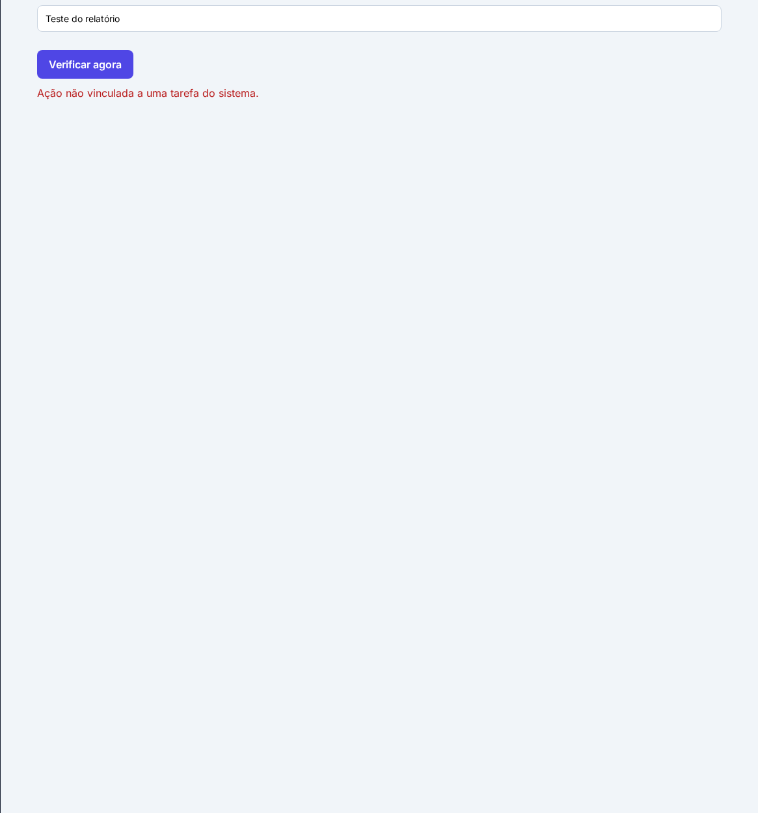
*UC-027 — o resultado da ação "Verificar agora"*

### UC-028 — Registrar Erros com Correlação por Requisição

| | |
|---|---|
| **Natureza** | convencional |
| **Requisitos** | FR-094, FR-085, FR-093 |
| **Tela** | Painel de Diagnóstico de Erros |
| **Veredito** | **AÇÃO SEM EXECUTOR** |

**O que a especificação pede.** Registrar erros de forma estruturada, com identificador de correlação por requisição, permitindo rastrear a cadeia de chamadas entre telas, servidor e serviços externos.

**Elementos da tela.** 17 de 23 elementos previstos (na especificação e na etapa de Interface) aparecem na tela. Ausentes: Baixar arquivo; Copiar identificador de correlação; Tentar novamente; Atualizar; Voltar ao Dashboard; Lista de erros estruturados.

**O que se observou.** Ao clicar em "Exportar lista de erros", a tela respondeu "Ação não vinculada a uma tarefa do sistema." Nada foi gravado nem consultado.

**Comparação com o caso de uso.** A tela existe e tem os campos e botões do caso de uso, mas a ação não chega ao servidor: falta o executor do lado convencional (o gerador só liga ações a tarefas de agente).

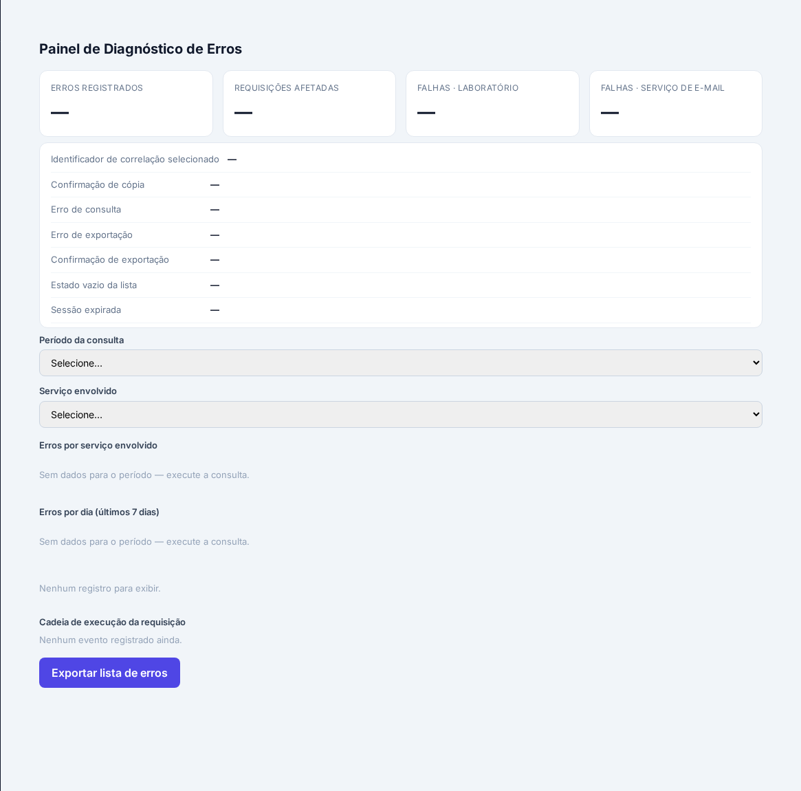
*UC-028 — a tela ao abrir*

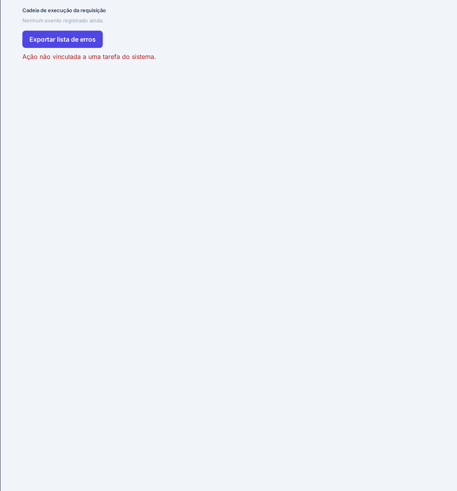
*UC-028 — o resultado da ação "Exportar lista de erros"*

### UC-029 — Criptografar Dados de Paciente em Repouso

| | |
|---|---|
| **Natureza** | convencional |
| **Requisitos** | FR-095, FR-068, FR-065 |
| **Tela** | Painel de Segurança de Dados |
| **Veredito** | **AÇÃO SEM EXECUTOR** |

**O que a especificação pede.** Armazenar dados de paciente e credenciais em repouso de forma criptografada, incluindo banco de dados e arquivos de configuração sensíveis.

**Elementos da tela.** 16 de 21 elementos previstos (na especificação e na etapa de Interface) aparecem na tela. Ausentes: Tentar novamente; Exportar relatório de conformidade; Baixar arquivo; Fazer login; Cancelar.

**O que se observou.** Ao clicar em "Verificar criptografia em repouso", a tela respondeu "Ação não vinculada a uma tarefa do sistema." Nada foi gravado nem consultado.

**Comparação com o caso de uso.** A tela existe e tem os campos e botões do caso de uso, mas a ação não chega ao servidor: falta o executor do lado convencional (o gerador só liga ações a tarefas de agente).

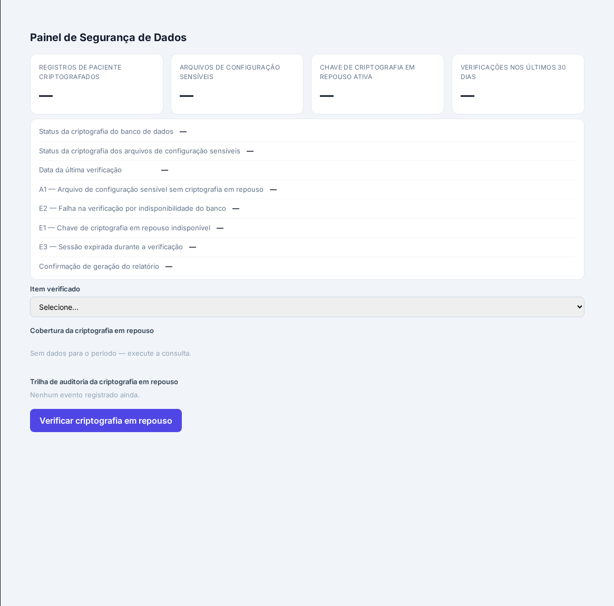
*UC-029 — a tela ao abrir*


*UC-029 — o resultado da ação "Verificar criptografia em repouso"*

### UC-030 — Aplicar Política de Retenção e Descarte de Dados

| | |
|---|---|
| **Natureza** | convencional |
| **Requisitos** | FR-097, FR-056, FR-075 |
| **Tela** | Gestão de Retenção e Descarte de Dados |
| **Veredito** | **AÇÃO SEM EXECUTOR** |

**O que a especificação pede.** Aplicar política de retenção de dados clínicos, de auditoria e de notificações, com prazos definidos e descarte seguro após o período legal, respeitando a LGPD.

**Elementos da tela.** 21 de 29 elementos previstos (na especificação e na etapa de Interface) aparecem na tela. Ausentes: Simular descarte; Executar descarte; Confirmar descarte; Cancelar; Tentar novamente; Entrar novamente; Gerar relatório de descarte; Baixar arquivo.

**O que se observou.** Ao clicar em "Salvar política", a tela respondeu "Ação não vinculada a uma tarefa do sistema." Nada foi gravado nem consultado.

**Comparação com o caso de uso.** A tela existe e tem os campos e botões do caso de uso, mas a ação não chega ao servidor: falta o executor do lado convencional (o gerador só liga ações a tarefas de agente).


*UC-030 — a tela ao abrir*


*UC-030 — o resultado da ação "Salvar política"*

### UC-031 — Gerenciar Segredos e Rotação de Credenciais

| | |
|---|---|
| **Natureza** | convencional |
| **Requisitos** | FR-099, FR-068 |
| **Tela** | Gestão de Segredos e Credenciais |
| **Veredito** | **NÃO EXECUTADO (AÇÃO SENSÍVEL)** |

**O que a especificação pede.** Armazenar as credenciais dos serviços externos (laboratório, motor de risco de Cox e serviço de e-mail) em cofre de segredos, com rotação periódica, garantindo que nunca sejam expostas em código, logs ou telas.

**Elementos da tela.** 25 de 31 elementos previstos (na especificação e na etapa de Interface) aparecem na tela. Ausentes: Salvar no cofre; Tentar novamente; Testar conexão; Adicionar serviço externo; Cancelar; Serviços externos cadastrados.

**O que se observou.** A tela abre com os serviços e as credenciais; a ação principal, "Confirmar rotação", não foi executada no teste para não trocar credenciais reais.

**Comparação com o caso de uso.** Só a tela foi conferida.


*UC-031 — a tela ao abrir*

## 4. As telas de cadastro

Em todas as 28 telas, a listagem bate com o banco. Onde a tela mostra 1 linha e o banco 0, é a linha "nenhum registro". A exceção é "Usuarios", que lista 0 com 1 usuário no banco. O ciclo criar → editar → excluir funcionou em **Antimicrobianos** e **Bundles**. Em **Pacientes**, o cadastro só grava com o identificador do médico digitado à mão, porque o campo é texto livre e não uma lista de usuários: com o campo vazio, o banco recusa e a tela não avisa. Em **Sítios de inserção** e **Faixas de risco**, a coluna "nome" só aceita uma lista fechada de valores (jugular_interna, subclávia, femoral; baixo, moderado, alto), mas o formulário oferece texto livre, então qualquer nome digitado é recusado, de novo sem aviso.

| Cadastro | Linhas na tela | Linhas no banco | Criar | Editar | Excluir |
|---|---|---|---|---|---|
| Alertas | 1 | 1 | — | — | — |
| Antibiogramas | 10 | 10 | — | — | — |
| Antimicrobianos | 6 | 6 | sim | sim | sim |
| Bundles | 4 | 4 | sim | sim | sim |
| Casos Clinicos | 2 | 2 | — | — | — |
| Ciclos Integrados | 1 | 0 | — | — | — |
| Classificacoes | 2 | 2 | — | — | — |
| Credenciais Servicos Externos | 1 | 0 | — | — | — |
| Criterios Nhsn | 2 | 2 | — | — | — |
| Dados Risco | 1 | 1 | — | — | — |
| Decisoes Sistema | 18 | 18 | — | — | — |
| Escores Cox | 1 | 0 | — | — | — |
| Estimativas Reducao Risco | 1 | 0 | — | — | — |
| Faixas Risco | 1 | 0 | **não** | — | — |
| Logs Auditoria | 10 | 10 | — | — | — |
| Notificacoes | 3 | 3 | — | — | — |
| Pacientes | 3 | 3 | **não** | — | — |
| Pacotes Bundle Aplicado | 1 | 0 | — | — | — |
| Paineis Vigilancia | 1 | 1 | — | — | — |
| Recomendacoes | 1 | 1 | — | — | — |
| Registros Auditoria | 1 | 0 | — | — | — |
| Relatorios Vigilancia | 1 | 1 | — | — | — |
| Resultados Hemocultura | 2 | 2 | — | — | — |
| Resultados Laboratorio Brutos | 1 | 0 | — | — | — |
| Sitios Insercao | 3 | 3 | **não** | — | — |
| Tokens Acesso | 1 | 0 | — | — | — |
| Trilhas Auditoria | 1 | 0 | — | — | — |
| Usuarios | 0 | 1 | — | — | — |

#### Antimicrobianos — ciclo completo


*Antimicrobianos — formulário preenchido*


*Antimicrobianos — depois de salvar*


*Antimicrobianos — depois de editar*


*Antimicrobianos — depois de excluir*

#### Bundles — ciclo completo


*Bundles — formulário preenchido*


*Bundles — depois de salvar*


*Bundles — depois de editar*


*Bundles — depois de excluir*

#### Faixas Risco — ciclo completo


*Faixas Risco — formulário preenchido*


*Faixas Risco — depois de salvar*

#### Pacientes — ciclo completo


*Pacientes — formulário preenchido*


*Pacientes — depois de salvar*

#### Sitios Insercao — ciclo completo


*Sitios Insercao — formulário preenchido*


*Sitios Insercao — depois de salvar*

## 5. Consulta aos agentes, em cadeia

O mesmo caso clínico passou pelas cinco telas de agente, na ordem do fluxo clínico. Em cada uma: a tela com o caso escolhido e o botão em destaque, e a resposta do agente.

### UC-008 — Tradução do resultado do laboratório (13 s)

**Aproveitável: sim.** Staphylococcus aureus, hemocultura, 6 antimicrobianos com classe e resultado (oxacilina, ceftriaxona, ciprofloxacino e gentamicina resistentes; meropenem intermediário; vancomicina sensível).


*UC-008 — a entrada*


*UC-008 — a resposta do agente*

### UC-009 — Classificação pelo critério NHSN (13 s)

**Pendente.** "Não foi possível classificar… porque os insumos obrigatórios para a decisão não estão disponíveis: data_inicio_caso não foi informada… criterios_candidatos não foi fornecido."


*UC-009 — a entrada*


*UC-009 — a resposta do agente*

### UC-011 — Multirresistência no antibiograma (9 s)

**Multirresistente: sim — 4 classes** (cefalosporina, betalactâmico, fluoroquinolona, aminoglicosídeo). O carbapenêmico, intermediário, não conta.


*UC-011 — a entrada*


*UC-011 — a resposta do agente*

### UC-015 — Recomendação de bundle (9 s)

**Insuficiente.** Reconhece o germe multirresistente e o bundle compatível, mas "recomendação disponível apenas para caso confirmado".


*UC-015 — a entrada*


*UC-015 — a resposta do agente*

### UC-013 — Texto do alerta para a equipe (13 s)

**Alerta redigido:** "ATENÇÃO — BACTÉRIA MULTIRRESISTENTE IDENTIFICADA NO EXAME DE SANGUE…", com o que houve, por que importa para o paciente com cateter e as precauções de contato.


*UC-013 — a entrada*


*UC-013 — a resposta do agente*

## 6. Requisitos

O documento de requisitos tem **99 requisitos funcionais**, e **todos os 99** são citados por algum caso de uso da Especificação v2: a cadeia requisito → caso de uso está completa. Na matriz de rastreabilidade do código gerado, **22** chegam a uma tarefa de agente e a uma tela. Os outros **77** são de natureza convencional (login, cadastro, auditoria, painel, relatório, backup, segurança) e aparecem como "sem cobertura de tarefa" porque essa matriz só liga requisitos a tarefas de agente. Na prática, são exatamente esses os que ficaram com "ação sem executor" nas telas.

| | Requisitos |
|---|---|
| Funcionais no documento de requisitos | 99 |
| Citados por algum caso de uso | 99 |
| Ligados a tarefa de agente e tela no código | 22 |
| Convencionais, sem executor no código | 77 |

## 7. Defeitos encontrados, por gravidade

Todos são defeitos do **gerador** (a fábrica), não deste projeto: corrigidos no LangNet, valem para toda aplicação gerada.

| # | Gravidade | Defeito | Onde aparece |
|---|---|---|---|
| 1 | Alta | **Não há autenticação**: o aplicativo abre sem login, e o botão "Entrar" não está ligado a nada | UC-001 |
| 2 | Alta | **O lado convencional não tem executor**: a ação principal de 20 telas responde "Ação não vinculada a uma tarefa do sistema" | UC-001 a 003, 006, 007, 010, 012, 018 a 030 |
| 3 | Alta | **Falha calada no cadastro**: o servidor devolve sucesso com o erro do banco dentro, e a tela volta à lista sem avisar | Pacientes, Sítios de inserção, Faixas de risco |
| 4 | Alta | **O resumo da senha chega ao navegador** na listagem de usuários (contraria FR-066) | Usuarios |
| 5 | Alta | **A classificação NHSN não recebe critérios nem data de início do caso**: fica "pendente" e trava recomendação e escolha de bundle | UC-009 → UC-015, UC-017 |
| 6 | Média | **Três telas convencionais geradas como tela de agente**, com o único botão sempre desabilitado | UC-004, UC-005, UC-014 |
| 7 | Média | **Campo de vínculo como texto livre** (o médico responsável pede o identificador interno) e **lista fechada como texto livre** (sítio de inserção, faixa de risco) | Pacientes, Sítios de inserção, Faixas de risco |
| 8 | Média | **O vocabulário do hospital não existe**: a busca vetorial que a tradução usa não tem tabela configurada, e a tradução às vezes recusa por isso | UC-008 |
| 9 | Média | **Resultado do agente instável entre execuções**: a mesma tradução, com o mesmo caso, aceitou numa rodada e recusou em outra | UC-008 |
| 10 | Média | **Tela de multirresistência sem seletor de caso**: só funciona vindo das telas anteriores | UC-011 |
| 11 | Baixa | **Mensagens de exceção desenhadas como linhas de dados** ("Este e-mail já está cadastrado. —") | Usuários e outras telas de painel |
| 12 | Baixa | **Nome do botão diferente da especificação** ("Identificar" × "Avaliar multirresistência") | UC-011 |
| 13 | Baixa | **A lista de usuários mostra 0** com 1 usuário no banco | Usuarios |

## 8. Conclusão

O BioByte v5 entrega o que tem de mais difícil: **as decisões clínicas por agente funcionam**, com a regra certa, justificativa, recusa honesta quando falta dado e registro de cada decisão no banco. O que falta é o que é mais simples e o que o usuário vê primeiro: login, as ações das telas convencionais e as mensagens de erro. A ordem de correção no gerador que este teste indica é:

1. o executor do lado convencional (defeito 2), que destrava 20 telas de uma vez;
2. a autenticação (1) e a senha fora do navegador (4);
3. a falha calada (3);
4. a entrada da classificação NHSN (5), que destrava a cadeia clínica inteira até a recomendação;
5. os campos de vínculo e de lista fechada como seletor (7).
