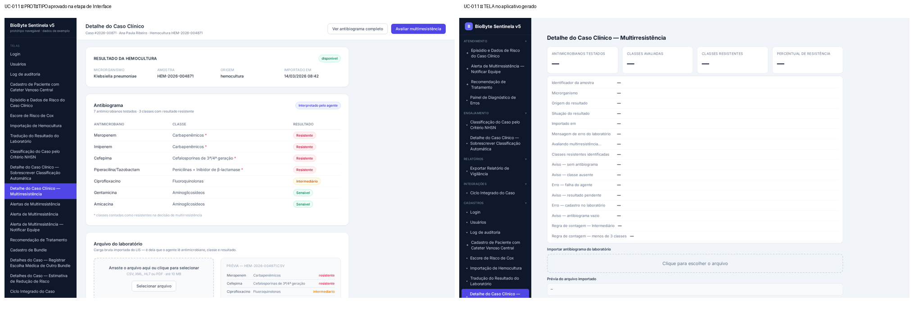
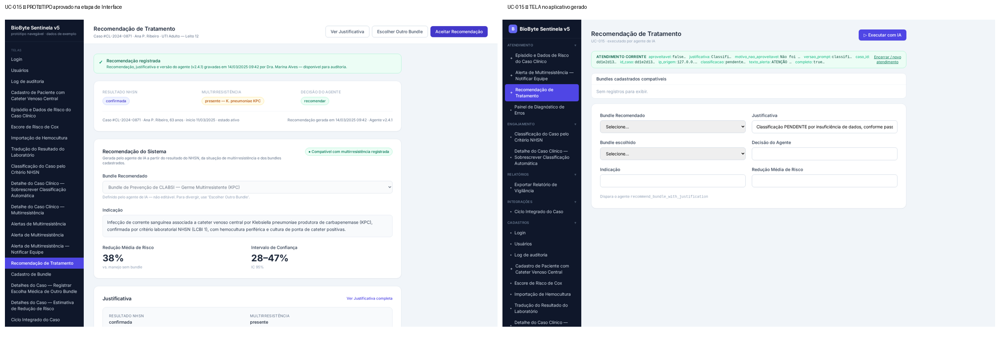

# Revisão honesta da geração e plano de execução — v1.1

**Data:** 03/10/2026 · **Projeto medido:** BioByte Sentinela v5 · **Base:** padrão de interação com agentes v1.0 (aprovado)

> **O que mudou da v1:** o plano passa a cobrir os oito pontos levantados pelo autor (seção 3.1): o ciclo
> pedir → refazer → ver do protótipo; dados de exemplo trocados por dados reais; protótipo da parte agêntica e do
> assistente; a sequência protótipo → Bancada → aplicativo; casos de teste até o código final; e um chat de código
> que funcione (fase nova F7). Também registra (2.8) o estado do chat de código e (2.9) os dados de exemplo.

Tudo o que está abaixo foi medido no banco do LangNet, nos arquivos gerados e na tela — não é lembrança.

## 1. O que está bem

| Parte | Evidência |
|---|---|
| **Telas do protótipo a partir dos casos de uso** | 25 das 30 telas têm mockup rico, com os campos, tabelas, indicadores e botões do caso de uso e dados de exemplo plausíveis (ex.: antibiograma com rótulos de resultado por cor) |
| **Edição pelo caso de uso** | em 29/09, a edição do esquema da tela do UC-011 gerou a Especificação v2 e refez a tela (versão 2 da Interface) |
| **Separação convencional × agêntico** | 31 casos de uso marcados; 5 tarefas de agente em 2 agentes (eram 45) |
| **Rede de Petri e Bancada** | a rede com as 5 tarefas roda inteira na Bancada do LangNet (29/09), com o token andando e cada tarefa com a sua saída |
| **Decisões dos agentes** | no aplicativo, multirresistência decidida pela regra certa, alerta redigido, cada decisão gravada no banco |

## 2. O que está errado, e por quê

### 2.1 A tela aprovada no protótipo não chega ao aplicativo — o defeito maior
A Geração de Código **não lê os mockups** (zero usos de `mockup_html` no gerador). As telas do aplicativo saem
de outros moldes, a partir da lista de componentes: uma lista de campos com "—". Quatro semanas de refino do
protótipo param na etapa de Interface.

*UC-011 — à esquerda, o protótipo aprovado; à direita, a tela do aplicativo gerado.*

*UC-015 — o mesmo descompasso na recomendação de tratamento.*

### 2.2 As ações das telas apontam para tarefas que não existem
A etapa de Interface declarou **103 ações** do tipo "tarefa", cada uma com um nome inventado por ela
(`autenticar_usuario`, `gerenciar_alerta`, `identificar_multirresistencia_antibiograma`…). **Nenhuma das 103**
existe no `tasks.yaml` nem nos 140 adaptadores do aplicativo. As cinco telas de agente só funcionam porque a
Geração de Código as religa à tarefa pelo caso de uso; as demais ficam "Ação não vinculada".

### 2.3 O protótipo esconde esse defeito
O protótipo é feito das páginas estáticas dos mockups: os botões não fazem nada. O provedor de dados fictício,
quando usado, responde "sucesso" a **qualquer** nome de tarefa. Ninguém consegue ver, no protótipo, que uma ação
não tem quem a execute — o defeito só aparece no aplicativo.

### 2.4 Cinco telas saíram genéricas no protótipo
UC-002 (Usuários), UC-006 (Escore de Cox), UC-012 (Alertas), UC-020 (Painel de Vigilância) e UC-031
(Segredos e Credenciais): lista com "Exemplo A/B/C", sem estilo, sem menu. A de Usuários já mostra a coluna
**"SENHA HASH"** — o vazamento da senha nasce aqui.

### 2.5 Mensagens de exceção viraram campos
Os mockups e as telas tratam as mensagens dos fluxos de exceção ("Este e-mail já está cadastrado.",
"Aviso — sem antibiograma") como **campos de exibição** com "—", em vez de mensagens que aparecem quando o
caso acontece.

### 2.6 O refino por conversa não foi exercitado neste projeto
No BioByte v5, a Interface tem 0 mensagens de conversa: a única alteração foi pela edição no caso de uso.
O caminho existe (`/chat`), mas não foi provado nesta versão.

### 2.7 Agentes, tarefas e rede
- As 5 tarefas estão todas no `clinical_classifier_agent`, inclusive a **recomendação de bundle**; o
  `treatment_recommender_agent` existe e não é usado.
- O **UC-025** (sinalizar hemocultura pronta e suspeita de ICSAC) é agêntico e **não virou tarefa**.
- O `tasks.yaml` carrega `traceability` e `output_schema`, fora do formato do CrewAI usado no TropicalSales.
- A rede é uma **linha reta** de 5 tarefas. A figura com dois ramos paralelos que pus na apresentação é
  ilustrativa — não é a rede do BioByte.
- O aplicativo gerado **não usa o framework**: o servidor de agentes é uma reimplementação de 1.047 linhas
  feita por molde, e o aplicativo leva um console de rede reduzido ("Admin / Petri") que não deveria estar lá.
- A classificação NHSN não recebe os critérios nem a data de início do caso → fica "pendente" e trava a cadeia.

### 2.8 O chat de código existe, mas não serve
A Geração de Código tem um refino por conversa, mas ele manda a árvore inteira de arquivos (138 no BioByte) num
pedido só — acima do que qualquer modelo devolve inteiro. Foi usado pela última vez em junho (6 mensagens). E a
mudança feita ali não volta para a etapa de origem: na regeneração seguinte, some.

### 2.9 Os dados de exemplo do protótipo não têm caminho para os dados reais
Os mockups trazem valores de exemplo fixos ("Klebsiella pneumoniae", "Caso #2026-00871"). Como a Geração de
Código ignora o mockup, nunca houve a troca desses valores pelos dados do banco. Quando o mockup passar a ser a
base do código, cada valor de exemplo precisa estar ligado ao campo que representa — e nenhum pode chegar ao
aplicativo (já aconteceu: o BioByte gravou o "-35" copiado do exemplo da especificação).

### 2.10 A causa comum
Cada etapa produz bem o seu artefato, mas **a etapa seguinte não consome o que a anterior entregou**: a
Geração de Código ignora o mockup; as ações da Interface não se ligam às tarefas de Agentes e Tarefas; o
aplicativo ignora o framework que a Bancada testa. E eu media cada etapa isolada ("25 telas ricas", "5 tarefas",
"rede roda na Bancada") sem medir o elo entre elas.

## 3. Plano de execução

Cada fase termina numa **prova medida** e só passa com o seu aval. Uma correção por vez; nada de regerar para
descobrir; decisão de arquitetura se pergunta antes.

| Fase | O que muda | Prova de aceite |
|---|---|---|
| **F0 — Framework** | o servidor de agentes do aplicativo passa a ser o framework (`frameworkagentsadapterv5`, orquestração por Petri), carregando o `agents.yaml` e o `tasks.yaml` intactos | a rede do BioByte roda no framework v5 com as 5 tarefas, e a Bancada do LangNet mostra a execução; se a v5 falhar, a mesma prova com a v4 |
| **F1 — Especificação** | coluna **"Executado por"** (`pronto` · `código gerado` · `agente`) em cada passo dos fluxos; mensagens de exceção marcadas como mensagens | os 31 casos de uso do BioByte com a coluna preenchida; nenhuma mensagem de exceção virando campo |
| **F2 — Interface & Protótipo** | (a) as telas nascem dos fluxos principal, **alternativos** e de exceção do caso de uso; (b) cada ação aponta para **o caso de uso e o passo**, não para um nome inventado; (c) blocos de agente com forma (decisão · campo · tela) e posição; (d) as 5 telas genéricas viram mockup rico; (e) nada de campo sensível em tela; (f) **cada valor de exemplo do mockup ligado ao campo do banco que representa** (marcação no próprio mockup); (g) **protótipo da parte agêntica**: os blocos de agente com respostas de exemplo nos cinco estados (aguardando, executando, concluído, recusado, erro) e o **protótipo do assistente** (a conversa de um fluxo); (h) **protótipo executável que denuncia**: cada botão mostra quem o executa (`pronto`, `código gerado`, `agente`) e, se ninguém, "sem executor"; (i) o ciclo **pedir ao agente → refazer a tela → ver no protótipo em tempo real** | 30 telas ricas; 0 ações com nome inventado; 100% dos valores de exemplo ligados a campo; no protótipo, cada ação diz quem a executa e as telas de agente mostram os cinco estados; o ciclo pedir → refazer → ver provado em três telas, pela interface do LangNet |
| **F3 — Agentes, Tarefas e YAML** | só passos `agente` viram tarefa; tarefa no agente certo; UC-025 ganha a sua tarefa; YAML no formato do CrewAI (rastreabilidade e esquema em arquivo à parte); a tarefa recebe tudo o que usa (critérios NHSN, data de início) | 6 tarefas para os 6 casos de uso agênticos; recomendação no agente de tratamento; classificação deixa de ficar "pendente" por falta de entrada |
| **F4 — Geração de Código** | (a) **as telas do aplicativo são as do protótipo aprovado** (mesmo desenho), com **cada valor de exemplo trocado pelo dado real** do campo a que está ligado; (b) passos `pronto` → moldes em rotas da API (login com token, cadastro, relatório, auditoria); (c) passos `código gerado` → o LLM escreve a resposta do sistema por caso de uso, como rota da API; (d) passos `agente` → a tarefa no framework, pelo nome; (e) Assistente único (Modo B) e marca ✦ no menu; (f) sai o console "Admin / Petri"; (g) erro nunca vira sucesso; senha nunca sai do servidor | comparação automática tela do aplicativo × protótipo aprovado, sem divergência; nenhuma ação sem executor |
| **F5 — Portões** | programa (não modelo) confere: toda ação tem executor; toda mensagem de exceção está no código; entradas/saídas da tela batem com o `tasks.yaml`; tela do aplicativo = protótipo; resposta com erro tratada como erro; **nenhum valor de exemplo do protótipo aparece no código ou no banco do aplicativo** | os portões reprovam um caso montado com cada defeito deste relatório, e aprovam o BioByte corrigido |
| **F6 — Prova de ponta a ponta** | regerar o BioByte **pela interface do LangNet**, etapa por etapa, na sequência obrigatória: **protótipo aprovado → orquestração testada na Bancada (aba Operação) → o mesmo código usado no aplicativo**, no botão de IA da tela ou na função do menu; a etapa de **Casos de Teste** (grafo de causa e efeito) passa a cobrir os três tipos de execução e os fluxos alternativos e de exceção, e é **executada no aplicativo a cada geração**, como portão final; implantar; rodar a bateria de 03/10 (31 casos de uso + 28 cadastros + cadeia de agentes); repetir num **segundo projeto** (Uso do Solo) para provar que é da fábrica | as 20 telas hoje sem ação respondem como o caso de uso; login funciona; cadeia clínica chega à recomendação; o segundo projeto passa na mesma bateria |

| **F7 — Conversa para modificar o código** | o chat da Geração de Código passa a trabalhar **uma tela ou um arquivo por vez**, mostra a diferença antes de aplicar, e diz **a que etapa a mudança pertence**: mudança de comportamento volta para o caso de uso / Interface / Agentes e Tarefas e o código é regerado; ajuste que é só de código fica **registrado como ajuste** e é reaplicado em toda regeneração, para não se perder | três pedidos pelo chat (um de tela, um de regra convencional, um de agente): cada um vai para a etapa certa, a diferença aparece antes de aplicar, e a regeneração seguinte mantém as três mudanças |

**Ordem e dependências:** F0 e F1 podem andar juntas; F2 depende de F1; F3 depende de F1; F4 depende de F0, F2 e
F3; F5 acompanha F4; F6 fecha a geração; F7 depende de F4 e F5.

### 3.1 Os oito pontos do autor e onde cada um está

| # | Ponto | Fase |
|---|---|---|
| 1 | protótipo vindo dos fluxos principal, alternativos e de exceção | F1, F2(a) |
| 2 | instrução ao agente → refaz a tela → protótipo visto em tempo real | F2(i) |
| 3 | o protótipo é a base do código | F4(a) |
| 4 | dados de exemplo do protótipo trocados pelos reais no programa | F2(f), F4(a), F5 |
| 5 | protótipo da parte agêntica | F2(g) |
| 6 | protótipo das telas e, depois, a orquestração na Bancada (aba Operação); o mesmo código no aplicativo, em botão de IA ou função do menu | F0, F6 |
| 7 | até o fim: casos de teste, grafo de causa e efeito, código final | F6 |
| 8 | interface de conversa para modificar o código | F7 |

**O que eu me comprometo a fazer diferente:** medir o **elo** entre as etapas, não só cada etapa; parar e
perguntar quando a decisão for de arquitetura; não relatar uma fase como pronta sem a prova de aceite rodada.
