# Especificação de Casos de Uso — LangNet Interface

**Aplicação:** LangNet Interface (React/TypeScript + FastAPI)
**Versão do documento:** 1.0 — 21/07/2026
**Base:** funcionalidades efetivamente implementadas no código (rotas, páginas e routers verificados)

---

## 1. Introdução

### 1.1 Objetivo
Especificar, em casos de uso, o comportamento **real** da aplicação LangNet Interface — a plataforma
que transforma um documento de descrição num **sistema multi-agente em Python**, através de um pipeline
de etapas encadeadas. O documento cobre:

- **Parte A — Casos de uso implementados:** funções com backend real, com fluxo principal (ação do ator /
  resposta real do sistema), fluxos alternativos e de exceção, regras de negócio e a tela correspondente.
- **Parte B — Casos de uso propostos:** funções hoje ausentes ou apenas visuais (mock), especialmente as
  telas de **configuração**, com proposta de tela.

### 1.2 Atores
| Ator | Descrição |
|------|-----------|
| **Engenheiro de Sistemas Agênticos** (usuário) | Opera o pipeline: envia documentos, gera e refina cada artefato, aprova e exporta o código. |
| **Agente de IA** (LLM) | Ator de apoio: gera e refina artefatos sob demanda do usuário (via backend). Nesta instância, modelo local no LM Studio. |
| **Administrador** | (proposto) Configura o sistema: banco de dados, provedor LLM, integrações, servidores MCP. |

### 1.3 Convenções
- **[IMPLEMENTADO]** — função com backend real e persistência.
- **[MOCK]** — tela existente, porém apenas visual (estado local, sem persistência).
- **[PROPOSTO]** — função ausente; especificada com tela proposta.
- Telas ilustradas com captura real da instância de teste **Quântica Comercial**.

### 1.4 Mapa de funcionalidades (real × mock)
| Área | Função | Status |
|------|--------|--------|
| Acesso | Login / Registro | ✅ IMPLEMENTADO |
| Projetos | Dashboard, lista e criação de projetos | ✅ IMPLEMENTADO |
| Projetos | Detalhe do projeto | ⚠️ MOCK (stub) |
| Pipeline | Documentos → Requisitos | ✅ IMPLEMENTADO |
| Pipeline | Especificação Funcional | ✅ IMPLEMENTADO |
| Pipeline | Modelo de Dados | ✅ IMPLEMENTADO |
| Pipeline | Interface & Protótipo | ✅ IMPLEMENTADO |
| Pipeline | Casos de Teste & Validação (CEG) | ✅ IMPLEMENTADO |
| Pipeline | Agentes & Tarefas (Agent-Task Spec) | ✅ IMPLEMENTADO |
| Pipeline | Sequência de Tarefas | ✅ IMPLEMENTADO |
| Pipeline | Rede de Petri | ✅ IMPLEMENTADO |
| Pipeline | Geração de Código | ✅ IMPLEMENTADO |
| Config | Configurações do Sistema (banco, LLM, integrações) | ⚠️ MOCK → PROPOSTO |
| Config | MCP: Configuração Global | ⚠️ MOCK → PROPOSTO |
| Config | MCP: Descoberta de Serviços | ⚠️ MOCK → PROPOSTO |
| Config | MCP: Sincronização de Estados | ⚠️ MOCK → PROPOSTO |
| Operação | Deploy | ⚠️ MOCK → PROPOSTO |
| Operação | Monitoramento (Langfuse) | 🟡 PARCIAL (integração externa) |
| Interação | Chat, Designer, Artefatos, Estado, Formulários | ⚠️ MOCK → PROPOSTO |

---

## 2. Padrões transversais do pipeline (aplicam-se a UC-04…UC-11)

Todas as etapas do pipeline compartilham o mesmo modelo de interação (a "casca" padrão). Para evitar
repetição, os comportamentos comuns são descritos aqui e **referenciados** em cada caso de uso.

- **PT-1 Seleção de origem + versão.** Cada etapa consome o artefato da etapa anterior. O usuário
  escolhe a **sessão de origem** e a **versão** por um seletor/menu de origem.
- **PT-2 Geração.** O botão *Gerar* dispara a geração pelo agente de IA. Etapas pesadas rodam em
  segundo plano (status `generating` → `completed`/`failed`).
- **PT-3 Refino por chat.** Um painel de chat permite pedir ajustes ao agente; cada refino que altera o
  artefato cria uma **nova versão** (`ai_refinement`).
- **PT-4 Edição manual.** O usuário pode editar o artefato; ao salvar, gera nova versão (`manual_edit`).
- **PT-5 Revisão.** O botão *Revisar* pede ao agente sugestões de melhoria (não altera até aplicar).
- **PT-6 Aprovar.** Marca a versão corrente como aprovada.
- **PT-7 Histórico.** O botão *Histórico* lista as versões; clicar numa versão a carrega/visualiza.
- **PT-8 Rastreabilidade.** Cada geração grava **de qual sessão e versão** de cada fonte o artefato veio
  (ver documento de rastreabilidade). O banner *"Origem: … v{n}"* exibe isso na tela.

**Regras de negócio transversais:**
- **RN-G1** Uma etapa só gera se sua(s) origem(ns) obrigatória(s) estiver(em) selecionada(s).
- **RN-G2** Toda geração/refino/edição é versionada; nenhuma sobrescreve o histórico.
- **RN-G3** Sessão expirada (401) redireciona ao login; a tela distingue "sessão expirada" de "vazio".
- **RN-G4** O limite de contexto do LLM local (~64K tokens) restringe o tamanho combinado das fontes.

---

# PARTE A — CASOS DE USO IMPLEMENTADOS

## UC-01 — Autenticar no sistema  [IMPLEMENTADO]

**Ator:** Usuário · **Objetivo:** obter acesso autenticado à aplicação.
**Pré-condições:** usuário possui conta (ou vai se registrar).

**Fluxo principal**
1. O usuário acessa a aplicação. → O sistema exibe a **tela de Login** (e-mail e senha).
2. O usuário informa e-mail e senha e confirma. → O sistema valida via `POST /api/auth/login`, emite um
   token JWT, armazena-o e redireciona ao **Dashboard**.

**Fluxo alternativo**
- 1a. **Novo usuário:** o usuário clica em *Registrar* → tela de Registro → informa dados →
  `POST /api/auth/register` cria a conta e autentica.

**Fluxo de exceção**
- 2e. **Credenciais inválidas:** o backend responde 401 → o sistema exibe mensagem de erro e mantém a tela.
- 2e2. **Token expirado durante o uso:** qualquer chamada 401 redireciona ao login (RN-G3).

**Regras de negócio**
- **RN-01.1** Rotas protegidas exigem token válido (componente `ProtectedRoute`).
- **RN-01.2** O token é enviado no header `Authorization: Bearer` em todas as chamadas.

**Tela:** `telas/g_login.png`

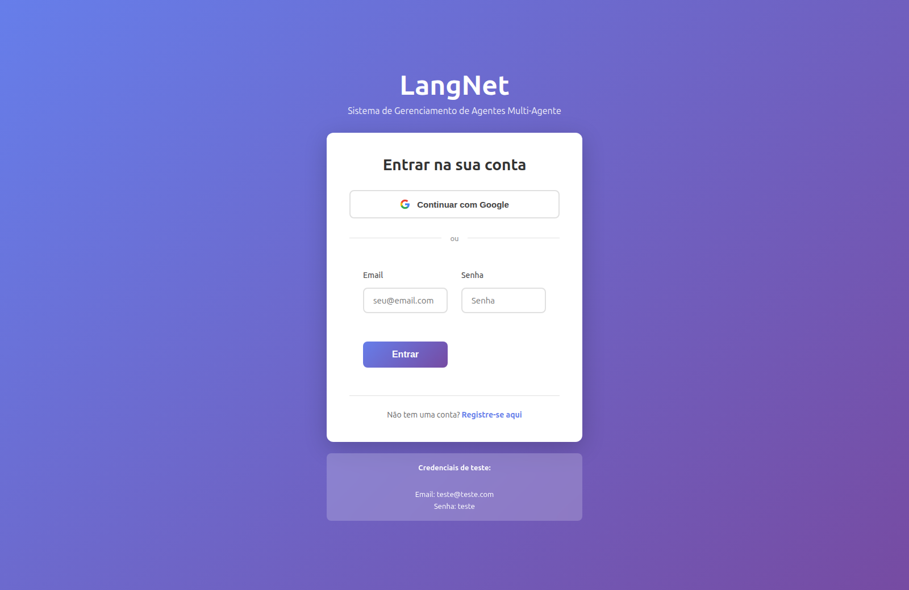

---

## UC-02 — Gerenciar projetos  [IMPLEMENTADO]

**Ator:** Usuário · **Objetivo:** criar, localizar e abrir projetos.
**Pré-condições:** autenticado.

**Fluxo principal**
1. O usuário acessa **Dashboard**. → O sistema carrega, via `projectService`, os projetos do usuário,
   métricas e atividades recentes.
2. O usuário abre **Projetos**. → O sistema lista os projetos em cards, com status, domínio e barra de
   progresso, além de busca e filtros.
3. O usuário clica em *Novo Projeto* e preenche os dados. → O sistema cria o projeto e passa a exibi-lo.
4. O usuário clica num projeto. → O sistema **entra no contexto do projeto** (rotas passam a ter prefixo
   `/project/:projectId/…`) e o menu lateral exibe as etapas do pipeline.

**Fluxo alternativo**
- 2a. **Busca/filtro:** o usuário filtra por status/domínio → a lista é refinada localmente.

**Fluxo de exceção**
- 1e. **Falha ao carregar projetos:** erro de rede/servidor → o sistema exibe estado de erro/lista vazia.

**Regras de negócio**
- **RN-02.1** Cada projeto pertence a um usuário (FK `user_id`); a listagem é escopada ao usuário autenticado.
- **RN-02.2** Entrar num projeto ativa o "contexto de projeto" que gera o menu do pipeline (NavigationContext).

**Telas:** `telas/g00-dashboard.png`, `telas/g01-projetos.png`

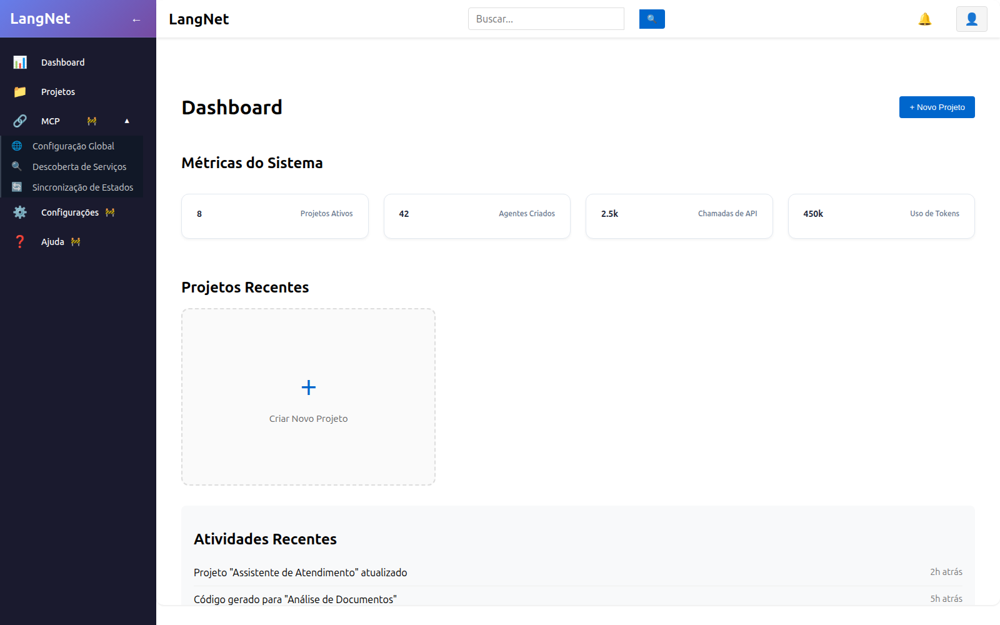
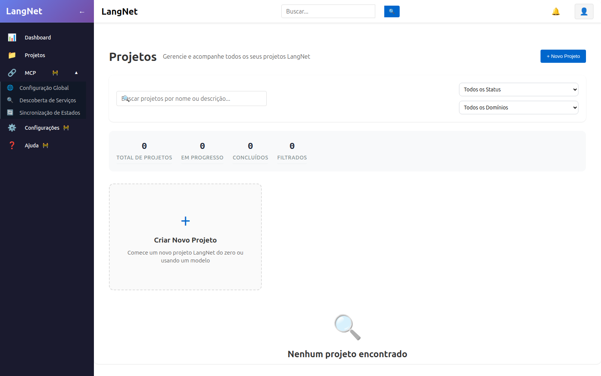

---

## UC-03 — Enviar e analisar documentos → gerar Requisitos  [IMPLEMENTADO]

**Ator:** Usuário · **Objetivo:** a partir de documentos, extrair e refinar os requisitos do sistema.
**Pré-condições:** projeto selecionado.

**Fluxo principal**
1. O usuário abre **Documentos** do projeto. → O sistema exibe três painéis: lista de documentos,
   chat com o agente e painel de requisitos.
2. O usuário clica em *+ Upload* e seleciona um arquivo. → O sistema envia via `documentService.uploadDocument`
   e o exibe na lista.
3. O usuário aciona *Analisar*. → O sistema executa a análise em lote (`analysisService.analyzeDocumentsBatch`),
   extrai entidades e requisitos e gera o **documento de requisitos**.
4. O usuário conversa no chat para refinar. → O sistema aplica `chatService.refineRequirements`, criando
   nova versão do documento de requisitos.
5. O usuário exporta. → O sistema gera o PDF (`pdfExportService.exportMarkdownToPDF`).

**Fluxos alternativos**
- 2a. **Múltiplos documentos:** o usuário sobe vários arquivos; a análise considera o conjunto.
- 4a. **Sem refino:** o usuário aceita a primeira versão dos requisitos e segue para a Especificação.

**Fluxos de exceção**
- 3e. **Documento ilegível/vazio:** a análise retorna erro → o sistema informa e mantém o documento na lista.
- 3e2. **Timeout do LLM:** a geração falha → o sistema exibe o erro (RN-G4).

**Regras de negócio**
- **RN-03.1** O documento de requisitos é versionado (histórico de versões da sessão).
- **RN-03.2** As referências (documentos analisados e fontes web) são registradas no documento.

**Tela:** `telas/00-documentos.png`

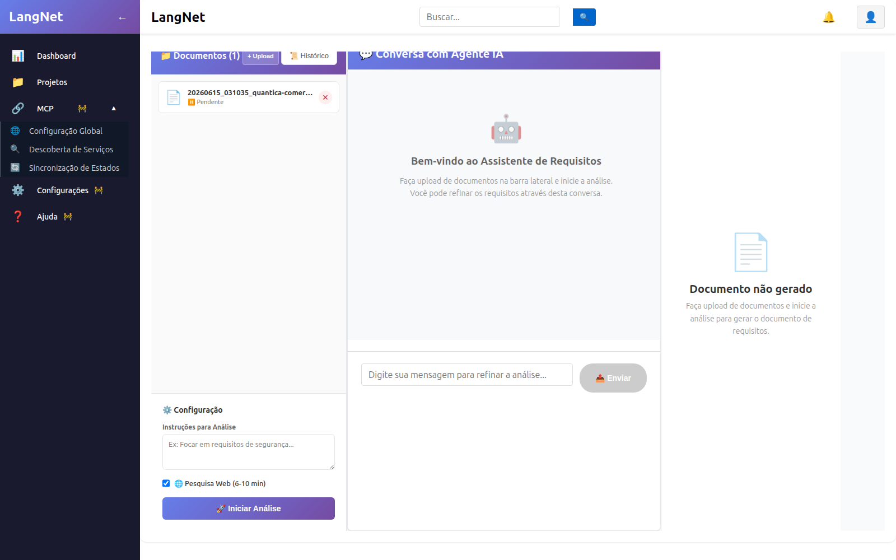

---

## UC-04 — Gerar Especificação Funcional  [IMPLEMENTADO]

**Ator:** Usuário · **Objetivo:** produzir a especificação funcional (casos de uso, regras, wireframes).
**Pré-condições:** existe documento de requisitos.

**Fluxo principal**
1. O usuário abre **Especificação**. → O sistema exibe a casca padrão (origem, chat, viewer).
2. O usuário seleciona a versão dos **Requisitos** como origem e escolhe o formato de wireframe
   (ASCII ou PlantUML) [PT-1]. → O sistema registra a origem.
3. O usuário clica em *Gerar Especificação* [PT-2]. → O sistema executa o pipeline de especificação
   (classificação → extração → composição → verificação → conformidade → formatação) e exibe o documento.
4. O usuário refina por chat [PT-3], revisa [PT-5], edita [PT-4], e **aprova** [PT-6].

**Fluxos alternativos**
- 3a. **Revisão antes de aprovar:** o usuário aciona *Revisar* e aplica as sugestões (novo refino).
- 7a. **Comparar versões:** pelo *Histórico* [PT-7] o usuário abre uma versão anterior.

**Fluxos de exceção**
- 2e. **Sem requisitos selecionados:** o botão *Gerar* fica desabilitado com aviso (RN-G1).
- 3e. **Falha na geração:** o sistema exibe o erro e mantém a última versão válida.

**Regras de negócio**
- **RN-04.1** A Especificação é a fonte central: Modelo de Dados, Casos de Teste, Interface e Agent-Task
  Spec derivam dela (RN de rastreabilidade PT-8).

**Tela:** `telas/01-especificacao.png`

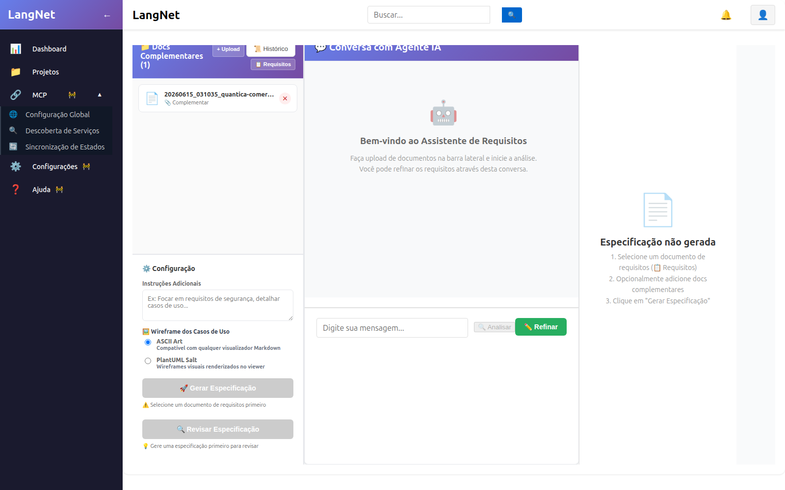

---

## UC-05 — Gerar Modelo de Dados  [IMPLEMENTADO]

**Ator:** Usuário · **Objetivo:** derivar o schema de banco (entidades, SQL, models.py, migrations).
**Pré-condições:** existe Especificação Funcional.

**Fluxo principal**
1. O usuário abre **Modelo de Dados**. → O sistema exibe a casca com o banner *"Origem: Especificação …"*.
2. O usuário escolhe o **DBMS** (ex.: MySQL) e a versão da Especificação [PT-1]. → registrado.
3. O usuário clica em *Gerar* [PT-2]. → O sistema gera as entidades e mostra as abas
   **Entidades / Schema SQL / models.py / Alembic / YAML**, além de um **score de validação** com problemas apontados.
4. O usuário refina/edita/aprova [PT-3…PT-6].

**Fluxos alternativos**
- 3a. **Trocar DBMS:** o usuário regenera com outro banco-alvo.
- 3b. **Corrigir avisos:** o usuário refina pedindo ajuste dos problemas de validação.

**Fluxos de exceção**
- 3e. **Especificação insuficiente:** o modelo sai incompleto → o score de validação sinaliza os problemas.

**Regras de negócio**
- **RN-05.1** Grava `specification_version` (proveniência) da spec de origem.
- **RN-05.2** O score de validação alerta padrões problemáticos (ex.: coluna JSON para busca/filtro).

**Tela:** `telas/02-modelo-dados.png`

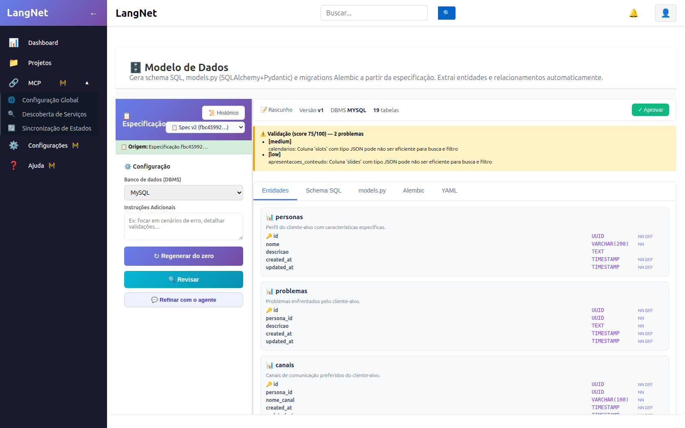

---

## UC-06 — Gerar Interface & Protótipo  [IMPLEMENTADO]

**Ator:** Usuário · **Objetivo:** gerar as telas de negócio (uma por caso de uso) com mockups PNG.
**Pré-condições:** existe Especificação e (recomendado) Modelo de Dados.

**Fluxo principal**
1. O usuário abre **Interface & Protótipo**. → O sistema exibe a lista de telas e o mockup selecionado.
2. O usuário seleciona a Especificação (casos de uso + wireframes) e o Modelo de Dados como origem [PT-1].
3. O usuário clica em *Gerar UI Spec* [PT-2]. → O sistema gera **N telas** (uma por caso de uso), cada uma
   com componentes reais e mockup PNG. (Ex.: Quântica — 18 telas.)
4. O usuário seleciona uma tela e a refina por chat [PT-3]; **aprova** [PT-6].

**Fluxos alternativos**
- 4a. **Refino por tela:** o refino atinge apenas a tela selecionada, regerando seu mockup.

**Fluxos de exceção**
- 3e. **Falha ao renderizar mockup:** a tela é gerada sem PNG → o sistema registra o aviso e segue.

**Regras de negócio**
- **RN-06.1** Consome **duas** fontes: a Especificação e o Modelo de Dados (registra ambas na proveniência).
- **RN-06.2** Cada tela corresponde a um caso de uso da Especificação (UC-xxx).

**Tela:** `telas/04-interface.png`

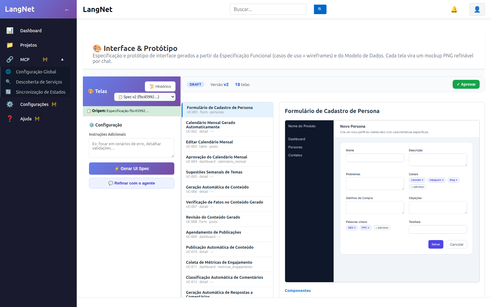

---

## UC-07 — Gerar Casos de Teste & Validação (CEG)  [IMPLEMENTADO]

**Ator:** Usuário · **Objetivo:** derivar casos de teste por Grafo de Causa-Efeito.
**Pré-condições:** existe Especificação Funcional.

**Fluxo principal**
1. O usuário abre **Casos de Teste & Validação**. → O sistema exibe a casca padrão.
2. O usuário seleciona a Especificação de origem [PT-1] e clica em *Gerar* [PT-2]. → O sistema identifica
   **causas e efeitos**, monta o **grafo (CEG)** e a **tabela de decisão**, e gera os casos que cobrem as
   combinações relevantes.
3. O usuário refina/revisa/aprova [PT-3…PT-6] e pode exportar o documento de validação.

**Fluxos alternativos**
- 2a. **Agrupamento de campos:** a geração agrupa campos afins numa única causa para evitar explosão combinatória.

**Fluxos de exceção**
- 2e. **Explosão combinatória:** com muitas causas independentes, a geração pode gerar excesso de casos →
  o usuário refina pedindo agrupamento (regra do prompt CEG).

**Regras de negócio**
- **RN-07.1** Grava `specification_version` de origem.
- **RN-07.2** A tabela de decisão usa lógica de 3 valores (V/F/indiferente).

**Tela:** `telas/03-casos-teste.png`

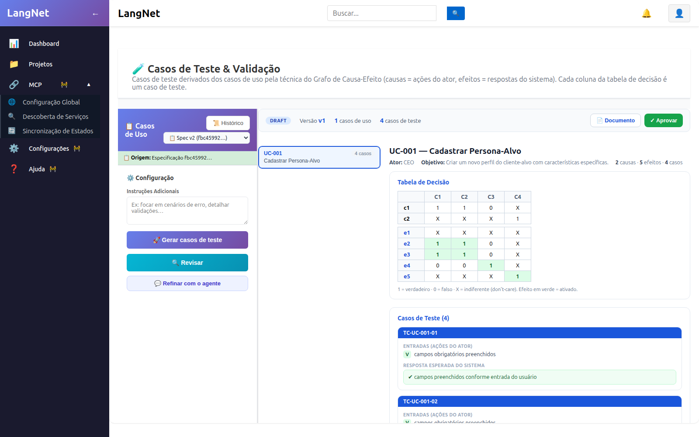

---

## UC-08 — Gerar Especificação de Agentes & Tarefas  [IMPLEMENTADO]

**Ator:** Usuário · **Objetivo:** especificar agentes e tarefas (papéis, tools, I/O) a partir da Especificação.
**Pré-condições:** existe Especificação Funcional.

**Fluxo principal**
1. O usuário abre **Agentes & Tarefas**. → O sistema exibe a casca com a origem (Especificação).
2. O usuário seleciona a Especificação [PT-1] e clica em *Gerar* [PT-2]. → O sistema produz o documento
   Agent-Task Spec (agentes, tarefas, ferramentas, entradas/saídas).
3. O usuário refina/revisa/aprova [PT-3…PT-6].
4. A partir deste documento o sistema gera os YAMLs (`agents.yaml`, `tasks.yaml`) consumidos adiante.

**Fluxos alternativos**
- 2a. **Auto-descoberta:** quando etapas seguintes não recebem a sessão explicitamente, o sistema usa a
  mais recente concluída do projeto.

**Fluxos de exceção**
- 3e. **Tabela de tools malformada:** o parser determinístico ignora linhas inválidas e registra aviso.

**Regras de negócio**
- **RN-08.1** Grava `specification_version` de origem.
- **RN-08.2** `agents.yaml` e `tasks.yaml` derivam do mesmo Agent-Task Spec (mesma versão de origem).

**Tela:** `telas/05-agent-task-spec.png`

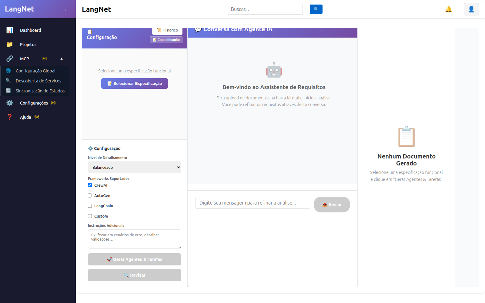

---

## UC-09 — Gerar Sequência de Tarefas  [IMPLEMENTADO]

**Ator:** Usuário · **Objetivo:** definir o fluxo de execução (ordem, dependências, paralelismo, estado).
**Pré-condições:** existem Especificação, Agent-Task Spec e `tasks.yaml`.

**Fluxo principal**
1. O usuário abre **Sequência de Tarefas**. → O sistema pede a seleção das **três fontes obrigatórias**.
2. O usuário seleciona Especificação + Agent-Task Spec + `tasks.yaml` [PT-1] e clica em
   *Gerar Sequência de Tarefas* [PT-2]. → O sistema gera (em segundo plano) o documento de fluxo e o exibe.
3. O usuário refina/revisa [PT-3, PT-5].

**Fluxos alternativos**
- 2a. **Instruções adicionais:** o usuário adiciona instruções customizadas antes de gerar.

**Fluxos de exceção**
- 2e. **Contexto excedido:** se as fontes combinadas ultrapassarem a janela do LLM, a geração falha com
  *"Context size exceeded"* → mitigado limitando o tamanho da saída (RN-09.2, RN-G4).

**Regras de negócio**
- **RN-09.1** Grava a versão das **três** fontes (proveniência).
- **RN-09.2** A geração reserva no máximo ~12K tokens de saída para caber na janela de 64K com specs grandes.

**Tela:** `telas/08-sequencia-tarefas.png`

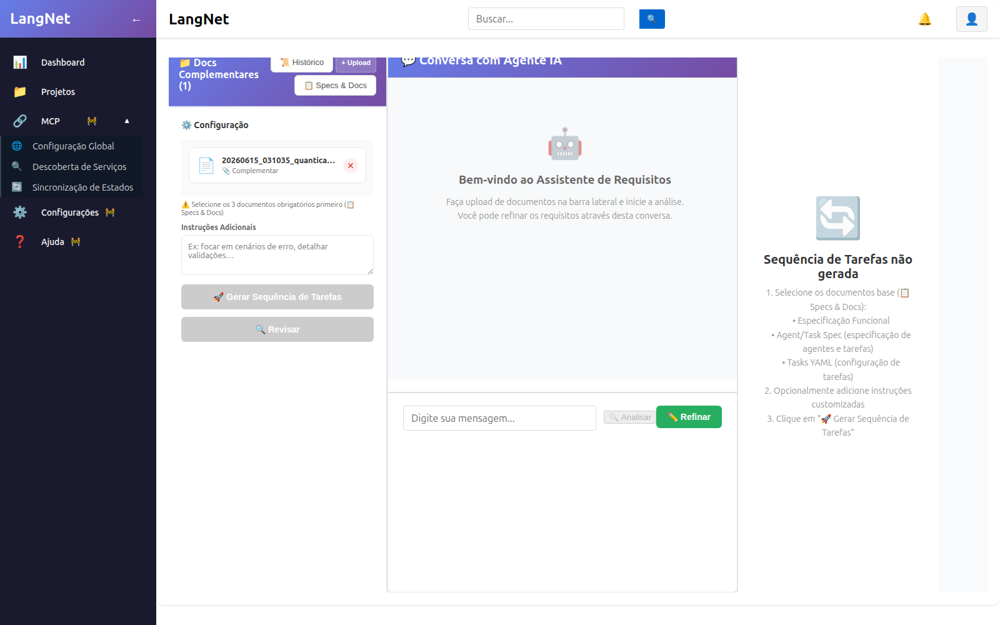

---

## UC-10 — Gerar / Editar Rede de Petri  [IMPLEMENTADO]

**Ator:** Usuário · **Objetivo:** obter o modelo formal de orquestração (lugares, transições, arcos).
**Pré-condições:** existem `agents.yaml`, `tasks.yaml` e (opcional) Sequência de Tarefas.

**Fluxo principal**
1. O usuário abre **Rede de Petri**. → O sistema carrega o editor visual (JointJS) com a rede corrente.
2. O usuário clica em *Gerar Rede / Origem* e escolhe `agents.yaml` + `tasks.yaml` + Sequência de Tarefas
   [PT-1]. → O sistema gera a rede e a renderiza (lugares = estados; transições = execução de tarefas).
3. O usuário edita no canvas (adicionar lugar/transição/arco/agente), **simula** o disparo de tokens, e
   pode fazer **Execução Real** conectando ao servidor agêntico via WebSocket.
4. O usuário salva; a edição vira nova versão [PT-4].

**Fluxos alternativos**
- 2a. **Sem Sequência:** a Sequência de Tarefas é opcional; a rede pode ser gerada só de agents+tasks.
- 3a. **Imprimir/Exportar JSON:** o usuário exporta a rede.

**Fluxos de exceção**
- 2e. **LLM não retorna rede válida (sem lugares):** o sistema rejeita a geração (erro 502) e mantém a rede anterior.

**Regras de negócio**
- **RN-10.1** Grava sessão+versão de agents.yaml, tasks.yaml e Sequência (proveniência). Edições manuais
  ficam sem proveniência de fonte, preservadas no histórico.
- **RN-10.2** Placeholders de lógica dos lugares são substituídos pela chamada WebSocket real ao empacotar.

**Tela:** `telas/09-rede-petri.png`

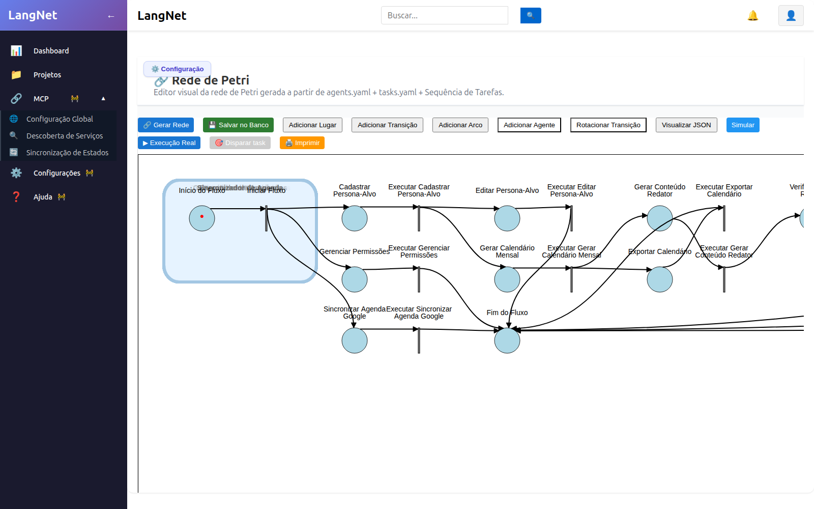

---

## UC-11 — Gerar Código  [IMPLEMENTADO]

**Ator:** Usuário · **Objetivo:** gerar o sistema Python multi-arquivo executável.
**Pré-condições:** existem `agents.yaml`, `tasks.yaml`, Rede de Petri e (recomendado) Agent-Task Spec e Sequência.

**Fluxo principal**
1. O usuário abre **Geração de Código**. → O sistema lista as sessões de geração anteriores.
2. O usuário clica em *Nova geração*, confirma as fontes e clica em *Gerar Código* [PT-2]. → O sistema
   executa a geração e produz a árvore de arquivos (servidor WebSocket, executor da Petri, YAMLs,
   `tools.py`, `adapters.py`, `petri_net.json`…). (Ex.: Quântica — 55 arquivos.)
3. O usuário navega pela árvore, refina por chat [PT-3], corrige avisos de validação, **baixa o ZIP** e pode
   **Executar** o servidor direto da tela (console via WebSocket).

**Fluxos alternativos**
- 3a. **Auto-fix de avisos:** o usuário pede ao agente para corrigir os warnings de validação.
- 3b. **Execução:** ao executar, o sistema sobe o servidor agêntico e conecta a Rede de Petri para execução real.

**Fluxos de exceção**
- 2e. **Nenhum arquivo gerado:** o gerador retorna vazio → o sistema marca a sessão como `failed` (erro 502).
- 2e2. **Petri ausente:** sem rede de Petri no projeto, a geração é bloqueada (erro 400) pedindo gerar a Petri antes.

**Regras de negócio**
- **RN-11.1** Grava a versão das 4 fontes + a versão da Petri usada + a sessão/versão do ui_spec (proveniência completa).
- **RN-11.2** O código é compatível com o framework de execução (servidor WebSocket + executor de Petri).

**Tela:** `telas/10-codigo.png`

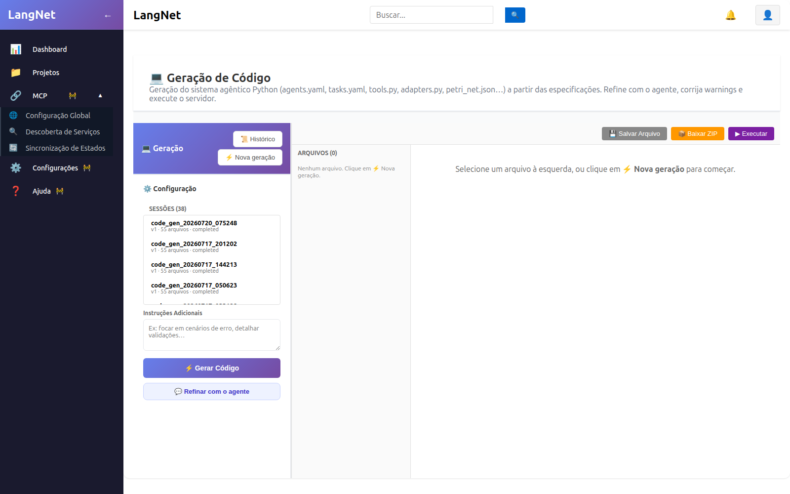

---

# PARTE B — CASOS DE USO PROPOSTOS (funções faltantes/mock)

> As telas abaixo **existem na UI, porém são apenas visuais (mock), sem persistência** — ou não existem.
> Cada caso propõe o comportamento real e a tela. Prioridade para as funções de **configuração**, que o
> usuário utiliza para preparar o ambiente.

## UC-P01 — Configurar o Sistema (banco de dados, LLM, integrações)  [PROPOSTO]

**Situação atual:** a tela **Configurações do Sistema** exibe status ("Database ✓", "Api ✓"), métricas e abas
(Geral, LLMs, Usuários, Segurança, Integrações…), mas **não persiste nada** — hoje o banco e o provedor LLM
são configurados apenas no arquivo `backend/.env`. Não existe tela real de configuração de banco de dados.

**Ator:** Administrador · **Objetivo:** configurar, pela UI, banco de dados, provedor LLM e integrações,
com persistência e validação.

**Fluxo principal proposto**
1. O admin abre **Configurações → Geral/LLMs/Banco**. → O sistema carrega os valores atuais (de config persistida).
2. Na aba **Banco de Dados**, informa host, porta, usuário, senha, base. → O sistema oferece *Testar conexão*.
3. O admin clica em *Testar conexão*. → O sistema tenta conectar e retorna sucesso/erro **real**.
4. Na aba **LLMs**, escolhe o provedor (LM Studio local / DeepSeek / OpenAI / Azure), o modelo e a janela de
   contexto. → O sistema valida o endpoint (lista modelos disponíveis).
5. O admin clica em *Salvar Alterações*. → O sistema persiste (com segredos protegidos) e passa a usar a nova config.

**Fluxos de exceção**
- 3e. **Conexão de banco falha:** o sistema exibe o erro do driver e não salva.
- 4e. **Endpoint LLM inacessível:** o sistema avisa e mantém o provedor anterior.

**Regras de negócio propostas**
- **RN-P01.1** Segredos (senha de banco, API keys) nunca são exibidos em claro nem retornados pela API.
- **RN-P01.2** *Salvar* só é permitido após *Testar conexão* bem-sucedido para banco e LLM.
- **RN-P01.3** A janela de contexto do LLM é validada contra o tamanho típico das fontes do pipeline (aviso se < 48K).

**Tela atual (a tornar real):** `telas/cfg04-configuracoes.png`

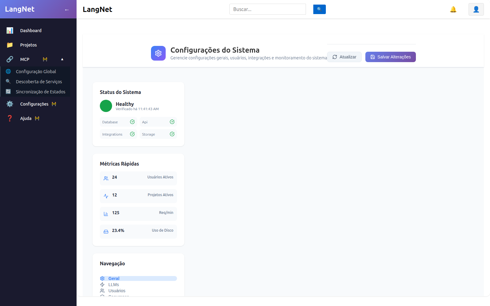

**Tela proposta (aba Banco de Dados):**
```
┌─ Configurações do Sistema ───────────────────────────── [Testar conexão] [Salvar] ┐
│ Geral │ LLMs │ [Banco de Dados] │ Usuários │ Segurança │ Integrações │ Backup      │
├────────────────────────────────────────────────────────────────────────────────────┤
│  Conexão do Banco (MySQL)                                                            │
│    Host:  [ camerascasas.no-ip.info        ]   Porta: [ 3308 ]                       │
│    Usuário: [ producao ]   Senha: [ •••••••• ]   Base: [ langnet ]                   │
│    Status: ● conectado (testado há 2s — 19 tabelas, 68 MB)                           │
│  [ Testar conexão ]                                                                  │
└────────────────────────────────────────────────────────────────────────────────────┘
```

---

## UC-P02 — Registrar e configurar servidores MCP (global)  [PROPOSTO]

**Situação atual:** **MCP → Configuração Global** lista servidores e permite "adicionar/testar/salvar",
mas tudo é estado local (mock, sem persistência).

**Ator:** Administrador · **Objetivo:** registrar servidores MCP reais (endpoint, credenciais, segurança) e
testar a conexão, com persistência.

**Fluxo principal proposto**
1. O admin abre **MCP → Configuração Global**. → O sistema carrega os servidores registrados.
2. O admin clica em *Adicionar servidor* e informa nome, endpoint, categoria e credenciais. → validação de formato.
3. O admin clica em *Testar conexão*. → O sistema faz um handshake real e mostra o resultado + capacidades descobertas.
4. O admin salva. → O sistema persiste o registro (segredos protegidos) e o disponibiliza para os projetos.

**Fluxos de exceção**
- 3e. **Servidor inacessível/credencial inválida:** o sistema exibe o erro e não habilita o servidor.

**Regras de negócio propostas**
- **RN-P02.1** Um servidor só fica "ativo" após teste de conexão bem-sucedido.
- **RN-P02.2** Credenciais são armazenadas de forma segura; a UI mostra apenas o status, nunca o segredo.

**Tela atual (a tornar real):** `telas/cfg01-mcp-config-global.png`

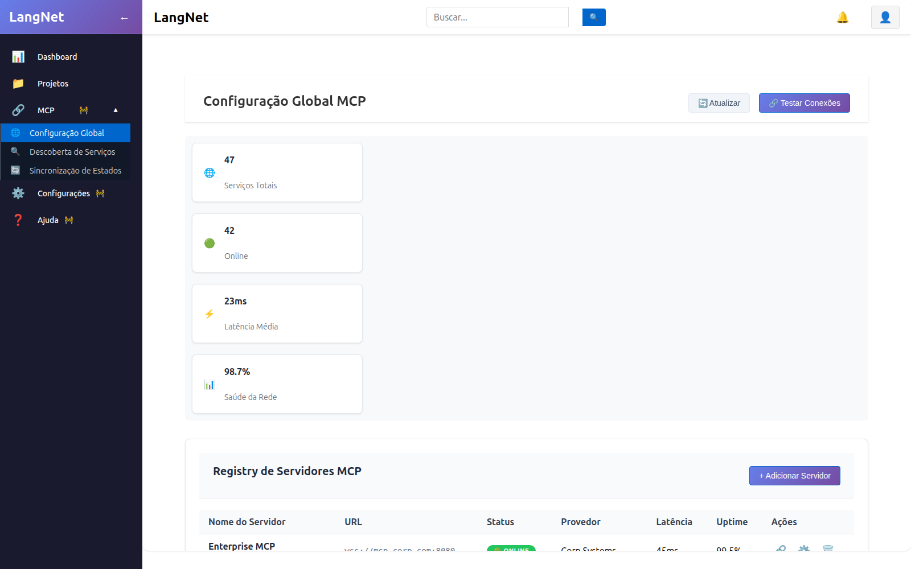

---

## UC-P03 — Descobrir e conectar serviços MCP  [PROPOSTO]

**Situação atual:** **MCP → Descoberta de Serviços** exibe catálogo, conexões ativas e matriz de
compatibilidade — tudo mock.

**Ator:** Administrador/Usuário · **Objetivo:** descobrir serviços expostos pelos servidores MCP e conectá-los.

**Fluxo principal proposto**
1. O usuário abre **Descoberta de Serviços**. → O sistema consulta os servidores registrados e lista os serviços
   reais, com versão e compatibilidade.
2. O usuário conecta/testa/monitora um serviço. → O sistema executa a ação real e atualiza o status.

**Fluxos de exceção**
- 1e. **Nenhum servidor registrado:** o sistema orienta a cadastrar em UC-P02.

**Regra de negócio proposta**
- **RN-P03.1** A descoberta só considera servidores com status "ativo" (UC-P02).

**Tela atual (a tornar real):** `telas/cfg02-mcp-descoberta-servicos.png`

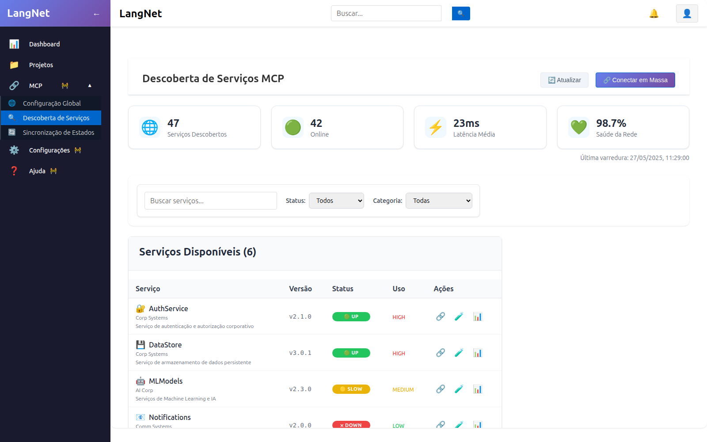

---

## UC-P04 — Sincronizar estados entre servidores MCP  [PROPOSTO]

**Situação atual:** **MCP → Sincronização de Estados** mostra overview, conflitos e jobs — mock.

**Ator:** Administrador · **Objetivo:** sincronizar estado entre servidores MCP e resolver conflitos.

**Fluxo principal proposto**
1. O admin abre **Sincronização de Estados**. → O sistema exibe status real dos servidores conectados.
2. O admin dispara *Sincronizar tudo*. → O sistema executa a sincronização e reporta resultados.
3. Havendo conflito, o admin escolhe **local / remoto / merge**. → O sistema aplica a resolução.

**Regra de negócio proposta**
- **RN-P04.1** Toda resolução de conflito é auditada (quem, quando, estratégia).

**Tela atual (a tornar real):** `telas/cfg03-mcp-sincronizacao.png`

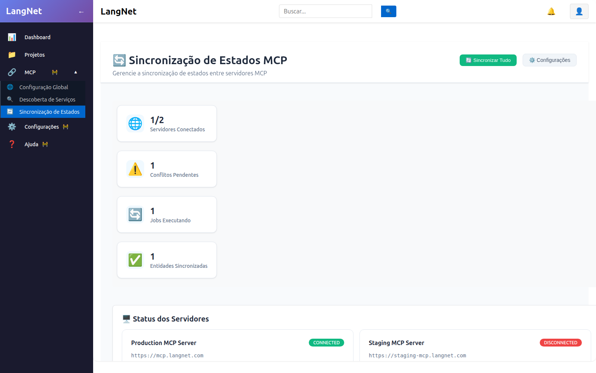

---

## UC-P05 — Fazer deploy do sistema gerado  [PROPOSTO]

**Situação atual:** **Deploy** mostra ambientes, pipeline CI/CD e histórico — mock.

**Ator:** Usuário/Administrador · **Objetivo:** publicar o sistema agêntico gerado (Docker/K8s/local/cloud).

**Fluxo principal proposto**
1. O usuário abre **Deploy** de um projeto com código gerado. → O sistema mostra os alvos disponíveis.
2. O usuário escolhe ambiente (Staging/Prod) e alvo. → O sistema valida pré-requisitos.
3. O usuário confirma o *Deploy*. → O sistema executa o pipeline e acompanha o progresso; permite *rollback*.

**Fluxos de exceção**
- 2e. **Sem código gerado:** o sistema bloqueia e orienta a concluir UC-11.

**Regra de negócio proposta**
- **RN-P05.1** Só é possível fazer deploy de uma geração de código concluída e aprovada.

**Tela atual (a tornar real):** `telas/op01-deploy.png`

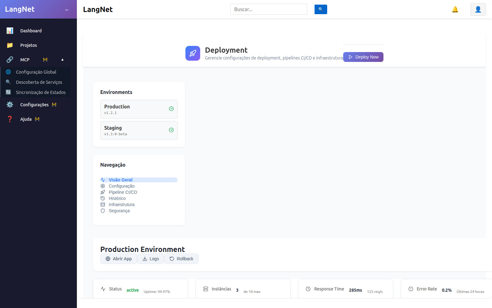

---

## UC-P06 — Monitorar execução (Langfuse)  [PARCIAL → PROPOSTO consolidar]

**Situação atual:** **Monitoramento** integra ao Langfuse (modal de conexão) para traces/métricas —
integração externa, sem backend próprio de persistência.

**Ator:** Usuário · **Objetivo:** observar execuções, traces, custos e alertas do sistema gerado.

**Fluxo principal proposto**
1. O usuário abre **Monitoramento** e conecta o Langfuse. → O sistema exibe traces, spans, métricas e alertas.
2. O usuário filtra por período e alterna tempo real. → O sistema atualiza os painéis.

**Regra de negócio proposta**
- **RN-P06.1** A conexão do Langfuse (host/keys) deve migrar para UC-P01 (config persistida), não por modal volátil.

**Tela atual:** `telas/op02-monitoramento.png`

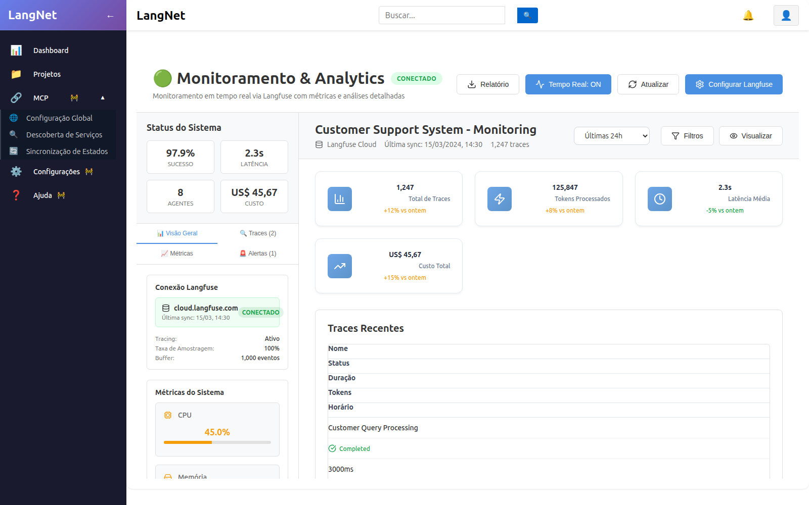

---

## UC-P07 — Funções interativas (Chat, Designer, Artefatos, Estado, Formulários)  [PROPOSTO]

**Situação atual:** as cinco telas de **Interação** (Chat com Agentes, Designer de Agentes, Gestão de
Artefatos, Estado do Sistema, Formulários Dinâmicos) são mock, com dados fixos.

**Ator:** Usuário · **Objetivo:** interagir em tempo real com o sistema agêntico gerado.

**Fluxo principal proposto (Chat com Agentes)**
1. O usuário abre **Chat com Agentes** de um projeto com sistema em execução. → O sistema lista os agentes ativos.
2. O usuário envia mensagem (individual/broadcast). → O agente responde via backend; o painel mostra a conversa e métricas.
3. O usuário pausa/reinicia agentes ou ajusta parâmetros. → O sistema aplica os controles em tempo real.

**Regra de negócio proposta**
- **RN-P07.1** Estas telas dependem de um sistema gerado **em execução** (UC-11 → Executar); sem execução, ficam informativas.

**Telas atuais (a tornar reais):** `telas/int01-chat-agentes.png` … `telas/int05-formularios-dinamicos.png`

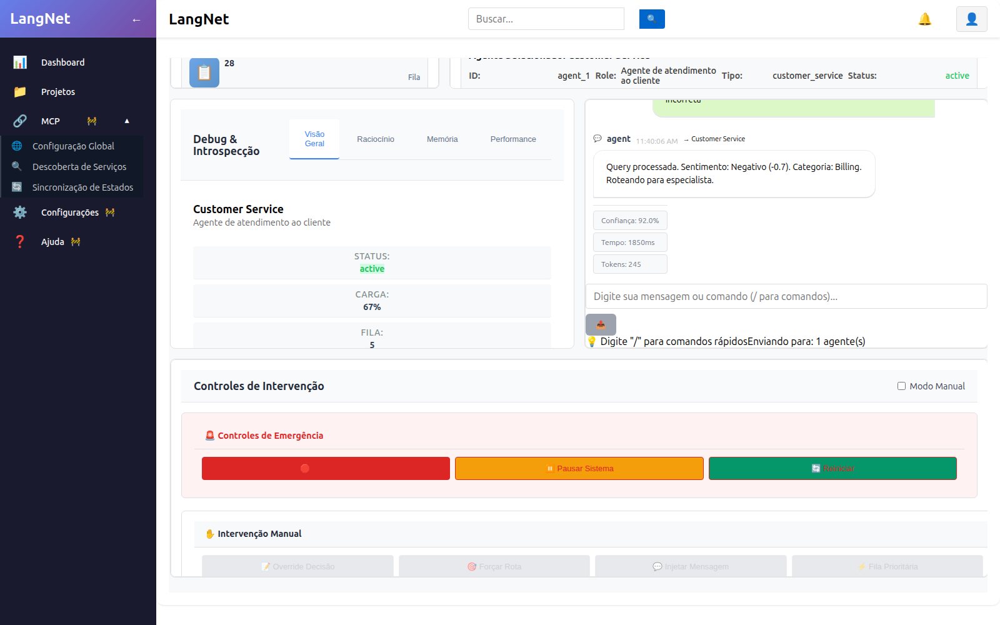
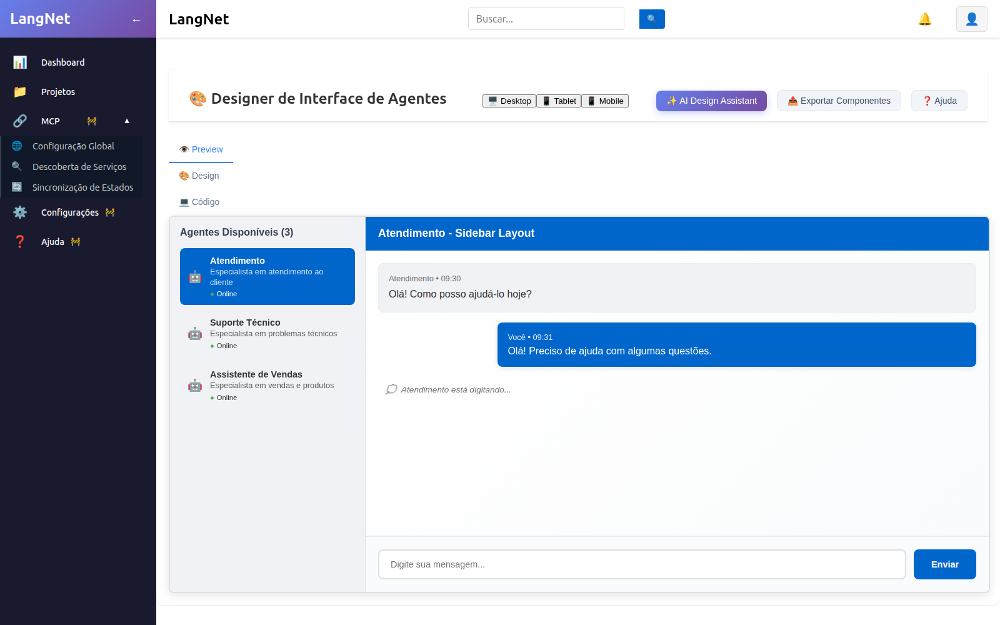
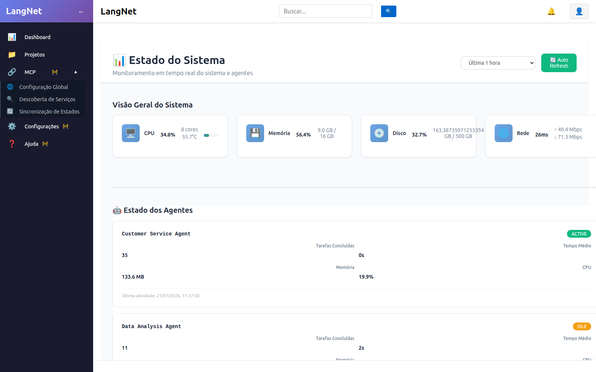

---

# 3. Regras de negócio consolidadas

| ID | Regra |
|----|-------|
| RN-G1 | Uma etapa só gera com sua(s) origem(ns) obrigatória(s) selecionada(s). |
| RN-G2 | Toda geração/refino/edição é versionada; nada sobrescreve o histórico. |
| RN-G3 | 401 (sessão expirada) redireciona ao login; distinguir "expirada" de "vazio". |
| RN-G4 | O contexto do LLM (~64K) limita o tamanho combinado das fontes por etapa. |
| RN-05.1 / RN-07.1 / RN-08.1 | Consumidores da Especificação gravam `specification_version`. |
| RN-06.1 | Interface consome Especificação **e** Modelo de Dados. |
| RN-09.1 | Sequência grava versão das três fontes. |
| RN-10.1 | Petri grava proveniência de agents/tasks/Sequência. |
| RN-11.1 | Código grava proveniência completa (4 fontes + Petri + ui_spec). |
| RN-P01.1 | Segredos de configuração nunca trafegam/aparecem em claro. |
| RN-P02.1 | Servidor MCP só fica ativo após teste de conexão bem-sucedido. |

# 4. Anexos
- **Rastreabilidade entre artefatos:** ver `docs/validacao-quantica/validacao-quantica.pdf`.
- **Manual do usuário do pipeline:** ver `docs/validacao-quantica/manual-langnet.pdf`.
