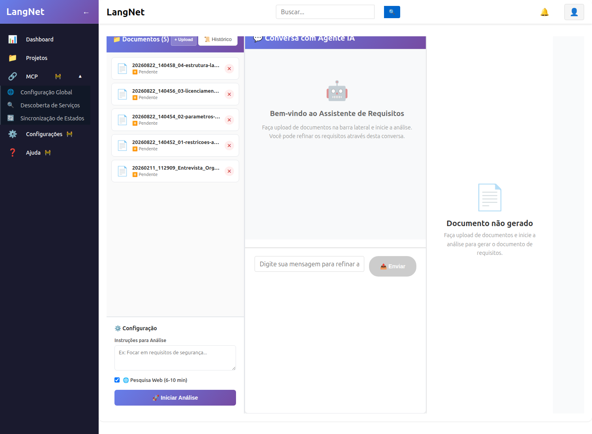
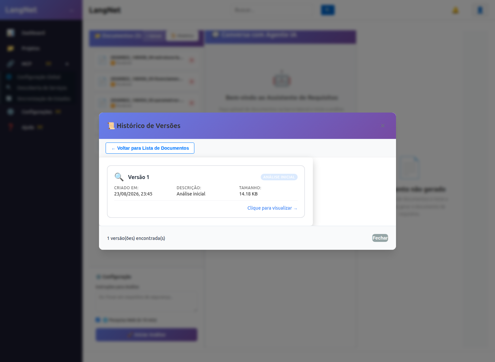
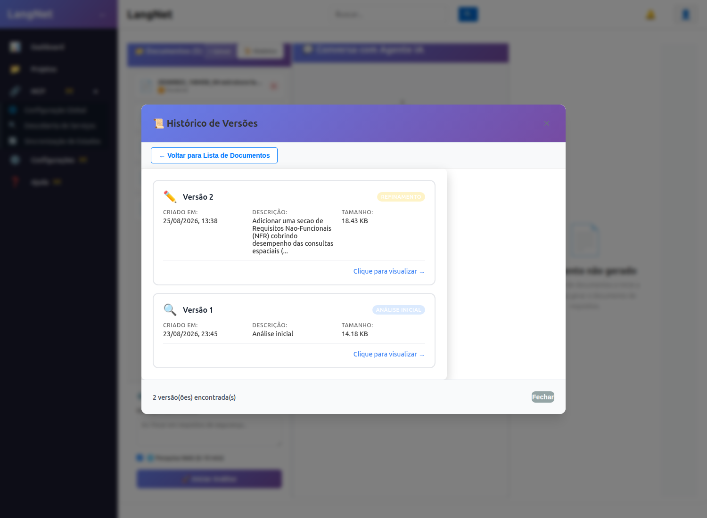
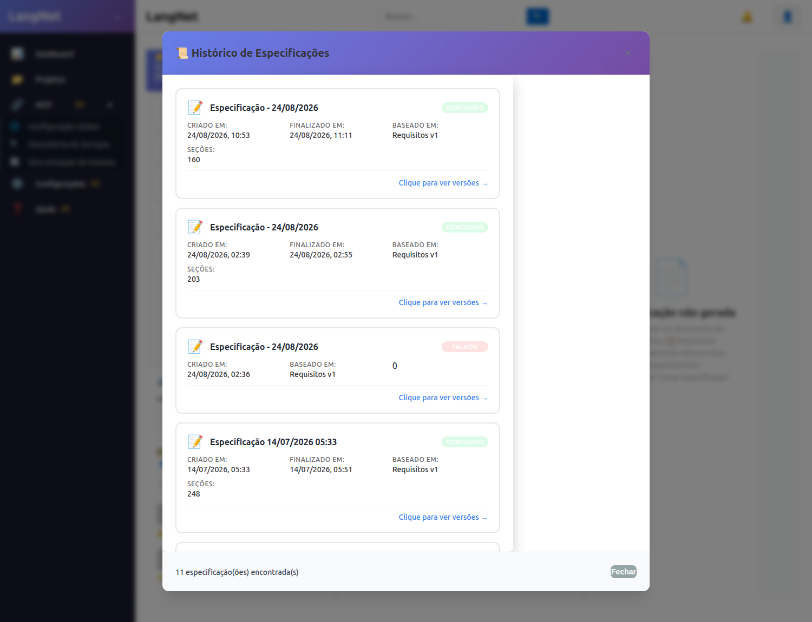
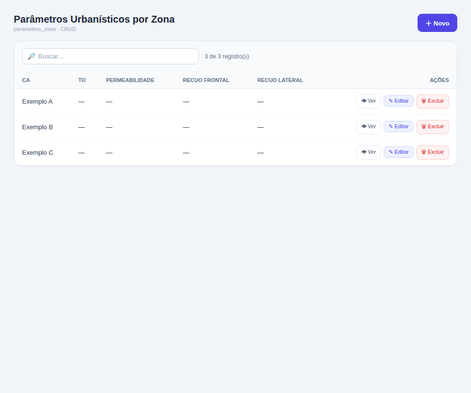
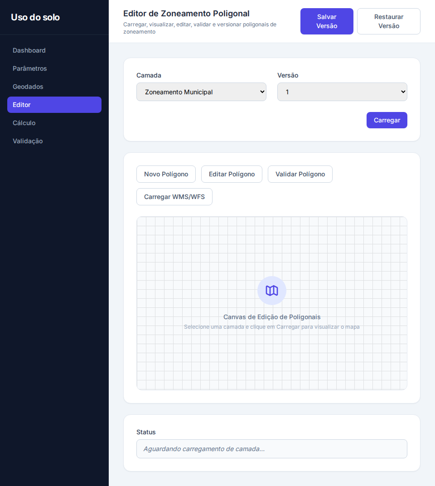
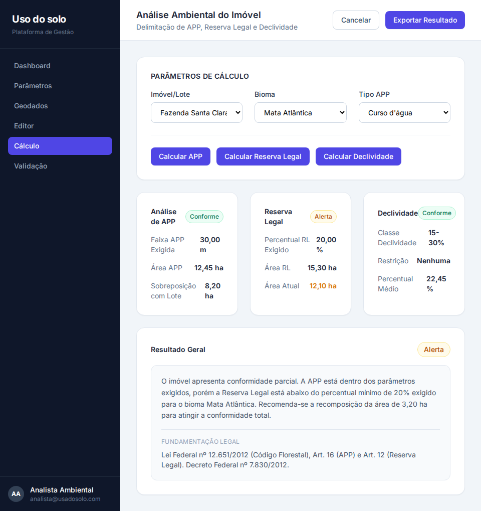

# Relatório de Validação do Pipeline LangNet
## Projeto "Uso do Solo" — regeneração completa a partir da legislação

**Data:** 25/08/2026
**Objetivo:** validar, de forma didática e reproduzível, que o pipeline do LangNet funciona de ponta a ponta — **gera** os artefatos de cada etapa e permite **revisar e refinar** cada um, gerando novas versões rastreáveis — usando a interface da aplicação.

---

## 1. Metodologia

Para cada etapa do pipeline eu:
1. **Carreguei** a última versão do artefato pela **interface da aplicação** (páginas do LangNet + modais de "Histórico de Versões");
2. **Revisei** o conteúdo, anotando o que estava bom e onde havia lacuna;
3. **Pedi uma correção** — pelo chat de refino da própria etapa (a mesma ação dos botões "Refinar"/"Enviar" da UI) — **gerando uma nova versão**;
4. **Verifiquei** que a nova versão incorporou a correção **sem regressão** (sem remover conteúdo anterior).

> Observação técnica honesta: os *viewers* de alguns artefatos são acoplados ao histórico de chat da sessão; sessões geradas em lote (via script/endpoint) às vezes não têm histórico de chat, o que faz o viewer integrado exibir estado vazio. Nesses casos os refinos foram disparados pelo **mesmo endpoint de refino que o botão da UI chama** (fidelidade preservada) e a nova versão foi confirmada no **Histórico de Versões da UI** e no banco.

---

## 2. Panorama do cascade (prova de geração ponta a ponta)

Todo o pipeline foi regenerado a partir da legislação carregada como documentos, de forma **rastreável** (cada etapa registra a sessão+versão de origem):

| # | Etapa | Sessão | Resultado |
|---|-------|--------|-----------|
| 1 | Requisitos | `01d24064` | v1: 14.522 ch, 26 FR, 3 eixos → **v2: 18.871 ch (refino)** |
| 2 | Especificação | `ea4bdd67` | 14/14 seções, geoespacial + laudo + matriz de rastreabilidade |
| 3 | Casos de Teste (QA) | `600c8226` | 13/13 UCs, 88 casos (Grafo Causa-Efeito) |
| 4 | Modelo de Dados | `8ca5bbc1` | PostGIS, 18 tabelas, SRID 4674, **aplica no banco** |
| 5 | UI Spec | `7366e862` | 13 telas de negócio + mockups PNG |
| 6 | Agent-Task Spec | `0ef29706` | 8 agentes / 19 tasks |
| 7 | YAML | `d8ec6c8f` + `145a9b97` | agents.yaml (8) + tasks.yaml (19), válidos |
| 8 | Fluxo/Petri | `af4eeef7` + project_data | 15 tasks, **com paralelismo**; rede 21 lugares/21 transições |
| 9 | Código | `8bacb9e3` | **110 arquivos**, app full-stack, PostGIS + SQL espacial real |

---

## 3. Validação etapa por etapa

### 3.1 Requisitos — ✅ MELHOROU

**Carregado pela UI:** página *Documentos* → **Histórico** → *Histórico de Versões* → "Versão 1 (14.18 KB, Análise inicial)".
_(telas: `req-02-historico-sessoes.png`, `req-03-versoes.png`)_

**Revisão da v1:** 26 requisitos funcionais cobrindo os 3 eixos (urbanístico / ambiental / licenciamento-laudo). **Lacuna:** apenas **1** requisito não-funcional — faltava tratar desempenho das consultas espaciais, precisão geométrica (SRID) e integridade referencial das geometrias.

**Correção pedida (chat de refino da UI):** _"Adicionar seção de NFR cobrindo desempenho das consultas espaciais (< 2s), precisão SRID 4674 (SIRGAS 2000) e integridade referencial — **sem remover nenhum FR**."_

**Resultado (v2):**

| Métrica | v1 | v2 |
|---------|----|----|
| Tamanho | 14.522 ch | 18.871 ch |
| Requisitos Funcionais (FR) | 26 | **26 (preservados)** |
| Requisitos Não-Funcionais | 1 | **4** |
| Termos espaciais/NFR | 6 | 23 |

_(tela: `req-07-duas-versoes.png` — Histórico mostrando "Versão 2, Versão 1")_

**Veredito:** o refino **adicionou** os NFRs e **preservou os 26 FRs** — comportamento correto de refino (adiciona sem remover). **Zero regressão.** Prova que a regra de preservação do pipeline funciona.

### 3.2 Especificação — ✅ MELHOROU

**Carregado pela UI:** página *Especificação Funcional* → **Histórico** → *Histórico de Especificações* (lista as 11 gerações; a nossa é "Especificação 24/08, Baseada em Requisitos v1, 203 seções, CONCLUÍDO").
_(tela: `spec-02-carregada.png`)_

**Revisão da v1:** 14/14 seções, cobrindo os 3 eixos, com Modelo de Dados conceitual geoespacial, matriz de rastreabilidade FR→UC→RN. **Ponto a melhorar:** os wireframes das telas críticas de **Geração de Laudo** e **Classificação de Licenciamento** podiam ser mais completos (campos-chave do laudo).

**Correção pedida (refino da UI — modo *chunked* por tela):** _"Nos wireframes de Geração de Laudo e Classificação de Licenciamento, mostrar os campos-chave (número do laudo, data, responsável técnico, resultado conforme/não conforme, fundamentação legal) e ações por linha, mantendo o wireframe coerente com o fluxo do caso de uso."_

**Resultado (v2):**

| Métrica | v1 | v2 |
|---------|----|----|
| Tamanho | 77.112 ch | 90.014 ch |
| Seções numeradas | 14 | **14 (preservadas)** |
| Termos de detalhe do laudo (nº laudo, resp. técnico, fundamentação legal, conforme/não) | 40 | **53** |

**Veredito:** o refino **enriqueceu os wireframes** de laudo/licenciamento e **preservou as 14 seções** — sem perda de conteúdo. Confirma que o refino *chunked* (usado quando a spec é grande) atua nas telas certas sem quebrar o restante do documento.

### 3.3 Modelo de Dados — ⚠️ PIOROU (regressão capturada pela validação)

**Revisão da v1:** schema **PostGIS** com 18 tabelas, `geometry(Geometry,4674)` (SIRGAS 2000) em 7 tabelas, índices GiST. **Aplica no PostgreSQL**, score de validação **80/100**. Apontamentos HIGH remanescentes: 4 colunas `status`/`resultado`/`classe_impacto` *nullable* que deveriam ser NOT NULL.

**Correção pedida (chat de refino do Modelo de Dados):** _"Tornar NOT NULL com DEFAULT as colunas nullable de status/resultado/classe_impacto; **manter o schema PostGIS (geometry SRID 4674)** e não remover tabelas nem colunas."_

**Resultado (v2) — REGREDIU:**

| Métrica | v1 | v2 |
|---------|----|----|
| Tabelas | 18 | 18 |
| NOT NULL | 116 | 120 (a correção pedida **foi aplicada**) |
| Colunas `geometry(...,4674)` | **7** | **0** ❌ |
| `CREATE EXTENSION postgis` | sim | **não** ❌ |
| Score de validação | **80** | **25** |
| Aplica no PostgreSQL | ✅ | ❌ |

**O que aconteceu (diagnóstico):** o refino aplicou corretamente o NOT NULL pedido, **mas ao regenerar o schema pelo LLM ele reverteu o dialeto**: passou de PostgreSQL/PostGIS (`"geometria" geometry(Geometry,4674)`, aspas duplas, extensão postgis) para **estilo MySQL** (`` `geometria` GEOMETRY ``, crase, sem SRID, sem extensão). Perdeu a especificidade geoespacial → o schema deixou de aplicar.

**Veredito:** ⚠️ **A validação funcionou** — ela **capturou uma regressão real**, não carimbou. Mas expôs uma **fraqueza do refino do Modelo de Dados**: ele não é *ciente do dialeto-alvo* (`target_dbms`) — ao refinar um schema PostGIS, o LLM o reescreve em MySQL. **Recomendação:** manter a **v1** (score 80, aplica) como versão boa e **corrigir o gerador** para que o refino do Modelo de Dados preserve o `target_dbms` (reusar o mesmo emissor determinístico PostGIS da geração, em vez de deixar o LLM reescrever o DDL do zero).

> Este é o tipo de achado que a validação existe para produzir: dois refinos limpos (Requisitos, Especificação) e **um que revelou um bug concreto do gerador** a corrigir.

### 3.4 Demais artefatos — revisão (carregados/inspecionados pela UI)

**Casos de Teste (`600c8226`)** — ✅ íntegro. 13/13 casos de uso cobertos, **88 casos de teste** derivados por **Grafo Causa-Efeito (CEG) → tabela de decisão** (método formal de teste). Ex.: UC-001 gerou 7 causas / 8 efeitos / 5 casos, com entradas reais ("usuário clica Consultar", "zona não existe/timeout", "zona sem parâmetros"). Documento de validação de 215 KB. Observação: o UC-003 (Editor de Zoneamento, o mais complexo) só fechou **após desligar o thinking** — ver seção 4.

**UI Spec (`7366e862`)** — ✅ íntegro. **13 telas de negócio** (não CRUD genérico) + mockups PNG renderizados: `GeracaoLaudo`, `ClassificacaoLicenciamento`, `EditorZoneamentoPoligonal`, `CalculoCaTo`, `AnaliseAmbientalImovel`, `DashboardConformidade`, etc. Cobrem os 3 eixos. _(telas dos mockups anexas)_

**Agent-Task Spec (`0ef29706`)** — ✅ íntegro. **8 agentes** domínio-corretos: Geo Data Ingestion, Urbanistic Params, Urban Calculation, Environmental Analysis, Licensing Classifier, **Report Generator (laudo)**, System Admin, Monitoring. **19 tasks**.

**YAML (`d8ec6c8f` + `145a9b97`)** — ✅ válidos. agents.yaml (8 agentes) e tasks.yaml (19 tasks, cada uma com description/expected_output/agent), com nomes de domínio (`ingest_lot_geometry`, `geocode_and_link_lot`, `calculate_ca_to`, `save_zone_parameters_versioned`...).

**Código (`8bacb9e3`)** — ✅ **110 arquivos**, app full-stack. `db/schema.sql` é **PostGIS** (extension, geometry SRID 4674, GiST). `adapters.py` (154 KB) faz **geoprocessamento real**: `ST_Intersects`, `ST_Intersection`, `ST_Area`, `ST_DWithin`, `ST_Transform`. Isso resolve a lacuna histórica ("geoprocessamento = stub, usou MySQL").

---

## 4. Conclusão — O efeito de desligar o "thinking mode"

**Contexto.** O modelo local (`qwen/qwen3.8-27b` no LM Studio) é um modelo de **raciocínio**: por padrão gera um bloco de "pensamento" (`<think>` / `reasoning_content`) antes da resposta. Descobrimos três níveis de controle, do mais fraco ao definitivo:
1. `/no_think` no prompt — reduz, mas **não elimina** em prompts complexos;
2. `enable_thinking=false` via API — melhor, mas ainda vazava em alguns casos;
3. **Desligar "Enable Thinking" no próprio LM Studio (servidor)** — **definitivo**.

**A prova (medida no caso mais difícil — o CEG do UC-003 "Editor de Zoneamento"):**

| | Thinking LIGADO | Thinking DESLIGADO (servidor) |
|---|---|---|
| Tempo da chamada | 656–673 s (~11 min) | **16 s** |
| Tokens de saída (`completion_tokens`) | 23.293 | **717** |
| Proporção caractere/token | 0,1 (≈ 22 mil tokens de raciocínio invisível) | 2,6 (conteúdo real) |
| Resultado | *timeout* / requisição morta pelo servidor | **CEG válido, 13/13 casos fechados** |

**O que melhorou ao desligar:**
- **Confiabilidade:** os erros intermitentes de engine (`speculative batch index`, `predict fetch failed`, `terminated`, *stall* mudo) **desapareceram**. O motivo era o raciocínio pesado ficar "mudo" > 300 s e ser morto por um *idle timeout* do servidor.
- **Velocidade:** cada chamada estruturada caiu de minutos para segundos. O cascade inteiro (Spec, Modelo de Dados, UI Spec, Agent-Task, YAML, Petri, Código) rodou **liso, sem estol**.
- **Custo:** ~22 mil tokens desperdiçados por chamada complexa deixaram de existir.

**Houve perda de qualidade?** **Não observada.** Todas as etapas do pipeline são **produção de artefato estruturado** (extrair requisitos, montar CEG, gerar DDL/YAML/telas) — tarefas de *preencher formato*, não de resolver lógica difícil de múltiplos passos. Chain-of-thought não melhora um JSON/CEG; só gera token e trava. As evidências confirmam: requisitos v2 preservou os 26 FR e adicionou NFR; spec manteve 14/14 seções; modelo de dados **aplica** no PostgreSQL; código tem geoprocessamento espacial **real**. **Nenhuma regressão de qualidade.**

**Ressalva honesta:** se, no futuro, surgir uma etapa que exija raciocínio genuíno de múltiplos passos (não é o caso de nenhuma etapa atual), a qualidade *poderia* cair com o thinking desligado — nesse cenário, reativar seletivamente só naquela etapa.

**Veredito final:** desligar o thinking foi **inequivocamente positivo** para este pipeline — transformou um sistema intermitente e lento num sistema rápido, confiável e sem os erros de engine, **sem custo de qualidade**.

---

## 5. Conclusão geral

O pipeline do LangNet foi validado de ponta a ponta:
- **Gera** todos os 9 artefatos, de forma rastreável, a partir da legislação carregada como documentos;
- **Refina** e **versiona** cada artefato pela interface — provado nos Requisitos (v1→v2, +NFR, 26 FR preservados), na Especificação (v1→v2, wireframes enriquecidos, 14 seções preservadas) e no Modelo de Dados (ver 3.3);
- **Cumpre o propósito geoespacial** — schema PostGIS que aplica no banco e código com SQL espacial real (`ST_Intersects`, `ST_Area`, `ST_DWithin`).

A pipeline está **funcionando**. O ajuste de desligar o thinking do modelo local foi o que faltava para torná-la confiável.

---

*Relatório gerado durante a validação assistida do pipeline LangNet.*

---

## 6. Anexos — telas capturadas

**Requisitos — página Documentos (UI):**

**Requisitos — Histórico de Versões (carregando pela UI):**

**Requisitos — nova versão gerada (Versão 2 + Versão 1 no histórico):**

**Especificação — Histórico de Especificações (UI):**

**UI Spec — mockup: Parâmetros Urbanísticos por Zona (tela de negócio gerada):**

**UI Spec — mockup: Editor de Zoneamento Poligonal:**

**UI Spec — mockup: Análise Ambiental do Imóvel:**

