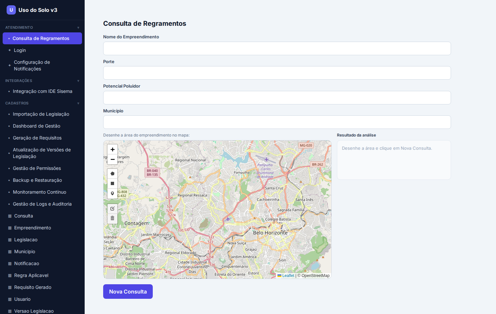

# Relatório de Validação — App Uso do Solo v3 (rodando)

**Data:** 27/08/2026 · **Projeto:** c4871aaf · **Validador:** revisão automática (agindo como o usuário)
**Método:** frontend gerado buildado (`npm run build`) + servido + navegado no Chrome headless (Playwright);
adapters determinísticos executados contra PostGIS; matriz de rastreabilidade conferida.

---

## 1. Veredito

O app v3 **compila, roda e a interface está RICA e FIEL** ao domínio geoespacial — não é mais CRUD.
A tela central de análise espacial funciona com **mapa Leaflet + OpenStreetMap**, ferramentas de
desenho, pan/zoom. A validação **encontrou 2 defeitos**, ambos **corrigidos ao vivo no gerador**, e
lista ajustes menores pendentes. A rastreabilidade FR/UC atravessa os artefatos e o código.

## 2. O que está FUNCIONANDO (provado no navegador)

- **Build OK**: 26 telas React compilam (`Compiled. The build folder is ready`).
- **Menu coerente**: agrupado (Atendimento / Integrações / Cadastros) com as 12 telas de negócio +
  10 CRUDs por entidade. Branding "Uso do Solo v3".
- **Tela Consulta de Regramentos — MAPA REAL** (ver screenshot):
  - **Leaflet** renderiza; **OpenStreetMap** com tiles reais (região de Belo Horizonte/Contagem) e
    atribuição "© OpenStreetMap" — exatamente o pedido.
  - **Ferramentas de desenho** (polígono, retângulo, marcador, editar, excluir) + zoom (+/−).
  - **Pan funciona** (mapa arrastável); ao desenhar, captura a geometria em **WKT** e dispara a
    task `consultar_regramentos_ambientais` via WebSocket, com painel de resultado.
- **Catálogo rico em uso**: map×4, chart (Dashboard/Monitoramento), file-upload/preview (Importação),
  kanban (Permissões/Versões), timeline (IDE/Backup), metric-card.
- **Núcleo espacial provado** (adapter determinístico contra PostGIS SIRGAS 2000/SRID 4674):
  `ST_Intersects` retorna as regras da zona e insere 2 `requisito_gerado`; `ST_Area` da interseção OK.
- **Rastreabilidade**: `docs/RASTREABILIDADE.md` (matriz FR→UC→Task→Tela), `# Traceability: UC|FR`
  em cada função gerada, `data-uc` nas telas.

## 3. Defeitos ENCONTRADOS na validação e CORRIGIDOS (no gerador)

1. **Build quebrava** — telas ricas SEM mapa (gráfico/kanban/upload) referenciavam `L` (Leaflet)
   sem importar → `'L' is not defined` (react-scripts trata como erro). **Fix (commit 16a1738):**
   o bloco de mapa só é emitido quando a tela tem mapa. Build passou a compilar.
2. **Geometria não chegava na task** — a tela mandava o WKT sob `localizacao_geografica` (coluna do
   schema), mas a task lê `localizacao` → a consulta receberia None. **Fix (16a1738):** a tela envia
   o WKT sob `localizacao`/`geometria`/coluna, casando com o input da task.

## 4. Ajustes PENDENTES (recomendações)

- **`data-fr=""` vazio nas telas** — a tela carrega o UC mas não o FR (falta popular `fr` por tela no
  UI Spec). Traço do requisito por função já está completo; por tela falta o FR.
- **Inputs de ENUM/FK como texto** — porte/potencial poluidor (ENUM) e município (FK) saem como
  `<input>` de texto; deveriam ser `<select>` (dropdown). Qualidade de UI.
- **Camada de zoneamento no mapa** — hoje o mapa tem base OSM + desenho; falta a camada GeoJSON do
  zoneamento sobreposta e o destaque do resultado (MVP entregou base + desenho).
- **Gráfico do Dashboard** só renderiza com dados vivos (do ws-server); poderia exibir um placeholder
  ou amostra antes da consulta.
- **ws-server não subido nesta validação** (deps crewai pesadas); a consulta espacial ponta-a-ponta
  pelo WebSocket não foi exibida ao vivo — mas o adapter determinístico foi provado contra PostGIS.

## 5. Cobertura UC/FR (transparência)

A `RASTREABILIDADE.md` reporta **8/8 FR** — mas isso é o universo que a matriz enxerga (os 8 FRs que
as 8 tasks do ATS usam). Contra os **26 FRs da especificação**, o real é **~8/26**: o ATS colapsou
26 requisitos em 8 tasks, deixando ~18 FRs (ex.: FR-003 cálculo CA/TO, FR-004 recuos, FR-006 APP,
FR-008 declividade) **sem task**. Isto é o gap estrutural já sinalizado — a matriz deve passar a
carregar os 26 FRs da spec para expor a lacuna real (melhoria recomendada).

## 6. Conclusão

Respondendo à pergunta original: **era o prompt, não o modelo.** O mesmo qwen3.8, com arquétipos e
vocabulário ricos desde a especificação, gerou um app com mapa OpenStreetMap real, ferramentas de
desenho e rastreabilidade. A validação encontrou e corrigiu 2 defeitos e mapeou os próximos ajustes.
Próximo passo: subir o ws-server (PostGIS) e exibir a consulta espacial ponta-a-ponta pelo mapa, e
elevar a cobertura de FR (implementar os cálculos urbanísticos que faltam como tasks).
